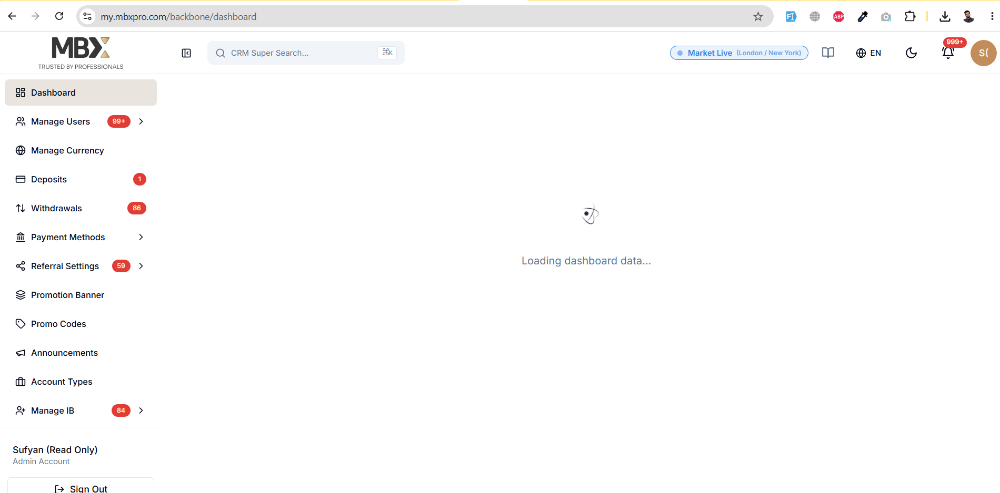
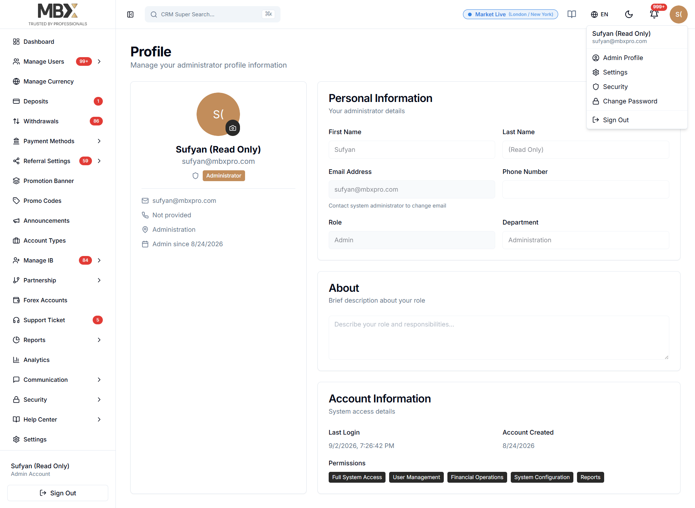
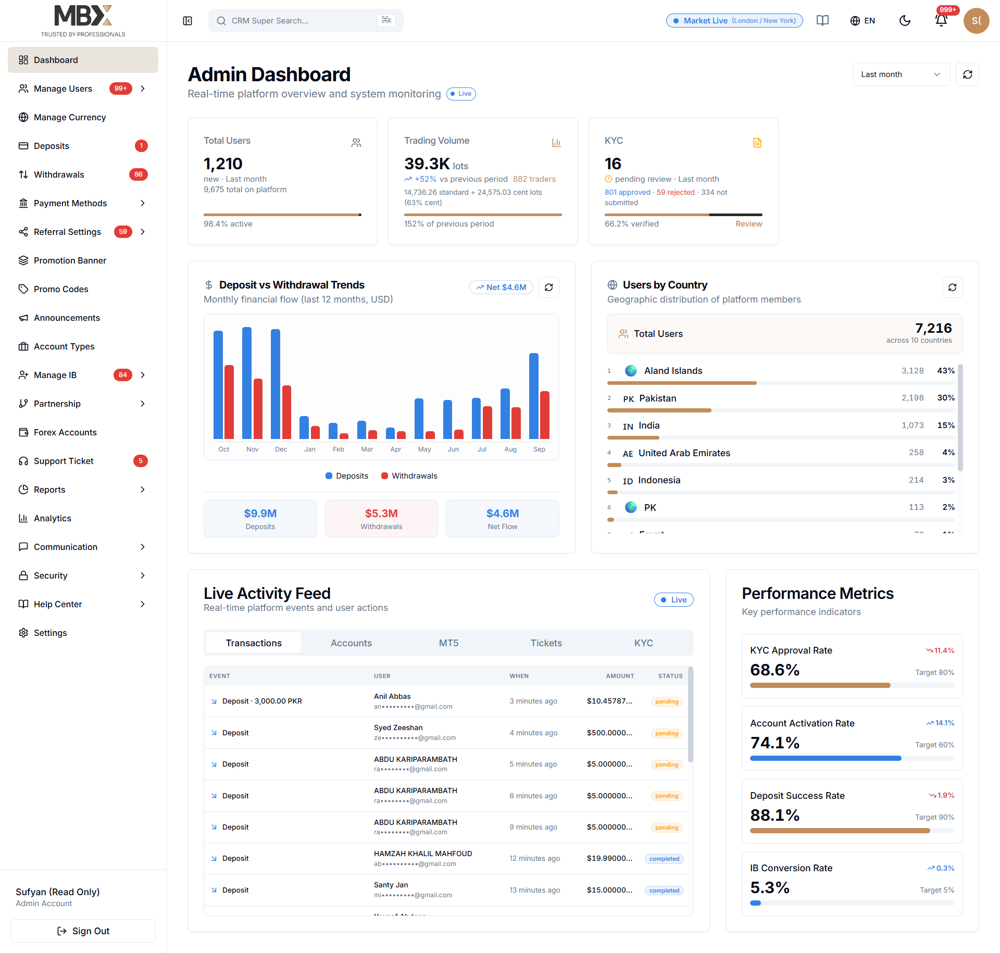
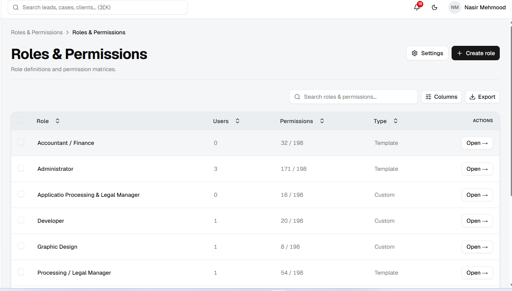
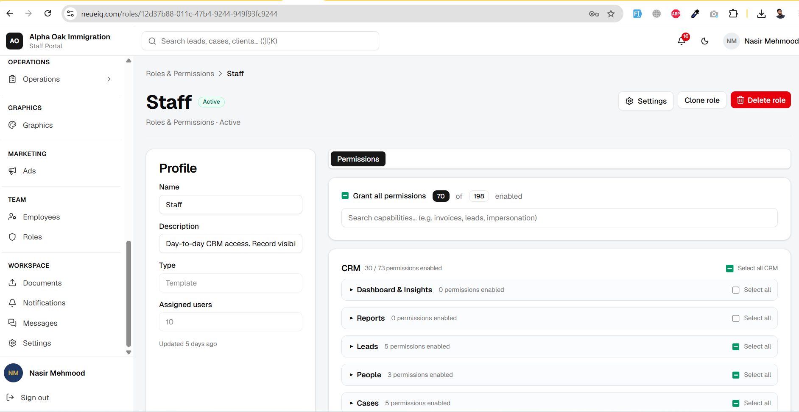
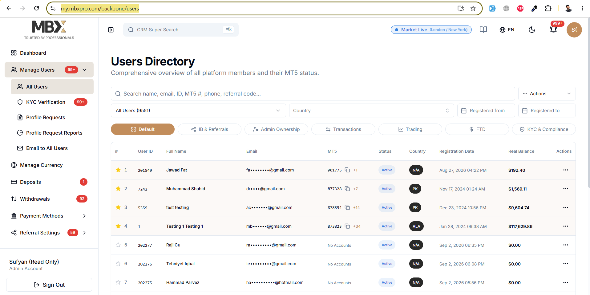
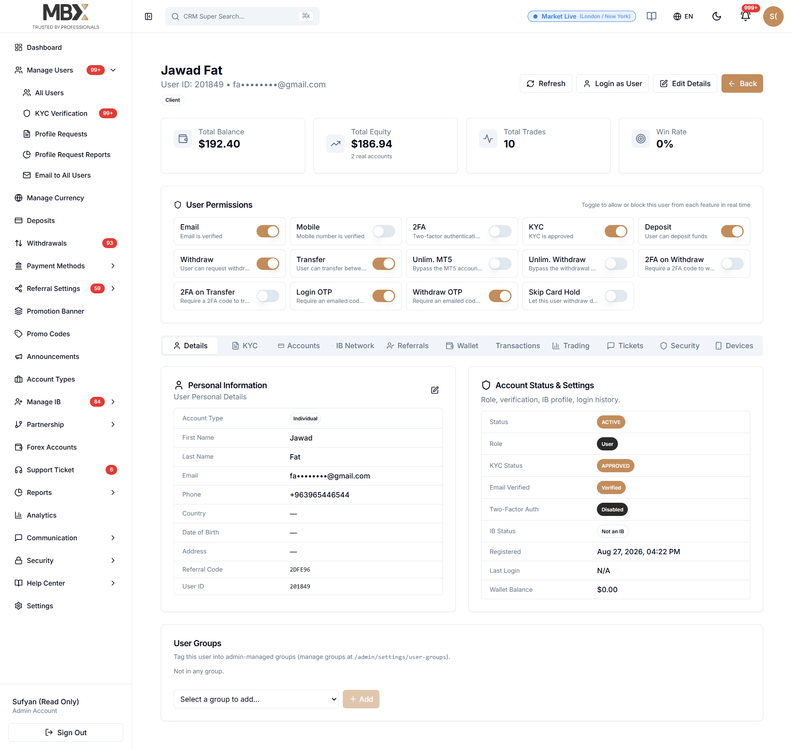
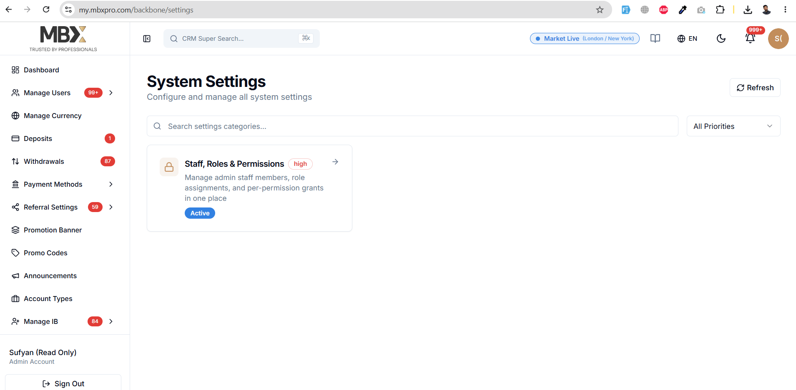
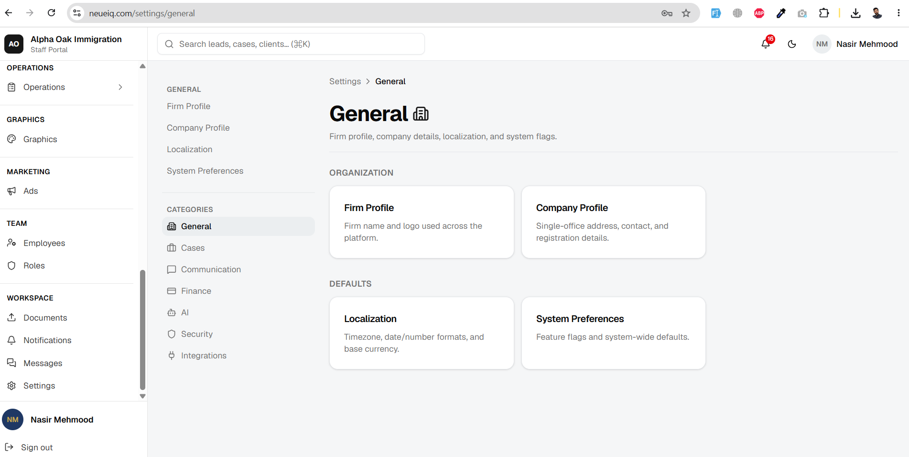

https://my.mbxpro.com/backbone/users

Email: admin@mbxpro.com
Password: Admin!Dev12345

Please review the existing MBX Pro users page and follow the **same design, layout, and user flow** for these pages.

- Review the users listing and follow the same **table structure, columns, spacing, icons, status badges, and overall presentation**.
- When clicking a user, create the user details page following the **same presentation and flow** used on MBX Pro.
- Review the **roles and permissions** section, especially how permissions are listed and assigned when opening a role.
- Follow the same **sidebar menu, menu structure, icons, headers, buttons, cards, tables, colors, and UI patterns**.
- Go through the relevant pages carefully and make the new implementation as **close as possible to the existing MBX Pro design and flow**.
- Keep the UI consistent across the users, employee details, roles, and
  should be follow the modal popup structure for the crud & listing in tables,
  all the delte should be confirmation popup..

specifically add the same loader of the page & use same specific card or section loader

the profile should have dropdonw listing having the profile page directly
where the login user can update there profile

### Role & Permission Management

- Admin should be able to **create new roles** and assign permissions.
- When opening a role, show a clear **permission list grouped by category** with checkboxes.
- Allow selecting:

  - All permissions
  - All permissions within a specific group
  - Individual permissions

- Permissions should **save automatically** when checked or unchecked.
  
  

### Employee Management

- Clicking an employee should redirect to a **dedicated employee details page**.
- The page should have separate sections for:

  - Employee basic information
  - Active/Inactive status
  - Role update
  - Reset password
  - Other relevant user controls
    permissions pages.
    
    

  ### Settings Structure

- Settings should be divided into **separate settings cards/categories**.
- When the admin clicks on a settings card, it should open that setting on a **dedicated page**.
- The settings page should have a **sidebar with sub-menu items** for easy navigation between different settings.
- Each setting should have its own **clear section and controls**.
- Follow a clean and consistent layout across all settings pages.
  
  

this should also be add in the settigns tabs
Social links should be **fully dynamic** and managed through CRUD.

- Admin can add a social link with:

  - Title
  - URL
  - Active/Inactive status

- Admin can **add multiple social links dynamically**.
- Admin should be able to **create, view, edit, update, and delete** social links.
- Active/Inactive status should be easily manageable.
- These social links should be displayed dynamically wherever required.

### Admin Search

- Add a **global search palette** at the top of the admin panel.
- It should allow admins to search across the **entire admin system**.
- Search should quickly find pages, users, roles, settings, and other relevant items.
- The search palette should be easily accessible from the top navigation.
- Keep the design consistent with the existing admin UI.

### Admin Theme & Notifications

- Add **Light Mode and Dark Mode** to the admin panel.
- Add a **notification icon** in the top navigation.
- The notification section should show relevant admin notifications.
- Keep the theme switcher and notification icon consistent with the overall admin design and existing UI patterns.
