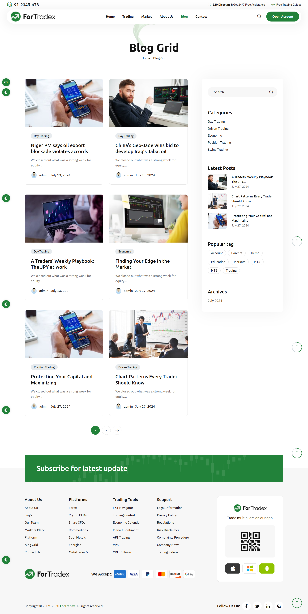

Review the existing MBFX Learning Center project and implement a new visual design system inspired by the ForTradex Forex Broker theme/demo.

Reference:
https://july.finestwp.com/newwp/fortradex/

Important:

- Do NOT replace the existing architecture.
- Do NOT convert the project to WordPress/Elementor.
- Keep the existing Next.js, TypeScript, Tailwind CSS and shadcn/ui architecture.
- Treat the reference only as a visual/design reference.
- Do not copy proprietary source code, assets, text or branding.
- Reuse and improve the existing components wherever possible.

First perform a complete UI/design audit of the existing website.

Analyze the reference and establish a reusable design system covering:

- Typography
- Colors
- Container widths
- Section spacing
- Buttons
- Cards
- Badges
- Images
- Borders
- Shadows
- Border radius
- Header/navigation
- Footer
- Hero sections
- Content grids
- Responsive behavior
- Hover states
- Scroll/reveal animations
- Loading states
- Counters/stat animations
- Image hover effects
- CTA sections
- News/article presentation

Create reusable components instead of page-specific implementations.

Create reusable primitives for:

- Container
- Section
- Button
- Card
- Badge
- Reveal animation
- Hover effects
- Page loader
- Counter
- Marquee/ticker
- Image reveal
- Section heading

Use CSS transitions for simple effects and Motion only where JavaScript animation is actually required.

Create reusable section variants such as:

- Hero: centered, split, background
- Feature section: image-left, image-right
- Cards: default, elevated, bordered, featured
- News grid: standard, featured, compact
- CTA: default and full-width

Do NOT build a generic page builder or Elementor clone.

For content management, separate content from presentation.

Existing/admin-managed content should control:

- Titles
- Descriptions
- Images
- Buttons
- Visibility
- Ordering
- Featured status
- Layout variants where appropriate
- Number of displayed items
- Animation variant where appropriate

The frontend components must remain responsible for the actual design and presentation.

Create a manageable homepage section system where sections can be enabled/disabled and ordered from the admin without duplicating frontend code.

Prioritize the following pages/components first:

1. Header/navigation
2. Homepage hero
3. Homepage sections
4. Statistics/cards
5. News & Analysis
6. CTA sections
7. Footer
8. Remaining public pages

Make the UI:

- Modern
- Professional
- Premium fintech/forex style
- Responsive
- Accessible
- Consistent
- Animation-rich but not excessive
- Fast and performant

Use the existing shadcn/ui components wherever appropriate instead of creating duplicate components.

Before implementation, document:

1. Current UI architecture
2. Components that can be reused
3. Components that need improvement
4. New components required
5. Design tokens
6. Animation strategy
7. Content/display management strategy

Then implement the changes incrementally.

Do not change backend/database architecture unless it is genuinely required for the content-management functionality.

After implementation:

- Run typecheck
- Run lint
- Run build
- Check desktop/tablet/mobile layouts
- Check dark/light mode
- Check reduced-motion accessibility
- Check loading states
- Check hover/focus states
- Remove duplicated CSS/components
- Keep the implementation production-ready.

Do not use update the dynamic color flow..this is the actual color code that will use
Dashboard
/
Theme
Theme
Colors & Branding
Layout & Display
Theme Modes (light / dark)
Presets

#e8b98c

#2A2A29

#2D72C7

#D93A34

#FFA310

#004284

#EAE5DE
Derived states (read-only)

#8b6f54
#e8b98c

this is the website view page source:
make home page of website like this..use these hover effects,loader etc..
make it components,reuse that each effects
https://july.finestwp.com/newwp/fortradex/

<!DOCTYPE html>
<html lang="en-US" class="no-js no-svg">
<head>
	<meta charset="UTF-8">
	    		<link rel="shortcut icon" href="https://july.finestwp.com/newwp/fortradex/wp-content/themes/fortradex/assets/images/favicon.png" type="image/x-icon">
		<link rel="icon" href="https://july.finestwp.com/newwp/fortradex/wp-content/themes/fortradex/assets/images/favicon.png" type="image/x-icon">
	    	<!-- responsive meta -->
	<meta name="viewport" content="width=device-width, initial-scale=1">
	<!-- For IE -->
    <meta http-equiv="X-UA-Compatible" content="IE=edge">
    <title>Fortradex &#8211; Fortradex WordPress Theme</title>
<meta name='robots' content='max-image-preview:large' />
<link rel='dns-prefetch' href='//fonts.googleapis.com' />
<link rel="alternate" type="application/rss+xml" title="Fortradex &raquo; Feed" href="https://july.finestwp.com/newwp/fortradex/feed/" />
<link rel="alternate" type="application/rss+xml" title="Fortradex &raquo; Comments Feed" href="https://july.finestwp.com/newwp/fortradex/comments/feed/" />
<link rel="alternate" title="oEmbed (JSON)" type="application/json+oembed" href="https://july.finestwp.com/newwp/fortradex/wp-json/oembed/1.0/embed?url=https%3A%2F%2Fjuly.finestwp.com%2Fnewwp%2Ffortradex%2F" />
<link rel="alternate" title="oEmbed (XML)" type="text/xml+oembed" href="https://july.finestwp.com/newwp/fortradex/wp-json/oembed/1.0/embed?url=https%3A%2F%2Fjuly.finestwp.com%2Fnewwp%2Ffortradex%2F&#038;format=xml" />

<link rel='stylesheet' id='contact-form-7-css' href='https://july.finestwp.com/newwp/fortradex/wp-content/plugins/contact-form-7/includes/css/styles.css?ver=6.1.7' media='all' />
<link rel='stylesheet' id='tutor-icon-css' href='https://july.finestwp.com/newwp/fortradex/wp-content/plugins/tutor/assets/css/tutor-icon.min.css?ver=4.0.7' media='all' />
<link rel='stylesheet' id='tutor-css' href='https://july.finestwp.com/newwp/fortradex/wp-content/plugins/tutor/assets/css/tutor.min.css?ver=4.0.7' media='all' />
<link rel='stylesheet' id='tutor-frontend-css' href='https://july.finestwp.com/newwp/fortradex/wp-content/plugins/tutor/assets/css/tutor-front.min.css?ver=4.0.7' media='all' />

<link rel='stylesheet' id='font-awesome-all-css' href='https://july.finestwp.com/newwp/fortradex/wp-content/themes/fortradex/assets/css/font-awesome-all.css?ver=7.1' media='all' />
<link rel='stylesheet' id='flaticon-css' href='https://july.finestwp.com/newwp/fortradex/wp-content/themes/fortradex/assets/css/flaticon.css?ver=7.1' media='all' />
<link rel='stylesheet' id='owl-css' href='https://july.finestwp.com/newwp/fortradex/wp-content/themes/fortradex/assets/css/owl.css?ver=7.1' media='all' />
<link rel='stylesheet' id='bootstrap-css' href='https://july.finestwp.com/newwp/fortradex/wp-content/themes/fortradex/assets/css/bootstrap.css?ver=7.1' media='all' />
<link rel='stylesheet' id='jquery-fancybox-css' href='https://july.finestwp.com/newwp/fortradex/wp-content/themes/fortradex/assets/css/jquery.fancybox.min.css?ver=7.1' media='all' />
<link rel='stylesheet' id='fancybox-css' href='https://july.finestwp.com/newwp/fortradex/wp-content/themes/fortradex/assets/css/animate.css?ver=7.1' media='all' />
<link rel='stylesheet' id='nice-select-css' href='https://july.finestwp.com/newwp/fortradex/wp-content/themes/fortradex/assets/css/nice-select.css?ver=7.1' media='all' />
<link rel='stylesheet' id='jquery-ui-css' href='https://july.finestwp.com/newwp/fortradex/wp-content/themes/fortradex/assets/css/jquery-ui.css?ver=7.1' media='all' />
<link rel='stylesheet' id='odometer-css' href='https://july.finestwp.com/newwp/fortradex/wp-content/themes/fortradex/assets/css/odometer.css?ver=7.1' media='all' />
<link rel='stylesheet' id='elpath-css' href='https://july.finestwp.com/newwp/fortradex/wp-content/themes/fortradex/assets/css/elpath.css?ver=7.1' media='all' />
<link rel='stylesheet' id='color-css' href='https://july.finestwp.com/newwp/fortradex/wp-content/themes/fortradex/assets/css/color.css?ver=7.1' media='all' />
<link rel='stylesheet' id='rtl-css' href='https://july.finestwp.com/newwp/fortradex/wp-content/themes/fortradex/assets/css/rtl.css?ver=7.1' media='all' />
<link rel='stylesheet' id='fortradex-header-css' href='https://july.finestwp.com/newwp/fortradex/wp-content/themes/fortradex/assets/css/module-css/header.css?ver=7.1' media='all' />
<link rel='stylesheet' id='fortradex-banner-css' href='https://july.finestwp.com/newwp/fortradex/wp-content/themes/fortradex/assets/css/module-css/banner.css?ver=7.1' media='all' />
<link rel='stylesheet' id='fortradex-cta-css' href='https://july.finestwp.com/newwp/fortradex/wp-content/themes/fortradex/assets/css/module-css/cta.css?ver=7.1' media='all' />
<link rel='stylesheet' id='fortradex-clients-css' href='https://july.finestwp.com/newwp/fortradex/wp-content/themes/fortradex/assets/css/module-css/clients.css?ver=7.1' media='all' />
<link rel='stylesheet' id='fortradex-account-css' href='https://july.finestwp.com/newwp/fortradex/wp-content/themes/fortradex/assets/css/module-css/account.css?ver=7.1' media='all' />
<link rel='stylesheet' id='fortradex-history-css' href='https://july.finestwp.com/newwp/fortradex/wp-content/themes/fortradex/assets/css/module-css/history.css?ver=7.1' media='all' />
<link rel='stylesheet' id='fortradex-about-css' href='https://july.finestwp.com/newwp/fortradex/wp-content/themes/fortradex/assets/css/module-css/about.css?ver=7.1' media='all' />
<link rel='stylesheet' id='fortradex-platform-css' href='https://july.finestwp.com/newwp/fortradex/wp-content/themes/fortradex/assets/css/module-css/platform.css?ver=7.1' media='all' />
<link rel='stylesheet' id='fortradex-funfact-css' href='https://july.finestwp.com/newwp/fortradex/wp-content/themes/fortradex/assets/css/module-css/funfact.css?ver=7.1' media='all' />
<link rel='stylesheet' id='fortradex-trading-css' href='https://july.finestwp.com/newwp/fortradex/wp-content/themes/fortradex/assets/css/module-css/trading.css?ver=7.1' media='all' />
<link rel='stylesheet' id='fortradex-process-css' href='https://july.finestwp.com/newwp/fortradex/wp-content/themes/fortradex/assets/css/module-css/process.css?ver=7.1' media='all' />
<link rel='stylesheet' id='fortradex-award-css' href='https://july.finestwp.com/newwp/fortradex/wp-content/themes/fortradex/assets/css/module-css/award.css?ver=7.1' media='all' />
<link rel='stylesheet' id='fortradex-apps-css' href='https://july.finestwp.com/newwp/fortradex/wp-content/themes/fortradex/assets/css/module-css/apps.css?ver=7.1' media='all' />
<link rel='stylesheet' id='fortradex-news-css' href='https://july.finestwp.com/newwp/fortradex/wp-content/themes/fortradex/assets/css/module-css/news.css?ver=7.1' media='all' />
<link rel='stylesheet' id='fortradex-experience-css' href='https://july.finestwp.com/newwp/fortradex/wp-content/themes/fortradex/assets/css/module-css/experience.css?ver=7.1' media='all' />
<link rel='stylesheet' id='fortradex-testimonial-css' href='https://july.finestwp.com/newwp/fortradex/wp-content/themes/fortradex/assets/css/module-css/testimonial.css?ver=7.1' media='all' />
<link rel='stylesheet' id='fortradex-subscribe-css' href='https://july.finestwp.com/newwp/fortradex/wp-content/themes/fortradex/assets/css/module-css/subscribe.css?ver=7.1' media='all' />
<link rel='stylesheet' id='fortradex-dark-css' href='https://july.finestwp.com/newwp/fortradex/wp-content/themes/fortradex/assets/css/dark.css?ver=7.1' media='all' />
<link rel='stylesheet' id='fortradex-page-title-css' href='https://july.finestwp.com/newwp/fortradex/wp-content/themes/fortradex/assets/css/module-css/page-title.css?ver=7.1' media='all' />
<link rel='stylesheet' id='fortradex-working-css' href='https://july.finestwp.com/newwp/fortradex/wp-content/themes/fortradex/assets/css/module-css/working.css?ver=7.1' media='all' />
<link rel='stylesheet' id='fortradex-team-css' href='https://july.finestwp.com/newwp/fortradex/wp-content/themes/fortradex/assets/css/module-css/team.css?ver=7.1' media='all' />
<link rel='stylesheet' id='fortradex-faq-css' href='https://july.finestwp.com/newwp/fortradex/wp-content/themes/fortradex/assets/css/module-css/faq.css?ver=7.1' media='all' />
<link rel='stylesheet' id='fortradex-error-css' href='https://july.finestwp.com/newwp/fortradex/wp-content/themes/fortradex/assets/css/module-css/error.css?ver=7.1' media='all' />
<link rel='stylesheet' id='fortradex-markets-css' href='https://july.finestwp.com/newwp/fortradex/wp-content/themes/fortradex/assets/css/module-css/markets.css?ver=7.1' media='all' />
<link rel='stylesheet' id='fortradex-team-details-css' href='https://july.finestwp.com/newwp/fortradex/wp-content/themes/fortradex/assets/css/module-css/team-details.css?ver=7.1' media='all' />
<link rel='stylesheet' id='fortradex-contact-css' href='https://july.finestwp.com/newwp/fortradex/wp-content/themes/fortradex/assets/css/module-css/contact.css?ver=7.1' media='all' />
<link rel='stylesheet' id='fortradex-blog-sidebar-css' href='https://july.finestwp.com/newwp/fortradex/wp-content/themes/fortradex/assets/css/module-css/blog-sidebar.css?ver=7.1' media='all' />
<link rel='stylesheet' id='fortradex-blog-details-css' href='https://july.finestwp.com/newwp/fortradex/wp-content/themes/fortradex/assets/css/module-css/blog-details.css?ver=7.1' media='all' />
<link rel='stylesheet' id='fortradex-pricing-css' href='https://july.finestwp.com/newwp/fortradex/wp-content/themes/fortradex/assets/css/module-css/pricing.css?ver=7.1' media='all' />
<link rel='stylesheet' id='fortradex-education-details-css' href='https://july.finestwp.com/newwp/fortradex/wp-content/themes/fortradex/assets/css/module-css/education-details.css?ver=7.1' media='all' />
<link rel='stylesheet' id='fortradex-footer-css' href='https://july.finestwp.com/newwp/fortradex/wp-content/themes/fortradex/assets/css/module-css/footer.css?ver=7.1' media='all' />
<link rel='stylesheet' id='fortradex-main-css' href='https://july.finestwp.com/newwp/fortradex/wp-content/themes/fortradex/style.css?ver=7.1' media='all' />
<link rel='stylesheet' id='fortradex-main-style-css' href='https://july.finestwp.com/newwp/fortradex/wp-content/themes/fortradex/assets/css/style.css?ver=7.1' media='all' />
<link rel='stylesheet' id='fortradex-custom-css' href='https://july.finestwp.com/newwp/fortradex/wp-content/themes/fortradex/assets/css/custom.css?ver=7.1' media='all' />
<link rel='stylesheet' id='fortradex-responsive-css' href='https://july.finestwp.com/newwp/fortradex/wp-content/themes/fortradex/assets/css/responsive.css?ver=7.1' media='all' />
<link rel='stylesheet' id='fortradex-main-color-scheme-css' href='https://july.finestwp.com/newwp/fortradex/wp-content/themes/fortradex/assets/css/color.php?main_color=22823A&#038;second_color=131615&#038;ver=7.1' media='all' />
<link rel='stylesheet' id='fortradex-theme-fonts-css' href='https://fonts.googleapis.com/css?family=Ubuntu%3Aital%2Cwght%400%2C300%2C%2C400%2C500%2C700%2C300%2C400%2C500%2C700%26display%3Dswap%7CIBM+Plex+Sans%3Aital%2Cwght%400%2C100%2C200%2C300%2C400%2C500%2C600%2C700%26display%3Dswap&#038;subset=latin%2Clatin-ext' media='all' />
<link rel='stylesheet' id='elementor-frontend-css' href='https://july.finestwp.com/newwp/fortradex/wp-content/uploads/elementor/css/custom-frontend.min.css?ver=1788275266' media='all' />
<link rel='stylesheet' id='elementor-post-10-css' href='https://july.finestwp.com/newwp/fortradex/wp-content/uploads/elementor/css/post-10.css?ver=1788285808' media='all' />
<link rel='stylesheet' id='widget-divider-css' href='https://july.finestwp.com/newwp/fortradex/wp-content/plugins/elementor/assets/css/widget-divider.min.css?ver=4.2.4' media='all' />
<link rel='stylesheet' id='widget-image-css' href='https://july.finestwp.com/newwp/fortradex/wp-content/plugins/elementor/assets/css/widget-image.min.css?ver=4.2.4' media='all' />
<link rel='stylesheet' id='widget-heading-css' href='https://july.finestwp.com/newwp/fortradex/wp-content/plugins/elementor/assets/css/widget-heading.min.css?ver=4.2.4' media='all' />
<link rel='stylesheet' id='elementor-post-15-css' href='https://july.finestwp.com/newwp/fortradex/wp-content/uploads/elementor/css/post-15.css?ver=1788285809' media='all' />
<link rel='stylesheet' id='elementor-gf-local-roboto-css' href='https://july.finestwp.com/newwp/fortradex/wp-content/uploads/elementor/google-fonts/css/roboto.css?ver=1742239231' media='all' />
<link rel='stylesheet' id='elementor-gf-local-robotoslab-css' href='https://july.finestwp.com/newwp/fortradex/wp-content/uploads/elementor/google-fonts/css/robotoslab.css?ver=1742239240' media='all' />
<link rel='stylesheet' id='elementor-gf-local-ubuntu-css' href='https://july.finestwp.com/newwp/fortradex/wp-content/uploads/elementor/google-fonts/css/ubuntu.css?ver=1742239248' media='all' />
<link rel='stylesheet' id='elementor-gf-local-ibmplexsans-css' href='https://july.finestwp.com/newwp/fortradex/wp-content/uploads/elementor/google-fonts/css/ibmplexsans.css?ver=1742239261' media='all' />

<link rel="https://api.w.org/" href="https://july.finestwp.com/newwp/fortradex/wp-json/" /><link rel="alternate" title="JSON" type="application/json" href="https://july.finestwp.com/newwp/fortradex/wp-json/wp/v2/pages/15" /><link rel="EditURI" type="application/rsd+xml" title="RSD" href="https://july.finestwp.com/newwp/fortradex/xmlrpc.php?rsd" />
<meta name="generator" content="WordPress 7.1" />
<meta name="generator" content="TutorLMS 4.0.7" />
<meta name="generator" content="WooCommerce 11.0.1" />
<link rel="canonical" href="https://july.finestwp.com/newwp/fortradex/" />
<link rel='shortlink' href='https://july.finestwp.com/newwp/fortradex/' />
<meta name="generator" content="Redux 4.4.17" />	<noscript></noscript>
	<meta name="generator" content="Elementor 4.2.4; features: e_font_icon_svg, additional_custom_breakpoints; settings: css_print_method-external, google_font-enabled, font_display-swap">
			
			</head>

<body class="home wp-singular page-template page-template-tpl-default-elementor page-template-tpl-default-elementor-php page page-id-15 wp-embed-responsive wp-theme-fortradex theme-fortradex tutor-lms woocommerce-no-js menu-layer elementor-default elementor-kit-10 elementor-page elementor-page-15">

            <!-- preloader -->
    

        

            
<i class="fal fa-times"></i>

            

                

                    

                    

                                                
f

o

r

t

r

a

d

e

x 

  

<!-- preloader end -->

        <!--Search Popup-->
    

        

            

                <figure class="logo-box p_relative z_1"></figure>
                
<i class="fal fa-times"></i>

            

            

            

                

<form method="post" action="https://july.finestwp.com/newwp/fortradex/">
    

        <fieldset>
            <input type="search" class="form-control" name="s" value="" placeholder="Search" required >
            <button type="submit"><i class="icon-10"></i></button>
        </fieldset>
    

</form>                

            

        

    

    <!-- main header -->
    <header class="main-header header-style-one">
                <!-- header-top -->
        

            

                

                                        

                        
<i class="icon-07"></i>

                        <a href="tel:91-2345-678">91-2345-678</a>
                    

                                                            

                        <a href="#" class="theme-btn btn-one mr_10">Open Account</a>                        <a href="#" class="theme-btn btn-two">Login</a>                    

                                    

            

        

                <!-- header-lower -->
        

            

                

                    <figure class="logo-box"></figure>
                    

                        <!--Mobile Navigation Toggler-->
                        

                            <i class="icon-bar"></i>
                            <i class="icon-bar"></i>
                            <i class="icon-bar"></i>
                        

                        <nav class="main-menu navbar-expand-md navbar-light clearfix">
                            

                                <ul class="navigation clearfix">
                                <li id="menu-item-18" class="menu-item menu-item-type-custom menu-item-object-custom current-menu-item current_page_item menu-item-home current-menu-ancestor current-menu-parent menu-item-has-children menu-item-18 dropdown current current"><a href="https://july.finestwp.com/newwp/fortradex/" onClick="return true">Home</a><ul class="sub-menu submenu menu-sub-content">	<li id="menu-item-20" class="menu-item menu-item-type-post_type menu-item-object-page menu-item-home current-menu-item page_item page-item-15 current_page_item menu-item-20 current"><a href="https://july.finestwp.com/newwp/fortradex/" onClick="return true">Home One</a></li>	<li id="menu-item-424" class="menu-item menu-item-type-post_type menu-item-object-page menu-item-424"><a href="https://july.finestwp.com/newwp/fortradex/home-two/" onClick="return true">Home Two</a></li>	<li id="menu-item-666" class="menu-item menu-item-type-post_type menu-item-object-page menu-item-666"><a href="https://july.finestwp.com/newwp/fortradex/home-three/" onClick="return true">Home Three</a></li>	<li id="menu-item-1064" class="menu-item menu-item-type-post_type menu-item-object-page menu-item-1064"><a href="https://july.finestwp.com/newwp/fortradex/home-four/" onClick="return true">Home Four</a></li>	<li id="menu-item-1198" class="menu-item menu-item-type-post_type menu-item-object-page menu-item-1198"><a href="https://july.finestwp.com/newwp/fortradex/home-five/" onClick="return true">Home Five</a></li></ul>

</li><li id="menu-item-137" class="menu-item menu-item-type-custom menu-item-object-custom menu-item-has-children menu-item-137 dropdown"><a href="#" onClick="return true">Trading</a><ul class="sub-menu submenu menu-sub-content">	<li id="menu-item-1404" class="menu-item menu-item-type-post_type menu-item-object-page menu-item-1404"><a href="https://july.finestwp.com/newwp/fortradex/platform/" onClick="return true">Platform</a></li>	<li id="menu-item-1433" class="menu-item menu-item-type-post_type menu-item-object-page menu-item-1433"><a href="https://july.finestwp.com/newwp/fortradex/account/" onClick="return true">Account</a></li>	<li id="menu-item-1934" class="menu-item menu-item-type-post_type menu-item-object-page menu-item-1934"><a href="https://july.finestwp.com/newwp/fortradex/account-details/" onClick="return true">Account Details</a></li></ul>
</li><li id="menu-item-138" class="menu-item menu-item-type-custom menu-item-object-custom menu-item-has-children menu-item-138 dropdown"><a href="#" onClick="return true">Market</a><ul class="sub-menu submenu menu-sub-content">	<li id="menu-item-1527" class="menu-item menu-item-type-post_type menu-item-object-page menu-item-1527"><a href="https://july.finestwp.com/newwp/fortradex/markets-place/" onClick="return true">Markets Place</a></li>	<li id="menu-item-2099" class="menu-item menu-item-type-post_type menu-item-object-page menu-item-2099"><a href="https://july.finestwp.com/newwp/fortradex/markets-details/" onClick="return true">Markets Details</a></li></ul>
</li><li id="menu-item-139" class="menu-item menu-item-type-custom menu-item-object-custom menu-item-has-children menu-item-139 dropdown"><a href="#" onClick="return true">About Us</a><ul class="sub-menu submenu menu-sub-content">	<li id="menu-item-1635" class="menu-item menu-item-type-custom menu-item-object-custom menu-item-has-children menu-item-1635 dropdown"><a href="#" onClick="return true">Education</a>	<ul class="sub-menu submenu menu-sub-content">		<li id="menu-item-2117" class="menu-item menu-item-type-post_type menu-item-object-page menu-item-2117"><a href="https://july.finestwp.com/newwp/fortradex/education/" onClick="return true">Education</a></li>		<li id="menu-item-2476" class="menu-item menu-item-type-post_type menu-item-object-page menu-item-2476"><a href="https://july.finestwp.com/newwp/fortradex/student-registration/" onClick="return true">Student Registration</a></li>		<li id="menu-item-2475" class="menu-item menu-item-type-post_type menu-item-object-page menu-item-2475"><a href="https://july.finestwp.com/newwp/fortradex/instructor-registration/" onClick="return true">Instructor Registration</a></li>		<li id="menu-item-2477" class="menu-item menu-item-type-post_type menu-item-object-page menu-item-2477"><a href="https://july.finestwp.com/newwp/fortradex/dashboard/" onClick="return true">Dashboard</a></li>	</ul>
</li>	<li id="menu-item-1636" class="menu-item menu-item-type-custom menu-item-object-custom menu-item-has-children menu-item-1636 dropdown"><a href="#" onClick="return true">Team</a>	<ul class="sub-menu submenu menu-sub-content">		<li id="menu-item-1660" class="menu-item menu-item-type-post_type menu-item-object-page menu-item-1660"><a href="https://july.finestwp.com/newwp/fortradex/our-expert-team/" onClick="return true">Our Expert Team</a></li>		<li id="menu-item-1746" class="menu-item menu-item-type-post_type menu-item-object-team menu-item-1746"><a href="https://july.finestwp.com/newwp/fortradex/team/aronic-kehan/" onClick="return true">Team Details</a></li>	</ul>
</li>	<li id="menu-item-1703" class="menu-item menu-item-type-post_type menu-item-object-page menu-item-1703"><a href="https://july.finestwp.com/newwp/fortradex/about-us/" onClick="return true">About Us</a></li>	<li id="menu-item-1727" class="menu-item menu-item-type-post_type menu-item-object-page menu-item-1727"><a href="https://july.finestwp.com/newwp/fortradex/faqs/" onClick="return true">Faq’s</a></li>	<li id="menu-item-1734" class="menu-item menu-item-type-custom menu-item-object-custom menu-item-1734"><a href="https://july.finestwp.com/newwp/fortradex/?p=123456abc" onClick="return true">404</a></li></ul>
</li><li id="menu-item-140" class="menu-item menu-item-type-custom menu-item-object-custom menu-item-has-children menu-item-140 dropdown"><a href="#" onClick="return true">Blog</a><ul class="sub-menu submenu menu-sub-content">	<li id="menu-item-1842" class="menu-item menu-item-type-post_type menu-item-object-page menu-item-1842"><a href="https://july.finestwp.com/newwp/fortradex/blog-grid/" onClick="return true">Blog Grid</a></li>	<li id="menu-item-1865" class="menu-item menu-item-type-post_type menu-item-object-page menu-item-1865"><a href="https://july.finestwp.com/newwp/fortradex/blog-standard/" onClick="return true">Blog Standard</a></li>	<li id="menu-item-2457" class="menu-item menu-item-type-post_type menu-item-object-post menu-item-2457"><a href="https://july.finestwp.com/newwp/fortradex/2024/07/a-traders-weekly-playbook-the-jpy-at-work-2/" onClick="return true">Blog Details</a></li></ul>
</li><li id="menu-item-143" class="menu-item menu-item-type-post_type menu-item-object-page menu-item-143"><a href="https://july.finestwp.com/newwp/fortradex/contact/" onClick="return true">Contact</a></li>     
                                </ul>
                            

                        </nav>
                                                
<button class="search-toggler"><i class="icon-10"></i></button>

                                            

                

            

        

        <!--sticky Header-->
        

            

                

                    <figure class="logo-box"></figure>
                    

                        <nav class="main-menu clearfix">
                            <!--Keep This Empty / Menu will come through Javascript-->
                        </nav>
                                                
<button class="search-toggler"><i class="icon-10"></i></button>

                                            

                

            

        

    </header>
    <!-- main-header end -->

    <!-- Mobile Menu  -->
    

        

        
<i class="fas fa-times"></i>

        <nav class="menu-box">
            

            			                        

            
<!--Here Menu Will Come Automatically Via Javascript / Same Menu as in Header-->

            

                <h4>Contact Info</h4>                <ul>
                    <li>Chicago 12, Melborne City, USA</li>                    <li><a href="tel:+88-01682648101">+88-01682648101</a></li>                    <li><a href="mailto:info@example.com">info@example.com</a></li>                </ul>
            

    		            

                <ul class="clearfix">

    	<li>
    	<a target="_blank" href="https://www.facebook.com/"><i class="fab  fa-facebook-f"></i></a>
    </li>
    	<li>
    	<a target="_blank" href="https://www.twitter.com/"><i class="fab  fa-twitter"></i></a>
    </li>
    	<li>
    	<a target="_blank" href="https://www.linkedin.com/"><i class="fab  fa-linkedin-in"></i></a>
    </li>
    	<li>
    	<a target="_blank" href="https://www.skype.com/"><i class="fab  fa-skype"></i></a>
    </li>

                    </ul>
            

                    </nav>
    

    <!-- End Mobile Menu -->
    				

    			

    			

    			

    <!-- banner-section -->
    <section class="banner-section p_relative pt_20">
        

            

                                

                                        

                    

                        <h2>Trading for Anyone. Anywhere. Anytime.</h2>
                        
Trade over 1000 Instruments. Forex, CFDs on Stock Indices, Commodities, Stocks, Metals and Energies.

    					                        

                            <a href="https://july.finestwp.com/newwp/fortradex/account/"   class="theme-btn btn-one">Create Account</a>
                        

                                            

                

                                

                                        

                    

                        <h2>Trading for Anyone. Anywhere. Anytime.</h2>
                        
Trade over 1000 Instruments. Forex, CFDs on Stock Indices, Commodities, Stocks, Metals and Energies.

    					                        

                            <a href="https://july.finestwp.com/newwp/fortradex/account/"   class="theme-btn btn-one">Create Account</a>
                        

                                            

                

                                

                                        

                    

                        <h2>Trading for Anyone. Anywhere. Anytime.</h2>
                        
Trade over 1000 Instruments. Forex, CFDs on Stock Indices, Commodities, Stocks, Metals and Energies.

    					                        

                            <a href="https://july.finestwp.com/newwp/fortradex/account/"   class="theme-btn btn-one">Create Account</a>
                        

                                            

                

                            

        

    </section>
    <!-- banner-section end -->

    				

    			

    			

    	

    				

    			

    			

    <!-- clients-section -->
    <section class="clients-section pt_40 pb_40">
        

            <ul class="clients-list">
                                <li></li>
                                <li></li>
                                <li></li>
                                <li></li>
                                <li></li>
                                <li></li>
                                <li></li>

            </ul>
        

    </section>
    <!-- clients-section end -->

    				

    			

    				

    			

    	

    				

    			

    			

    

        		<h6 class="te-subtitle sub-title">Account</h6>
        		<h2 class="te-title fortradex-size-default">Trading Accounts</h2>
            

    				

    			

    	

    			

    			

    

        

            

                            <i class="icon-01"></i>                        

            <h3><a href="https://july.finestwp.com/newwp/fortradex/professional-account/"  >Professional Account</a></h3>
            
Traders with professional accounts gain access to a wide range of benefits, including enhanced trading platforms

        

    

    				

    			

    			

    			

    

        

            

                            <i class=" icon-02"></i>                        

            <h3><a href="https://july.finestwp.com/newwp/fortradex/overview-account/"  >Overview Account</a></h3>
            
The primary feature of a trading overview account is its ability to aggregate information from multiple accounts and

        

    

    				

    			

    			

    			

    

        

            

                            <i class=" icon-03"></i>                        

            <h3><a href="https://july.finestwp.com/newwp/fortradex/demo-account/"  >Demo Account</a></h3>
            
Trading demo accounts are particularly valuable for novice traders who are new to the world of investing.

        

    

    				

    			

    			

    			

    

        

            

                            <i class=" icon-04"></i>                        

            <h3><a href="https://july.finestwp.com/newwp/fortradex/islamic-account/"  >Islamic Account</a></h3>
            
Islamic accounts also adhere to ethical guidelines that prohibit trading certain financial instruments deemed

        

    

    				

    			

    			

    				

    			

    	

    				

    	

    			

    			

    

        		<h6 class="te-subtitle sub-title">Account</h6>
        		<h2 class="te-title fortradex-size-default">Trading Accounts</h2>
            

    				

    			

    			

    			

    

        

            <ul class="accordion-box">
                                <li class="accordion block active-block">
                    

                        
<i class="icon-29"></i>

                        <h3 class="te-title">Who we are</h3>
                    

                    

                        

                            
As a brokerage firm or trading platform. We are dedicated to providing innovative and user-friendly trading

                        

                    

                </li>
                                <li class="accordion block ">
                    

                        
<i class="icon-29"></i>

                        <h3 class="te-title">What we do</h3>
                    

                    

                        

                            
As a brokerage firm or trading platform. We are dedicated to providing innovative and user-friendly trading

                        

                    

                </li>
                                <li class="accordion block ">
                    

                        
<i class="icon-29"></i>

                        <h3 class="te-title">How it works</h3>
                    

                    

                        

                            
As a brokerage firm or trading platform. We are dedicated to providing innovative and user-friendly trading

                        

                    

                </li>
                            </ul>
        

    

    				

    			

    			

    	

    			

    			

    

        

            

                

                                        

                        watch&nbsp;&nbsp;the&nbsp;&nbsp;video&nbsp;&nbsp;right&nbsp;&nbsp;now&nbsp;&nbsp;
                    

                                        <a href="https://www.youtube.com/watch?v=nfP5N9Yc72A&#038;t=28s" class="lightbox-image video-btn" data-caption=""><i class="icon-11"></i></a>                

            

        

    

    				

    			

    			

    				

    			

    	

    			

    			

    <!-- funfact-section -->
    <section class="funfact-section">
        

            

                

                                        

                        

                            

                                

                                    0+Countries
                                

                                
Trade policies and agreements shape the trading landscape of countries

                            

                        

                    

                                        

                        

                            

                                

                                    0+Million Invest
                                

                                
Investing a million dollars in trading represents a significant opportunity and

                            

                        

                    

                                        

                        

                            

                                

                                    0+Awards
                                

                                
Trading awards recognize excellence and achievement within the financial

                            

                        

                    

                                    

            

        

    </section>
    <!-- funfact-section end -->

    				

    			

    			

    	

    				

    			

    			

    

        		<h6 class="te-subtitle sub-title">Trading Platforms</h6>
        		<h2 class="te-title fortradex-size-default">Things We Trade</h2>
            

    				

    			

    			

    			

    <!-- trading-section -->
    <section class="trading-section m-0 p-0">
        

                        

                

                    <figure class="image-box"></figure>
                    <h3><a href="#"  target=&quot;_blank&quot;  rel=&quot;nofollow&quot;>Crypto Trading</a></h3>
                    
One of the primary methods of gold trading is through the spot

                    
<a href="#"  target=&quot;_blank&quot;  rel=&quot;nofollow&quot; class="theme-btn btn-one">Start Trading Now</a>
                

            

                        

                

                    <figure class="image-box"></figure>
                    <h3><a href="#"  target=&quot;_blank&quot;  rel=&quot;nofollow&quot;>Shares Trading</a></h3>
                    
One of the primary methods of gold trading is through the spot

                    
<a href="#"  target=&quot;_blank&quot;  rel=&quot;nofollow&quot; class="theme-btn btn-one">Start Trading Now</a>
                

            

                        

                

                    <figure class="image-box"></figure>
                    <h3><a href="#"  target=&quot;_blank&quot;  rel=&quot;nofollow&quot;>Gold Trading</a></h3>
                    
One of the primary methods of gold trading is through the spot

                    
<a href="#"  target=&quot;_blank&quot;  rel=&quot;nofollow&quot; class="theme-btn btn-one">Start Trading Now</a>
                

            

                        

                

                    <figure class="image-box"></figure>
                    <h3><a href="#"  target=&quot;_blank&quot;  rel=&quot;nofollow&quot;>Currency Trading</a></h3>
                    
One of the primary methods of gold trading is through the spot

                    
<a href="#"  target=&quot;_blank&quot;  rel=&quot;nofollow&quot; class="theme-btn btn-one">Start Trading Now</a>
                

            

                        

                

                    <figure class="image-box"></figure>
                    <h3><a href="#"  target=&quot;_blank&quot;  rel=&quot;nofollow&quot;>Silver Trading</a></h3>
                    
One of the primary methods of gold trading is through the spot

                    
<a href="#"  target=&quot;_blank&quot;  rel=&quot;nofollow&quot; class="theme-btn btn-one">Start Trading Now</a>
                

            

                    

    </section>
    <!-- trading-section end -->

    				

    			

    				

    			

    	

    				

    			

    			

    

        		<h6 class="te-subtitle sub-title">Trade Now</h6>
        		<h2 class="te-title fortradex-size-default">Market Spreads and Swaps</h2>
            

    				

    			

    				

    			

    	

    				

    	

    			

    			

    

        		<h6 class="te-subtitle sub-title">The Process</h6>
        		<h2 class="te-title fortradex-size-default">How It Works</h2>
            

    				

    			

    			

    	

    	

    			

    			

    <!-- process-section -->
    <section class="process-section">
        

                        

                

                    

                    01
                    <h3>Sign up, Its Free!</h3>
                    
Our team will set up your account and help you build job to  easy-to-use web dashboard.

                

            

                        

                

                    

                    02
                    <h3>Find best Deals and Invest</h3>
                    
Create and Trade anywhere from 1-100% openings with just a few clicks. customize your own.

                

            

                        

                

                    

                    03
                    <h3>Get you profit back</h3>
                    
View market, reviews, and rosters before forex arrive on the site, and post reviews and pay, effortlessly.

                

            

                    

    </section>

    				

    			

    			

    	

    			

    			

    <!-- process-section -->
    <section class="process-section p-0 m-0">
        

            <figure class="image image-hov-two"></figure>
        

    </section>

    				

    			

    			

    			

    				

    			

    	

    				

    			

    			

    						

    		
    					
    	

    					

    			

    				

    			

    	

    				

    			

    			

    

        		<h6 class="te-subtitle sub-title">AWARDED BY THE BEST</h6>
        		<h2 class="te-title fortradex-size-default">Globally Awarded</h2>
            

    				

    			

    			

    			

    <!-- award-section -->
    <section class="award-section p-0 m-0">
        

            <table class="award-table">
                <tbody>
                                        <tr>
                        <td>01</td>
                        <td><h3><a href="#"  target=&quot;_blank&quot;  rel=&quot;nofollow&quot;>The Best Trading Platform, UK</a></h3></td>
                        <td>x1</td>
                        <td><figure class="image-box"></figure></td>
                        <td>2023</td>
                    </tr>
                                        <tr>
                        <td>02</td>
                        <td><h3><a href="#"  target=&quot;_blank&quot;  rel=&quot;nofollow&quot;>Awards Interior Excellence</a></h3></td>
                        <td>x3</td>
                        <td><figure class="image-box"></figure></td>
                        <td>2017</td>
                    </tr>
                                        <tr>
                        <td>03</td>
                        <td><h3><a href="#"  target=&quot;_blank&quot;  rel=&quot;nofollow&quot;>The Best Trading Platform, UK</a></h3></td>
                        <td>x4</td>
                        <td><figure class="image-box"></figure></td>
                        <td>2022</td>
                    </tr>
                                        <tr>
                        <td>04</td>
                        <td><h3><a href="#"  target=&quot;_blank&quot;  rel=&quot;nofollow&quot;>Advance HighTechnology Trade</a></h3></td>
                        <td>x3</td>
                        <td><figure class="image-box"></figure></td>
                        <td>2014</td>
                    </tr>
                                        <tr>
                        <td>05</td>
                        <td><h3><a href="#"  target=&quot;_blank&quot;  rel=&quot;nofollow&quot;>The Best Trading Platform, London</a></h3></td>
                        <td>x4</td>
                        <td><figure class="image-box"></figure></td>
                        <td>2018</td>
                    </tr>
                                    </tbody>
            </table>
        

    </section>
    <!-- award-section end -->

    				

    			

    				

    			

    	

    				

    	

    	

    			

    			

    

        		<h6 class="te-subtitle sub-title">Download App</h6>
        		<h2 class="te-title fortradex-size-default">Download Trading App</h2>
                

            
We use cookines to understand how you use our website and to give you the best possible experience.

        

            

    				

    			

    	

    			

    			

    						

    		<a class="elementor-icon" href="#">
    		<svg aria-hidden="true" class="e-font-icon-svg e-fab-apple" viewBox="0 0 384 512" xmlns="http://www.w3.org/2000/svg"><path d="M318.7 268.7c-.2-36.7 16.4-64.4 50-84.8-18.8-26.9-47.2-41.7-84.7-44.6-35.5-2.8-74.3 20.7-88.5 20.7-15 0-49.4-19.7-76.4-19.7C63.3 141.2 4 184.8 4 273.5q0 39.3 14.4 81.2c12.8 36.7 59 126.7 107.2 125.2 25.2-.6 43-17.9 75.8-17.9 31.8 0 48.3 17.9 76.4 17.9 48.6-.7 90.4-82.5 102.6-119.3-65.2-30.7-61.7-90-61.7-91.9zm-56.6-164.2c27.3-32.4 24.8-61.9 24-72.5-24.1 1.4-52 16.4-67.9 34.9-17.5 19.8-27.8 44.3-25.6 71.9 26.1 2 49.9-11.4 69.5-34.3z"></path></svg>			</a>
    	

    					

    			

    			

    			

    						

    		<a class="elementor-icon" href="#">
    		<svg aria-hidden="true" class="e-font-icon-svg e-fab-windows" viewBox="0 0 448 512" xmlns="http://www.w3.org/2000/svg"><path d="M0 93.7l183.6-25.3v177.4H0V93.7zm0 324.6l183.6 25.3V268.4H0v149.9zm203.8 28L448 480V268.4H203.8v177.9zm0-380.6v180.1H448V32L203.8 65.7z"></path></svg>			</a>
    	

    					

    			

    			

    			

    						

    		<a class="elementor-icon" href="#">
    		<svg xmlns="http://www.w3.org/2000/svg" xmlns:xlink="http://www.w3.org/1999/xlink" fill="#000000" height="800px" width="800px" id="Layer_1" viewBox="0 0 299.679 299.679" xml:space="preserve"><g id="XMLID_197_">	<path id="XMLID_221_" d="M181.122,299.679c10.02,0,18.758-8.738,18.758-18.758v-43.808h12.525c7.516,0,12.525-5.011,12.525-12.525  V99.466H74.749v125.123c0,7.515,5.01,12.525,12.525,12.525H99.8v43.808c0,10.02,8.736,18.758,18.758,18.758  c10.019,0,18.756-8.738,18.756-18.758v-43.808h25.051v43.808C162.364,290.941,171.102,299.679,181.122,299.679z"></path>	<path id="XMLID_222_" d="M256.214,224.589c10.02,0,18.756-8.737,18.756-18.758v-87.615c0-9.967-8.736-18.75-18.756-18.75  c-10.021,0-18.758,8.783-18.758,18.75v87.615C237.456,215.851,246.192,224.589,256.214,224.589z"></path>	<path id="XMLID_223_" d="M43.466,224.589c10.021,0,18.758-8.737,18.758-18.758v-87.615c0-9.967-8.736-18.75-18.758-18.75  c-10.02,0-18.756,8.783-18.756,18.75v87.615C24.71,215.851,33.446,224.589,43.466,224.589z"></path>	<path id="XMLID_224_" d="M209.899,1.89c-2.504-2.52-6.232-2.52-8.736,0l-16.799,16.743l-0.775,0.774  c-9.961-4.988-21.129-7.479-33.566-7.503c-0.061,0-0.121-0.002-0.182-0.002h-0.002c-0.063,0-0.121,0.002-0.184,0.002  c-12.436,0.024-23.604,2.515-33.564,7.503l-0.777-0.774L98.516,1.89c-2.506-2.52-6.232-2.52-8.736,0  c-2.506,2.506-2.506,6.225,0,8.729l16.25,16.253c-5.236,3.496-9.984,7.774-14.113,12.667C82.032,51.256,75.727,66.505,74.86,83.027  c-0.008,0.172-0.025,0.342-0.033,0.514c-0.053,1.125-0.078,2.256-0.078,3.391H224.93c0-1.135-0.027-2.266-0.078-3.391  c-0.008-0.172-0.025-0.342-0.035-0.514c-0.865-16.522-7.172-31.772-17.057-43.487c-4.127-4.893-8.877-9.171-14.113-12.667  l16.252-16.253C212.405,8.115,212.405,4.396,209.899,1.89z M118.534,65.063c-5.182,0-9.383-4.201-9.383-9.383  c0-5.182,4.201-9.383,9.383-9.383c5.182,0,9.383,4.201,9.383,9.383C127.917,60.862,123.716,65.063,118.534,65.063z M181.145,65.063  c-5.182,0-9.383-4.201-9.383-9.383c0-5.182,4.201-9.383,9.383-9.383c5.182,0,9.383,4.201,9.383,9.383  C190.528,60.862,186.327,65.063,181.145,65.063z"></path></g></svg>			</a>
    	

    					

    			

    			

    			

    						

    		<a class="elementor-icon" href="#">
    		<svg aria-hidden="true" class="e-font-icon-svg e-far-object-group" viewBox="0 0 512 512" xmlns="http://www.w3.org/2000/svg"><path d="M500 128c6.627 0 12-5.373 12-12V44c0-6.627-5.373-12-12-12h-72c-6.627 0-12 5.373-12 12v12H96V44c0-6.627-5.373-12-12-12H12C5.373 32 0 37.373 0 44v72c0 6.627 5.373 12 12 12h12v256H12c-6.627 0-12 5.373-12 12v72c0 6.627 5.373 12 12 12h72c6.627 0 12-5.373 12-12v-12h320v12c0 6.627 5.373 12 12 12h72c6.627 0 12-5.373 12-12v-72c0-6.627-5.373-12-12-12h-12V128h12zm-52-64h32v32h-32V64zM32 64h32v32H32V64zm32 384H32v-32h32v32zm416 0h-32v-32h32v32zm-40-64h-12c-6.627 0-12 5.373-12 12v12H96v-12c0-6.627-5.373-12-12-12H72V128h12c6.627 0 12-5.373 12-12v-12h320v12c0 6.627 5.373 12 12 12h12v256zm-36-192h-84v-52c0-6.628-5.373-12-12-12H108c-6.627 0-12 5.372-12 12v168c0 6.628 5.373 12 12 12h84v52c0 6.628 5.373 12 12 12h200c6.627 0 12-5.372 12-12V204c0-6.628-5.373-12-12-12zm-268-24h144v112H136V168zm240 176H232v-24h76c6.627 0 12-5.372 12-12v-76h56v112z"></path></svg>			</a>
    	

    					

    			

    			

    			

    	

    			

    			

    																													

    			

    			

    			

    				

    			

    	

    				

    			

    			

    

        		<h6 class="te-subtitle sub-title">Media Center</h6>
        		<h2 class="te-title fortradex-size-default">Latest News Update</h2>
            

    				

    			

    			

    			

        <!-- news-section -->
        <section class="news-section p-0 m-0">
            

                                

                    

                        

                            July 13, 2024                            <h3><a href="https://july.finestwp.com/newwp/fortradex/2024/07/niger-pm-says-oil-export-blockade-violates-accords/">Niger PM says oil export blockade violates accords</a></h3>
                            
We closed out what was a strong week for equity indices large number of trades within a short timeframe, aiming to profit from small price&hellip;

                            
<a href="https://july.finestwp.com/newwp/fortradex/2024/07/niger-pm-says-oil-export-blockade-violates-accords/">
    						                                Read More                                                        </a>

                        

    					                        

                                                        <figure class="author-thumb"></figure>
                                                        admin
                        

                                            

                

                                

                    

                        

                            July 13, 2024                            <h3><a href="https://july.finestwp.com/newwp/fortradex/2024/07/chinas-geo-jade-wins-bid-to-develop-iraqs-jabal-oil/">China&#8217;s Geo-Jade wins bid to develop Iraq&#8217;s Jabal oil</a></h3>
                            
We closed out what was a strong week for equity indices large number of trades within a short timeframe, aiming to profit from small price&hellip;

                            
<a href="https://july.finestwp.com/newwp/fortradex/2024/07/chinas-geo-jade-wins-bid-to-develop-iraqs-jabal-oil/">
    						                                Read More                                                        </a>

                        

    					                        

                                                        <figure class="author-thumb"></figure>
                                                        admin
                        

                                            

                

                                

                    

                        

                            July 13, 2024                            <h3><a href="https://july.finestwp.com/newwp/fortradex/2024/07/a-traders-weekly-playbook-the-jpy-at-work/">A Traders’ Weekly Playbook: The JPY at work</a></h3>
                            
We closed out what was a strong week for equity indices large number of trades within a short timeframe, aiming to profit from small price&hellip;

                            
<a href="https://july.finestwp.com/newwp/fortradex/2024/07/a-traders-weekly-playbook-the-jpy-at-work/">
    						                                Read More                                                        </a>

                        

    					                        

                                                        <figure class="author-thumb"></figure>
                                                        admin
                        

                                            

                

                            

        </section>
        <!-- news-section end -->

        				

    			

    				

    			

    	

    				

    	

    	

    			

    			

    				<h2 class="elementor-heading-title elementor-size-default">

Subscribe for latest update</h2> 

    <!-- subscribe-section -->
    <section class="subscribe-section p-0 m-0">
        

                    

    </section>
    <!-- subscribe-section end -->

    				

    			

    			

    			

    				

    			

    			

    <!-- main-footer -->
    <footer class="main-footer">
        

            

                

                    

                                                

                            

<h3>About Us</h3>

<ul id="menu-footer-about-us" class="menu"><li id="menu-item-1887" class="menu-item menu-item-type-post_type menu-item-object-page menu-item-1887"><a href="https://july.finestwp.com/newwp/fortradex/about-us/" onClick="return true">About Us</a></li>

<li id="menu-item-1890" class="menu-item menu-item-type-post_type menu-item-object-page menu-item-1890"><a href="https://july.finestwp.com/newwp/fortradex/faqs/" onClick="return true">Faq’s</a></li>
<li id="menu-item-1891" class="menu-item menu-item-type-post_type menu-item-object-page menu-item-1891"><a href="https://july.finestwp.com/newwp/fortradex/our-expert-team/" onClick="return true">Our Team</a></li>
<li id="menu-item-1892" class="menu-item menu-item-type-post_type menu-item-object-page menu-item-1892"><a href="https://july.finestwp.com/newwp/fortradex/markets-place/" onClick="return true">Markets Place</a></li>
<li id="menu-item-1893" class="menu-item menu-item-type-post_type menu-item-object-page menu-item-1893"><a href="https://july.finestwp.com/newwp/fortradex/platform/" onClick="return true">Platform</a></li>
<li id="menu-item-1888" class="menu-item menu-item-type-post_type menu-item-object-page menu-item-1888"><a href="https://july.finestwp.com/newwp/fortradex/blog-grid/" onClick="return true">Blog Grid</a></li>
<li id="menu-item-1889" class="menu-item menu-item-type-post_type menu-item-object-page menu-item-1889"><a href="https://july.finestwp.com/newwp/fortradex/contact/" onClick="return true">Contact Us</a></li>
</ul>

<h3>Platforms</h3>

<ul id="menu-footer-platforms-menu" class="menu"><li id="menu-item-1894" class="menu-item menu-item-type-custom menu-item-object-custom menu-item-1894"><a href="#" onClick="return true">Forex</a></li>
<li id="menu-item-1895" class="menu-item menu-item-type-custom menu-item-object-custom menu-item-1895"><a href="#" onClick="return true">Crypto CFDs</a></li>
<li id="menu-item-1896" class="menu-item menu-item-type-custom menu-item-object-custom menu-item-1896"><a href="#" onClick="return true">Share CFDs</a></li>
<li id="menu-item-1897" class="menu-item menu-item-type-custom menu-item-object-custom menu-item-1897"><a href="#" onClick="return true">Commodities</a></li>
<li id="menu-item-1898" class="menu-item menu-item-type-custom menu-item-object-custom menu-item-1898"><a href="#" onClick="return true">Spot Metals</a></li>
<li id="menu-item-1899" class="menu-item menu-item-type-custom menu-item-object-custom menu-item-1899"><a href="#" onClick="return true">Energies</a></li>
<li id="menu-item-1900" class="menu-item menu-item-type-custom menu-item-object-custom menu-item-1900"><a href="#" onClick="return true">MetaTrader 5</a></li>
</ul>

<h3>Trading Tools</h3>

<ul id="menu-trading-tools-menu" class="menu"><li id="menu-item-1901" class="menu-item menu-item-type-custom menu-item-object-custom menu-item-1901"><a href="#" onClick="return true">FXT Navigator</a></li>
<li id="menu-item-1902" class="menu-item menu-item-type-custom menu-item-object-custom menu-item-1902"><a href="#" onClick="return true">Trading Central</a></li>
<li id="menu-item-1903" class="menu-item menu-item-type-custom menu-item-object-custom menu-item-1903"><a href="#" onClick="return true">Economic Calendar</a></li>
<li id="menu-item-1904" class="menu-item menu-item-type-custom menu-item-object-custom menu-item-1904"><a href="#" onClick="return true">Market Sentiment</a></li>
<li id="menu-item-1905" class="menu-item menu-item-type-custom menu-item-object-custom menu-item-1905"><a href="#" onClick="return true">API Trading</a></li>
<li id="menu-item-1906" class="menu-item menu-item-type-custom menu-item-object-custom menu-item-1906"><a href="#" onClick="return true">VPS</a></li>
<li id="menu-item-1907" class="menu-item menu-item-type-custom menu-item-object-custom menu-item-1907"><a href="#" onClick="return true">CDF Rollover</a></li>
</ul>

<h3>Support</h3>

<ul id="menu-support-menu" class="menu"><li id="menu-item-1908" class="menu-item menu-item-type-custom menu-item-object-custom menu-item-1908"><a href="#" onClick="return true">Legal Information</a></li>
<li id="menu-item-1909" class="menu-item menu-item-type-custom menu-item-object-custom menu-item-1909"><a href="#" onClick="return true">Privacy Policy</a></li>
<li id="menu-item-1910" class="menu-item menu-item-type-custom menu-item-object-custom menu-item-1910"><a href="#" onClick="return true">Regulations</a></li>
<li id="menu-item-1911" class="menu-item menu-item-type-custom menu-item-object-custom menu-item-1911"><a href="#" onClick="return true">Risk Disclaimer</a></li>
<li id="menu-item-1912" class="menu-item menu-item-type-custom menu-item-object-custom menu-item-1912"><a href="#" onClick="return true">Complaints Procedure</a></li>
<li id="menu-item-1913" class="menu-item menu-item-type-custom menu-item-object-custom menu-item-1913"><a href="#" onClick="return true">Company News</a></li>
<li id="menu-item-1914" class="menu-item menu-item-type-custom menu-item-object-custom menu-item-1914"><a href="#" onClick="return true">Trading Videos</a></li>
</ul>

                        

                                                

                            <figure class="footer-logo"></figure>
                            <ul class="footer-card clearfix">
                                <li><h4>We Accept:</h4></li>

                                                                <li></li>
                                                                <li></li>
                                                                <li></li>
                                                                <li></li>
                                                                <li></li>
                                                                <li></li>
                                                            </ul>
                        

                                            

                                        

                        

                            

                                                                    <figure class="footer-logo mb_15">
                                    </figure>
    							                                
Trade multipliers on our app.

                                                                

                                                                <ul class="download-list clearfix">
                                    <li><a href="#"><i class="fab fa-apple"></i></a></li>                                    <li></li>                                    <li><a href="#"><i class="fab fa-android"></i></a></li>                                </ul>
                            

                        

                    

                

            

        

        

            

                

                    
Copyright &copy; 2007-2030 <a href="#">ForTradex</a>. All rights reserved.

                                        <ul class="social-links">
                        <li><h5>Follow Us On:</h5></li>

    	<li>
    	<a target="_blank" href="https://www.facebook.com/"><i class="fab  fa-facebook-f"></i></a>
    </li>
    	<li>
    	<a target="_blank" href="https://www.twitter.com/"><i class="fab  fa-twitter"></i></a>
    </li>
    	<li>
    	<a target="_blank" href="https://www.linkedin.com/"><i class="fab  fa-linkedin-in"></i></a>
    </li>
    	<li>
    	<a target="_blank" href="https://www.skype.com/"><i class="fab  fa-skype"></i></a>
    </li>

                        </ul>
                                    

            

        

    </footer>
    <!-- main-footer end -->

    <!--Scroll to top-->
    

        <svg class="scroll-top-inner" viewBox="-1 -1 102 102">
            <path d="M50,1 a49,49 0 0,1 0,98 a49,49 0 0,1 0,-98" />
        </svg>
    

    <!-- page-direction -->
    

        
<button class="rtl">RTL</button>

        
<button class="ltr">LTR</button>

    

    <!-- page-direction end -->

    <!-- demo-switch -->
    

        
<button><i class="fas fa-sun"></i></button>

        
<button><i class="fas fa-moon"></i></button>

    

    <!-- demo-switch end -->

    		
    			
    <link rel='stylesheet' id='wc-blocks-style-css' href='https://july.finestwp.com/newwp/fortradex/wp-content/plugins/woocommerce/assets/client/blocks/wc-blocks.css?ver=wc-11.0.1' media='all' />

</body>
</html>

---

this is the new flow or dsiplay style in public site for the news & analysis page:

https://july.finestwp.com/newwp/fortradex/blog-grid/

<!DOCTYPE html>
<html lang="en-US" class="no-js no-svg">
<head>
	<meta charset="UTF-8">
	    		<link rel="shortcut icon" href="https://july.finestwp.com/newwp/fortradex/wp-content/themes/fortradex/assets/images/favicon.png" type="image/x-icon">
		<link rel="icon" href="https://july.finestwp.com/newwp/fortradex/wp-content/themes/fortradex/assets/images/favicon.png" type="image/x-icon">
	    	<!-- responsive meta -->
	<meta name="viewport" content="width=device-width, initial-scale=1">
	<!-- For IE -->
    <meta http-equiv="X-UA-Compatible" content="IE=edge">
    <title>Blog Grid &#8211; Fortradex</title>
<meta name='robots' content='max-image-preview:large' />
<link rel='dns-prefetch' href='//fonts.googleapis.com' />
<link rel="alternate" type="application/rss+xml" title="Fortradex &raquo; Feed" href="https://july.finestwp.com/newwp/fortradex/feed/" />
<link rel="alternate" type="application/rss+xml" title="Fortradex &raquo; Comments Feed" href="https://july.finestwp.com/newwp/fortradex/comments/feed/" />
<link rel="alternate" title="oEmbed (JSON)" type="application/json+oembed" href="https://july.finestwp.com/newwp/fortradex/wp-json/oembed/1.0/embed?url=https%3A%2F%2Fjuly.finestwp.com%2Fnewwp%2Ffortradex%2Fblog-grid%2F" />
<link rel="alternate" title="oEmbed (XML)" type="text/xml+oembed" href="https://july.finestwp.com/newwp/fortradex/wp-json/oembed/1.0/embed?url=https%3A%2F%2Fjuly.finestwp.com%2Fnewwp%2Ffortradex%2Fblog-grid%2F&#038;format=xml" />

<link rel='stylesheet' id='contact-form-7-css' href='https://july.finestwp.com/newwp/fortradex/wp-content/plugins/contact-form-7/includes/css/styles.css?ver=6.1.7' media='all' />
<link rel='stylesheet' id='tutor-icon-css' href='https://july.finestwp.com/newwp/fortradex/wp-content/plugins/tutor/assets/css/tutor-icon.min.css?ver=4.0.7' media='all' />
<link rel='stylesheet' id='tutor-css' href='https://july.finestwp.com/newwp/fortradex/wp-content/plugins/tutor/assets/css/tutor.min.css?ver=4.0.7' media='all' />
<link rel='stylesheet' id='tutor-frontend-css' href='https://july.finestwp.com/newwp/fortradex/wp-content/plugins/tutor/assets/css/tutor-front.min.css?ver=4.0.7' media='all' />

<link rel='stylesheet' id='font-awesome-all-css' href='https://july.finestwp.com/newwp/fortradex/wp-content/themes/fortradex/assets/css/font-awesome-all.css?ver=7.1' media='all' />
<link rel='stylesheet' id='flaticon-css' href='https://july.finestwp.com/newwp/fortradex/wp-content/themes/fortradex/assets/css/flaticon.css?ver=7.1' media='all' />
<link rel='stylesheet' id='owl-css' href='https://july.finestwp.com/newwp/fortradex/wp-content/themes/fortradex/assets/css/owl.css?ver=7.1' media='all' />
<link rel='stylesheet' id='bootstrap-css' href='https://july.finestwp.com/newwp/fortradex/wp-content/themes/fortradex/assets/css/bootstrap.css?ver=7.1' media='all' />
<link rel='stylesheet' id='jquery-fancybox-css' href='https://july.finestwp.com/newwp/fortradex/wp-content/themes/fortradex/assets/css/jquery.fancybox.min.css?ver=7.1' media='all' />
<link rel='stylesheet' id='fancybox-css' href='https://july.finestwp.com/newwp/fortradex/wp-content/themes/fortradex/assets/css/animate.css?ver=7.1' media='all' />
<link rel='stylesheet' id='nice-select-css' href='https://july.finestwp.com/newwp/fortradex/wp-content/themes/fortradex/assets/css/nice-select.css?ver=7.1' media='all' />
<link rel='stylesheet' id='jquery-ui-css' href='https://july.finestwp.com/newwp/fortradex/wp-content/themes/fortradex/assets/css/jquery-ui.css?ver=7.1' media='all' />
<link rel='stylesheet' id='odometer-css' href='https://july.finestwp.com/newwp/fortradex/wp-content/themes/fortradex/assets/css/odometer.css?ver=7.1' media='all' />
<link rel='stylesheet' id='elpath-css' href='https://july.finestwp.com/newwp/fortradex/wp-content/themes/fortradex/assets/css/elpath.css?ver=7.1' media='all' />
<link rel='stylesheet' id='color-css' href='https://july.finestwp.com/newwp/fortradex/wp-content/themes/fortradex/assets/css/color.css?ver=7.1' media='all' />
<link rel='stylesheet' id='rtl-css' href='https://july.finestwp.com/newwp/fortradex/wp-content/themes/fortradex/assets/css/rtl.css?ver=7.1' media='all' />
<link rel='stylesheet' id='fortradex-header-css' href='https://july.finestwp.com/newwp/fortradex/wp-content/themes/fortradex/assets/css/module-css/header.css?ver=7.1' media='all' />
<link rel='stylesheet' id='fortradex-banner-css' href='https://july.finestwp.com/newwp/fortradex/wp-content/themes/fortradex/assets/css/module-css/banner.css?ver=7.1' media='all' />
<link rel='stylesheet' id='fortradex-cta-css' href='https://july.finestwp.com/newwp/fortradex/wp-content/themes/fortradex/assets/css/module-css/cta.css?ver=7.1' media='all' />
<link rel='stylesheet' id='fortradex-clients-css' href='https://july.finestwp.com/newwp/fortradex/wp-content/themes/fortradex/assets/css/module-css/clients.css?ver=7.1' media='all' />
<link rel='stylesheet' id='fortradex-account-css' href='https://july.finestwp.com/newwp/fortradex/wp-content/themes/fortradex/assets/css/module-css/account.css?ver=7.1' media='all' />
<link rel='stylesheet' id='fortradex-history-css' href='https://july.finestwp.com/newwp/fortradex/wp-content/themes/fortradex/assets/css/module-css/history.css?ver=7.1' media='all' />
<link rel='stylesheet' id='fortradex-about-css' href='https://july.finestwp.com/newwp/fortradex/wp-content/themes/fortradex/assets/css/module-css/about.css?ver=7.1' media='all' />
<link rel='stylesheet' id='fortradex-platform-css' href='https://july.finestwp.com/newwp/fortradex/wp-content/themes/fortradex/assets/css/module-css/platform.css?ver=7.1' media='all' />
<link rel='stylesheet' id='fortradex-funfact-css' href='https://july.finestwp.com/newwp/fortradex/wp-content/themes/fortradex/assets/css/module-css/funfact.css?ver=7.1' media='all' />
<link rel='stylesheet' id='fortradex-trading-css' href='https://july.finestwp.com/newwp/fortradex/wp-content/themes/fortradex/assets/css/module-css/trading.css?ver=7.1' media='all' />
<link rel='stylesheet' id='fortradex-process-css' href='https://july.finestwp.com/newwp/fortradex/wp-content/themes/fortradex/assets/css/module-css/process.css?ver=7.1' media='all' />
<link rel='stylesheet' id='fortradex-award-css' href='https://july.finestwp.com/newwp/fortradex/wp-content/themes/fortradex/assets/css/module-css/award.css?ver=7.1' media='all' />
<link rel='stylesheet' id='fortradex-apps-css' href='https://july.finestwp.com/newwp/fortradex/wp-content/themes/fortradex/assets/css/module-css/apps.css?ver=7.1' media='all' />
<link rel='stylesheet' id='fortradex-news-css' href='https://july.finestwp.com/newwp/fortradex/wp-content/themes/fortradex/assets/css/module-css/news.css?ver=7.1' media='all' />
<link rel='stylesheet' id='fortradex-experience-css' href='https://july.finestwp.com/newwp/fortradex/wp-content/themes/fortradex/assets/css/module-css/experience.css?ver=7.1' media='all' />
<link rel='stylesheet' id='fortradex-testimonial-css' href='https://july.finestwp.com/newwp/fortradex/wp-content/themes/fortradex/assets/css/module-css/testimonial.css?ver=7.1' media='all' />
<link rel='stylesheet' id='fortradex-subscribe-css' href='https://july.finestwp.com/newwp/fortradex/wp-content/themes/fortradex/assets/css/module-css/subscribe.css?ver=7.1' media='all' />
<link rel='stylesheet' id='fortradex-dark-css' href='https://july.finestwp.com/newwp/fortradex/wp-content/themes/fortradex/assets/css/dark.css?ver=7.1' media='all' />
<link rel='stylesheet' id='fortradex-page-title-css' href='https://july.finestwp.com/newwp/fortradex/wp-content/themes/fortradex/assets/css/module-css/page-title.css?ver=7.1' media='all' />
<link rel='stylesheet' id='fortradex-working-css' href='https://july.finestwp.com/newwp/fortradex/wp-content/themes/fortradex/assets/css/module-css/working.css?ver=7.1' media='all' />
<link rel='stylesheet' id='fortradex-team-css' href='https://july.finestwp.com/newwp/fortradex/wp-content/themes/fortradex/assets/css/module-css/team.css?ver=7.1' media='all' />
<link rel='stylesheet' id='fortradex-faq-css' href='https://july.finestwp.com/newwp/fortradex/wp-content/themes/fortradex/assets/css/module-css/faq.css?ver=7.1' media='all' />
<link rel='stylesheet' id='fortradex-error-css' href='https://july.finestwp.com/newwp/fortradex/wp-content/themes/fortradex/assets/css/module-css/error.css?ver=7.1' media='all' />
<link rel='stylesheet' id='fortradex-markets-css' href='https://july.finestwp.com/newwp/fortradex/wp-content/themes/fortradex/assets/css/module-css/markets.css?ver=7.1' media='all' />
<link rel='stylesheet' id='fortradex-team-details-css' href='https://july.finestwp.com/newwp/fortradex/wp-content/themes/fortradex/assets/css/module-css/team-details.css?ver=7.1' media='all' />
<link rel='stylesheet' id='fortradex-contact-css' href='https://july.finestwp.com/newwp/fortradex/wp-content/themes/fortradex/assets/css/module-css/contact.css?ver=7.1' media='all' />
<link rel='stylesheet' id='fortradex-blog-sidebar-css' href='https://july.finestwp.com/newwp/fortradex/wp-content/themes/fortradex/assets/css/module-css/blog-sidebar.css?ver=7.1' media='all' />
<link rel='stylesheet' id='fortradex-blog-details-css' href='https://july.finestwp.com/newwp/fortradex/wp-content/themes/fortradex/assets/css/module-css/blog-details.css?ver=7.1' media='all' />
<link rel='stylesheet' id='fortradex-pricing-css' href='https://july.finestwp.com/newwp/fortradex/wp-content/themes/fortradex/assets/css/module-css/pricing.css?ver=7.1' media='all' />
<link rel='stylesheet' id='fortradex-education-details-css' href='https://july.finestwp.com/newwp/fortradex/wp-content/themes/fortradex/assets/css/module-css/education-details.css?ver=7.1' media='all' />
<link rel='stylesheet' id='fortradex-footer-css' href='https://july.finestwp.com/newwp/fortradex/wp-content/themes/fortradex/assets/css/module-css/footer.css?ver=7.1' media='all' />
<link rel='stylesheet' id='fortradex-main-css' href='https://july.finestwp.com/newwp/fortradex/wp-content/themes/fortradex/style.css?ver=7.1' media='all' />
<link rel='stylesheet' id='fortradex-main-style-css' href='https://july.finestwp.com/newwp/fortradex/wp-content/themes/fortradex/assets/css/style.css?ver=7.1' media='all' />
<link rel='stylesheet' id='fortradex-custom-css' href='https://july.finestwp.com/newwp/fortradex/wp-content/themes/fortradex/assets/css/custom.css?ver=7.1' media='all' />
<link rel='stylesheet' id='fortradex-responsive-css' href='https://july.finestwp.com/newwp/fortradex/wp-content/themes/fortradex/assets/css/responsive.css?ver=7.1' media='all' />
<link rel='stylesheet' id='fortradex-main-color-scheme-css' href='https://july.finestwp.com/newwp/fortradex/wp-content/themes/fortradex/assets/css/color.php?main_color=22823A&#038;second_color=131615&#038;ver=7.1' media='all' />
<link rel='stylesheet' id='fortradex-theme-fonts-css' href='https://fonts.googleapis.com/css?family=Ubuntu%3Aital%2Cwght%400%2C300%2C%2C400%2C500%2C700%2C300%2C400%2C500%2C700%26display%3Dswap%7CIBM+Plex+Sans%3Aital%2Cwght%400%2C100%2C200%2C300%2C400%2C500%2C600%2C700%26display%3Dswap&#038;subset=latin%2Clatin-ext' media='all' />
<link rel='stylesheet' id='elementor-frontend-css' href='https://july.finestwp.com/newwp/fortradex/wp-content/uploads/elementor/css/custom-frontend.min.css?ver=1788275266' media='all' />
<link rel='stylesheet' id='elementor-post-10-css' href='https://july.finestwp.com/newwp/fortradex/wp-content/uploads/elementor/css/post-10.css?ver=1788285808' media='all' />
<link rel='stylesheet' id='widget-heading-css' href='https://july.finestwp.com/newwp/fortradex/wp-content/plugins/elementor/assets/css/widget-heading.min.css?ver=4.2.4' media='all' />
<link rel='stylesheet' id='elementor-post-1809-css' href='https://july.finestwp.com/newwp/fortradex/wp-content/uploads/elementor/css/post-1809.css?ver=1788442069' media='all' />
<link rel='stylesheet' id='elementor-gf-local-roboto-css' href='https://july.finestwp.com/newwp/fortradex/wp-content/uploads/elementor/google-fonts/css/roboto.css?ver=1742239231' media='all' />
<link rel='stylesheet' id='elementor-gf-local-robotoslab-css' href='https://july.finestwp.com/newwp/fortradex/wp-content/uploads/elementor/google-fonts/css/robotoslab.css?ver=1742239240' media='all' />
<link rel='stylesheet' id='elementor-gf-local-ubuntu-css' href='https://july.finestwp.com/newwp/fortradex/wp-content/uploads/elementor/google-fonts/css/ubuntu.css?ver=1742239248' media='all' />

<link rel="https://api.w.org/" href="https://july.finestwp.com/newwp/fortradex/wp-json/" /><link rel="alternate" title="JSON" type="application/json" href="https://july.finestwp.com/newwp/fortradex/wp-json/wp/v2/pages/1809" /><link rel="EditURI" type="application/rsd+xml" title="RSD" href="https://july.finestwp.com/newwp/fortradex/xmlrpc.php?rsd" />
<meta name="generator" content="WordPress 7.1" />
<meta name="generator" content="TutorLMS 4.0.7" />
<meta name="generator" content="WooCommerce 11.0.1" />
<link rel="canonical" href="https://july.finestwp.com/newwp/fortradex/blog-grid/" />
<link rel='shortlink' href='https://july.finestwp.com/newwp/fortradex/?p=1809' />
<meta name="generator" content="Redux 4.4.17" />	<noscript></noscript>
	<meta name="generator" content="Elementor 4.2.4; features: e_font_icon_svg, additional_custom_breakpoints; settings: css_print_method-external, google_font-enabled, font_display-swap">
			
			</head>

<body class="wp-singular page-template page-template-tpl-default-elementor page-template-tpl-default-elementor-php page page-id-1809 wp-embed-responsive wp-theme-fortradex theme-fortradex tutor-lms woocommerce-no-js menu-layer elementor-default elementor-kit-10 elementor-page elementor-page-1809">

            <!-- preloader -->
    

        

            
<i class="fal fa-times"></i>

            

                

                    

                    

                                                
f

o

r

t

r

a

d

e

x 

  

<!-- preloader end -->

        <!--Search Popup-->
    

        

            

                <figure class="logo-box p_relative z_1"></figure>
                
<i class="fal fa-times"></i>

            

            

            

                

<form method="post" action="https://july.finestwp.com/newwp/fortradex/">
    

        <fieldset>
            <input type="search" class="form-control" name="s" value="" placeholder="Search" required >
            <button type="submit"><i class="icon-10"></i></button>
        </fieldset>
    

</form>                

            

        

    

    <!-- main header -->
    <header class="main-header header-style-three">
                <!-- header-top -->
        

            

                

                    

                                                

                            
<i class="icon-07"></i>

                            <a href="tel:91-2345-678">91-2345-678</a>
                        

                    

                                        <ul class="info-list clearfix">
                        <li><i class="icon-28"></i>£20 Discount &amp; Get 24/7 Free Assistance</li>                        <li><i class="icon-27"></i>Free Trading Guides</li>                    </ul>
                                    

            

        

                <!-- header-lower -->
        

            

                

                    <figure class="logo-box"></figure>
                    

                        <!--Mobile Navigation Toggler-->
                        

                            <i class="icon-bar"></i>
                            <i class="icon-bar"></i>
                            <i class="icon-bar"></i>
                        

                        <nav class="main-menu navbar-expand-md navbar-light clearfix">
                            

                                <ul class="navigation clearfix">
                                <li id="menu-item-18" class="menu-item menu-item-type-custom menu-item-object-custom menu-item-home menu-item-has-children menu-item-18 dropdown"><a href="https://july.finestwp.com/newwp/fortradex/" onClick="return true">Home</a><ul class="sub-menu submenu menu-sub-content">	<li id="menu-item-20" class="menu-item menu-item-type-post_type menu-item-object-page menu-item-home menu-item-20"><a href="https://july.finestwp.com/newwp/fortradex/" onClick="return true">Home One</a></li>	<li id="menu-item-424" class="menu-item menu-item-type-post_type menu-item-object-page menu-item-424"><a href="https://july.finestwp.com/newwp/fortradex/home-two/" onClick="return true">Home Two</a></li>	<li id="menu-item-666" class="menu-item menu-item-type-post_type menu-item-object-page menu-item-666"><a href="https://july.finestwp.com/newwp/fortradex/home-three/" onClick="return true">Home Three</a></li>	<li id="menu-item-1064" class="menu-item menu-item-type-post_type menu-item-object-page menu-item-1064"><a href="https://july.finestwp.com/newwp/fortradex/home-four/" onClick="return true">Home Four</a></li>	<li id="menu-item-1198" class="menu-item menu-item-type-post_type menu-item-object-page menu-item-1198"><a href="https://july.finestwp.com/newwp/fortradex/home-five/" onClick="return true">Home Five</a></li></ul>

</li><li id="menu-item-137" class="menu-item menu-item-type-custom menu-item-object-custom menu-item-has-children menu-item-137 dropdown"><a href="#" onClick="return true">Trading</a><ul class="sub-menu submenu menu-sub-content">	<li id="menu-item-1404" class="menu-item menu-item-type-post_type menu-item-object-page menu-item-1404"><a href="https://july.finestwp.com/newwp/fortradex/platform/" onClick="return true">Platform</a></li>	<li id="menu-item-1433" class="menu-item menu-item-type-post_type menu-item-object-page menu-item-1433"><a href="https://july.finestwp.com/newwp/fortradex/account/" onClick="return true">Account</a></li>	<li id="menu-item-1934" class="menu-item menu-item-type-post_type menu-item-object-page menu-item-1934"><a href="https://july.finestwp.com/newwp/fortradex/account-details/" onClick="return true">Account Details</a></li></ul>
</li><li id="menu-item-138" class="menu-item menu-item-type-custom menu-item-object-custom menu-item-has-children menu-item-138 dropdown"><a href="#" onClick="return true">Market</a><ul class="sub-menu submenu menu-sub-content">	<li id="menu-item-1527" class="menu-item menu-item-type-post_type menu-item-object-page menu-item-1527"><a href="https://july.finestwp.com/newwp/fortradex/markets-place/" onClick="return true">Markets Place</a></li>	<li id="menu-item-2099" class="menu-item menu-item-type-post_type menu-item-object-page menu-item-2099"><a href="https://july.finestwp.com/newwp/fortradex/markets-details/" onClick="return true">Markets Details</a></li></ul>
</li><li id="menu-item-139" class="menu-item menu-item-type-custom menu-item-object-custom menu-item-has-children menu-item-139 dropdown"><a href="#" onClick="return true">About Us</a><ul class="sub-menu submenu menu-sub-content">	<li id="menu-item-1635" class="menu-item menu-item-type-custom menu-item-object-custom menu-item-has-children menu-item-1635 dropdown"><a href="#" onClick="return true">Education</a>	<ul class="sub-menu submenu menu-sub-content">		<li id="menu-item-2117" class="menu-item menu-item-type-post_type menu-item-object-page menu-item-2117"><a href="https://july.finestwp.com/newwp/fortradex/education/" onClick="return true">Education</a></li>		<li id="menu-item-2476" class="menu-item menu-item-type-post_type menu-item-object-page menu-item-2476"><a href="https://july.finestwp.com/newwp/fortradex/student-registration/" onClick="return true">Student Registration</a></li>		<li id="menu-item-2475" class="menu-item menu-item-type-post_type menu-item-object-page menu-item-2475"><a href="https://july.finestwp.com/newwp/fortradex/instructor-registration/" onClick="return true">Instructor Registration</a></li>		<li id="menu-item-2477" class="menu-item menu-item-type-post_type menu-item-object-page menu-item-2477"><a href="https://july.finestwp.com/newwp/fortradex/dashboard/" onClick="return true">Dashboard</a></li>	</ul>
</li>	<li id="menu-item-1636" class="menu-item menu-item-type-custom menu-item-object-custom menu-item-has-children menu-item-1636 dropdown"><a href="#" onClick="return true">Team</a>	<ul class="sub-menu submenu menu-sub-content">		<li id="menu-item-1660" class="menu-item menu-item-type-post_type menu-item-object-page menu-item-1660"><a href="https://july.finestwp.com/newwp/fortradex/our-expert-team/" onClick="return true">Our Expert Team</a></li>		<li id="menu-item-1746" class="menu-item menu-item-type-post_type menu-item-object-team menu-item-1746"><a href="https://july.finestwp.com/newwp/fortradex/team/aronic-kehan/" onClick="return true">Team Details</a></li>	</ul>
</li>	<li id="menu-item-1703" class="menu-item menu-item-type-post_type menu-item-object-page menu-item-1703"><a href="https://july.finestwp.com/newwp/fortradex/about-us/" onClick="return true">About Us</a></li>	<li id="menu-item-1727" class="menu-item menu-item-type-post_type menu-item-object-page menu-item-1727"><a href="https://july.finestwp.com/newwp/fortradex/faqs/" onClick="return true">Faq’s</a></li>	<li id="menu-item-1734" class="menu-item menu-item-type-custom menu-item-object-custom menu-item-1734"><a href="https://july.finestwp.com/newwp/fortradex/?p=123456abc" onClick="return true">404</a></li></ul>
</li><li id="menu-item-140" class="menu-item menu-item-type-custom menu-item-object-custom current-menu-ancestor current-menu-parent menu-item-has-children menu-item-140 dropdown current"><a href="#" onClick="return true">Blog</a><ul class="sub-menu submenu menu-sub-content">	<li id="menu-item-1842" class="menu-item menu-item-type-post_type menu-item-object-page current-menu-item page_item page-item-1809 current_page_item menu-item-1842 current"><a href="https://july.finestwp.com/newwp/fortradex/blog-grid/" onClick="return true">Blog Grid</a></li>	<li id="menu-item-1865" class="menu-item menu-item-type-post_type menu-item-object-page menu-item-1865"><a href="https://july.finestwp.com/newwp/fortradex/blog-standard/" onClick="return true">Blog Standard</a></li>	<li id="menu-item-2457" class="menu-item menu-item-type-post_type menu-item-object-post menu-item-2457"><a href="https://july.finestwp.com/newwp/fortradex/2024/07/a-traders-weekly-playbook-the-jpy-at-work-2/" onClick="return true">Blog Details</a></li></ul>
</li><li id="menu-item-143" class="menu-item menu-item-type-post_type menu-item-object-page menu-item-143"><a href="https://july.finestwp.com/newwp/fortradex/contact/" onClick="return true">Contact</a></li> 
                                </ul>
                            

                        </nav>
                    

                    

                        
<button class="search-toggler"><i class="icon-10"></i></button>
                        
<a href="#" class="theme-btn btn-one">Open Account</a>
                   

                

            

        

        <!--sticky Header-->
        

            

                

                    <figure class="logo-box"></figure>
                    

                        <nav class="main-menu clearfix">
                            <!--Keep This Empty / Menu will come through Javascript-->
                        </nav>
                    

                    

                        
<button class="search-toggler"><i class="icon-10"></i></button>
                        
<a href="#" class="theme-btn btn-one">Open Account</a>
                    

                

            

        

    </header>
    <!-- main-header end -->

    <!-- Mobile Menu  -->
    

        

        
<i class="fas fa-times"></i>

        <nav class="menu-box">
            

            			                        

            
<!--Here Menu Will Come Automatically Via Javascript / Same Menu as in Header-->

            

                <h4>Contact Info</h4>                <ul>
                    <li>Chicago 12, Melborne City, USA</li>                    <li><a href="tel:+88-01682648101">+88-01682648101</a></li>                    <li><a href="mailto:info@example.com">info@example.com</a></li>                </ul>
            

    		            

                <ul class="clearfix">

    	<li>
    	<a target="_blank" href="https://www.facebook.com/"><i class="fab  fa-facebook-f"></i></a>
    </li>
    	<li>
    	<a target="_blank" href="https://www.twitter.com/"><i class="fab  fa-twitter"></i></a>
    </li>
    	<li>
    	<a target="_blank" href="https://www.linkedin.com/"><i class="fab  fa-linkedin-in"></i></a>
    </li>
    	<li>
    	<a target="_blank" href="https://www.skype.com/"><i class="fab  fa-skype"></i></a>
    </li>

                    </ul>
            

                    </nav>
    

    <!-- End Mobile Menu -->

    <!-- page-title -->
    <section class="page-title centred pt_90 pb_0">
        

        

            

                <h1>Blog Grid</h1>
                                <ul class="bread-crumb clearfix">
                    <li class="breadcrumb-item"><a href="https://july.finestwp.com/newwp/fortradex/">Home</a></li><li class="breadcrumb-item">Blog Grid</li>                </ul>
                            

        

    </section>
    <!-- page-title end -->

    		

    			

    				

    	

    			

    			

        <!-- sidebar-page-container -->
        <section class="sidebar-page-container">
            

                

                    

                                                

                            

                                

                                                                        

                                        <figure class="image"></figure>
                                        <figure class="overlay-image"></figure>
                                    

                                                                        

                                        <a href="https://july.finestwp.com/newwp/fortradex/category/day-trading/" rel="category tag">Day Trading</a>                                        <h3><a href="https://july.finestwp.com/newwp/fortradex/2024/07/niger-pm-says-oil-export-blockade-violates-accords/">Niger PM says oil export blockade violates accords</a></h3>
                                		
We closed out what was a strong week for equity&hellip;

    																			

                                            											                                            <figure class="author-thumb"></figure>
                                                                                                                                    admin &nbsp; July 13, 2024
                                        

                                                                            

                                

                            

                        

                                                

                            

                                

                                                                        

                                        <figure class="image"></figure>
                                        <figure class="overlay-image"></figure>
                                    

                                                                        

                                        <a href="https://july.finestwp.com/newwp/fortradex/category/day-trading/" rel="category tag">Day Trading</a>                                        <h3><a href="https://july.finestwp.com/newwp/fortradex/2024/07/chinas-geo-jade-wins-bid-to-develop-iraqs-jabal-oil/">China&#8217;s Geo-Jade wins bid to develop Iraq&#8217;s Jabal oil</a></h3>
                                		
We closed out what was a strong week for equity&hellip;

    																			

                                            											                                            <figure class="author-thumb"></figure>
                                                                                                                                    admin &nbsp; July 13, 2024
                                        

                                                                            

                                

                            

                        

                                                

                            

                                

                                                                        

                                        <figure class="image"></figure>
                                        <figure class="overlay-image"></figure>
                                    

                                                                        

                                        <a href="https://july.finestwp.com/newwp/fortradex/category/day-trading/" rel="category tag">Day Trading</a>                                        <h3><a href="https://july.finestwp.com/newwp/fortradex/2024/07/a-traders-weekly-playbook-the-jpy-at-work/">A Traders’ Weekly Playbook: The JPY at work</a></h3>
                                		
We closed out what was a strong week for equity&hellip;

    																			

                                            											                                            <figure class="author-thumb"></figure>
                                                                                                                                    admin &nbsp; July 13, 2024
                                        

                                                                            

                                

                            

                        

                                                

                            

                                

                                                                        

                                        <figure class="image"></figure>
                                        <figure class="overlay-image"></figure>
                                    

                                                                        

                                        <a href="https://july.finestwp.com/newwp/fortradex/category/economic/" rel="category tag">Economic</a>                                        <h3><a href="https://july.finestwp.com/newwp/fortradex/2024/07/finding-your-edge-in-the-market/">Finding Your Edge in the Market</a></h3>
                                		
We closed out what was a strong week for equity&hellip;

    																			

                                            											                                            <figure class="author-thumb"></figure>
                                                                                                                                    admin &nbsp; July 27, 2024
                                        

                                                                            

                                

                            

                        

                                                

                            

                                

                                                                        

                                        <figure class="image"></figure>
                                        <figure class="overlay-image"></figure>
                                    

                                                                        

                                        <a href="https://july.finestwp.com/newwp/fortradex/category/position-trading/" rel="category tag">Position Trading</a>                                        <h3><a href="https://july.finestwp.com/newwp/fortradex/2024/07/protecting-your-capital-and-maximizing/">Protecting Your Capital and Maximizing</a></h3>
                                		
We closed out what was a strong week for equity&hellip;

    																			

                                            											                                            <figure class="author-thumb"></figure>
                                                                                                                                    admin &nbsp; July 27, 2024
                                        

                                                                            

                                

                            

                        

                                                

                            

                                

                                                                        

                                        <figure class="image"></figure>
                                        <figure class="overlay-image"></figure>
                                    

                                                                        

                                        <a href="https://july.finestwp.com/newwp/fortradex/category/driven-trading/" rel="category tag">Driven Trading</a>                                        <h3><a href="https://july.finestwp.com/newwp/fortradex/2024/07/chart-patterns-every-trader-should-know/">Chart Patterns Every Trader Should Know</a></h3>
                                		
We closed out what was a strong week for equity&hellip;

    																			

                                            											                                            <figure class="author-thumb"></figure>
                                                                                                                                    admin &nbsp; July 27, 2024
                                        

                                                                            

                                

                            

                        

                                            

                                        

    					<ul class="pagination">
    <li>1</li>
    <li><a aria-label="Page 2" class="page-numbers" href="https://july.finestwp.com/newwp/fortradex/blog-grid/page/2/">2</a></li>
    <li><a class="next page-numbers" href="https://july.finestwp.com/newwp/fortradex/blog-grid/page/2/"><i class="icon-40"></i> </a></li>

</ul>
                    

                                    

            

        </section>
        <!-- sidebar-page-container end -->

        				

    			

    			

    	

    			

    			

    				

<!--Start Single Sidebar Box-->

    

        <form method="post" action="https://july.finestwp.com/newwp/fortradex/">
            

                <input type="search" name="s" value="" placeholder="Search" required="">
                <button type="submit"><i class="icon-10"></i></button>
            

        </form>
    

<!--End Single Sidebar Box-->

<h3>Categories</h3>

			<ul>
					<li class="cat-item cat-item-1"><a href="https://july.finestwp.com/newwp/fortradex/category/day-trading/">Day Trading</a>
</li>
	<li class="cat-item cat-item-10"><a href="https://july.finestwp.com/newwp/fortradex/category/driven-trading/">Driven Trading</a>
</li>
	<li class="cat-item cat-item-11"><a href="https://july.finestwp.com/newwp/fortradex/category/economic/">Economic</a>
</li>
	<li class="cat-item cat-item-9"><a href="https://july.finestwp.com/newwp/fortradex/category/position-trading/">Position Trading</a>
</li>
	<li class="cat-item cat-item-8"><a href="https://july.finestwp.com/newwp/fortradex/category/swing-trading/">Swing Trading</a>
</li>
			</ul>

    		

    	

            
<h3>Latest Posts</h3>
            

           	<!-- Title -->

            

                <figure class="post-thumb"></figure>
                <h6><a href="https://july.finestwp.com/newwp/fortradex/2024/07/a-traders-weekly-playbook-the-jpy-at-work-2/">A Traders’ Weekly Playbook: The JPY...</a></h6>
                July 27, 2024
            

            

                <figure class="post-thumb"></figure>
                <h6><a href="https://july.finestwp.com/newwp/fortradex/2024/07/chart-patterns-every-trader-should-know/">Chart Patterns Every Trader Should Know</a></h6>
                July 27, 2024
            

            

                <figure class="post-thumb"></figure>
                <h6><a href="https://july.finestwp.com/newwp/fortradex/2024/07/protecting-your-capital-and-maximizing/">Protecting Your Capital and Maximizing</a></h6>
                July 27, 2024
            

                    

        

    	

<h3>Popular tag</h3>

<a href="https://july.finestwp.com/newwp/fortradex/tag/account/" class="tag-cloud-link tag-link-15 tag-link-position-1" style="font-size: 8pt;" aria-label="Account (1 item)">Account</a>

<a href="https://july.finestwp.com/newwp/fortradex/tag/careers/" class="tag-cloud-link tag-link-13 tag-link-position-2" style="font-size: 22pt;" aria-label="Careers (4 items)">Careers</a>
<a href="https://july.finestwp.com/newwp/fortradex/tag/demo/" class="tag-cloud-link tag-link-14 tag-link-position-3" style="font-size: 22pt;" aria-label="Demo (4 items)">Demo</a>
<a href="https://july.finestwp.com/newwp/fortradex/tag/education/" class="tag-cloud-link tag-link-19 tag-link-position-4" style="font-size: 8pt;" aria-label="Education (1 item)">Education</a>
<a href="https://july.finestwp.com/newwp/fortradex/tag/markets/" class="tag-cloud-link tag-link-16 tag-link-position-5" style="font-size: 8pt;" aria-label="Markets (1 item)">Markets</a>
<a href="https://july.finestwp.com/newwp/fortradex/tag/mt4/" class="tag-cloud-link tag-link-17 tag-link-position-6" style="font-size: 8pt;" aria-label="MT4 (1 item)">MT4</a>
<a href="https://july.finestwp.com/newwp/fortradex/tag/mt5/" class="tag-cloud-link tag-link-20 tag-link-position-7" style="font-size: 8pt;" aria-label="MT5 (1 item)">MT5</a>
<a href="https://july.finestwp.com/newwp/fortradex/tag/trading/" class="tag-cloud-link tag-link-18 tag-link-position-8" style="font-size: 8pt;" aria-label="Trading (1 item)">Trading</a>

<h3>Archives</h3>

			<ul>
					<li><a href='https://july.finestwp.com/newwp/fortradex/2024/07/'>July 2024</a></li>
			</ul>

    		
				

    			

    			

    				

    			

    	

    				

    	

    	

    			

    			

    				<h2 class="elementor-heading-title elementor-size-default">

Subscribe for latest update</h2> 

    <!-- subscribe-section -->
    <section class="subscribe-section p-0 m-0">
        

                    

    </section>
    <!-- subscribe-section end -->

    				

    			

    			

    			

    				

    			

    			

    <!-- main-footer -->
    <footer class="main-footer">
        

            

                

                    

                                                

                            

<h3>About Us</h3>

<ul id="menu-footer-about-us" class="menu"><li id="menu-item-1887" class="menu-item menu-item-type-post_type menu-item-object-page menu-item-1887"><a href="https://july.finestwp.com/newwp/fortradex/about-us/" onClick="return true">About Us</a></li>

<li id="menu-item-1890" class="menu-item menu-item-type-post_type menu-item-object-page menu-item-1890"><a href="https://july.finestwp.com/newwp/fortradex/faqs/" onClick="return true">Faq’s</a></li>
<li id="menu-item-1891" class="menu-item menu-item-type-post_type menu-item-object-page menu-item-1891"><a href="https://july.finestwp.com/newwp/fortradex/our-expert-team/" onClick="return true">Our Team</a></li>
<li id="menu-item-1892" class="menu-item menu-item-type-post_type menu-item-object-page menu-item-1892"><a href="https://july.finestwp.com/newwp/fortradex/markets-place/" onClick="return true">Markets Place</a></li>
<li id="menu-item-1893" class="menu-item menu-item-type-post_type menu-item-object-page menu-item-1893"><a href="https://july.finestwp.com/newwp/fortradex/platform/" onClick="return true">Platform</a></li>
<li id="menu-item-1888" class="menu-item menu-item-type-post_type menu-item-object-page current-menu-item page_item page-item-1809 current_page_item menu-item-1888"><a href="https://july.finestwp.com/newwp/fortradex/blog-grid/" aria-current="page" onClick="return true">Blog Grid</a></li>
<li id="menu-item-1889" class="menu-item menu-item-type-post_type menu-item-object-page menu-item-1889"><a href="https://july.finestwp.com/newwp/fortradex/contact/" onClick="return true">Contact Us</a></li>
</ul>

<h3>Platforms</h3>

<ul id="menu-footer-platforms-menu" class="menu"><li id="menu-item-1894" class="menu-item menu-item-type-custom menu-item-object-custom menu-item-1894"><a href="#" onClick="return true">Forex</a></li>
<li id="menu-item-1895" class="menu-item menu-item-type-custom menu-item-object-custom menu-item-1895"><a href="#" onClick="return true">Crypto CFDs</a></li>
<li id="menu-item-1896" class="menu-item menu-item-type-custom menu-item-object-custom menu-item-1896"><a href="#" onClick="return true">Share CFDs</a></li>
<li id="menu-item-1897" class="menu-item menu-item-type-custom menu-item-object-custom menu-item-1897"><a href="#" onClick="return true">Commodities</a></li>
<li id="menu-item-1898" class="menu-item menu-item-type-custom menu-item-object-custom menu-item-1898"><a href="#" onClick="return true">Spot Metals</a></li>
<li id="menu-item-1899" class="menu-item menu-item-type-custom menu-item-object-custom menu-item-1899"><a href="#" onClick="return true">Energies</a></li>
<li id="menu-item-1900" class="menu-item menu-item-type-custom menu-item-object-custom menu-item-1900"><a href="#" onClick="return true">MetaTrader 5</a></li>
</ul>

<h3>Trading Tools</h3>

<ul id="menu-trading-tools-menu" class="menu"><li id="menu-item-1901" class="menu-item menu-item-type-custom menu-item-object-custom menu-item-1901"><a href="#" onClick="return true">FXT Navigator</a></li>
<li id="menu-item-1902" class="menu-item menu-item-type-custom menu-item-object-custom menu-item-1902"><a href="#" onClick="return true">Trading Central</a></li>
<li id="menu-item-1903" class="menu-item menu-item-type-custom menu-item-object-custom menu-item-1903"><a href="#" onClick="return true">Economic Calendar</a></li>
<li id="menu-item-1904" class="menu-item menu-item-type-custom menu-item-object-custom menu-item-1904"><a href="#" onClick="return true">Market Sentiment</a></li>
<li id="menu-item-1905" class="menu-item menu-item-type-custom menu-item-object-custom menu-item-1905"><a href="#" onClick="return true">API Trading</a></li>
<li id="menu-item-1906" class="menu-item menu-item-type-custom menu-item-object-custom menu-item-1906"><a href="#" onClick="return true">VPS</a></li>
<li id="menu-item-1907" class="menu-item menu-item-type-custom menu-item-object-custom menu-item-1907"><a href="#" onClick="return true">CDF Rollover</a></li>
</ul>

<h3>Support</h3>

<ul id="menu-support-menu" class="menu"><li id="menu-item-1908" class="menu-item menu-item-type-custom menu-item-object-custom menu-item-1908"><a href="#" onClick="return true">Legal Information</a></li>
<li id="menu-item-1909" class="menu-item menu-item-type-custom menu-item-object-custom menu-item-1909"><a href="#" onClick="return true">Privacy Policy</a></li>
<li id="menu-item-1910" class="menu-item menu-item-type-custom menu-item-object-custom menu-item-1910"><a href="#" onClick="return true">Regulations</a></li>
<li id="menu-item-1911" class="menu-item menu-item-type-custom menu-item-object-custom menu-item-1911"><a href="#" onClick="return true">Risk Disclaimer</a></li>
<li id="menu-item-1912" class="menu-item menu-item-type-custom menu-item-object-custom menu-item-1912"><a href="#" onClick="return true">Complaints Procedure</a></li>
<li id="menu-item-1913" class="menu-item menu-item-type-custom menu-item-object-custom menu-item-1913"><a href="#" onClick="return true">Company News</a></li>
<li id="menu-item-1914" class="menu-item menu-item-type-custom menu-item-object-custom menu-item-1914"><a href="#" onClick="return true">Trading Videos</a></li>
</ul>

                        

                                                

                            <figure class="footer-logo"></figure>
                            <ul class="footer-card clearfix">
                                <li><h4>We Accept:</h4></li>

                                                                <li></li>
                                                                <li></li>
                                                                <li></li>
                                                                <li></li>
                                                                <li></li>
                                                                <li></li>
                                                            </ul>
                        

                                            

                                        

                        

                            

                                                                    <figure class="footer-logo mb_15">
                                    </figure>
    							                                
Trade multipliers on our app.

                                                                

                                                                <ul class="download-list clearfix">
                                    <li><a href="#"><i class="fab fa-apple"></i></a></li>                                    <li></li>                                    <li><a href="#"><i class="fab fa-android"></i></a></li>                                </ul>
                            

                        

                    

                

            

        

        

            

                

                    
Copyright &copy; 2007-2030 <a href="#">ForTradex</a>. All rights reserved.

                                        <ul class="social-links">
                        <li><h5>Follow Us On:</h5></li>

    	<li>
    	<a target="_blank" href="https://www.facebook.com/"><i class="fab  fa-facebook-f"></i></a>
    </li>
    	<li>
    	<a target="_blank" href="https://www.twitter.com/"><i class="fab  fa-twitter"></i></a>
    </li>
    	<li>
    	<a target="_blank" href="https://www.linkedin.com/"><i class="fab  fa-linkedin-in"></i></a>
    </li>
    	<li>
    	<a target="_blank" href="https://www.skype.com/"><i class="fab  fa-skype"></i></a>
    </li>

                        </ul>
                                    

            

        

    </footer>
    <!-- main-footer end -->

    <!--Scroll to top-->
    

        <svg class="scroll-top-inner" viewBox="-1 -1 102 102">
            <path d="M50,1 a49,49 0 0,1 0,98 a49,49 0 0,1 0,-98" />
        </svg>
    

    <!-- page-direction -->
    

        
<button class="rtl">RTL</button>

        
<button class="ltr">LTR</button>

    

    <!-- page-direction end -->

    <!-- demo-switch -->
    

        
<button><i class="fas fa-sun"></i></button>

        
<button><i class="fas fa-moon"></i></button>

    

    <!-- demo-switch end -->

    		
    			
    <link rel='stylesheet' id='wc-blocks-style-css' href='https://july.finestwp.com/newwp/fortradex/wp-content/plugins/woocommerce/assets/client/blocks/wc-blocks.css?ver=wc-11.0.1' media='all' />

</body>
</html>
