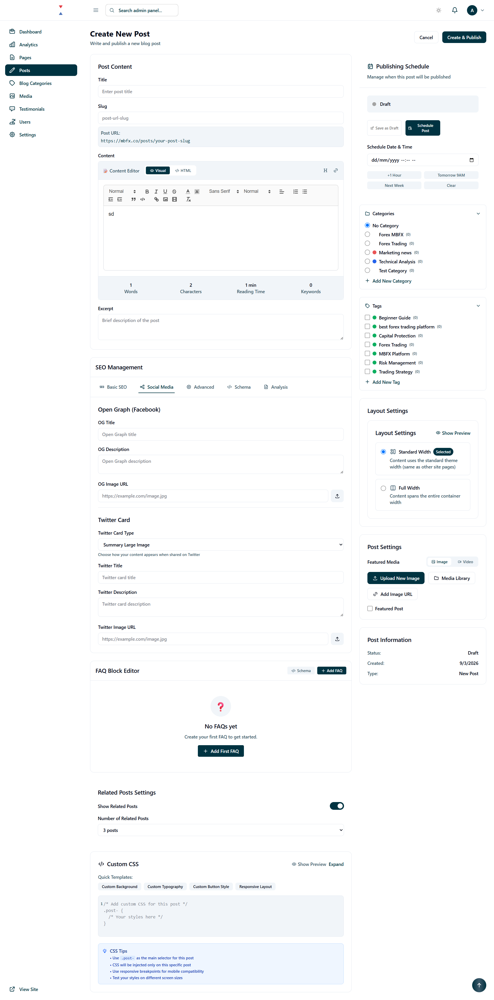
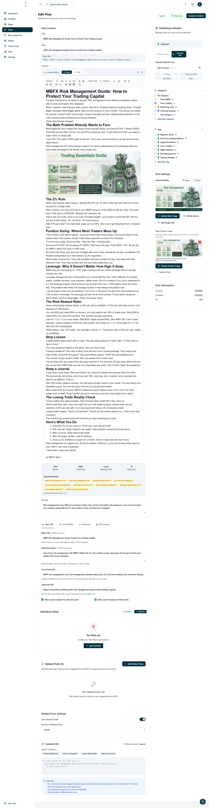
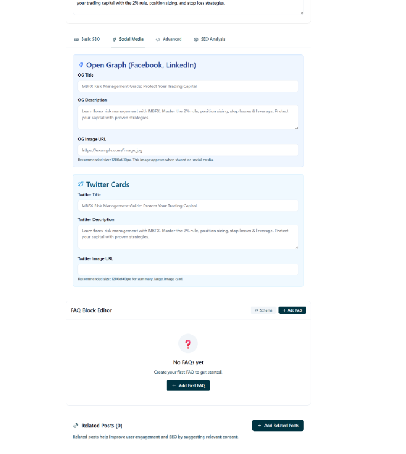
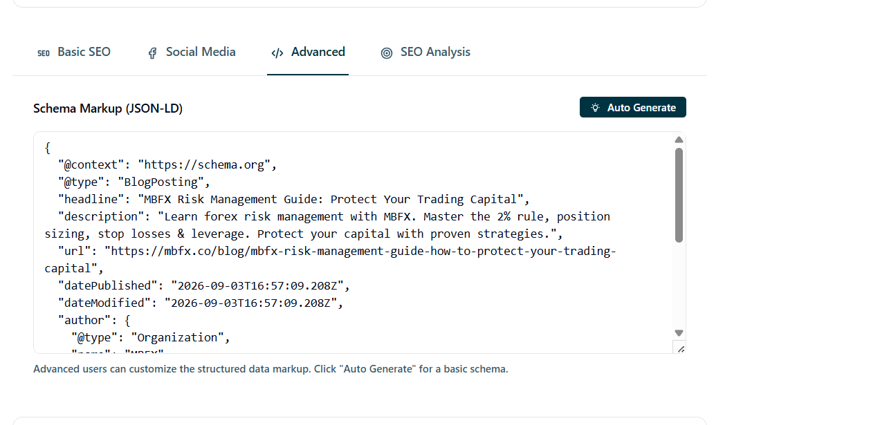
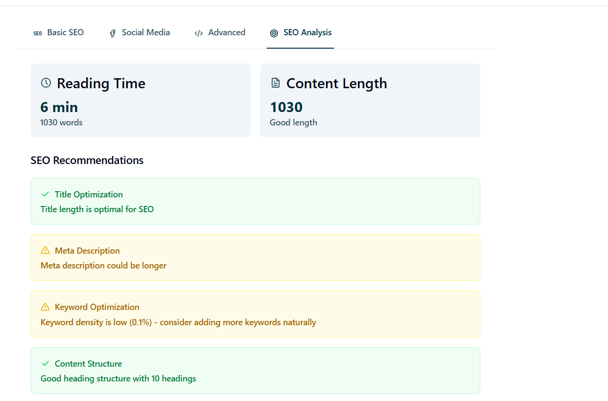

### Simple Development Prompt

> Review the current **News & Analysis → Create/Edit Post** admin page and update it to follow the same UI, layout, spacing, card structure, and presentation flow shown in the reference screenshot.
>
> We are still in the development phase, so you can change, reorganize, add, or remove fields if needed. Do not be limited by the current implementation.
>
> **Keep the same overall flow:**
>
> 1. Post Content
> 2. SEO Management
> 3. FAQ / Structured Content
> 4. Related Posts
> 5. Custom/Advanced Settings
> 6. Right sidebar for publishing, categories, tags, media, and post information
> 7. change the background color of the cards,
>
> **Add/review the missing News & Analysis fields:**
>
> - Content type: News / Analysis / Trade Idea
> - Title
> - Slug with auto-generation and manual editing
> - Short excerpt/summary
> - Main article content using **Tiptap rich text editor**
> - Featured image with image upload/media library
> - Optional video/media
> - Author
> - Source name and source URL
> - Published date
> - Updated date
> - Reading time
> - Categories
> - Tags
> - Related articles/posts
> - Featured post option
> - Post status: Draft / Scheduled / Published / Archived
>
> **For News-specific content**, consider fields such as:
>
> - News source
> - Original article URL
> - Market/asset
> - Region/country
> - Importance/priority
>
> **For Analysis/Trade Ideas**, add appropriate optional fields such as:
>
> - Market/asset
> - Market direction: Bullish / Bearish / Neutral
> - Entry
> - Stop Loss
> - Take Profit
> - Risk/Reward
> - Analysis summary
>
> These should be conditional fields so the form does not become unnecessarily large.
>
> **Publishing section:**
>
> - Save as Draft
> - Publish Now
> - Schedule
> - Date & time picker
> - Timezone
> - Clear schedule
> - Proper status indicator
>
> **SEO section:**
> Keep the tab-based SEO structure shown in the screenshot:
>
> - Basic SEO
> - Social Media
> - Advanced
> - Schema
> - Analysis
>
> Add:
>
> - Meta title
> - Meta description
> - Canonical URL
> - OG title
> - OG description
> - OG image
> - Twitter/X title
> - Twitter/X description
> - Twitter/X image
> - Robots settings
> - Schema/structured-data preview
>
> **Media:**
> Use the existing media upload/library system. Images must be uploaded or selected from the media library, not entered only as URLs.
>
> **UI requirements:**
>
> - Match the reference screenshot's professional admin design.
> - Use the existing project UI components and **shadcn/ui** components.
> - Use reusable form, card, tabs, dropdown, dialog, date-picker, upload, badge, and table components.
> - Keep the two-column layout with the main content area and right sidebar.
> - Make cards, buttons, inputs, tabs, and controls consistent and interactive.
> - Make the page fully responsive.
> - Use proper validation and helpful empty/error states.
> - Keep sections collapsible where appropriate.
> - Avoid unnecessary fields being visible at once.
>
> **Important:**
> First inspect the existing News & Analysis implementation, database/schema, components, and current design before making changes.
>
> Do not blindly copy the screenshot. Use it as the **UI and presentation reference**, while adapting the fields and workflow for our actual News & Analysis requirements.
>
> Since the project is still in development, feel free to refactor or reverse existing implementation where it improves the final flow. Keep the existing architecture and conventions where they are already good.
>
> After implementation, check the complete **Create → Save Draft → Edit → Schedule → Publish → View on public site** flow and fix any related UI or validation issues.
