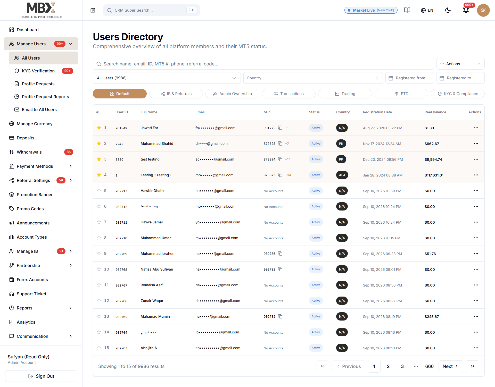

The purpose is the redesign the whole system Ui like below reference..
these are the inspect element styling..
we're using  (https://ui.shadcn.com/) cdn but maintaing the font size,button size,color,spacing,dropdown,datatables,badges,inputs style,filters management & content placemetn style,title heading,sub text size & font used,icons used,radius,menu spacing..
so the purpose is to update the ui completely,by maintaining the consistancy,common styling, & reuse..

These are the inspect styling from the reference site

button styling:

element.style {
}
.transition-colors {
    transition-property: color, background-color, border-color, text-decoration-color, fill, stroke;
    transition-duration: .15s;
    transition-timing-function: cubic-bezier(.4, 0, .2, 1);
}
.ring-offset-background {
    --tw-ring-offset-color: hsl(var(--background));
}
.text-primary-foreground {
    color: hsl(var(--primary-foreground));
}
.font-medium {
    font-weight: 500;
}
.text-sm {
    font-size: .875rem;
    line-height: 1.25rem;
}
.py-2 {
    padding-top: .5rem;
    padding-bottom: .5rem;
}
.px-4 {
    padding-left: 1rem;
    padding-right: 1rem;
}
.bg-primary {
    background-color: hsl(var(--primary));
}
.rounded-md {
    border-radius: calc(var(--radius) - 2px);
}
.whitespace-nowrap {
    white-space: nowrap;
}
.justify-center {
    justify-content: center;
}
.items-center {
    align-items: center;
}
.h-10 {
    height: 2.5rem;
}
.inline-flex {
    display: inline-flex;
}
button, [role=button] {
    cursor: pointer;
}
button, input:where([type=button]), input:where([type=reset]), input:where([type=submit]) {
    -webkit-appearance: button;
    background-color: #0000;
    background-image: none;
}
button, select {
    text-transform: none;
}
button, input, optgroup, select, textarea {
    font-feature-settings: inherit;
    font-variation-settings: inherit;
    font-family: inherit;
    font-size: 100%;
    font-weight: inherit;
    line-height: inherit;
    letter-spacing: inherit;
    color: inherit;
    margin: 0;
    padding: 0;
}
* {
    border-color: hsl(var(--border));
}
*, :before, :after {
    box-sizing: border-box;
    border: 0 solid #e5e7eb;
}
*, :before, :after, ::backdrop {
    --tw-border-spacing-x: 0;
    --tw-border-spacing-y: 0;
    --tw-translate-x: 0;
    --tw-translate-y: 0;
    --tw-rotate: 0;
    --tw-skew-x: 0;
    --tw-skew-y: 0;
    --tw-scale-x: 1;
    --tw-scale-y: 1;
    --tw-pan-x: ;
    --tw-pan-y: ;
    --tw-pinch-zoom: ;
    --tw-scroll-snap-strictness: proximity;
    --tw-gradient-from-position: ;
    --tw-gradient-via-position: ;
    --tw-gradient-to-position: ;
    --tw-ordinal: ;
    --tw-slashed-zero: ;
    --tw-numeric-figure: ;
    --tw-numeric-spacing: ;
    --tw-numeric-fraction: ;
    --tw-ring-inset: ;
    --tw-ring-offset-width: 0px;
    --tw-ring-offset-color: #fff;
    --tw-ring-color: #3b82f680;
    --tw-ring-offset-shadow: 0 0 #0000;
    --tw-ring-shadow: 0 0 #0000;
    --tw-shadow: 0 0 #0000;
    --tw-shadow-colored: 0 0 #0000;
    --tw-blur: ;
    --tw-brightness: ;
    --tw-contrast: ;
    --tw-grayscale: ;
    --tw-hue-rotate: ;
    --tw-invert: ;
    --tw-saturate: ;
    --tw-sepia: ;
    --tw-drop-shadow: ;
    --tw-backdrop-blur: ;
    --tw-backdrop-brightness: ;
    --tw-backdrop-contrast: ;
    --tw-backdrop-grayscale: ;
    --tw-backdrop-hue-rotate: ;
    --tw-backdrop-invert: ;
    --tw-backdrop-opacity: ;
    --tw-backdrop-saturate: ;
    --tw-backdrop-sepia: ;
    --tw-contain-size: ;
    --tw-contain-layout: ;
    --tw-contain-paint: ;
Show all properties (1 more)
}
user agent stylesheet
button {
    appearance: auto;
    font-style: ;
    font-variant-ligatures: ;
    font-variant-caps: ;
    font-variant-numeric: ;
    font-variant-east-asian: ;
    font-variant-alternates: ;
    font-variant-position: ;
    font-variant-emoji: ;
    font-weight: ;
    font-stretch: ;
    font-size: ;
    font-family: ;
    font-optical-sizing: ;
    font-size-adjust: ;
    font-kerning: ;
    font-feature-settings: ;
    font-variation-settings: ;
    font-language-override: ;
    text-rendering: auto;
    color: buttontext;
    letter-spacing: normal;
    word-spacing: normal;
    line-height: normal;
    text-transform: none;
    text-indent: 0px;
    text-shadow: none;
    display: inline-block;
    text-align: center;
    cursor: default;
    box-sizing: border-box;
    background-color: buttonface;
    margin: 0em 0em 0em 0em;
    padding-block: 1px;
    padding-inline: 6px;
    border-width: 2px;
    border-style: outset;
    border-color: buttonborder;
    border-image: none;
}
*, :before, :after, ::backdrop {
    --tw-border-spacing-x: 0;
    --tw-border-spacing-y: 0;
    --tw-translate-x: 0;
    --tw-translate-y: 0;
    --tw-rotate: 0;
    --tw-skew-x: 0;
    --tw-skew-y: 0;
    --tw-scale-x: 1;
    --tw-scale-y: 1;
    --tw-pan-x: ;
    --tw-pan-y: ;
    --tw-pinch-zoom: ;
    --tw-scroll-snap-strictness: proximity;
    --tw-gradient-from-position: ;
    --tw-gradient-via-position: ;
    --tw-gradient-to-position: ;
    --tw-ordinal: ;
    --tw-slashed-zero: ;
    --tw-numeric-figure: ;
    --tw-numeric-spacing: ;
    --tw-numeric-fraction: ;
    --tw-ring-inset: ;
    --tw-ring-offset-width: 0px;
    --tw-ring-offset-color: #fff;
    --tw-ring-color: #3b82f680;
    --tw-ring-offset-shadow: 0 0 #0000;
    --tw-ring-shadow: 0 0 #0000;
    --tw-shadow: 0 0 #0000;
    --tw-shadow-colored: 0 0 #0000;
    --tw-blur: ;
    --tw-brightness: ;
    --tw-contrast: ;
    --tw-grayscale: ;
    --tw-hue-rotate: ;
    --tw-invert: ;
    --tw-saturate: ;
    --tw-sepia: ;
    --tw-drop-shadow: ;
    --tw-backdrop-blur: ;
    --tw-backdrop-brightness: ;
    --tw-backdrop-contrast: ;
    --tw-backdrop-grayscale: ;
    --tw-backdrop-hue-rotate: ;
    --tw-backdrop-invert: ;
    --tw-backdrop-opacity: ;
    --tw-backdrop-saturate: ;
    --tw-backdrop-sepia: ;
    --tw-contain-size: ;
    --tw-contain-layout: ;
    --tw-contain-paint: ;
Show all properties (1 more)
}
*, :before, :after, ::backdrop {
    --tw-border-spacing-x: 0;
    --tw-border-spacing-y: 0;
    --tw-translate-x: 0;
    --tw-translate-y: 0;
    --tw-rotate: 0;
    --tw-skew-x: 0;
    --tw-skew-y: 0;
    --tw-scale-x: 1;
    --tw-scale-y: 1;
    --tw-pan-x: ;
    --tw-pan-y: ;
    --tw-pinch-zoom: ;
    --tw-scroll-snap-strictness: proximity;
    --tw-gradient-from-position: ;
    --tw-gradient-via-position: ;
    --tw-gradient-to-position: ;
    --tw-ordinal: ;
    --tw-slashed-zero: ;
    --tw-numeric-figure: ;
    --tw-numeric-spacing: ;
    --tw-numeric-fraction: ;
    --tw-ring-inset: ;
    --tw-ring-offset-width: 0px;
    --tw-ring-offset-color: #fff;
    --tw-ring-color: #3b82f680;
    --tw-ring-offset-shadow: 0 0 #0000;
    --tw-ring-shadow: 0 0 #0000;
    --tw-shadow: 0 0 #0000;
    --tw-shadow-colored: 0 0 #0000;
    --tw-blur: ;
    --tw-brightness: ;
    --tw-contrast: ;
    --tw-grayscale: ;
    --tw-hue-rotate: ;
    --tw-invert: ;
    --tw-saturate: ;
    --tw-sepia: ;
    --tw-drop-shadow: ;
    --tw-backdrop-blur: ;
    --tw-backdrop-brightness: ;
    --tw-backdrop-contrast: ;
    --tw-backdrop-grayscale: ;
    --tw-backdrop-hue-rotate: ;
    --tw-backdrop-invert: ;
    --tw-backdrop-opacity: ;
    --tw-backdrop-saturate: ;
    --tw-backdrop-sepia: ;
    --tw-contain-size: ;
    --tw-contain-layout: ;
    --tw-contain-paint: ;
Show all properties (1 more)
}
*, :before, :after, ::backdrop {
    --tw-border-spacing-x: 0;
    --tw-border-spacing-y: 0;
    --tw-translate-x: 0;
    --tw-translate-y: 0;
    --tw-rotate: 0;
    --tw-skew-x: 0;
    --tw-skew-y: 0;
    --tw-scale-x: 1;
    --tw-scale-y: 1;
    --tw-pan-x: ;
    --tw-pan-y: ;
    --tw-pinch-zoom: ;
    --tw-scroll-snap-strictness: proximity;
    --tw-gradient-from-position: ;
    --tw-gradient-via-position: ;
    --tw-gradient-to-position: ;
    --tw-ordinal: ;
    --tw-slashed-zero: ;
    --tw-numeric-figure: ;
    --tw-numeric-spacing: ;
    --tw-numeric-fraction: ;
    --tw-ring-inset: ;
    --tw-ring-offset-width: 0px;
    --tw-ring-offset-color: #fff;
    --tw-ring-color: #3b82f680;
    --tw-ring-offset-shadow: 0 0 #0000;
    --tw-ring-shadow: 0 0 #0000;
    --tw-shadow: 0 0 #0000;
    --tw-shadow-colored: 0 0 #0000;
    --tw-blur: ;
    --tw-brightness: ;
    --tw-contrast: ;
    --tw-grayscale: ;
    --tw-hue-rotate: ;
    --tw-invert: ;
    --tw-saturate: ;
    --tw-sepia: ;
    --tw-drop-shadow: ;
    --tw-backdrop-blur: ;
    --tw-backdrop-brightness: ;
    --tw-backdrop-contrast: ;
    --tw-backdrop-grayscale: ;
    --tw-backdrop-hue-rotate: ;
    --tw-backdrop-invert: ;
    --tw-backdrop-opacity: ;
    --tw-backdrop-saturate: ;
    --tw-backdrop-sepia: ;
    --tw-contain-size: ;
    --tw-contain-layout: ;
    --tw-contain-paint: ;
Show all properties (1 more)
}
*, :before, :after, ::backdrop {
    --tw-border-spacing-x: 0;
    --tw-border-spacing-y: 0;
    --tw-translate-x: 0;
    --tw-translate-y: 0;
    --tw-rotate: 0;
    --tw-skew-x: 0;
    --tw-skew-y: 0;
    --tw-scale-x: 1;
    --tw-scale-y: 1;
    --tw-pan-x: ;
    --tw-pan-y: ;
    --tw-pinch-zoom: ;
    --tw-scroll-snap-strictness: proximity;
    --tw-gradient-from-position: ;
    --tw-gradient-via-position: ;
    --tw-gradient-to-position: ;
    --tw-ordinal: ;
    --tw-slashed-zero: ;
    --tw-numeric-figure: ;
    --tw-numeric-spacing: ;
    --tw-numeric-fraction: ;
    --tw-ring-inset: ;
    --tw-ring-offset-width: 0px;
    --tw-ring-offset-color: #fff;
    --tw-ring-color: #3b82f680;
    --tw-ring-offset-shadow: 0 0 #0000;
    --tw-ring-shadow: 0 0 #0000;
    --tw-shadow: 0 0 #0000;
    --tw-shadow-colored: 0 0 #0000;
    --tw-blur: ;
    --tw-brightness: ;
    --tw-contrast: ;
    --tw-grayscale: ;
    --tw-hue-rotate: ;
    --tw-invert: ;
    --tw-saturate: ;
    --tw-sepia: ;
    --tw-drop-shadow: ;
    --tw-backdrop-blur: ;
    --tw-backdrop-brightness: ;
    --tw-backdrop-contrast: ;
    --tw-backdrop-grayscale: ;
    --tw-backdrop-hue-rotate: ;
    --tw-backdrop-invert: ;
    --tw-backdrop-opacity: ;
    --tw-backdrop-saturate: ;
    --tw-backdrop-sepia: ;
    --tw-contain-size: ;
    --tw-contain-layout: ;
    --tw-contain-paint: ;
Show all properties (1 more)
}
*, :before, :after, ::backdrop {
    --tw-border-spacing-x: 0;
    --tw-border-spacing-y: 0;
    --tw-translate-x: 0;
    --tw-translate-y: 0;
    --tw-rotate: 0;
    --tw-skew-x: 0;
    --tw-skew-y: 0;
    --tw-scale-x: 1;
    --tw-scale-y: 1;
    --tw-pan-x: ;
    --tw-pan-y: ;
    --tw-pinch-zoom: ;
    --tw-scroll-snap-strictness: proximity;
    --tw-gradient-from-position: ;
    --tw-gradient-via-position: ;
    --tw-gradient-to-position: ;
    --tw-ordinal: ;
    --tw-slashed-zero: ;
    --tw-numeric-figure: ;
    --tw-numeric-spacing: ;
    --tw-numeric-fraction: ;
    --tw-ring-inset: ;
    --tw-ring-offset-width: 0px;
    --tw-ring-offset-color: #fff;
    --tw-ring-color: #3b82f680;
    --tw-ring-offset-shadow: 0 0 #0000;
    --tw-ring-shadow: 0 0 #0000;
    --tw-shadow: 0 0 #0000;
    --tw-shadow-colored: 0 0 #0000;
    --tw-blur: ;
    --tw-brightness: ;
    --tw-contrast: ;
    --tw-grayscale: ;
    --tw-hue-rotate: ;
    --tw-invert: ;
    --tw-saturate: ;
    --tw-sepia: ;
    --tw-drop-shadow: ;
    --tw-backdrop-blur: ;
    --tw-backdrop-brightness: ;
    --tw-backdrop-contrast: ;
    --tw-backdrop-grayscale: ;
    --tw-backdrop-hue-rotate: ;
    --tw-backdrop-invert: ;
    --tw-backdrop-opacity: ;
    --tw-backdrop-saturate: ;
    --tw-backdrop-sepia: ;
    --tw-contain-size: ;
    --tw-contain-layout: ;
    --tw-contain-paint: ;
Show all properties (1 more)
}
*, :before, :after, ::backdrop {
    --tw-border-spacing-x: 0;
    --tw-border-spacing-y: 0;
    --tw-translate-x: 0;
    --tw-translate-y: 0;
    --tw-rotate: 0;
    --tw-skew-x: 0;
    --tw-skew-y: 0;
    --tw-scale-x: 1;
    --tw-scale-y: 1;
    --tw-pan-x: ;
    --tw-pan-y: ;
    --tw-pinch-zoom: ;
    --tw-scroll-snap-strictness: proximity;
    --tw-gradient-from-position: ;
    --tw-gradient-via-position: ;
    --tw-gradient-to-position: ;
    --tw-ordinal: ;
    --tw-slashed-zero: ;
    --tw-numeric-figure: ;
    --tw-numeric-spacing: ;
    --tw-numeric-fraction: ;
    --tw-ring-inset: ;
    --tw-ring-offset-width: 0px;
    --tw-ring-offset-color: #fff;
    --tw-ring-color: #3b82f680;
    --tw-ring-offset-shadow: 0 0 #0000;
    --tw-ring-shadow: 0 0 #0000;
    --tw-shadow: 0 0 #0000;
    --tw-shadow-colored: 0 0 #0000;
    --tw-blur: ;
    --tw-brightness: ;
    --tw-contrast: ;
    --tw-grayscale: ;
    --tw-hue-rotate: ;
    --tw-invert: ;
    --tw-saturate: ;
    --tw-sepia: ;
    --tw-drop-shadow: ;
    --tw-backdrop-blur: ;
    --tw-backdrop-brightness: ;
    --tw-backdrop-contrast: ;
    --tw-backdrop-grayscale: ;
    --tw-backdrop-hue-rotate: ;
    --tw-backdrop-invert: ;
    --tw-backdrop-opacity: ;
    --tw-backdrop-saturate: ;
    --tw-backdrop-sepia: ;
    --tw-contain-size: ;
    --tw-contain-layout: ;
    --tw-contain-paint: ;
Show all properties (1 more)
}
.inter_e8e1cfa7-module__5U1njG__className {
    font-family: Inter, Inter Fallback;
    font-style: normal;
}
body {
    background-color: hsl(var(--background));
    color: hsl(var(--foreground));
    width: 100%;
    max-width: 100%;
    transition: background-color .3s, color .3s;
}
body {
    line-height: inherit;
    margin: 0;
}
*, :before, :after, ::backdrop {
    --tw-border-spacing-x: 0;
    --tw-border-spacing-y: 0;
    --tw-translate-x: 0;
    --tw-translate-y: 0;
    --tw-rotate: 0;
    --tw-skew-x: 0;
    --tw-skew-y: 0;
    --tw-scale-x: 1;
    --tw-scale-y: 1;
    --tw-pan-x: ;
    --tw-pan-y: ;
    --tw-pinch-zoom: ;
    --tw-scroll-snap-strictness: proximity;
    --tw-gradient-from-position: ;
    --tw-gradient-via-position: ;
    --tw-gradient-to-position: ;
    --tw-ordinal: ;
    --tw-slashed-zero: ;
    --tw-numeric-figure: ;
    --tw-numeric-spacing: ;
    --tw-numeric-fraction: ;
    --tw-ring-inset: ;
    --tw-ring-offset-width: 0px;
    --tw-ring-offset-color: #fff;
    --tw-ring-color: #3b82f680;
    --tw-ring-offset-shadow: 0 0 #0000;
    --tw-ring-shadow: 0 0 #0000;
    --tw-shadow: 0 0 #0000;
    --tw-shadow-colored: 0 0 #0000;
    --tw-blur: ;
    --tw-brightness: ;
    --tw-contrast: ;
    --tw-grayscale: ;
    --tw-hue-rotate: ;
    --tw-invert: ;
    --tw-saturate: ;
    --tw-sepia: ;
    --tw-drop-shadow: ;
    --tw-backdrop-blur: ;
    --tw-backdrop-brightness: ;
    --tw-backdrop-contrast: ;
    --tw-backdrop-grayscale: ;
    --tw-backdrop-hue-rotate: ;
    --tw-backdrop-invert: ;
    --tw-backdrop-opacity: ;
    --tw-backdrop-saturate: ;
    --tw-backdrop-sepia: ;
    --tw-contain-size: ;
    --tw-contain-layout: ;
    --tw-contain-paint: ;
Show all properties (1 more)
}
style attribute {
    color-scheme: light;
    --primary: 29 46% 56%;
    --primary-foreground: 210 40% 98%;
    --secondary: 60 1% 16%;
    --secondary-foreground: 210 40% 98%;
    --success: 213 75% 54%;
    --success-foreground: 210 40% 98%;
    --destructive: 2 75% 55%;
    --destructive-foreground: 210 40% 98%;
    --warning: 37 100% 53%;
    --warning-foreground: 210 40% 98%;
    --info: 210 100% 26%;
    --info-foreground: 210 40% 98%;
    --accent: 35 22% 89%;
    --accent-foreground: 222.2 84% 4.9%;
    --ring: 29 46% 56%;
    --sidebar-primary: 29 46% 56%;
    --sidebar-primary-foreground: 210 40% 98%;
}
:root {
    --success: 142 76% 36%;
    --success-foreground: 355 7% 97%;
    --warning: 38 92% 50%;
    --warning-foreground: 48 96% 89%;
    --info: 199 89% 48%;
    --info-foreground: 210 20% 98%;
}
:root {
    --background: 0 0% 100%;
    --foreground: 222.2 84% 4.9%;
    --card: 0 0% 100%;
    --card-foreground: 222.2 84% 4.9%;
    --popover: 0 0% 100%;
    --popover-foreground: 222.2 84% 4.9%;
    --primary: 221.2 83.2% 53.3%;
    --primary-foreground: 210 40% 98%;
    --secondary: 210 40% 96%;
    --secondary-foreground: 222.2 84% 4.9%;
    --muted: 210 40% 96%;
    --muted-foreground: 215.4 16.3% 46.9%;
    --accent: 210 40% 96%;
    --accent-foreground: 222.2 84% 4.9%;
    --destructive: 0 84.2% 60.2%;
    --destructive-foreground: 210 40% 98%;
    --border: 214.3 31.8% 91.4%;
    --input: 214.3 31.8% 91.4%;
    --ring: 221.2 83.2% 53.3%;
    --radius: .5rem;
    --chart-1: 12 76% 61%;
    --chart-2: 173 58% 39%;
    --chart-3: 197 37% 24%;
    --chart-4: 43 74% 66%;
    --chart-5: 27 87% 67%;
}
html {
    -moz-text-size-adjust: 100%;
    text-size-adjust: 100%;
    width: 100%;
    max-width: 100%;
    transition: background-color .3s;
}
html, :host {
    -webkit-text-size-adjust: 100%;
    tab-size: 4;
    font-feature-settings: normal;
    font-variation-settings: normal;
    -webkit-tap-highlight-color: transparent;
    font-family: ui-sans-serif, system-ui, sans-serif, Apple Color Emoji, Segoe UI Emoji, Segoe UI Symbol, Noto Color Emoji;
    line-height: 1.5;
}
<style>
:where(html[dir="ltr"]), :where([data-sonner-toaster][dir="ltr"]) {
    --toast-icon-margin-start: -3px;
    --toast-icon-margin-end: 4px;
    --toast-svg-margin-start: -1px;
    --toast-svg-margin-end: 0px;
    --toast-button-margin-start: auto;
    --toast-button-margin-end: 0;
    --toast-close-button-start: 0;
    --toast-close-button-end: unset;
    --toast-close-button-transform: translate(-35%, -35%);
}
*, :before, :after, ::backdrop {
    --tw-border-spacing-x: 0;
    --tw-border-spacing-y: 0;
    --tw-translate-x: 0;
    --tw-translate-y: 0;
    --tw-rotate: 0;
    --tw-skew-x: 0;
    --tw-skew-y: 0;
    --tw-scale-x: 1;
    --tw-scale-y: 1;
    --tw-pan-x: ;
    --tw-pan-y: ;
    --tw-pinch-zoom: ;
    --tw-scroll-snap-strictness: proximity;
    --tw-gradient-from-position: ;
    --tw-gradient-via-position: ;
    --tw-gradient-to-position: ;
    --tw-ordinal: ;
    --tw-slashed-zero: ;
    --tw-numeric-figure: ;
    --tw-numeric-spacing: ;
    --tw-numeric-fraction: ;
    --tw-ring-inset: ;
    --tw-ring-offset-width: 0px;
    --tw-ring-offset-color: #fff;
    --tw-ring-color: #3b82f680;
    --tw-ring-offset-shadow: 0 0 #0000;
    --tw-ring-shadow: 0 0 #0000;
    --tw-shadow: 0 0 #0000;
    --tw-shadow-colored: 0 0 #0000;
    --tw-blur: ;
    --tw-brightness: ;
    --tw-contrast: ;
    --tw-grayscale: ;
    --tw-hue-rotate: ;
    --tw-invert: ;
    --tw-saturate: ;
    --tw-sepia: ;
    --tw-drop-shadow: ;
    --tw-backdrop-blur: ;
    --tw-backdrop-brightness: ;
    --tw-backdrop-contrast: ;
    --tw-backdrop-grayscale: ;
    --tw-backdrop-hue-rotate: ;
    --tw-backdrop-invert: ;
    --tw-backdrop-opacity: ;
    --tw-backdrop-saturate: ;
    --tw-backdrop-sepia: ;
    --tw-contain-size: ;
    --tw-contain-layout: ;
    --tw-contain-paint: ;
Show all properties (1 more)
}
:before, :after {
    --tw-content: "";
}
*, :before, :after {
    box-sizing: border-box;
    border: 0 solid #e5e7eb;
}
*, :before, :after, ::backdrop {
    --tw-border-spacing-x: 0;
    --tw-border-spacing-y: 0;
    --tw-translate-x: 0;
    --tw-translate-y: 0;
    --tw-rotate: 0;
    --tw-skew-x: 0;
    --tw-skew-y: 0;
    --tw-scale-x: 1;
    --tw-scale-y: 1;
    --tw-pan-x: ;
    --tw-pan-y: ;
    --tw-pinch-zoom: ;
    --tw-scroll-snap-strictness: proximity;
    --tw-gradient-from-position: ;
    --tw-gradient-via-position: ;
    --tw-gradient-to-position: ;
    --tw-ordinal: ;
    --tw-slashed-zero: ;
    --tw-numeric-figure: ;
    --tw-numeric-spacing: ;
    --tw-numeric-fraction: ;
    --tw-ring-inset: ;
    --tw-ring-offset-width: 0px;
    --tw-ring-offset-color: #fff;
    --tw-ring-color: #3b82f680;
    --tw-ring-offset-shadow: 0 0 #0000;
    --tw-ring-shadow: 0 0 #0000;
    --tw-shadow: 0 0 #0000;
    --tw-shadow-colored: 0 0 #0000;
    --tw-blur: ;
    --tw-brightness: ;
    --tw-contrast: ;
    --tw-grayscale: ;
    --tw-hue-rotate: ;
    --tw-invert: ;
    --tw-saturate: ;
    --tw-sepia: ;
    --tw-drop-shadow: ;
    --tw-backdrop-blur: ;
    --tw-backdrop-brightness: ;
    --tw-backdrop-contrast: ;
    --tw-backdrop-grayscale: ;
    --tw-backdrop-hue-rotate: ;
    --tw-backdrop-invert: ;
    --tw-backdrop-opacity: ;
    --tw-backdrop-saturate: ;
    --tw-backdrop-sepia: ;
    --tw-contain-size: ;
    --tw-contain-layout: ;
    --tw-contain-paint: ;
Show all properties (1 more)
}
:before, :after {
    --tw-content: "";
}
*, :before, :after {
    box-sizing: border-box;
    border: 0 solid #e5e7eb;
}
*, :before, :after, ::backdrop {
    --tw-border-spacing-x: 0;
    --tw-border-spacing-y: 0;
    --tw-translate-x: 0;
    --tw-translate-y: 0;
    --tw-rotate: 0;
    --tw-skew-x: 0;
    --tw-skew-y: 0;
    --tw-scale-x: 1;
    --tw-scale-y: 1;
    --tw-pan-x: ;
    --tw-pan-y: ;
    --tw-pinch-zoom: ;
    --tw-scroll-snap-strictness: proximity;
    --tw-gradient-from-position: ;
    --tw-gradient-via-position: ;
    --tw-gradient-to-position: ;
    --tw-ordinal: ;
    --tw-slashed-zero: ;
    --tw-numeric-figure: ;
    --tw-numeric-spacing: ;
    --tw-numeric-fraction: ;
    --tw-ring-inset: ;
    --tw-ring-offset-width: 0px;
    --tw-ring-offset-color: #fff;
    --tw-ring-color: #3b82f680;
    --tw-ring-offset-shadow: 0 0 #0000;
    --tw-ring-shadow: 0 0 #0000;
    --tw-shadow: 0 0 #0000;
    --tw-shadow-colored: 0 0 #0000;
    --tw-blur: ;
    --tw-brightness: ;
    --tw-contrast: ;
    --tw-grayscale: ;
    --tw-hue-rotate: ;
    --tw-invert: ;
    --tw-saturate: ;
    --tw-sepia: ;
    --tw-drop-shadow: ;
    --tw-backdrop-blur: ;
    --tw-backdrop-brightness: ;
    --tw-backdrop-contrast: ;
    --tw-backdrop-grayscale: ;
    --tw-backdrop-hue-rotate: ;
    --tw-backdrop-invert: ;
    --tw-backdrop-opacity: ;
    --tw-backdrop-saturate: ;
    --tw-backdrop-sepia: ;
    --tw-contain-size: ;
    --tw-contain-layout: ;
    --tw-contain-paint: ;
Show all properties (1 more)
}
*, :before, :after, ::backdrop {
    --tw-border-spacing-x: 0;
    --tw-border-spacing-y: 0;
    --tw-translate-x: 0;
    --tw-translate-y: 0;
    --tw-rotate: 0;
    --tw-skew-x: 0;
    --tw-skew-y: 0;
    --tw-scale-x: 1;
    --tw-scale-y: 1;
    --tw-pan-x: ;
    --tw-pan-y: ;
    --tw-pinch-zoom: ;
    --tw-scroll-snap-strictness: proximity;
    --tw-gradient-from-position: ;
    --tw-gradient-via-position: ;
    --tw-gradient-to-position: ;
    --tw-ordinal: ;
    --tw-slashed-zero: ;
    --tw-numeric-figure: ;
    --tw-numeric-spacing: ;
    --tw-numeric-fraction: ;
    --tw-ring-inset: ;
    --tw-ring-offset-width: 0px;
    --tw-ring-offset-color: #fff;
    --tw-ring-color: #3b82f680;
    --tw-ring-offset-shadow: 0 0 #0000;
    --tw-ring-shadow: 0 0 #0000;
    --tw-shadow: 0 0 #0000;
    --tw-shadow-colored: 0 0 #0000;
    --tw-blur: ;
    --tw-brightness: ;
    --tw-contrast: ;
    --tw-grayscale: ;
    --tw-hue-rotate: ;
    --tw-invert: ;
    --tw-saturate: ;
    --tw-sepia: ;
    --tw-drop-shadow: ;
    --tw-backdrop-blur: ;
    --tw-backdrop-brightness: ;
    --tw-backdrop-contrast: ;
    --tw-backdrop-grayscale: ;
    --tw-backdrop-hue-rotate: ;
    --tw-backdrop-invert: ;
    --tw-backdrop-opacity: ;
    --tw-backdrop-saturate: ;
    --tw-backdrop-sepia: ;
    --tw-contain-size: ;
    --tw-contain-layout: ;
    --tw-contain-paint: ;
Show all properties (1 more)
}
::-webkit-scrollbar {
    width: 8px;
    height: 8px;
}
::-webkit-scrollbar-thumb {
    background-color: hsl(var(--muted-foreground) / .3);
    border-radius: 9999px;
}
::-webkit-scrollbar-track {
    background-color: hsl(var(--muted) / .3);
}
<style>
@font-face {
    font-family: Inter;
    font-style: normal;
    font-weight: 100 900;
    font-display: swap;
    src: url(../media/2c55a0e60120577a-s.0bjc5tiuqdqro.woff2) format("woff2");
    unicode-range: U +460 -52F, U +1C80 -1C8A, U +20B4, U +2DE0 -2DFF, U + A640-A69F, U + FE2E-FE2F;
}
the above the is tyle of buttons used in admin side..
---------

this should be settings or conetent displa of the page

------------------

<h1 class="text-3xl font-bold tracking-tight">Users Directory</h1>
border-bottom-colorrgb(226, 232, 240)
border-bottom-stylesolid
border-bottom-width0px
border-image-outset0
border-image-repeatstretch
border-image-slice100%
border-image-sourcenone
border-image-width1
border-left-colorrgb(226, 232, 240)
border-left-stylesolid
border-left-width0px
border-right-colorrgb(226, 232, 240)
border-right-stylesolid
border-right-width0px
border-top-colorrgb(226, 232, 240)
border-top-stylesolid
border-top-width0px
box-sizingborder-box
colorrgb(2, 8, 23)
color-schemelight
displayblock
font-familyInter, "Inter Fallback"
font-feature-settingsnormal
font-size30px
font-stylenormal
font-variation-settingsnormal
font-weight700
height36px
letter-spacing-0.75px
line-height36px
margin-block-end0px
margin-block-start0px
margin-bottom0px
margin-inline-end0px
margin-inline-start0px
margin-left0px
margin-right0px
margin-top0px
tab-size4
text-size-adjust100%
unicode-bidiisolate
width368px
-webkit-tap-highlight-colorrgba(0, 0, 0, 0)
endered Fonts
Family name: Inter
PostScript name: Inter-Bold
Font origin: Network resource(15 glyphs)

------------

Comprehensive overview of all platform members and their MT5 status.

border-bottom-colorrgb(226, 232, 240)
border-bottom-stylesolid
border-bottom-width0px
border-image-outset0
border-image-repeatstretch
border-image-slice100%
border-image-sourcenone
border-image-width1
border-left-colorrgb(226, 232, 240)
border-left-stylesolid
border-left-width0px
border-right-colorrgb(226, 232, 240)
border-right-stylesolid
border-right-width0px
border-top-colorrgb(226, 232, 240)
border-top-stylesolid
border-top-width0px
box-sizingborder-box
colorrgb(100, 116, 139)
color-schemelight
displayblock
font-familyInter, "Inter Fallback"
font-feature-settingsnormal
font-stylenormal
font-variation-settingsnormal
height48px
line-height24px
margin-block-end0px
margin-block-start0px
margin-bottom0px
margin-inline-end0px
margin-inline-start0px
margin-left0px
margin-right0px
margin-top0px
tab-size4
text-size-adjust100%
unicode-bidiisolate
width368px
-webkit-tap-highlight-colorrgba(0, 0, 0, 0)

Rendered Fonts
Family name: Inter
PostScript name: Inter
Font origin: Network resource(67 glyphs)

----------------

<svg xmlns="http://www.w3.org/2000/svg" width="24" height="24" viewBox="0 0 24 24" fill="none" stroke="currentColor" stroke-width="2" stroke-linecap="round" stroke-linejoin="round" class="lucide lucide-search absolute left-2 top-1/2 -translate-y-1/2 h-3.5 w-3.5 text-muted-foreground"><circle cx="11" cy="11" r="8"></circle><path d="m21 21-4.3-4.3"></path></svg><input class="flex w-full rounded-md border border-input bg-background px-3 py-2 md:text-sm ring-offset-background file:border-0 file:bg-transparent file:text-sm file:font-medium placeholder:text-muted-foreground focus-visible:outline-none focus-visible:ring-2 focus-visible:ring-ring focus-visible:ring-offset-2 disabled:cursor-not-allowed disabled:opacity-50 pl-7 h-8 text-xs" placeholder="Search name / display / description / group…" value="">
<button type="button" role="combobox" aria-controls="radix-_r_i_" aria-expanded="false" aria-autocomplete="none" dir="ltr" data-state="closed" class="flex items-center justify-between rounded-md border border-input bg-background px-3 py-2 ring-offset-background placeholder:text-muted-foreground focus:outline-none focus:ring-2 focus:ring-ring focus:ring-offset-2 disabled:cursor-not-allowed disabled:opacity-50 [&amp;&gt;span]:line-clamp-1 [&amp;&gt;span]:truncate [&amp;&gt;span]:min-w-0 min-w-0 w-[110px] h-8 text-xs">All status<svg xmlns="http://www.w3.org/2000/svg" width="24" height="24" viewBox="0 0 24 24" fill="none" stroke="currentColor" stroke-width="2" stroke-linecap="round" stroke-linejoin="round" class="lucide lucide-chevron-down h-4 w-4 shrink-0 opacity-50" aria-hidden="true"><path d="m6 9 6 6 6-6"></path></svg></button><button type="button" role="combobox" aria-controls="radix-_r_j_" aria-expanded="false" aria-autocomplete="none" dir="ltr" data-state="closed" class="flex items-center justify-between rounded-md border border-input bg-background px-3 py-2 ring-offset-background placeholder:text-muted-foreground focus:outline-none focus:ring-2 focus:ring-ring focus:ring-offset-2 disabled:cursor-not-allowed disabled:opacity-50 [&amp;&gt;span]:line-clamp-1 [&amp;&gt;span]:truncate [&amp;&gt;span]:min-w-0 min-w-0 w-[120px] h-8 text-xs">All types<svg xmlns="http://www.w3.org/2000/svg" width="24" height="24" viewBox="0 0 24 24" fill="none" stroke="currentColor" stroke-width="2" stroke-linecap="round" stroke-linejoin="round" class="lucide lucide-chevron-down h-4 w-4 shrink-0 opacity-50" aria-hidden="true"><path d="m6 9 6 6 6-6"></path></svg></button>

<table class="w-full caption-bottom text-xs"><thead class="[&amp;_tr]:border-b"><tr class="border-b transition-colors hover:bg-muted/50 data-[state=selected]:bg-muted bg-muted/50"><th class="h-12 text-left align-middle text-muted-foreground [&amp;:has([role=checkbox])]:pr-0 px-2 w-20 font-semibold">Priority</th><th class="h-12 text-left align-middle text-muted-foreground [&amp;:has([role=checkbox])]:pr-0 px-2 font-semibold">Name</th><th class="h-12 text-left align-middle text-muted-foreground [&amp;:has([role=checkbox])]:pr-0 px-2 w-24 font-semibold">Min Deposit</th><th class="h-12 text-left align-middle text-muted-foreground [&amp;:has([role=checkbox])]:pr-0 px-2 w-20 font-semibold">Max Lev</th><th class="h-12 text-left align-middle text-muted-foreground [&amp;:has([role=checkbox])]:pr-0 px-2 w-16 font-semibold">Spread</th><th class="h-12 text-left align-middle text-muted-foreground [&amp;:has([role=checkbox])]:pr-0 px-2 font-semibold">MT5 Group</th><th class="h-12 align-middle text-muted-foreground [&amp;:has([role=checkbox])]:pr-0 px-2 w-20 text-center font-semibold">Status</th><th class="h-12 text-left align-middle font-medium text-muted-foreground [&amp;:has([role=checkbox])]:pr-0 px-2 w-10"></th></tr></thead><tbody class="[&amp;_tr:last-child]:border-0"><tr class="border-b transition-colors data-[state=selected]:bg-muted h-9 hover:bg-muted/30"><td class="p-4 align-middle [&amp;:has([role=checkbox])]:pr-0 px-2 py-1">
0
<button class="inline-flex items-center justify-center whitespace-nowrap text-sm font-medium ring-offset-background transition-colors focus-visible:outline-none focus-visible:ring-2 focus-visible:ring-ring focus-visible:ring-offset-2 disabled:pointer-events-none disabled:opacity-50 hover:bg-accent hover:text-accent-foreground rounded-md h-3.5 w-3.5 p-0" disabled=""><svg xmlns="http://www.w3.org/2000/svg" width="24" height="24" viewBox="0 0 24 24" fill="none" stroke="currentColor" stroke-width="2" stroke-linecap="round" stroke-linejoin="round" class="lucide lucide-chevron-up h-2.5 w-2.5"><path d="m18 15-6-6-6 6"></path></svg></button><button class="inline-flex items-center justify-center whitespace-nowrap text-sm font-medium ring-offset-background transition-colors focus-visible:outline-none focus-visible:ring-2 focus-visible:ring-ring focus-visible:ring-offset-2 disabled:pointer-events-none disabled:opacity-50 hover:bg-accent hover:text-accent-foreground rounded-md h-3.5 w-3.5 p-0"><svg xmlns="http://www.w3.org/2000/svg" width="24" height="24" viewBox="0 0 24 24" fill="none" stroke="currentColor" stroke-width="2" stroke-linecap="round" stroke-linejoin="round" class="lucide lucide-chevron-down h-2.5 w-2.5"><path d="m6 9 6 6 6-6"></path></svg></button>

</td><td class="p-4 align-middle [&amp;:has([role=checkbox])]:pr-0 px-2 py-1">
Bonus

Get 50% Marginal Bonus upto $5000
</td><td class="p-4 align-middle [&amp;:has([role=checkbox])]:pr-0 px-2 py-1 tabular-nums">$100.00</td><td class="p-4 align-middle [&amp;:has([role=checkbox])]:pr-0 px-2 py-1">1:1000</td><td class="p-4 align-middle [&amp;:has([role=checkbox])]:pr-0 px-2 py-1">0.1p</td><td class="p-4 align-middle [&amp;:has([role=checkbox])]:pr-0 px-2 py-1"><code class="text-[10px] text-muted-foreground truncate block max-w-[200px]" title="real\MBFX\B\Sw\Bonus\USD">real\MBFX\B\Sw\Bonus\USD</code></td><td class="p-4 align-middle [&amp;:has([role=checkbox])]:pr-0 px-2 py-1 text-center">
Inactive
</td><td class="p-4 align-middle [&amp;:has([role=checkbox])]:pr-0 px-1 py-1"><button class="inline-flex items-center justify-center whitespace-nowrap rounded-md text-sm font-medium ring-offset-background transition-colors focus-visible:outline-none focus-visible:ring-2 focus-visible:ring-ring focus-visible:ring-offset-2 disabled:pointer-events-none disabled:opacity-50 hover:bg-accent hover:text-accent-foreground h-6 w-6" type="button" id="radix-_r_k_" aria-haspopup="menu" aria-expanded="false" data-state="closed"><svg xmlns="http://www.w3.org/2000/svg" width="24" height="24" viewBox="0 0 24 24" fill="none" stroke="currentColor" stroke-width="2" stroke-linecap="round" stroke-linejoin="round" class="lucide lucide-more-horizontal h-3.5 w-3.5"><circle cx="12" cy="12" r="1"></circle><circle cx="19" cy="12" r="1"></circle><circle cx="5" cy="12" r="1"></circle></svg></button></td></tr><tr class="border-b transition-colors data-[state=selected]:bg-muted h-9 hover:bg-muted/30"><td class="p-4 align-middle [&amp;:has([role=checkbox])]:pr-0 px-2 py-1">
1
<button class="inline-flex items-center justify-center whitespace-nowrap text-sm font-medium ring-offset-background transition-colors focus-visible:outline-none focus-visible:ring-2 focus-visible:ring-ring focus-visible:ring-offset-2 disabled:pointer-events-none disabled:opacity-50 hover:bg-accent hover:text-accent-foreground rounded-md h-3.5 w-3.5 p-0"><svg xmlns="http://www.w3.org/2000/svg" width="24" height="24" viewBox="0 0 24 24" fill="none" stroke="currentColor" stroke-width="2" stroke-linecap="round" stroke-linejoin="round" class="lucide lucide-chevron-up h-2.5 w-2.5"><path d="m18 15-6-6-6 6"></path></svg></button><button class="inline-flex items-center justify-center whitespace-nowrap text-sm font-medium ring-offset-background transition-colors focus-visible:outline-none focus-visible:ring-2 focus-visible:ring-ring focus-visible:ring-offset-2 disabled:pointer-events-none disabled:opacity-50 hover:bg-accent hover:text-accent-foreground rounded-md h-3.5 w-3.5 p-0"><svg xmlns="http://www.w3.org/2000/svg" width="24" height="24" viewBox="0 0 24 24" fill="none" stroke="currentColor" stroke-width="2" stroke-linecap="round" stroke-linejoin="round" class="lucide lucide-chevron-down h-2.5 w-2.5"><path d="m6 9 6 6 6-6"></path></svg></button>

</td><td class="p-4 align-middle [&amp;:has([role=checkbox])]:pr-0 px-2 py-1">
STP

Perfect for everyday trading with competitive spreads and commission-free execution.
</td><td class="p-4 align-middle [&amp;:has([role=checkbox])]:pr-0 px-2 py-1 tabular-nums">$20.00</td><td class="p-4 align-middle [&amp;:has([role=checkbox])]:pr-0 px-2 py-1">1:1000</td><td class="p-4 align-middle [&amp;:has([role=checkbox])]:pr-0 px-2 py-1">1p</td><td class="p-4 align-middle [&amp;:has([role=checkbox])]:pr-0 px-2 py-1"><code class="text-[10px] text-muted-foreground truncate block max-w-[200px]" title="real\MBFX\B\Sw\Prm\USD">real\MBFX\B\Sw\Prm\USD</code></td><td class="p-4 align-middle [&amp;:has([role=checkbox])]:pr-0 px-2 py-1 text-center">
Active
</td><td class="p-4 align-middle [&amp;:has([role=checkbox])]:pr-0 px-1 py-1"><button class="inline-flex items-center justify-center whitespace-nowrap rounded-md text-sm font-medium ring-offset-background transition-colors focus-visible:outline-none focus-visible:ring-2 focus-visible:ring-ring focus-visible:ring-offset-2 disabled:pointer-events-none disabled:opacity-50 hover:bg-accent hover:text-accent-foreground h-6 w-6" type="button" id="radix-_r_m_" aria-haspopup="menu" aria-expanded="false" data-state="closed"><svg xmlns="http://www.w3.org/2000/svg" width="24" height="24" viewBox="0 0 24 24" fill="none" stroke="currentColor" stroke-width="2" stroke-linecap="round" stroke-linejoin="round" class="lucide lucide-more-horizontal h-3.5 w-3.5"><circle cx="12" cy="12" r="1"></circle><circle cx="19" cy="12" r="1"></circle><circle cx="5" cy="12" r="1"></circle></svg></button></td></tr><tr class="border-b transition-colors data-[state=selected]:bg-muted h-9 hover:bg-muted/30"><td class="p-4 align-middle [&amp;:has([role=checkbox])]:pr-0 px-2 py-1">
2
<button class="inline-flex items-center justify-center whitespace-nowrap text-sm font-medium ring-offset-background transition-colors focus-visible:outline-none focus-visible:ring-2 focus-visible:ring-ring focus-visible:ring-offset-2 disabled:pointer-events-none disabled:opacity-50 hover:bg-accent hover:text-accent-foreground rounded-md h-3.5 w-3.5 p-0"><svg xmlns="http://www.w3.org/2000/svg" width="24" height="24" viewBox="0 0 24 24" fill="none" stroke="currentColor" stroke-width="2" stroke-linecap="round" stroke-linejoin="round" class="lucide lucide-chevron-up h-2.5 w-2.5"><path d="m18 15-6-6-6 6"></path></svg></button><button class="inline-flex items-center justify-center whitespace-nowrap text-sm font-medium ring-offset-background transition-colors focus-visible:outline-none focus-visible:ring-2 focus-visible:ring-ring focus-visible:ring-offset-2 disabled:pointer-events-none disabled:opacity-50 hover:bg-accent hover:text-accent-foreground rounded-md h-3.5 w-3.5 p-0"><svg xmlns="http://www.w3.org/2000/svg" width="24" height="24" viewBox="0 0 24 24" fill="none" stroke="currentColor" stroke-width="2" stroke-linecap="round" stroke-linejoin="round" class="lucide lucide-chevron-down h-2.5 w-2.5"><path d="m6 9 6 6 6-6"></path></svg></button>

</td><td class="p-4 align-middle [&amp;:has([role=checkbox])]:pr-0 px-2 py-1">
STP

Perfect for everyday trading with competitive spreads and commission-free execution.
</td><td class="p-4 align-middle [&amp;:has([role=checkbox])]:pr-0 px-2 py-1 tabular-nums">$20.00</td><td class="p-4 align-middle [&amp;:has([role=checkbox])]:pr-0 px-2 py-1">1:1000</td><td class="p-4 align-middle [&amp;:has([role=checkbox])]:pr-0 px-2 py-1">1p</td><td class="p-4 align-middle [&amp;:has([role=checkbox])]:pr-0 px-2 py-1"><code class="text-[10px] text-muted-foreground truncate block max-w-[200px]" title="real\MBFX\B\Sw\Prm\USD_MU5_txc">real\MBFX\B\Sw\Prm\USD_MU5_txc</code></td><td class="p-4 align-middle [&amp;:has([role=checkbox])]:pr-0 px-2 py-1 text-center">
Active
</td><td class="p-4 align-middle [&amp;:has([role=checkbox])]:pr-0 px-1 py-1"><button class="inline-flex items-center justify-center whitespace-nowrap rounded-md text-sm font-medium ring-offset-background transition-colors focus-visible:outline-none focus-visible:ring-2 focus-visible:ring-ring focus-visible:ring-offset-2 disabled:pointer-events-none disabled:opacity-50 hover:bg-accent hover:text-accent-foreground h-6 w-6" type="button" id="radix-_r_o_" aria-haspopup="menu" aria-expanded="false" data-state="closed"><svg xmlns="http://www.w3.org/2000/svg" width="24" height="24" viewBox="0 0 24 24" fill="none" stroke="currentColor" stroke-width="2" stroke-linecap="round" stroke-linejoin="round" class="lucide lucide-more-horizontal h-3.5 w-3.5"><circle cx="12" cy="12" r="1"></circle><circle cx="19" cy="12" r="1"></circle><circle cx="5" cy="12" r="1"></circle></svg></button></td></tr><tr class="border-b transition-colors data-[state=selected]:bg-muted h-9 hover:bg-muted/30"><td class="p-4 align-middle [&amp;:has([role=checkbox])]:pr-0 px-2 py-1">
3
<button class="inline-flex items-center justify-center whitespace-nowrap text-sm font-medium ring-offset-background transition-colors focus-visible:outline-none focus-visible:ring-2 focus-visible:ring-ring focus-visible:ring-offset-2 disabled:pointer-events-none disabled:opacity-50 hover:bg-accent hover:text-accent-foreground rounded-md h-3.5 w-3.5 p-0"><svg xmlns="http://www.w3.org/2000/svg" width="24" height="24" viewBox="0 0 24 24" fill="none" stroke="currentColor" stroke-width="2" stroke-linecap="round" stroke-linejoin="round" class="lucide lucide-chevron-up h-2.5 w-2.5"><path d="m18 15-6-6-6 6"></path></svg></button><button class="inline-flex items-center justify-center whitespace-nowrap text-sm font-medium ring-offset-background transition-colors focus-visible:outline-none focus-visible:ring-2 focus-visible:ring-ring focus-visible:ring-offset-2 disabled:pointer-events-none disabled:opacity-50 hover:bg-accent hover:text-accent-foreground rounded-md h-3.5 w-3.5 p-0"><svg xmlns="http://www.w3.org/2000/svg" width="24" height="24" viewBox="0 0 24 24" fill="none" stroke="currentColor" stroke-width="2" stroke-linecap="round" stroke-linejoin="round" class="lucide lucide-chevron-down h-2.5 w-2.5"><path d="m6 9 6 6 6-6"></path></svg></button>

</td><td class="p-4 align-middle [&amp;:has([role=checkbox])]:pr-0 px-2 py-1">
STP

Perfect for everyday trading with competitive spreads and commission-free execution.
</td><td class="p-4 align-middle [&amp;:has([role=checkbox])]:pr-0 px-2 py-1 tabular-nums">$20.00</td><td class="p-4 align-middle [&amp;:has([role=checkbox])]:pr-0 px-2 py-1">1:1000</td><td class="p-4 align-middle [&amp;:has([role=checkbox])]:pr-0 px-2 py-1">1p</td><td class="p-4 align-middle [&amp;:has([role=checkbox])]:pr-0 px-2 py-1"><code class="text-[10px] text-muted-foreground truncate block max-w-[200px]" title="real\MBFX\B\Sw\Prm\USD_MU10_txc">real\MBFX\B\Sw\Prm\USD_MU10_txc</code></td><td class="p-4 align-middle [&amp;:has([role=checkbox])]:pr-0 px-2 py-1 text-center">
Active
</td><td class="p-4 align-middle [&amp;:has([role=checkbox])]:pr-0 px-1 py-1"><button class="inline-flex items-center justify-center whitespace-nowrap rounded-md text-sm font-medium ring-offset-background transition-colors focus-visible:outline-none focus-visible:ring-2 focus-visible:ring-ring focus-visible:ring-offset-2 disabled:pointer-events-none disabled:opacity-50 hover:bg-accent hover:text-accent-foreground h-6 w-6" type="button" id="radix-_r_q_" aria-haspopup="menu" aria-expanded="false" data-state="closed"><svg xmlns="http://www.w3.org/2000/svg" width="24" height="24" viewBox="0 0 24 24" fill="none" stroke="currentColor" stroke-width="2" stroke-linecap="round" stroke-linejoin="round" class="lucide lucide-more-horizontal h-3.5 w-3.5"><circle cx="12" cy="12" r="1"></circle><circle cx="19" cy="12" r="1"></circle><circle cx="5" cy="12" r="1"></circle></svg></button></td></tr><tr class="border-b transition-colors data-[state=selected]:bg-muted h-9 hover:bg-muted/30"><td class="p-4 align-middle [&amp;:has([role=checkbox])]:pr-0 px-2 py-1">
4
<button class="inline-flex items-center justify-center whitespace-nowrap text-sm font-medium ring-offset-background transition-colors focus-visible:outline-none focus-visible:ring-2 focus-visible:ring-ring focus-visible:ring-offset-2 disabled:pointer-events-none disabled:opacity-50 hover:bg-accent hover:text-accent-foreground rounded-md h-3.5 w-3.5 p-0"><svg xmlns="http://www.w3.org/2000/svg" width="24" height="24" viewBox="0 0 24 24" fill="none" stroke="currentColor" stroke-width="2" stroke-linecap="round" stroke-linejoin="round" class="lucide lucide-chevron-up h-2.5 w-2.5"><path d="m18 15-6-6-6 6"></path></svg></button><button class="inline-flex items-center justify-center whitespace-nowrap text-sm font-medium ring-offset-background transition-colors focus-visible:outline-none focus-visible:ring-2 focus-visible:ring-ring focus-visible:ring-offset-2 disabled:pointer-events-none disabled:opacity-50 hover:bg-accent hover:text-accent-foreground rounded-md h-3.5 w-3.5 p-0"><svg xmlns="http://www.w3.org/2000/svg" width="24" height="24" viewBox="0 0 24 24" fill="none" stroke="currentColor" stroke-width="2" stroke-linecap="round" stroke-linejoin="round" class="lucide lucide-chevron-down h-2.5 w-2.5"><path d="m6 9 6 6 6-6"></path></svg></button>

</td><td class="p-4 align-middle [&amp;:has([role=checkbox])]:pr-0 px-2 py-1">
STP

Perfect for everyday trading with competitive spreads and commission-free execution.
</td><td class="p-4 align-middle [&amp;:has([role=checkbox])]:pr-0 px-2 py-1 tabular-nums">$20.00</td><td class="p-4 align-middle [&amp;:has([role=checkbox])]:pr-0 px-2 py-1">1:1000</td><td class="p-4 align-middle [&amp;:has([role=checkbox])]:pr-0 px-2 py-1">1p</td><td class="p-4 align-middle [&amp;:has([role=checkbox])]:pr-0 px-2 py-1"><code class="text-[10px] text-muted-foreground truncate block max-w-[200px]" title="real\MBFX\B\Sw\Prm\USD_MU15_txc">real\MBFX\B\Sw\Prm\USD_MU15_txc</code></td><td class="p-4 align-middle [&amp;:has([role=checkbox])]:pr-0 px-2 py-1 text-center">
Active
</td><td class="p-4 align-middle [&amp;:has([role=checkbox])]:pr-0 px-1 py-1"><button class="inline-flex items-center justify-center whitespace-nowrap rounded-md text-sm font-medium ring-offset-background transition-colors focus-visible:outline-none focus-visible:ring-2 focus-visible:ring-ring focus-visible:ring-offset-2 disabled:pointer-events-none disabled:opacity-50 hover:bg-accent hover:text-accent-foreground h-6 w-6" type="button" id="radix-_r_s_" aria-haspopup="menu" aria-expanded="false" data-state="closed"><svg xmlns="http://www.w3.org/2000/svg" width="24" height="24" viewBox="0 0 24 24" fill="none" stroke="currentColor" stroke-width="2" stroke-linecap="round" stroke-linejoin="round" class="lucide lucide-more-horizontal h-3.5 w-3.5"><circle cx="12" cy="12" r="1"></circle><circle cx="19" cy="12" r="1"></circle><circle cx="5" cy="12" r="1"></circle></svg></button></td></tr><tr class="border-b transition-colors data-[state=selected]:bg-muted h-9 hover:bg-muted/30"><td class="p-4 align-middle [&amp;:has([role=checkbox])]:pr-0 px-2 py-1">
5
<button class="inline-flex items-center justify-center whitespace-nowrap text-sm font-medium ring-offset-background transition-colors focus-visible:outline-none focus-visible:ring-2 focus-visible:ring-ring focus-visible:ring-offset-2 disabled:pointer-events-none disabled:opacity-50 hover:bg-accent hover:text-accent-foreground rounded-md h-3.5 w-3.5 p-0"><svg xmlns="http://www.w3.org/2000/svg" width="24" height="24" viewBox="0 0 24 24" fill="none" stroke="currentColor" stroke-width="2" stroke-linecap="round" stroke-linejoin="round" class="lucide lucide-chevron-up h-2.5 w-2.5"><path d="m18 15-6-6-6 6"></path></svg></button><button class="inline-flex items-center justify-center whitespace-nowrap text-sm font-medium ring-offset-background transition-colors focus-visible:outline-none focus-visible:ring-2 focus-visible:ring-ring focus-visible:ring-offset-2 disabled:pointer-events-none disabled:opacity-50 hover:bg-accent hover:text-accent-foreground rounded-md h-3.5 w-3.5 p-0"><svg xmlns="http://www.w3.org/2000/svg" width="24" height="24" viewBox="0 0 24 24" fill="none" stroke="currentColor" stroke-width="2" stroke-linecap="round" stroke-linejoin="round" class="lucide lucide-chevron-down h-2.5 w-2.5"><path d="m6 9 6 6 6-6"></path></svg></button>

</td><td class="p-4 align-middle [&amp;:has([role=checkbox])]:pr-0 px-2 py-1">
STP

Perfect for everyday trading with competitive spreads and commission-free execution.
</td><td class="p-4 align-middle [&amp;:has([role=checkbox])]:pr-0 px-2 py-1 tabular-nums">$20.00</td><td class="p-4 align-middle [&amp;:has([role=checkbox])]:pr-0 px-2 py-1">1:1000</td><td class="p-4 align-middle [&amp;:has([role=checkbox])]:pr-0 px-2 py-1">1p</td><td class="p-4 align-middle [&amp;:has([role=checkbox])]:pr-0 px-2 py-1"><code class="text-[10px] text-muted-foreground truncate block max-w-[200px]" title="real\MBFX\B\Sw\Prm\USD_MU20_txc">real\MBFX\B\Sw\Prm\USD_MU20_txc</code></td><td class="p-4 align-middle [&amp;:has([role=checkbox])]:pr-0 px-2 py-1 text-center">
Active
</td><td class="p-4 align-middle [&amp;:has([role=checkbox])]:pr-0 px-1 py-1"><button class="inline-flex items-center justify-center whitespace-nowrap rounded-md text-sm font-medium ring-offset-background transition-colors focus-visible:outline-none focus-visible:ring-2 focus-visible:ring-ring focus-visible:ring-offset-2 disabled:pointer-events-none disabled:opacity-50 hover:bg-accent hover:text-accent-foreground h-6 w-6" type="button" id="radix-_r_u_" aria-haspopup="menu" aria-expanded="false" data-state="closed"><svg xmlns="http://www.w3.org/2000/svg" width="24" height="24" viewBox="0 0 24 24" fill="none" stroke="currentColor" stroke-width="2" stroke-linecap="round" stroke-linejoin="round" class="lucide lucide-more-horizontal h-3.5 w-3.5"><circle cx="12" cy="12" r="1"></circle><circle cx="19" cy="12" r="1"></circle><circle cx="5" cy="12" r="1"></circle></svg></button></td></tr><tr class="border-b transition-colors data-[state=selected]:bg-muted h-9 hover:bg-muted/30"><td class="p-4 align-middle [&amp;:has([role=checkbox])]:pr-0 px-2 py-1">
6
<button class="inline-flex items-center justify-center whitespace-nowrap text-sm font-medium ring-offset-background transition-colors focus-visible:outline-none focus-visible:ring-2 focus-visible:ring-ring focus-visible:ring-offset-2 disabled:pointer-events-none disabled:opacity-50 hover:bg-accent hover:text-accent-foreground rounded-md h-3.5 w-3.5 p-0"><svg xmlns="http://www.w3.org/2000/svg" width="24" height="24" viewBox="0 0 24 24" fill="none" stroke="currentColor" stroke-width="2" stroke-linecap="round" stroke-linejoin="round" class="lucide lucide-chevron-up h-2.5 w-2.5"><path d="m18 15-6-6-6 6"></path></svg></button><button class="inline-flex items-center justify-center whitespace-nowrap text-sm font-medium ring-offset-background transition-colors focus-visible:outline-none focus-visible:ring-2 focus-visible:ring-ring focus-visible:ring-offset-2 disabled:pointer-events-none disabled:opacity-50 hover:bg-accent hover:text-accent-foreground rounded-md h-3.5 w-3.5 p-0"><svg xmlns="http://www.w3.org/2000/svg" width="24" height="24" viewBox="0 0 24 24" fill="none" stroke="currentColor" stroke-width="2" stroke-linecap="round" stroke-linejoin="round" class="lucide lucide-chevron-down h-2.5 w-2.5"><path d="m6 9 6 6 6-6"></path></svg></button>

</td><td class="p-4 align-middle [&amp;:has([role=checkbox])]:pr-0 px-2 py-1">
STP

Perfect for everyday trading with competitive spreads and commission-free execution.
</td><td class="p-4 align-middle [&amp;:has([role=checkbox])]:pr-0 px-2 py-1 tabular-nums">$20.00</td><td class="p-4 align-middle [&amp;:has([role=checkbox])]:pr-0 px-2 py-1">1:1000</td><td class="p-4 align-middle [&amp;:has([role=checkbox])]:pr-0 px-2 py-1">1p</td><td class="p-4 align-middle [&amp;:has([role=checkbox])]:pr-0 px-2 py-1"><code class="text-[10px] text-muted-foreground truncate block max-w-[200px]" title="real\MBFX\B\Sw\Prm\USD_MU25_txc">real\MBFX\B\Sw\Prm\USD_MU25_txc</code></td><td class="p-4 align-middle [&amp;:has([role=checkbox])]:pr-0 px-2 py-1 text-center">
Active
</td><td class="p-4 align-middle [&amp;:has([role=checkbox])]:pr-0 px-1 py-1"><button class="inline-flex items-center justify-center whitespace-nowrap rounded-md text-sm font-medium ring-offset-background transition-colors focus-visible:outline-none focus-visible:ring-2 focus-visible:ring-ring focus-visible:ring-offset-2 disabled:pointer-events-none disabled:opacity-50 hover:bg-accent hover:text-accent-foreground h-6 w-6" type="button" id="radix-_r_10_" aria-haspopup="menu" aria-expanded="false" data-state="closed"><svg xmlns="http://www.w3.org/2000/svg" width="24" height="24" viewBox="0 0 24 24" fill="none" stroke="currentColor" stroke-width="2" stroke-linecap="round" stroke-linejoin="round" class="lucide lucide-more-horizontal h-3.5 w-3.5"><circle cx="12" cy="12" r="1"></circle><circle cx="19" cy="12" r="1"></circle><circle cx="5" cy="12" r="1"></circle></svg></button></td></tr><tr class="border-b transition-colors data-[state=selected]:bg-muted h-9 hover:bg-muted/30"><td class="p-4 align-middle [&amp;:has([role=checkbox])]:pr-0 px-2 py-1">
7
<button class="inline-flex items-center justify-center whitespace-nowrap text-sm font-medium ring-offset-background transition-colors focus-visible:outline-none focus-visible:ring-2 focus-visible:ring-ring focus-visible:ring-offset-2 disabled:pointer-events-none disabled:opacity-50 hover:bg-accent hover:text-accent-foreground rounded-md h-3.5 w-3.5 p-0"><svg xmlns="http://www.w3.org/2000/svg" width="24" height="24" viewBox="0 0 24 24" fill="none" stroke="currentColor" stroke-width="2" stroke-linecap="round" stroke-linejoin="round" class="lucide lucide-chevron-up h-2.5 w-2.5"><path d="m18 15-6-6-6 6"></path></svg></button><button class="inline-flex items-center justify-center whitespace-nowrap text-sm font-medium ring-offset-background transition-colors focus-visible:outline-none focus-visible:ring-2 focus-visible:ring-ring focus-visible:ring-offset-2 disabled:pointer-events-none disabled:opacity-50 hover:bg-accent hover:text-accent-foreground rounded-md h-3.5 w-3.5 p-0"><svg xmlns="http://www.w3.org/2000/svg" width="24" height="24" viewBox="0 0 24 24" fill="none" stroke="currentColor" stroke-width="2" stroke-linecap="round" stroke-linejoin="round" class="lucide lucide-chevron-down h-2.5 w-2.5"><path d="m6 9 6 6 6-6"></path></svg></button>

</td><td class="p-4 align-middle [&amp;:has([role=checkbox])]:pr-0 px-2 py-1">
Copy Trade

Copy experienced traders automatically while staying in control of your account.
</td><td class="p-4 align-middle [&amp;:has([role=checkbox])]:pr-0 px-2 py-1 tabular-nums">$20.00</td><td class="p-4 align-middle [&amp;:has([role=checkbox])]:pr-0 px-2 py-1">1:1000</td><td class="p-4 align-middle [&amp;:has([role=checkbox])]:pr-0 px-2 py-1">1p</td><td class="p-4 align-middle [&amp;:has([role=checkbox])]:pr-0 px-2 py-1"><code class="text-[10px] text-muted-foreground truncate block max-w-[200px]" title="real\MBFX\B\Sw\Cp\USD">real\MBFX\B\Sw\Cp\USD</code></td><td class="p-4 align-middle [&amp;:has([role=checkbox])]:pr-0 px-2 py-1 text-center">
Active
</td><td class="p-4 align-middle [&amp;:has([role=checkbox])]:pr-0 px-1 py-1"><button class="inline-flex items-center justify-center whitespace-nowrap rounded-md text-sm font-medium ring-offset-background transition-colors focus-visible:outline-none focus-visible:ring-2 focus-visible:ring-ring focus-visible:ring-offset-2 disabled:pointer-events-none disabled:opacity-50 hover:bg-accent hover:text-accent-foreground h-6 w-6" type="button" id="radix-_r_12_" aria-haspopup="menu" aria-expanded="false" data-state="closed"><svg xmlns="http://www.w3.org/2000/svg" width="24" height="24" viewBox="0 0 24 24" fill="none" stroke="currentColor" stroke-width="2" stroke-linecap="round" stroke-linejoin="round" class="lucide lucide-more-horizontal h-3.5 w-3.5"><circle cx="12" cy="12" r="1"></circle><circle cx="19" cy="12" r="1"></circle><circle cx="5" cy="12" r="1"></circle></svg></button></td></tr><tr class="border-b transition-colors data-[state=selected]:bg-muted h-9 hover:bg-muted/30"><td class="p-4 align-middle [&amp;:has([role=checkbox])]:pr-0 px-2 py-1">
8
<button class="inline-flex items-center justify-center whitespace-nowrap text-sm font-medium ring-offset-background transition-colors focus-visible:outline-none focus-visible:ring-2 focus-visible:ring-ring focus-visible:ring-offset-2 disabled:pointer-events-none disabled:opacity-50 hover:bg-accent hover:text-accent-foreground rounded-md h-3.5 w-3.5 p-0"><svg xmlns="http://www.w3.org/2000/svg" width="24" height="24" viewBox="0 0 24 24" fill="none" stroke="currentColor" stroke-width="2" stroke-linecap="round" stroke-linejoin="round" class="lucide lucide-chevron-up h-2.5 w-2.5"><path d="m18 15-6-6-6 6"></path></svg></button><button class="inline-flex items-center justify-center whitespace-nowrap text-sm font-medium ring-offset-background transition-colors focus-visible:outline-none focus-visible:ring-2 focus-visible:ring-ring focus-visible:ring-offset-2 disabled:pointer-events-none disabled:opacity-50 hover:bg-accent hover:text-accent-foreground rounded-md h-3.5 w-3.5 p-0"><svg xmlns="http://www.w3.org/2000/svg" width="24" height="24" viewBox="0 0 24 24" fill="none" stroke="currentColor" stroke-width="2" stroke-linecap="round" stroke-linejoin="round" class="lucide lucide-chevron-down h-2.5 w-2.5"><path d="m6 9 6 6 6-6"></path></svg></button>

</td><td class="p-4 align-middle [&amp;:has([role=checkbox])]:pr-0 px-2 py-1">
Copy Trade

Copy experienced traders automatically while staying in control of your account.
</td><td class="p-4 align-middle [&amp;:has([role=checkbox])]:pr-0 px-2 py-1 tabular-nums">$20.00</td><td class="p-4 align-middle [&amp;:has([role=checkbox])]:pr-0 px-2 py-1">1:1000</td><td class="p-4 align-middle [&amp;:has([role=checkbox])]:pr-0 px-2 py-1">1p</td><td class="p-4 align-middle [&amp;:has([role=checkbox])]:pr-0 px-2 py-1"><code class="text-[10px] text-muted-foreground truncate block max-w-[200px]" title="real\MBFX\B\Sw\Cp\USD_MU5_txc">real\MBFX\B\Sw\Cp\USD_MU5_txc</code></td><td class="p-4 align-middle [&amp;:has([role=checkbox])]:pr-0 px-2 py-1 text-center">
Active
</td><td class="p-4 align-middle [&amp;:has([role=checkbox])]:pr-0 px-1 py-1"><button class="inline-flex items-center justify-center whitespace-nowrap rounded-md text-sm font-medium ring-offset-background transition-colors focus-visible:outline-none focus-visible:ring-2 focus-visible:ring-ring focus-visible:ring-offset-2 disabled:pointer-events-none disabled:opacity-50 hover:bg-accent hover:text-accent-foreground h-6 w-6" type="button" id="radix-_r_14_" aria-haspopup="menu" aria-expanded="false" data-state="closed"><svg xmlns="http://www.w3.org/2000/svg" width="24" height="24" viewBox="0 0 24 24" fill="none" stroke="currentColor" stroke-width="2" stroke-linecap="round" stroke-linejoin="round" class="lucide lucide-more-horizontal h-3.5 w-3.5"><circle cx="12" cy="12" r="1"></circle><circle cx="19" cy="12" r="1"></circle><circle cx="5" cy="12" r="1"></circle></svg></button></td></tr><tr class="border-b transition-colors data-[state=selected]:bg-muted h-9 hover:bg-muted/30"><td class="p-4 align-middle [&amp;:has([role=checkbox])]:pr-0 px-2 py-1">
9
<button class="inline-flex items-center justify-center whitespace-nowrap text-sm font-medium ring-offset-background transition-colors focus-visible:outline-none focus-visible:ring-2 focus-visible:ring-ring focus-visible:ring-offset-2 disabled:pointer-events-none disabled:opacity-50 hover:bg-accent hover:text-accent-foreground rounded-md h-3.5 w-3.5 p-0"><svg xmlns="http://www.w3.org/2000/svg" width="24" height="24" viewBox="0 0 24 24" fill="none" stroke="currentColor" stroke-width="2" stroke-linecap="round" stroke-linejoin="round" class="lucide lucide-chevron-up h-2.5 w-2.5"><path d="m18 15-6-6-6 6"></path></svg></button><button class="inline-flex items-center justify-center whitespace-nowrap text-sm font-medium ring-offset-background transition-colors focus-visible:outline-none focus-visible:ring-2 focus-visible:ring-ring focus-visible:ring-offset-2 disabled:pointer-events-none disabled:opacity-50 hover:bg-accent hover:text-accent-foreground rounded-md h-3.5 w-3.5 p-0"><svg xmlns="http://www.w3.org/2000/svg" width="24" height="24" viewBox="0 0 24 24" fill="none" stroke="currentColor" stroke-width="2" stroke-linecap="round" stroke-linejoin="round" class="lucide lucide-chevron-down h-2.5 w-2.5"><path d="m6 9 6 6 6-6"></path></svg></button>

</td><td class="p-4 align-middle [&amp;:has([role=checkbox])]:pr-0 px-2 py-1">
Copy Trade

Copy experienced traders automatically while staying in control of your account.
</td><td class="p-4 align-middle [&amp;:has([role=checkbox])]:pr-0 px-2 py-1 tabular-nums">$20.00</td><td class="p-4 align-middle [&amp;:has([role=checkbox])]:pr-0 px-2 py-1">1:1000</td><td class="p-4 align-middle [&amp;:has([role=checkbox])]:pr-0 px-2 py-1">1p</td><td class="p-4 align-middle [&amp;:has([role=checkbox])]:pr-0 px-2 py-1"><code class="text-[10px] text-muted-foreground truncate block max-w-[200px]" title="real\MBFX\B\Sw\Cp\USD_MU10_txc">real\MBFX\B\Sw\Cp\USD_MU10_txc</code></td><td class="p-4 align-middle [&amp;:has([role=checkbox])]:pr-0 px-2 py-1 text-center">
Active
</td><td class="p-4 align-middle [&amp;:has([role=checkbox])]:pr-0 px-1 py-1"><button class="inline-flex items-center justify-center whitespace-nowrap rounded-md text-sm font-medium ring-offset-background transition-colors focus-visible:outline-none focus-visible:ring-2 focus-visible:ring-ring focus-visible:ring-offset-2 disabled:pointer-events-none disabled:opacity-50 hover:bg-accent hover:text-accent-foreground h-6 w-6" type="button" id="radix-_r_16_" aria-haspopup="menu" aria-expanded="false" data-state="closed"><svg xmlns="http://www.w3.org/2000/svg" width="24" height="24" viewBox="0 0 24 24" fill="none" stroke="currentColor" stroke-width="2" stroke-linecap="round" stroke-linejoin="round" class="lucide lucide-more-horizontal h-3.5 w-3.5"><circle cx="12" cy="12" r="1"></circle><circle cx="19" cy="12" r="1"></circle><circle cx="5" cy="12" r="1"></circle></svg></button></td></tr><tr class="border-b transition-colors data-[state=selected]:bg-muted h-9 hover:bg-muted/30"><td class="p-4 align-middle [&amp;:has([role=checkbox])]:pr-0 px-2 py-1">
10
<button class="inline-flex items-center justify-center whitespace-nowrap text-sm font-medium ring-offset-background transition-colors focus-visible:outline-none focus-visible:ring-2 focus-visible:ring-ring focus-visible:ring-offset-2 disabled:pointer-events-none disabled:opacity-50 hover:bg-accent hover:text-accent-foreground rounded-md h-3.5 w-3.5 p-0"><svg xmlns="http://www.w3.org/2000/svg" width="24" height="24" viewBox="0 0 24 24" fill="none" stroke="currentColor" stroke-width="2" stroke-linecap="round" stroke-linejoin="round" class="lucide lucide-chevron-up h-2.5 w-2.5"><path d="m18 15-6-6-6 6"></path></svg></button><button class="inline-flex items-center justify-center whitespace-nowrap text-sm font-medium ring-offset-background transition-colors focus-visible:outline-none focus-visible:ring-2 focus-visible:ring-ring focus-visible:ring-offset-2 disabled:pointer-events-none disabled:opacity-50 hover:bg-accent hover:text-accent-foreground rounded-md h-3.5 w-3.5 p-0"><svg xmlns="http://www.w3.org/2000/svg" width="24" height="24" viewBox="0 0 24 24" fill="none" stroke="currentColor" stroke-width="2" stroke-linecap="round" stroke-linejoin="round" class="lucide lucide-chevron-down h-2.5 w-2.5"><path d="m6 9 6 6 6-6"></path></svg></button>

</td><td class="p-4 align-middle [&amp;:has([role=checkbox])]:pr-0 px-2 py-1">
Copy Trade

Copy experienced traders automatically while staying in control of your account.
</td><td class="p-4 align-middle [&amp;:has([role=checkbox])]:pr-0 px-2 py-1 tabular-nums">$20.00</td><td class="p-4 align-middle [&amp;:has([role=checkbox])]:pr-0 px-2 py-1">1:1000</td><td class="p-4 align-middle [&amp;:has([role=checkbox])]:pr-0 px-2 py-1">1p</td><td class="p-4 align-middle [&amp;:has([role=checkbox])]:pr-0 px-2 py-1"><code class="text-[10px] text-muted-foreground truncate block max-w-[200px]" title="real\MBFX\B\Sw\Cp\USD_MU15_txc">real\MBFX\B\Sw\Cp\USD_MU15_txc</code></td><td class="p-4 align-middle [&amp;:has([role=checkbox])]:pr-0 px-2 py-1 text-center">
Active
</td><td class="p-4 align-middle [&amp;:has([role=checkbox])]:pr-0 px-1 py-1"><button class="inline-flex items-center justify-center whitespace-nowrap rounded-md text-sm font-medium ring-offset-background transition-colors focus-visible:outline-none focus-visible:ring-2 focus-visible:ring-ring focus-visible:ring-offset-2 disabled:pointer-events-none disabled:opacity-50 hover:bg-accent hover:text-accent-foreground h-6 w-6" type="button" id="radix-_r_18_" aria-haspopup="menu" aria-expanded="false" data-state="closed"><svg xmlns="http://www.w3.org/2000/svg" width="24" height="24" viewBox="0 0 24 24" fill="none" stroke="currentColor" stroke-width="2" stroke-linecap="round" stroke-linejoin="round" class="lucide lucide-more-horizontal h-3.5 w-3.5"><circle cx="12" cy="12" r="1"></circle><circle cx="19" cy="12" r="1"></circle><circle cx="5" cy="12" r="1"></circle></svg></button></td></tr><tr class="border-b transition-colors data-[state=selected]:bg-muted h-9 hover:bg-muted/30"><td class="p-4 align-middle [&amp;:has([role=checkbox])]:pr-0 px-2 py-1">
11
<button class="inline-flex items-center justify-center whitespace-nowrap text-sm font-medium ring-offset-background transition-colors focus-visible:outline-none focus-visible:ring-2 focus-visible:ring-ring focus-visible:ring-offset-2 disabled:pointer-events-none disabled:opacity-50 hover:bg-accent hover:text-accent-foreground rounded-md h-3.5 w-3.5 p-0"><svg xmlns="http://www.w3.org/2000/svg" width="24" height="24" viewBox="0 0 24 24" fill="none" stroke="currentColor" stroke-width="2" stroke-linecap="round" stroke-linejoin="round" class="lucide lucide-chevron-up h-2.5 w-2.5"><path d="m18 15-6-6-6 6"></path></svg></button><button class="inline-flex items-center justify-center whitespace-nowrap text-sm font-medium ring-offset-background transition-colors focus-visible:outline-none focus-visible:ring-2 focus-visible:ring-ring focus-visible:ring-offset-2 disabled:pointer-events-none disabled:opacity-50 hover:bg-accent hover:text-accent-foreground rounded-md h-3.5 w-3.5 p-0"><svg xmlns="http://www.w3.org/2000/svg" width="24" height="24" viewBox="0 0 24 24" fill="none" stroke="currentColor" stroke-width="2" stroke-linecap="round" stroke-linejoin="round" class="lucide lucide-chevron-down h-2.5 w-2.5"><path d="m6 9 6 6 6-6"></path></svg></button>

</td><td class="p-4 align-middle [&amp;:has([role=checkbox])]:pr-0 px-2 py-1">
Copy Trade

Copy experienced traders automatically while staying in control of your account.
</td><td class="p-4 align-middle [&amp;:has([role=checkbox])]:pr-0 px-2 py-1 tabular-nums">$20.00</td><td class="p-4 align-middle [&amp;:has([role=checkbox])]:pr-0 px-2 py-1">1:1000</td><td class="p-4 align-middle [&amp;:has([role=checkbox])]:pr-0 px-2 py-1">1p</td><td class="p-4 align-middle [&amp;:has([role=checkbox])]:pr-0 px-2 py-1"><code class="text-[10px] text-muted-foreground truncate block max-w-[200px]" title="real\MBFX\B\Sw\Cp\USD_MU20_txc">real\MBFX\B\Sw\Cp\USD_MU20_txc</code></td><td class="p-4 align-middle [&amp;:has([role=checkbox])]:pr-0 px-2 py-1 text-center">
Active
</td><td class="p-4 align-middle [&amp;:has([role=checkbox])]:pr-0 px-1 py-1"><button class="inline-flex items-center justify-center whitespace-nowrap rounded-md text-sm font-medium ring-offset-background transition-colors focus-visible:outline-none focus-visible:ring-2 focus-visible:ring-ring focus-visible:ring-offset-2 disabled:pointer-events-none disabled:opacity-50 hover:bg-accent hover:text-accent-foreground h-6 w-6" type="button" id="radix-_r_1a_" aria-haspopup="menu" aria-expanded="false" data-state="closed"><svg xmlns="http://www.w3.org/2000/svg" width="24" height="24" viewBox="0 0 24 24" fill="none" stroke="currentColor" stroke-width="2" stroke-linecap="round" stroke-linejoin="round" class="lucide lucide-more-horizontal h-3.5 w-3.5"><circle cx="12" cy="12" r="1"></circle><circle cx="19" cy="12" r="1"></circle><circle cx="5" cy="12" r="1"></circle></svg></button></td></tr><tr class="border-b transition-colors data-[state=selected]:bg-muted h-9 hover:bg-muted/30"><td class="p-4 align-middle [&amp;:has([role=checkbox])]:pr-0 px-2 py-1">
12
<button class="inline-flex items-center justify-center whitespace-nowrap text-sm font-medium ring-offset-background transition-colors focus-visible:outline-none focus-visible:ring-2 focus-visible:ring-ring focus-visible:ring-offset-2 disabled:pointer-events-none disabled:opacity-50 hover:bg-accent hover:text-accent-foreground rounded-md h-3.5 w-3.5 p-0"><svg xmlns="http://www.w3.org/2000/svg" width="24" height="24" viewBox="0 0 24 24" fill="none" stroke="currentColor" stroke-width="2" stroke-linecap="round" stroke-linejoin="round" class="lucide lucide-chevron-up h-2.5 w-2.5"><path d="m18 15-6-6-6 6"></path></svg></button><button class="inline-flex items-center justify-center whitespace-nowrap text-sm font-medium ring-offset-background transition-colors focus-visible:outline-none focus-visible:ring-2 focus-visible:ring-ring focus-visible:ring-offset-2 disabled:pointer-events-none disabled:opacity-50 hover:bg-accent hover:text-accent-foreground rounded-md h-3.5 w-3.5 p-0"><svg xmlns="http://www.w3.org/2000/svg" width="24" height="24" viewBox="0 0 24 24" fill="none" stroke="currentColor" stroke-width="2" stroke-linecap="round" stroke-linejoin="round" class="lucide lucide-chevron-down h-2.5 w-2.5"><path d="m6 9 6 6 6-6"></path></svg></button>

</td><td class="p-4 align-middle [&amp;:has([role=checkbox])]:pr-0 px-2 py-1">
Copy Trade

Copy experienced traders automatically while staying in control of your account.
</td><td class="p-4 align-middle [&amp;:has([role=checkbox])]:pr-0 px-2 py-1 tabular-nums">$20.00</td><td class="p-4 align-middle [&amp;:has([role=checkbox])]:pr-0 px-2 py-1">1:1000</td><td class="p-4 align-middle [&amp;:has([role=checkbox])]:pr-0 px-2 py-1">1p</td><td class="p-4 align-middle [&amp;:has([role=checkbox])]:pr-0 px-2 py-1"><code class="text-[10px] text-muted-foreground truncate block max-w-[200px]" title="real\MBFX\B\Sw\Cp\USD_MU25_txc">real\MBFX\B\Sw\Cp\USD_MU25_txc</code></td><td class="p-4 align-middle [&amp;:has([role=checkbox])]:pr-0 px-2 py-1 text-center">
Active
</td><td class="p-4 align-middle [&amp;:has([role=checkbox])]:pr-0 px-1 py-1"><button class="inline-flex items-center justify-center whitespace-nowrap rounded-md text-sm font-medium ring-offset-background transition-colors focus-visible:outline-none focus-visible:ring-2 focus-visible:ring-ring focus-visible:ring-offset-2 disabled:pointer-events-none disabled:opacity-50 hover:bg-accent hover:text-accent-foreground h-6 w-6" type="button" id="radix-_r_1c_" aria-haspopup="menu" aria-expanded="false" data-state="closed"><svg xmlns="http://www.w3.org/2000/svg" width="24" height="24" viewBox="0 0 24 24" fill="none" stroke="currentColor" stroke-width="2" stroke-linecap="round" stroke-linejoin="round" class="lucide lucide-more-horizontal h-3.5 w-3.5"><circle cx="12" cy="12" r="1"></circle><circle cx="19" cy="12" r="1"></circle><circle cx="5" cy="12" r="1"></circle></svg></button></td></tr><tr class="border-b transition-colors data-[state=selected]:bg-muted h-9 hover:bg-muted/30"><td class="p-4 align-middle [&amp;:has([role=checkbox])]:pr-0 px-2 py-1">
13
<button class="inline-flex items-center justify-center whitespace-nowrap text-sm font-medium ring-offset-background transition-colors focus-visible:outline-none focus-visible:ring-2 focus-visible:ring-ring focus-visible:ring-offset-2 disabled:pointer-events-none disabled:opacity-50 hover:bg-accent hover:text-accent-foreground rounded-md h-3.5 w-3.5 p-0"><svg xmlns="http://www.w3.org/2000/svg" width="24" height="24" viewBox="0 0 24 24" fill="none" stroke="currentColor" stroke-width="2" stroke-linecap="round" stroke-linejoin="round" class="lucide lucide-chevron-up h-2.5 w-2.5"><path d="m18 15-6-6-6 6"></path></svg></button><button class="inline-flex items-center justify-center whitespace-nowrap text-sm font-medium ring-offset-background transition-colors focus-visible:outline-none focus-visible:ring-2 focus-visible:ring-ring focus-visible:ring-offset-2 disabled:pointer-events-none disabled:opacity-50 hover:bg-accent hover:text-accent-foreground rounded-md h-3.5 w-3.5 p-0"><svg xmlns="http://www.w3.org/2000/svg" width="24" height="24" viewBox="0 0 24 24" fill="none" stroke="currentColor" stroke-width="2" stroke-linecap="round" stroke-linejoin="round" class="lucide lucide-chevron-down h-2.5 w-2.5"><path d="m6 9 6 6 6-6"></path></svg></button>

</td><td class="p-4 align-middle [&amp;:has([role=checkbox])]:pr-0 px-2 py-1">
VIP ECN

Raw spreads and institutional pricing for experienced and high-volume traders.
</td><td class="p-4 align-middle [&amp;:has([role=checkbox])]:pr-0 px-2 py-1 tabular-nums">$3,000.00</td><td class="p-4 align-middle [&amp;:has([role=checkbox])]:pr-0 px-2 py-1">1:1000</td><td class="p-4 align-middle [&amp;:has([role=checkbox])]:pr-0 px-2 py-1">1p</td><td class="p-4 align-middle [&amp;:has([role=checkbox])]:pr-0 px-2 py-1"><code class="text-[10px] text-muted-foreground truncate block max-w-[200px]" title="real\MBFX\B\Sw\VIP\USD">real\MBFX\B\Sw\VIP\USD</code></td><td class="p-4 align-middle [&amp;:has([role=checkbox])]:pr-0 px-2 py-1 text-center">
Active
</td><td class="p-4 align-middle [&amp;:has([role=checkbox])]:pr-0 px-1 py-1"><button class="inline-flex items-center justify-center whitespace-nowrap rounded-md text-sm font-medium ring-offset-background transition-colors focus-visible:outline-none focus-visible:ring-2 focus-visible:ring-ring focus-visible:ring-offset-2 disabled:pointer-events-none disabled:opacity-50 hover:bg-accent hover:text-accent-foreground h-6 w-6" type="button" id="radix-_r_1e_" aria-haspopup="menu" aria-expanded="false" data-state="closed"><svg xmlns="http://www.w3.org/2000/svg" width="24" height="24" viewBox="0 0 24 24" fill="none" stroke="currentColor" stroke-width="2" stroke-linecap="round" stroke-linejoin="round" class="lucide lucide-more-horizontal h-3.5 w-3.5"><circle cx="12" cy="12" r="1"></circle><circle cx="19" cy="12" r="1"></circle><circle cx="5" cy="12" r="1"></circle></svg></button></td></tr><tr class="border-b transition-colors data-[state=selected]:bg-muted h-9 hover:bg-muted/30"><td class="p-4 align-middle [&amp;:has([role=checkbox])]:pr-0 px-2 py-1">
14
<button class="inline-flex items-center justify-center whitespace-nowrap text-sm font-medium ring-offset-background transition-colors focus-visible:outline-none focus-visible:ring-2 focus-visible:ring-ring focus-visible:ring-offset-2 disabled:pointer-events-none disabled:opacity-50 hover:bg-accent hover:text-accent-foreground rounded-md h-3.5 w-3.5 p-0"><svg xmlns="http://www.w3.org/2000/svg" width="24" height="24" viewBox="0 0 24 24" fill="none" stroke="currentColor" stroke-width="2" stroke-linecap="round" stroke-linejoin="round" class="lucide lucide-chevron-up h-2.5 w-2.5"><path d="m18 15-6-6-6 6"></path></svg></button><button class="inline-flex items-center justify-center whitespace-nowrap text-sm font-medium ring-offset-background transition-colors focus-visible:outline-none focus-visible:ring-2 focus-visible:ring-ring focus-visible:ring-offset-2 disabled:pointer-events-none disabled:opacity-50 hover:bg-accent hover:text-accent-foreground rounded-md h-3.5 w-3.5 p-0"><svg xmlns="http://www.w3.org/2000/svg" width="24" height="24" viewBox="0 0 24 24" fill="none" stroke="currentColor" stroke-width="2" stroke-linecap="round" stroke-linejoin="round" class="lucide lucide-chevron-down h-2.5 w-2.5"><path d="m6 9 6 6 6-6"></path></svg></button>

</td><td class="p-4 align-middle [&amp;:has([role=checkbox])]:pr-0 px-2 py-1">
VIP ECN

Raw spreads and institutional pricing for experienced and high-volume traders.
</td><td class="p-4 align-middle [&amp;:has([role=checkbox])]:pr-0 px-2 py-1 tabular-nums">$3,000.00</td><td class="p-4 align-middle [&amp;:has([role=checkbox])]:pr-0 px-2 py-1">1:1000</td><td class="p-4 align-middle [&amp;:has([role=checkbox])]:pr-0 px-2 py-1">1p</td><td class="p-4 align-middle [&amp;:has([role=checkbox])]:pr-0 px-2 py-1"><code class="text-[10px] text-muted-foreground truncate block max-w-[200px]" title="real\MBFX\B\Sw\VIP\USD_MU5_txc">real\MBFX\B\Sw\VIP\USD_MU5_txc</code></td><td class="p-4 align-middle [&amp;:has([role=checkbox])]:pr-0 px-2 py-1 text-center">
Active
</td><td class="p-4 align-middle [&amp;:has([role=checkbox])]:pr-0 px-1 py-1"><button class="inline-flex items-center justify-center whitespace-nowrap rounded-md text-sm font-medium ring-offset-background transition-colors focus-visible:outline-none focus-visible:ring-2 focus-visible:ring-ring focus-visible:ring-offset-2 disabled:pointer-events-none disabled:opacity-50 hover:bg-accent hover:text-accent-foreground h-6 w-6" type="button" id="radix-_r_1g_" aria-haspopup="menu" aria-expanded="false" data-state="closed"><svg xmlns="http://www.w3.org/2000/svg" width="24" height="24" viewBox="0 0 24 24" fill="none" stroke="currentColor" stroke-width="2" stroke-linecap="round" stroke-linejoin="round" class="lucide lucide-more-horizontal h-3.5 w-3.5"><circle cx="12" cy="12" r="1"></circle><circle cx="19" cy="12" r="1"></circle><circle cx="5" cy="12" r="1"></circle></svg></button></td></tr></tbody></table>

Showing 1–15 of 33

<button type="button" role="combobox" aria-controls="radix-_r_1i_" aria-expanded="false" aria-autocomplete="none" dir="ltr" data-state="closed" class="flex items-center justify-between rounded-md border border-input bg-background px-3 py-2 ring-offset-background placeholder:text-muted-foreground focus:outline-none focus:ring-2 focus:ring-ring focus:ring-offset-2 disabled:cursor-not-allowed disabled:opacity-50 [&amp;&gt;span]:line-clamp-1 [&amp;&gt;span]:truncate [&amp;&gt;span]:min-w-0 min-w-0 w-[90px] h-7 text-xs">15 / page<svg xmlns="http://www.w3.org/2000/svg" width="24" height="24" viewBox="0 0 24 24" fill="none" stroke="currentColor" stroke-width="2" stroke-linecap="round" stroke-linejoin="round" class="lucide lucide-chevron-down h-4 w-4 shrink-0 opacity-50" aria-hidden="true"><path d="m6 9 6 6 6-6"></path></svg></button><button class="inline-flex items-center justify-center whitespace-nowrap font-medium ring-offset-background transition-colors focus-visible:outline-none focus-visible:ring-2 focus-visible:ring-ring focus-visible:ring-offset-2 disabled:pointer-events-none disabled:opacity-50 border border-input bg-background hover:bg-accent hover:text-accent-foreground rounded-md h-7 px-2 text-xs" disabled="">«</button><button class="inline-flex items-center justify-center whitespace-nowrap font-medium ring-offset-background transition-colors focus-visible:outline-none focus-visible:ring-2 focus-visible:ring-ring focus-visible:ring-offset-2 disabled:pointer-events-none disabled:opacity-50 border border-input bg-background hover:bg-accent hover:text-accent-foreground rounded-md h-7 px-2 text-xs" disabled="">Prev</button>1 / 3<button class="inline-flex items-center justify-center whitespace-nowrap font-medium ring-offset-background transition-colors focus-visible:outline-none focus-visible:ring-2 focus-visible:ring-ring focus-visible:ring-offset-2 disabled:pointer-events-none disabled:opacity-50 border border-input bg-background hover:bg-accent hover:text-accent-foreground rounded-md h-7 px-2 text-xs">Next</button><button class="inline-flex items-center justify-center whitespace-nowrap font-medium ring-offset-background transition-colors focus-visible:outline-none focus-visible:ring-2 focus-visible:ring-ring focus-visible:ring-offset-2 disabled:pointer-events-none disabled:opacity-50 border border-input bg-background hover:bg-accent hover:text-accent-foreground rounded-md h-7 px-2 text-xs">»</button>

the above the whole inpur for the search.
now the upper div designs
border-bottom-colorrgb(226, 232, 240)
border-bottom-stylesolid
border-bottom-width0px
border-image-outset0
border-image-repeatstretch
border-image-slice100%
border-image-sourcenone
border-image-width1
border-left-colorrgb(226, 232, 240)
border-left-stylesolid
border-left-width0px
border-right-colorrgb(226, 232, 240)
border-right-stylesolid
border-right-width0px
border-top-colorrgb(226, 232, 240)
border-top-stylesolid
border-top-width0px
box-sizingborder-box
colorrgb(2, 8, 23)
color-schemelight
displayblock
font-familyInter, "Inter Fallback"
font-feature-settingsnormal
font-stylenormal
font-variation-settingsnormal
height839.2px
line-height24px
padding-bottom24px
padding-left24px
padding-right24px
padding-top0px
tab-size4
text-size-adjust100%
unicode-bidiisolate
width366.4px
-webkit-tap-highlight-colorrgba(0, 0, 0, 0)

----
now the input itself 
<input class="flex w-full rounded-md border border-input bg-background px-3 py-2 md:text-sm ring-offset-background file:border-0 file:bg-transparent file:text-sm file:font-medium placeholder:text-muted-foreground focus-visible:outline-none focus-visible:ring-2 focus-visible:ring-ring focus-visible:ring-offset-2 disabled:cursor-not-allowed disabled:opacity-50 pl-7 h-8 text-xs" placeholder="Search name / display / description / group…" value="">

appearanceauto
background-colorrgb(255, 255, 255)
border-bottom-colorrgb(226, 232, 240)
border-bottom-left-radius6px
border-bottom-right-radius6px
border-bottom-stylesolid
border-bottom-width0.8px
border-image-outset0
border-image-repeatstretch
border-image-slice100%
border-image-sourcenone
border-image-width1
border-left-colorrgb(226, 232, 240)
border-left-stylesolid
border-left-width0.8px
border-right-colorrgb(226, 232, 240)
border-right-stylesolid
border-right-width0.8px
border-top-colorrgb(226, 232, 240)
border-top-left-radius6px
border-top-right-radius6px
border-top-stylesolid
border-top-width0.8px
box-sizingborder-box
colorrgb(2, 8, 23)
color-schemelight
cursortext
displayflex
font-familyInter, "Inter Fallback"
font-feature-settingsnormal
font-kerningauto
font-language-overridenormal
font-optical-sizingauto
font-size16px
font-size-adjustnone
font-stretch100%
font-stylenormal
font-variant-alternatesnormal
font-variant-capsnormal
font-variant-east-asiannormal
font-variant-emojinormal
font-variant-ligaturesnormal
font-variant-numericnormal
font-variant-positionnormal
font-variation-settingsnormal
font-weight400
height32px
letter-spacingnormal
line-height16px
margin-bottom0px
margin-left0px
margin-right0px
margin-top0px
overflow-clip-margin0px
overflow-xclip
overflow-yclip
padding-block-end8px
padding-block-start8px
padding-bottom8px
padding-inline-end12px
padding-inline-start28px
padding-left28px
padding-right12px
padding-top8px
tab-size4
text-alignstart
text-indent0px
text-renderingauto
text-shadownone
text-size-adjust100%
text-transformnone
width202.4px
word-spacing0px
-webkit-rtl-orderinglogical
-webkit-tap-highlight-colorrgba(0, 0, 0, 0)
-webkit-border-imagenone
-----

<button type="button" role="combobox" aria-controls="radix-_r_i_" aria-expanded="false" aria-autocomplete="none" dir="ltr" data-state="closed" class="flex items-center justify-between rounded-md border border-input bg-background px-3 py-2 ring-offset-background placeholder:text-muted-foreground focus:outline-none focus:ring-2 focus:ring-ring focus:ring-offset-2 disabled:cursor-not-allowed disabled:opacity-50 [&amp;&gt;span]:line-clamp-1 [&amp;&gt;span]:truncate [&amp;&gt;span]:min-w-0 min-w-0 w-[110px] h-8 text-xs">All status<svg xmlns="http://www.w3.org/2000/svg" width="24" height="24" viewBox="0 0 24 24" fill="none" stroke="currentColor" stroke-width="2" stroke-linecap="round" stroke-linejoin="round" class="lucide lucide-chevron-down h-4 w-4 shrink-0 opacity-50" aria-hidden="true"><path d="m6 9 6 6 6-6"></path></svg></button>

align-itemscenter
appearancebutton
background-colorrgb(255, 255, 255)
background-imagenone
border-bottom-colorrgb(226, 232, 240)
border-bottom-left-radius6px
border-bottom-right-radius6px
border-bottom-stylesolid
border-bottom-width0.8px
border-image-outset0
border-image-repeatstretch
border-image-slice100%
border-image-sourcenone
border-image-width1
border-left-colorrgb(226, 232, 240)
border-left-stylesolid
border-left-width0.8px
border-right-colorrgb(226, 232, 240)
border-right-stylesolid
border-right-width0.8px
border-top-colorrgb(226, 232, 240)
border-top-left-radius6px
border-top-right-radius6px
border-top-stylesolid
border-top-width0.8px
box-sizingborder-box
colorrgb(2, 8, 23)
color-schemelight
cursorpointer
directionltr
displayflex
font-familyInter, "Inter Fallback"
font-feature-settingsnormal
font-kerningauto
font-language-overridenormal
font-optical-sizingauto
font-size12px
font-size-adjustnone
font-stretch100%
font-stylenormal
font-variant-alternatesnormal
font-variant-capsnormal
font-variant-east-asiannormal
font-variant-emojinormal
font-variant-ligaturesnormal
font-variant-numericnormal
font-variant-positionnormal
font-variation-settingsnormal
font-weight400
height32px
justify-contentspace-between
letter-spacingnormal
line-height16px
margin-bottom0px
margin-left0px
margin-right0px
margin-top0px
min-width0px
padding-block-end8px
padding-block-start8px
padding-bottom8px
padding-inline-end12px
padding-inline-start12px
padding-left12px
padding-right12px
padding-top8px
tab-size4
text-aligncenter
text-indent0px
text-renderingauto
text-shadownone
text-size-adjust100%
text-transformnone
unicode-bidiisolate
width110px
word-spacing0px
-webkit-tap-highlight-colorrgba(0, 0, 0, 0)
-webkit-border-imagenone

-----

admin sidebar 
<button class="inline-flex items-center whitespace-nowrap rounded-md font-medium ring-offset-background transition-colors focus-visible:outline-none focus-visible:ring-2 focus-visible:ring-ring focus-visible:ring-offset-2 disabled:pointer-events-none disabled:opacity-50 hover:bg-accent hover:text-accent-foreground h-10 px-4 py-2 w-full justify-start gap-2 text-[13px] dark:hover:bg-muted dark:hover:text-foreground bg-accent text-accent-foreground dark:bg-muted dark:text-foreground"><svg xmlns="http://www.w3.org/2000/svg" width="24" height="24" viewBox="0 0 24 24" fill="none" stroke="currentColor" stroke-width="2" stroke-linecap="round" stroke-linejoin="round" class="lucide lucide-layout-dashboard h-4 w-4"><rect width="7" height="9" x="3" y="3" rx="1"></rect><rect width="7" height="5" x="14" y="3" rx="1"></rect><rect width="7" height="9" x="14" y="12" rx="1"></rect><rect width="7" height="5" x="3" y="16" rx="1"></rect></svg>Dashboard</button>

align-itemscenter
appearancebutton
background-colorrgb(233, 228, 221)
background-imagenone
border-bottom-colorrgb(226, 232, 240)
border-bottom-left-radius6px
border-bottom-right-radius6px
border-bottom-stylesolid
border-bottom-width0px
border-image-outset0
border-image-repeatstretch
border-image-slice100%
border-image-sourcenone
border-image-width1
border-left-colorrgb(226, 232, 240)
border-left-stylesolid
border-left-width0px
border-right-colorrgb(226, 232, 240)
border-right-stylesolid
border-right-width0px
border-top-colorrgb(226, 232, 240)
border-top-left-radius6px
border-top-right-radius6px
border-top-stylesolid
border-top-width0px
box-sizingborder-box
colorrgb(2, 8, 23)
color-schemelight
column-gap8px
cursorpointer
displayinline-flex
font-familyInter, "Inter Fallback"
font-feature-settingsnormal
font-kerningauto
font-language-overridenormal
font-optical-sizingauto
font-size13px
font-size-adjustnone
font-stretch100%
font-stylenormal
font-variant-alternatesnormal
font-variant-capsnormal
font-variant-east-asiannormal
font-variant-emojinormal
font-variant-ligaturesnormal
font-variant-numericnormal
font-variant-positionnormal
font-variation-settingsnormal
font-weight500
height40px
justify-contentflex-start
letter-spacingnormal
line-height19.5px
margin-bottom0px
margin-left0px
margin-right0px
margin-top0px
padding-block-end8px
padding-block-start8px
padding-bottom8px
padding-inline-end16px
padding-inline-start16px
padding-left16px
padding-right16px
padding-top8px
row-gap8px
tab-size4
text-aligncenter
text-indent0px
text-renderingauto
text-shadownone
text-size-adjust100%
text-transformnone
text-wrap-modenowrap
transition-duration0.15s
transition-propertycolor, background-color, border-color, text-decoration-color, fill, stroke
transition-timing-functioncubic-bezier(0.4, 0, 0.2, 1)
white-space-collapsecollapse
width231.2px
word-spacing0px
-webkit-tap-highlight-colorrgba(0, 0, 0, 0)
-webkit-border-imagenone

-----
<h3 class="tracking-tight text-sm font-medium text-muted-foreground">Total Users</h3>
border-bottom-colorrgb(226, 232, 240)
border-bottom-stylesolid
border-bottom-width0px
border-image-outset0
border-image-repeatstretch
border-image-slice100%
border-image-sourcenone
border-image-width1
border-left-colorrgb(226, 232, 240)
border-left-stylesolid
border-left-width0px
border-right-colorrgb(226, 232, 240)
border-right-stylesolid
border-right-width0px
border-top-colorrgb(226, 232, 240)
border-top-stylesolid
border-top-width0px
box-sizingborder-box
colorrgb(100, 116, 139)
color-schemelight
displayblock
font-familyInter, "Inter Fallback"
font-feature-settingsnormal
font-size14px
font-stylenormal
font-variation-settingsnormal
font-weight500
height20px
letter-spacing-0.35px
line-height20px
margin-block-end0px
margin-block-start0px
margin-bottom0px
margin-inline-end0px
margin-inline-start0px
margin-left0px
margin-right0px
margin-top0px
tab-size4
text-size-adjust100%
unicode-bidiisolate
width71.7875px
-webkit-tap-highlight-colorrgba(0, 0, 0, 0)
-webkit-border-imagenone

-----
border-bottom-colorrgb(226, 232, 240)
border-bottom-stylesolid
border-bottom-width0px
border-image-outset0
border-image-repeatstretch
border-image-slice100%
border-image-sourcenone
border-image-width1
border-left-colorrgb(226, 232, 240)
border-left-stylesolid
border-left-width0px
border-right-colorrgb(226, 232, 240)
border-right-stylesolid
border-right-width0px
border-top-colorrgb(226, 232, 240)
border-top-stylesolid
border-top-width0px
box-sizingborder-box
colorrgb(100, 116, 139)
color-schemelight
displayblock
font-familyInter, "Inter Fallback"
font-feature-settingsnormal
font-size14px
font-stylenormal
font-variation-settingsnormal
font-weight500
height20px
letter-spacing-0.35px
line-height20px
margin-block-end0px
margin-block-start0px
margin-bottom0px
margin-inline-end0px
margin-inline-start0px
margin-left0px
margin-right0px
margin-top0px
tab-size4
text-size-adjust100%
unicode-bidiisolate
width71.7875px
-webkit-tap-highlight-colorrgba(0, 0, 0, 0)
-webkit-border-imagenone
align-itemscenter
border-bottom-colorrgb(226, 232, 240)
border-bottom-stylesolid
border-bottom-width0px
border-image-outset0
border-image-repeatstretch
border-image-slice100%
border-image-sourcenone
border-image-width1
border-left-colorrgb(226, 232, 240)
border-left-stylesolid
border-left-width0px
border-right-colorrgb(226, 232, 240)
border-right-stylesolid
border-right-width0px
border-top-colorrgb(226, 232, 240)
border-top-stylesolid
border-top-width0px
box-sizingborder-box
colorrgb(100, 116, 139)
color-schemelight
column-gap4px
displayflex
flex-wrapwrap
font-familyInter, "Inter Fallback"
font-feature-settingsnormal
font-size12px
font-stylenormal
font-variation-settingsnormal
height16px
line-height16px
tab-size4
text-size-adjust100%
unicode-bidiisolate
width240.4px
-webkit-tap-highlight-colorrgba(0, 0, 0, 0)
-webkit-border-imagenone
------------
new · Last month
border-bottom-colorrgb(226, 232, 240)
border-bottom-stylesolid
border-bottom-width0px
border-image-outset0
border-image-repeatstretch
border-image-slice100%
border-image-sourcenone
border-image-width1
border-left-colorrgb(226, 232, 240)
border-left-stylesolid
border-left-width0px
border-right-colorrgb(226, 232, 240)
border-right-stylesolid
border-right-width0px
border-top-colorrgb(226, 232, 240)
border-top-stylesolid
border-top-width0px
box-sizingborder-box
colorrgb(100, 116, 139)
color-schemelight
displayblock
font-familyInter, "Inter Fallback"
font-feature-settingsnormal
font-size12px
font-stylenormal
font-variation-settingsnormal
height16px
line-height16px
tab-size4
text-size-adjust100%
width96.8875px
-webkit-tap-highlight-colorrgba(0, 0, 0, 0)
-webkit-border-imagenone

--------------
sign in
<body class="inter_e8e1cfa7-module__5U1njG__className" cz-shortcut-listen="true">
<!--$--><!--/$-->
<!--$--><!--$-->

<button class="inline-flex items-center justify-center whitespace-nowrap text-sm font-medium ring-offset-background transition-colors focus-visible:outline-none focus-visible:ring-2 focus-visible:ring-ring focus-visible:ring-offset-2 disabled:pointer-events-none disabled:opacity-50 hover:bg-accent hover:text-accent-foreground h-9 rounded-md px-3 gap-1.5" type="button" id="radix-_r_0_" aria-haspopup="menu" aria-expanded="false" data-state="closed"><svg xmlns="http://www.w3.org/2000/svg" width="24" height="24" viewBox="0 0 24 24" fill="none" stroke="currentColor" stroke-width="2" stroke-linecap="round" stroke-linejoin="round" class="lucide lucide-globe h-4 w-4"><circle cx="12" cy="12" r="10"></circle><path d="M12 2a14.5 14.5 0 0 0 0 20 14.5 14.5 0 0 0 0-20"></path><path d="M2 12h20"></path></svg>en</button><button class="inline-flex items-center justify-center whitespace-nowrap text-sm font-medium ring-offset-background transition-colors focus-visible:outline-none focus-visible:ring-2 focus-visible:ring-ring focus-visible:ring-offset-2 disabled:pointer-events-none disabled:opacity-50 hover:bg-accent hover:text-accent-foreground h-9 rounded-md px-3" aria-label="Toggle theme"><svg xmlns="http://www.w3.org/2000/svg" width="24" height="24" viewBox="0 0 24 24" fill="none" stroke="currentColor" stroke-width="2" stroke-linecap="round" stroke-linejoin="round" class="lucide lucide-moon h-5 w-5"><path d="M12 3a6 6 0 0 0 9 9 9 9 0 1 1-9-9Z"></path></svg></button>

<h3 class="tracking-tight text-2xl font-bold">Admin Portal</h3>
Sign in to access the admin dashboard

<form class="space-y-4">
<label class="text-sm font-medium leading-none peer-disabled:cursor-not-allowed peer-disabled:opacity-70" for="email">Admin Email</label>
<svg xmlns="http://www.w3.org/2000/svg" width="24" height="24" viewBox="0 0 24 24" fill="none" stroke="currentColor" stroke-width="2" stroke-linecap="round" stroke-linejoin="round" class="lucide lucide-mail absolute left-3 top-1/2 transform -translate-y-1/2 h-4 w-4 text-muted-foreground"><rect width="20" height="16" x="2" y="4" rx="2"></rect><path d="m22 7-8.97 5.7a1.94 1.94 0 0 1-2.06 0L2 7"></path></svg><input type="email" class="flex h-10 w-full rounded-md border border-input bg-background px-3 py-2 text-base md:text-sm ring-offset-background file:border-0 file:bg-transparent file:text-sm file:font-medium placeholder:text-muted-foreground focus-visible:outline-none focus-visible:ring-2 focus-visible:ring-ring focus-visible:ring-offset-2 disabled:cursor-not-allowed disabled:opacity-50 pl-10" id="email" placeholder="Enter your email" required="" value="">

<label class="text-sm font-medium leading-none peer-disabled:cursor-not-allowed peer-disabled:opacity-70" for="password">Password</label>
<svg xmlns="http://www.w3.org/2000/svg" width="24" height="24" viewBox="0 0 24 24" fill="none" stroke="currentColor" stroke-width="2" stroke-linecap="round" stroke-linejoin="round" class="lucide lucide-lock absolute left-3 top-1/2 transform -translate-y-1/2 h-4 w-4 text-muted-foreground"><rect width="18" height="11" x="3" y="11" rx="2" ry="2"></rect><path d="M7 11V7a5 5 0 0 1 10 0v4"></path></svg><input type="password" class="flex h-10 w-full rounded-md border border-input bg-background px-3 py-2 text-base md:text-sm ring-offset-background file:border-0 file:bg-transparent file:text-sm file:font-medium placeholder:text-muted-foreground focus-visible:outline-none focus-visible:ring-2 focus-visible:ring-ring focus-visible:ring-offset-2 disabled:cursor-not-allowed disabled:opacity-50 pl-10 pr-10" id="password" placeholder="Enter your password" required="" value=""><button class="inline-flex items-center justify-center whitespace-nowrap text-sm font-medium ring-offset-background transition-colors focus-visible:outline-none focus-visible:ring-2 focus-visible:ring-ring focus-visible:ring-offset-2 disabled:pointer-events-none disabled:opacity-50 hover:text-accent-foreground rounded-md absolute right-0 top-0 h-full px-3 py-2 hover:bg-transparent" type="button"><svg xmlns="http://www.w3.org/2000/svg" width="24" height="24" viewBox="0 0 24 24" fill="none" stroke="currentColor" stroke-width="2" stroke-linecap="round" stroke-linejoin="round" class="lucide lucide-eye h-4 w-4 text-muted-foreground"><path d="M2 12s3-7 10-7 10 7 10 7-3 7-10 7-10-7-10-7Z"></path><circle cx="12" cy="12" r="3"></circle></svg></button>

<button class="inline-flex items-center justify-center whitespace-nowrap rounded-md text-sm font-medium ring-offset-background transition-colors focus-visible:outline-none focus-visible:ring-2 focus-visible:ring-ring focus-visible:ring-offset-2 disabled:pointer-events-none disabled:opacity-50 bg-primary text-primary-foreground hover:bg-primary/90 h-10 px-4 py-2 w-full shadow-md ring-1 ring-primary/40 hover:ring-primary/60" type="submit">Sign In to Admin</button></form>
<a href="/login" class="text-sm font-semibold text-foreground underline underline-offset-2 decoration-foreground/60 hover:decoration-foreground">Go to User Login</a>

<!--/$--><!--/$-->
<ol tabindex="-1" class="fixed top-0 z-[100] flex max-h-screen w-full flex-col-reverse p-4 sm:bottom-0 sm:right-0 sm:top-auto sm:flex-col md:max-w-[420px]" style="padding-top:max(1rem, env(safe-area-inset-top));padding-bottom:max(1rem, env(safe-area-inset-bottom))"></ol>
<section aria-label="Notifications alt+T" tabindex="-1" aria-live="polite" aria-relevant="additions text" aria-atomic="false"></section><title>Forex Dashboard</title><meta name="description" content="Professional Forex Trading Dashboard"><link rel="manifest" href="/manifest.webmanifest"><meta name="mobile-web-app-capable" content="yes"><meta name="apple-mobile-web-app-title" content="MBX PRO"><meta name="apple-mobile-web-app-status-bar-style" content="black-translucent"><meta property="og:title" content="Forex Dashboard"><meta property="og:description" content="Professional Forex Trading Dashboard"><meta property="og:type" content="website"><meta name="twitter:card" content="summary"><meta name="twitter:title" content="Forex Dashboard"><meta name="twitter:description" content="Professional Forex Trading Dashboard"><link rel="shortcut icon" href="/api/uploads/app-icon/icon-192.png?v=1783696069288"><iframe height="1" width="1" style="position: absolute; top: 0px; left: 0px; border-width: medium; border-style: none; border-color: currentcolor; border-image: none; visibility: hidden;"></iframe><next-route-announcer style="position: absolute;"><template shadowrootmode="open">

</template></next-route-announcer></body>

        <body class="inter_e8e1cfa7-module__5U1njG__className" cz-shortcut-listen="true">
<!--$--><!--/$-->
<!--$-->

S(

Sufyan (Read Only)

Admin Account

<a class="hidden lg:flex items-center flex-1 min-w-0 gap-2" href="/backbone/dashboard">

</a><button class="inline-flex items-center justify-center whitespace-nowrap text-sm font-medium ring-offset-background transition-colors focus-visible:outline-none focus-visible:ring-2 focus-visible:ring-ring focus-visible:ring-offset-2 disabled:pointer-events-none disabled:opacity-50 hover:bg-accent hover:text-accent-foreground h-9 rounded-md px-3 lg:hidden"><svg xmlns="http://www.w3.org/2000/svg" width="24" height="24" viewBox="0 0 24 24" fill="none" stroke="currentColor" stroke-width="2" stroke-linecap="round" stroke-linejoin="round" class="lucide lucide-x h-5 w-5"><path d="M18 6 6 18"></path><path d="m6 6 12 12"></path></svg></button>

<a href="/backbone/dashboard"><button class="inline-flex items-center whitespace-nowrap rounded-md font-medium ring-offset-background transition-colors focus-visible:outline-none focus-visible:ring-2 focus-visible:ring-ring focus-visible:ring-offset-2 disabled:pointer-events-none disabled:opacity-50 hover:bg-accent hover:text-accent-foreground h-10 px-4 py-2 w-full justify-start gap-2 text-[13px] dark:hover:bg-muted dark:hover:text-foreground"><svg xmlns="http://www.w3.org/2000/svg" width="24" height="24" viewBox="0 0 24 24" fill="none" stroke="currentColor" stroke-width="2" stroke-linecap="round" stroke-linejoin="round" class="lucide lucide-layout-dashboard h-4 w-4"><rect width="7" height="9" x="3" y="3" rx="1"></rect><rect width="7" height="5" x="14" y="3" rx="1"></rect><rect width="7" height="9" x="14" y="12" rx="1"></rect><rect width="7" height="5" x="3" y="16" rx="1"></rect></svg>Dashboard</button></a>

<button class="inline-flex items-center whitespace-nowrap rounded-md font-medium ring-offset-background transition-colors focus-visible:outline-none focus-visible:ring-2 focus-visible:ring-ring focus-visible:ring-offset-2 disabled:pointer-events-none disabled:opacity-50 hover:bg-accent hover:text-accent-foreground h-10 px-4 py-2 w-full justify-between gap-2 text-[13px] dark:hover:bg-muted dark:hover:text-foreground bg-accent text-accent-foreground dark:bg-muted dark:text-foreground" type="button" aria-controls="radix-_r_9_" aria-expanded="false" data-state="closed"><svg xmlns="http://www.w3.org/2000/svg" width="24" height="24" viewBox="0 0 24 24" fill="none" stroke="currentColor" stroke-width="2" stroke-linecap="round" stroke-linejoin="round" class="lucide lucide-users h-4 w-4"><path d="M16 21v-2a4 4 0 0 0-4-4H6a4 4 0 0 0-4 4v2"></path><circle cx="9" cy="7" r="4"></circle><path d="M22 21v-2a4 4 0 0 0-3-3.87"></path><path d="M16 3.13a4 4 0 0 1 0 7.75"></path></svg>Manage Users
99+<svg xmlns="http://www.w3.org/2000/svg" width="24" height="24" viewBox="0 0 24 24" fill="none" stroke="currentColor" stroke-width="2" stroke-linecap="round" stroke-linejoin="round" class="lucide lucide-chevron-right h-4 w-4"><path d="m9 18 6-6-6-6"></path></svg>
</button>

<a href="/backbone/currency"><button class="inline-flex items-center whitespace-nowrap rounded-md font-medium ring-offset-background transition-colors focus-visible:outline-none focus-visible:ring-2 focus-visible:ring-ring focus-visible:ring-offset-2 disabled:pointer-events-none disabled:opacity-50 hover:bg-accent hover:text-accent-foreground h-10 px-4 py-2 w-full justify-start gap-2 text-[13px] dark:hover:bg-muted dark:hover:text-foreground"><svg xmlns="http://www.w3.org/2000/svg" width="24" height="24" viewBox="0 0 24 24" fill="none" stroke="currentColor" stroke-width="2" stroke-linecap="round" stroke-linejoin="round" class="lucide lucide-globe h-4 w-4"><circle cx="12" cy="12" r="10"></circle><path d="M12 2a14.5 14.5 0 0 0 0 20 14.5 14.5 0 0 0 0-20"></path><path d="M2 12h20"></path></svg>Manage Currency</button></a>

<a href="/backbone/deposits"><button class="inline-flex items-center whitespace-nowrap rounded-md font-medium ring-offset-background transition-colors focus-visible:outline-none focus-visible:ring-2 focus-visible:ring-ring focus-visible:ring-offset-2 disabled:pointer-events-none disabled:opacity-50 hover:bg-accent hover:text-accent-foreground h-10 px-4 py-2 w-full justify-start gap-2 text-[13px] dark:hover:bg-muted dark:hover:text-foreground"><svg xmlns="http://www.w3.org/2000/svg" width="24" height="24" viewBox="0 0 24 24" fill="none" stroke="currentColor" stroke-width="2" stroke-linecap="round" stroke-linejoin="round" class="lucide lucide-credit-card h-4 w-4"><rect width="20" height="14" x="2" y="5" rx="2"></rect><line x1="2" x2="22" y1="10" y2="10"></line></svg>Deposits</button></a>

<a href="/backbone/withdrawals"><button class="inline-flex items-center whitespace-nowrap rounded-md font-medium ring-offset-background transition-colors focus-visible:outline-none focus-visible:ring-2 focus-visible:ring-ring focus-visible:ring-offset-2 disabled:pointer-events-none disabled:opacity-50 hover:bg-accent hover:text-accent-foreground h-10 px-4 py-2 w-full justify-start gap-2 text-[13px] dark:hover:bg-muted dark:hover:text-foreground"><svg xmlns="http://www.w3.org/2000/svg" width="24" height="24" viewBox="0 0 24 24" fill="none" stroke="currentColor" stroke-width="2" stroke-linecap="round" stroke-linejoin="round" class="lucide lucide-arrow-up-down h-4 w-4"><path d="m21 16-4 4-4-4"></path><path d="M17 20V4"></path><path d="m3 8 4-4 4 4"></path><path d="M7 4v16"></path></svg>Withdrawals99+</button></a>

<button class="inline-flex items-center whitespace-nowrap rounded-md font-medium ring-offset-background transition-colors focus-visible:outline-none focus-visible:ring-2 focus-visible:ring-ring focus-visible:ring-offset-2 disabled:pointer-events-none disabled:opacity-50 hover:bg-accent hover:text-accent-foreground h-10 px-4 py-2 w-full justify-between gap-2 text-[13px] dark:hover:bg-muted dark:hover:text-foreground" type="button" aria-controls="radix-_r_e_" aria-expanded="false" data-state="closed"><svg xmlns="http://www.w3.org/2000/svg" width="24" height="24" viewBox="0 0 24 24" fill="none" stroke="currentColor" stroke-width="2" stroke-linecap="round" stroke-linejoin="round" class="lucide lucide-landmark h-4 w-4"><line x1="3" x2="21" y1="22" y2="22"></line><line x1="6" x2="6" y1="18" y2="11"></line><line x1="10" x2="10" y1="18" y2="11"></line><line x1="14" x2="14" y1="18" y2="11"></line><line x1="18" x2="18" y1="18" y2="11"></line><polygon points="12 2 20 7 4 7"></polygon></svg>Payment Methods
<svg xmlns="http://www.w3.org/2000/svg" width="24" height="24" viewBox="0 0 24 24" fill="none" stroke="currentColor" stroke-width="2" stroke-linecap="round" stroke-linejoin="round" class="lucide lucide-chevron-right h-4 w-4"><path d="m9 18 6-6-6-6"></path></svg>
</button>

<button class="inline-flex items-center whitespace-nowrap rounded-md font-medium ring-offset-background transition-colors focus-visible:outline-none focus-visible:ring-2 focus-visible:ring-ring focus-visible:ring-offset-2 disabled:pointer-events-none disabled:opacity-50 hover:bg-accent hover:text-accent-foreground h-10 px-4 py-2 w-full justify-between gap-2 text-[13px] dark:hover:bg-muted dark:hover:text-foreground" type="button" aria-controls="radix-_r_a_" aria-expanded="false" data-state="closed"><svg xmlns="http://www.w3.org/2000/svg" width="24" height="24" viewBox="0 0 24 24" fill="none" stroke="currentColor" stroke-width="2" stroke-linecap="round" stroke-linejoin="round" class="lucide lucide-share2 h-4 w-4"><circle cx="18" cy="5" r="3"></circle><circle cx="6" cy="12" r="3"></circle><circle cx="18" cy="19" r="3"></circle><line x1="8.59" x2="15.42" y1="13.51" y2="17.49"></line><line x1="15.41" x2="8.59" y1="6.51" y2="10.49"></line></svg>Referral Settings
59<svg xmlns="http://www.w3.org/2000/svg" width="24" height="24" viewBox="0 0 24 24" fill="none" stroke="currentColor" stroke-width="2" stroke-linecap="round" stroke-linejoin="round" class="lucide lucide-chevron-right h-4 w-4"><path d="m9 18 6-6-6-6"></path></svg>
</button>

<a href="/backbone/banners"><button class="inline-flex items-center whitespace-nowrap rounded-md font-medium ring-offset-background transition-colors focus-visible:outline-none focus-visible:ring-2 focus-visible:ring-ring focus-visible:ring-offset-2 disabled:pointer-events-none disabled:opacity-50 hover:bg-accent hover:text-accent-foreground h-10 px-4 py-2 w-full justify-start gap-2 text-[13px] dark:hover:bg-muted dark:hover:text-foreground"><svg xmlns="http://www.w3.org/2000/svg" width="24" height="24" viewBox="0 0 24 24" fill="none" stroke="currentColor" stroke-width="2" stroke-linecap="round" stroke-linejoin="round" class="lucide lucide-layers h-4 w-4"><path d="m12.83 2.18a2 2 0 0 0-1.66 0L2.6 6.08a1 1 0 0 0 0 1.83l8.58 3.91a2 2 0 0 0 1.66 0l8.58-3.9a1 1 0 0 0 0-1.83Z"></path><path d="m22 17.65-9.17 4.16a2 2 0 0 1-1.66 0L2 17.65"></path><path d="m22 12.65-9.17 4.16a2 2 0 0 1-1.66 0L2 12.65"></path></svg>Promotion Banner</button></a>

<a href="/backbone/promo-codes"><button class="inline-flex items-center whitespace-nowrap rounded-md font-medium ring-offset-background transition-colors focus-visible:outline-none focus-visible:ring-2 focus-visible:ring-ring focus-visible:ring-offset-2 disabled:pointer-events-none disabled:opacity-50 hover:bg-accent hover:text-accent-foreground h-10 px-4 py-2 w-full justify-start gap-2 text-[13px] dark:hover:bg-muted dark:hover:text-foreground"><svg xmlns="http://www.w3.org/2000/svg" width="24" height="24" viewBox="0 0 24 24" fill="none" stroke="currentColor" stroke-width="2" stroke-linecap="round" stroke-linejoin="round" class="lucide lucide-tag h-4 w-4"><path d="M12.586 2.586A2 2 0 0 0 11.172 2H4a2 2 0 0 0-2 2v7.172a2 2 0 0 0 .586 1.414l8.704 8.704a2.426 2.426 0 0 0 3.42 0l6.58-6.58a2.426 2.426 0 0 0 0-3.42z"></path><circle cx="7.5" cy="7.5" r=".5" fill="currentColor"></circle></svg>Promo Codes</button></a>

<a href="/backbone/broadcast"><button class="inline-flex items-center whitespace-nowrap rounded-md font-medium ring-offset-background transition-colors focus-visible:outline-none focus-visible:ring-2 focus-visible:ring-ring focus-visible:ring-offset-2 disabled:pointer-events-none disabled:opacity-50 hover:bg-accent hover:text-accent-foreground h-10 px-4 py-2 w-full justify-start gap-2 text-[13px] dark:hover:bg-muted dark:hover:text-foreground"><svg xmlns="http://www.w3.org/2000/svg" width="24" height="24" viewBox="0 0 24 24" fill="none" stroke="currentColor" stroke-width="2" stroke-linecap="round" stroke-linejoin="round" class="lucide lucide-megaphone h-4 w-4"><path d="m3 11 18-5v12L3 14v-3z"></path><path d="M11.6 16.8a3 3 0 1 1-5.8-1.6"></path></svg>Announcements</button></a>

<a href="/backbone/account-types"><button class="inline-flex items-center whitespace-nowrap rounded-md font-medium ring-offset-background transition-colors focus-visible:outline-none focus-visible:ring-2 focus-visible:ring-ring focus-visible:ring-offset-2 disabled:pointer-events-none disabled:opacity-50 hover:bg-accent hover:text-accent-foreground h-10 px-4 py-2 w-full justify-start gap-2 text-[13px] dark:hover:bg-muted dark:hover:text-foreground"><svg xmlns="http://www.w3.org/2000/svg" width="24" height="24" viewBox="0 0 24 24" fill="none" stroke="currentColor" stroke-width="2" stroke-linecap="round" stroke-linejoin="round" class="lucide lucide-briefcase h-4 w-4"><rect width="20" height="14" x="2" y="7" rx="2" ry="2"></rect><path d="M16 21V5a2 2 0 0 0-2-2h-4a2 2 0 0 0-2 2v16"></path></svg>Account Types</button></a>

<button class="inline-flex items-center whitespace-nowrap rounded-md font-medium ring-offset-background transition-colors focus-visible:outline-none focus-visible:ring-2 focus-visible:ring-ring focus-visible:ring-offset-2 disabled:pointer-events-none disabled:opacity-50 hover:bg-accent hover:text-accent-foreground h-10 px-4 py-2 w-full justify-between gap-2 text-[13px] dark:hover:bg-muted dark:hover:text-foreground" type="button" aria-controls="radix-_r_b_" aria-expanded="false" data-state="closed"><svg xmlns="http://www.w3.org/2000/svg" width="24" height="24" viewBox="0 0 24 24" fill="none" stroke="currentColor" stroke-width="2" stroke-linecap="round" stroke-linejoin="round" class="lucide lucide-user-plus h-4 w-4"><path d="M16 21v-2a4 4 0 0 0-4-4H6a4 4 0 0 0-4 4v2"></path><circle cx="9" cy="7" r="4"></circle><line x1="19" x2="19" y1="8" y2="14"></line><line x1="22" x2="16" y1="11" y2="11"></line></svg>Manage IB
94<svg xmlns="http://www.w3.org/2000/svg" width="24" height="24" viewBox="0 0 24 24" fill="none" stroke="currentColor" stroke-width="2" stroke-linecap="round" stroke-linejoin="round" class="lucide lucide-chevron-right h-4 w-4"><path d="m9 18 6-6-6-6"></path></svg>
</button>

<button class="inline-flex items-center whitespace-nowrap rounded-md font-medium ring-offset-background transition-colors focus-visible:outline-none focus-visible:ring-2 focus-visible:ring-ring focus-visible:ring-offset-2 disabled:pointer-events-none disabled:opacity-50 hover:bg-accent hover:text-accent-foreground h-10 px-4 py-2 w-full justify-between gap-2 text-[13px] dark:hover:bg-muted dark:hover:text-foreground" type="button" aria-controls="radix-_r_d_" aria-expanded="false" data-state="closed"><svg xmlns="http://www.w3.org/2000/svg" width="24" height="24" viewBox="0 0 24 24" fill="none" stroke="currentColor" stroke-width="2" stroke-linecap="round" stroke-linejoin="round" class="lucide lucide-git-branch h-4 w-4"><line x1="6" x2="6" y1="3" y2="15"></line><circle cx="18" cy="6" r="3"></circle><circle cx="6" cy="18" r="3"></circle><path d="M18 9a9 9 0 0 1-9 9"></path></svg>Partnership
<svg xmlns="http://www.w3.org/2000/svg" width="24" height="24" viewBox="0 0 24 24" fill="none" stroke="currentColor" stroke-width="2" stroke-linecap="round" stroke-linejoin="round" class="lucide lucide-chevron-right h-4 w-4"><path d="m9 18 6-6-6-6"></path></svg>
</button>

<a href="/backbone/forex-accounts"><button class="inline-flex items-center whitespace-nowrap rounded-md font-medium ring-offset-background transition-colors focus-visible:outline-none focus-visible:ring-2 focus-visible:ring-ring focus-visible:ring-offset-2 disabled:pointer-events-none disabled:opacity-50 hover:bg-accent hover:text-accent-foreground h-10 px-4 py-2 w-full justify-start gap-2 text-[13px] dark:hover:bg-muted dark:hover:text-foreground"><svg xmlns="http://www.w3.org/2000/svg" width="24" height="24" viewBox="0 0 24 24" fill="none" stroke="currentColor" stroke-width="2" stroke-linecap="round" stroke-linejoin="round" class="lucide lucide-wallet h-4 w-4"><path d="M21 12V7H5a2 2 0 0 1 0-4h14v4"></path><path d="M3 5v14a2 2 0 0 0 2 2h16v-5"></path><path d="M18 12a2 2 0 0 0 0 4h4v-4Z"></path></svg>Forex Accounts</button></a>

<a href="/backbone/support"><button class="inline-flex items-center whitespace-nowrap rounded-md font-medium ring-offset-background transition-colors focus-visible:outline-none focus-visible:ring-2 focus-visible:ring-ring focus-visible:ring-offset-2 disabled:pointer-events-none disabled:opacity-50 hover:bg-accent hover:text-accent-foreground h-10 px-4 py-2 w-full justify-start gap-2 text-[13px] dark:hover:bg-muted dark:hover:text-foreground"><svg xmlns="http://www.w3.org/2000/svg" width="24" height="24" viewBox="0 0 24 24" fill="none" stroke="currentColor" stroke-width="2" stroke-linecap="round" stroke-linejoin="round" class="lucide lucide-headphones h-4 w-4"><path d="M3 14h3a2 2 0 0 1 2 2v3a2 2 0 0 1-2 2H5a2 2 0 0 1-2-2v-7a9 9 0 0 1 18 0v7a2 2 0 0 1-2 2h-1a2 2 0 0 1-2-2v-3a2 2 0 0 1 2-2h3"></path></svg>Support Ticket</button></a>

<button class="inline-flex items-center whitespace-nowrap rounded-md font-medium ring-offset-background transition-colors focus-visible:outline-none focus-visible:ring-2 focus-visible:ring-ring focus-visible:ring-offset-2 disabled:pointer-events-none disabled:opacity-50 hover:bg-accent hover:text-accent-foreground h-10 px-4 py-2 w-full justify-between gap-2 text-[13px] dark:hover:bg-muted dark:hover:text-foreground" type="button" aria-controls="radix-_r_f_" aria-expanded="false" data-state="closed"><svg xmlns="http://www.w3.org/2000/svg" width="24" height="24" viewBox="0 0 24 24" fill="none" stroke="currentColor" stroke-width="2" stroke-linecap="round" stroke-linejoin="round" class="lucide lucide-pie-chart h-4 w-4"><path d="M21.21 15.89A10 10 0 1 1 8 2.83"></path><path d="M22 12A10 10 0 0 0 12 2v10z"></path></svg>Reports
<svg xmlns="http://www.w3.org/2000/svg" width="24" height="24" viewBox="0 0 24 24" fill="none" stroke="currentColor" stroke-width="2" stroke-linecap="round" stroke-linejoin="round" class="lucide lucide-chevron-right h-4 w-4"><path d="m9 18 6-6-6-6"></path></svg>
</button>

<a href="/backbone/analytics"><button class="inline-flex items-center whitespace-nowrap rounded-md font-medium ring-offset-background transition-colors focus-visible:outline-none focus-visible:ring-2 focus-visible:ring-ring focus-visible:ring-offset-2 disabled:pointer-events-none disabled:opacity-50 hover:bg-accent hover:text-accent-foreground h-10 px-4 py-2 w-full justify-start gap-2 text-[13px] dark:hover:bg-muted dark:hover:text-foreground"><svg xmlns="http://www.w3.org/2000/svg" width="24" height="24" viewBox="0 0 24 24" fill="none" stroke="currentColor" stroke-width="2" stroke-linecap="round" stroke-linejoin="round" class="lucide lucide-bar-chart3 h-4 w-4"><path d="M3 3v18h18"></path><path d="M18 17V9"></path><path d="M13 17V5"></path><path d="M8 17v-3"></path></svg>Analytics</button></a>

<button class="inline-flex items-center whitespace-nowrap rounded-md font-medium ring-offset-background transition-colors focus-visible:outline-none focus-visible:ring-2 focus-visible:ring-ring focus-visible:ring-offset-2 disabled:pointer-events-none disabled:opacity-50 hover:bg-accent hover:text-accent-foreground h-10 px-4 py-2 w-full justify-between gap-2 text-[13px] dark:hover:bg-muted dark:hover:text-foreground" type="button" aria-controls="radix-_r_g_" aria-expanded="false" data-state="closed"><svg xmlns="http://www.w3.org/2000/svg" width="24" height="24" viewBox="0 0 24 24" fill="none" stroke="currentColor" stroke-width="2" stroke-linecap="round" stroke-linejoin="round" class="lucide lucide-message-square h-4 w-4"><path d="M21 15a2 2 0 0 1-2 2H7l-4 4V5a2 2 0 0 1 2-2h14a2 2 0 0 1 2 2z"></path></svg>Communication
<svg xmlns="http://www.w3.org/2000/svg" width="24" height="24" viewBox="0 0 24 24" fill="none" stroke="currentColor" stroke-width="2" stroke-linecap="round" stroke-linejoin="round" class="lucide lucide-chevron-right h-4 w-4"><path d="m9 18 6-6-6-6"></path></svg>
</button>

<button class="inline-flex items-center whitespace-nowrap rounded-md font-medium ring-offset-background transition-colors focus-visible:outline-none focus-visible:ring-2 focus-visible:ring-ring focus-visible:ring-offset-2 disabled:pointer-events-none disabled:opacity-50 hover:bg-accent hover:text-accent-foreground h-10 px-4 py-2 w-full justify-between gap-2 text-[13px] dark:hover:bg-muted dark:hover:text-foreground" type="button" aria-controls="radix-_r_h_" aria-expanded="false" data-state="closed"><svg xmlns="http://www.w3.org/2000/svg" width="24" height="24" viewBox="0 0 24 24" fill="none" stroke="currentColor" stroke-width="2" stroke-linecap="round" stroke-linejoin="round" class="lucide lucide-lock h-4 w-4"><rect width="18" height="11" x="3" y="11" rx="2" ry="2"></rect><path d="M7 11V7a5 5 0 0 1 10 0v4"></path></svg>Security
<svg xmlns="http://www.w3.org/2000/svg" width="24" height="24" viewBox="0 0 24 24" fill="none" stroke="currentColor" stroke-width="2" stroke-linecap="round" stroke-linejoin="round" class="lucide lucide-chevron-right h-4 w-4"><path d="m9 18 6-6-6-6"></path></svg>
</button>

<button class="inline-flex items-center whitespace-nowrap rounded-md font-medium ring-offset-background transition-colors focus-visible:outline-none focus-visible:ring-2 focus-visible:ring-ring focus-visible:ring-offset-2 disabled:pointer-events-none disabled:opacity-50 hover:bg-accent hover:text-accent-foreground h-10 px-4 py-2 w-full justify-between gap-2 text-[13px] dark:hover:bg-muted dark:hover:text-foreground" type="button" aria-controls="radix-_r_i_" aria-expanded="false" data-state="closed"><svg xmlns="http://www.w3.org/2000/svg" width="24" height="24" viewBox="0 0 24 24" fill="none" stroke="currentColor" stroke-width="2" stroke-linecap="round" stroke-linejoin="round" class="lucide lucide-book-open h-4 w-4"><path d="M2 3h6a4 4 0 0 1 4 4v14a3 3 0 0 0-3-3H2z"></path><path d="M22 3h-6a4 4 0 0 0-4 4v14a3 3 0 0 1 3-3h7z"></path></svg>Help Center
<svg xmlns="http://www.w3.org/2000/svg" width="24" height="24" viewBox="0 0 24 24" fill="none" stroke="currentColor" stroke-width="2" stroke-linecap="round" stroke-linejoin="round" class="lucide lucide-chevron-right h-4 w-4"><path d="m9 18 6-6-6-6"></path></svg>
</button>

<a href="/backbone/settings"><button class="inline-flex items-center whitespace-nowrap rounded-md font-medium ring-offset-background transition-colors focus-visible:outline-none focus-visible:ring-2 focus-visible:ring-ring focus-visible:ring-offset-2 disabled:pointer-events-none disabled:opacity-50 hover:bg-accent hover:text-accent-foreground h-10 px-4 py-2 w-full justify-start gap-2 text-[13px] dark:hover:bg-muted dark:hover:text-foreground"><svg xmlns="http://www.w3.org/2000/svg" width="24" height="24" viewBox="0 0 24 24" fill="none" stroke="currentColor" stroke-width="2" stroke-linecap="round" stroke-linejoin="round" class="lucide lucide-settings h-4 w-4"><path d="M12.22 2h-.44a2 2 0 0 0-2 2v.18a2 2 0 0 1-1 1.73l-.43.25a2 2 0 0 1-2 0l-.15-.08a2 2 0 0 0-2.73.73l-.22.38a2 2 0 0 0 .73 2.73l.15.1a2 2 0 0 1 1 1.72v.51a2 2 0 0 1-1 1.74l-.15.09a2 2 0 0 0-.73 2.73l.22.38a2 2 0 0 0 2.73.73l.15-.08a2 2 0 0 1 2 0l.43.25a2 2 0 0 1 1 1.73V20a2 2 0 0 0 2 2h.44a2 2 0 0 0 2-2v-.18a2 2 0 0 1 1-1.73l.43-.25a2 2 0 0 1 2 0l.15.08a2 2 0 0 0 2.73-.73l.22-.39a2 2 0 0 0-.73-2.73l-.15-.08a2 2 0 0 1-1-1.74v-.5a2 2 0 0 1 1-1.74l.15-.09a2 2 0 0 0 .73-2.73l-.22-.38a2 2 0 0 0-2.73-.73l-.15.08a2 2 0 0 1-2 0l-.43-.25a2 2 0 0 1-1-1.73V4a2 2 0 0 0-2-2z"></path><circle cx="12" cy="12" r="3"></circle></svg>Settings</button></a>

Sufyan (Read Only)

Admin Account

<button class="inline-flex items-center justify-center whitespace-nowrap text-sm font-medium ring-offset-background transition-colors focus-visible:outline-none focus-visible:ring-2 focus-visible:ring-ring focus-visible:ring-offset-2 disabled:pointer-events-none disabled:opacity-50 border border-input bg-background hover:bg-accent hover:text-accent-foreground h-9 rounded-md px-3 w-full lg:mt-2"><svg xmlns="http://www.w3.org/2000/svg" width="24" height="24" viewBox="0 0 24 24" fill="none" stroke="currentColor" stroke-width="2" stroke-linecap="round" stroke-linejoin="round" class="lucide lucide-log-out h-4 w-4 mr-2 rtl:mr-0 rtl:ml-2"><path d="M9 21H5a2 2 0 0 1-2-2V5a2 2 0 0 1 2-2h4"></path><polyline points="16 17 21 12 16 7"></polyline><line x1="21" x2="9" y1="12" y2="12"></line></svg>Sign Out</button>

<header class="bg-background border-b flex items-center justify-between px-2 sm:px-4 sticky top-0 z-30 overflow-x-hidden w-full max-w-full gap-1" style="padding-top: env(safe-area-inset-top); min-height: calc(4rem + env(safe-area-inset-top));">
<button class="inline-flex items-center justify-center whitespace-nowrap text-sm font-medium ring-offset-background transition-colors focus-visible:outline-none focus-visible:ring-2 focus-visible:ring-ring focus-visible:ring-offset-2 disabled:pointer-events-none disabled:opacity-50 hover:bg-accent hover:text-accent-foreground h-9 rounded-md lg:hidden shrink-0 px-2" aria-label="Open menu" aria-expanded="false"></button>
<button class="inline-flex items-center justify-center whitespace-nowrap text-sm font-medium ring-offset-background transition-colors focus-visible:outline-none focus-visible:ring-2 focus-visible:ring-ring focus-visible:ring-offset-2 disabled:pointer-events-none disabled:opacity-50 hover:bg-accent hover:text-accent-foreground rounded-md h-8 w-8 p-0"><svg xmlns="http://www.w3.org/2000/svg" width="24" height="24" viewBox="0 0 24 24" fill="none" stroke="currentColor" stroke-width="2" stroke-linecap="round" stroke-linejoin="round" class="lucide lucide-panel-left-close h-4 w-4"><rect width="18" height="18" x="3" y="3" rx="2"></rect><path d="M9 3v18"></path><path d="m16 15-3-3 3-3"></path></svg></button>

<button type="button" class="flex items-center gap-2 bg-muted rounded-lg px-3 py-2 w-full text-left text-muted-foreground hover:bg-muted/70 transition-colors"><svg xmlns="http://www.w3.org/2000/svg" width="24" height="24" viewBox="0 0 24 24" fill="none" stroke="currentColor" stroke-width="2" stroke-linecap="round" stroke-linejoin="round" class="lucide lucide-search h-4 w-4"><circle cx="11" cy="11" r="8"></circle><path d="m21 21-4.3-4.3"></path></svg>CRM Super Search…<kbd class="hidden lg:inline-flex items-center rounded border border-border bg-background px-1.5 py-0.5 text-[10px] font-medium">⌘K</kbd></button>

Market Live(Tokyo)

<a title="Documentation" target="_blank" rel="noopener" class="hidden min-[400px]:inline-flex items-center justify-center rounded-md p-2 text-muted-foreground transition-colors hover:bg-muted hover:text-foreground" href="/backbone/docs"><svg xmlns="http://www.w3.org/2000/svg" width="24" height="24" viewBox="0 0 24 24" fill="none" stroke="currentColor" stroke-width="2" stroke-linecap="round" stroke-linejoin="round" class="lucide lucide-book-open h-5 w-5"><path d="M2 3h6a4 4 0 0 1 4 4v14a3 3 0 0 0-3-3H2z"></path><path d="M22 3h-6a4 4 0 0 0-4 4v14a3 3 0 0 1 3-3h7z"></path></svg></a>
<button class="inline-flex items-center justify-center whitespace-nowrap text-sm font-medium ring-offset-background transition-colors focus-visible:outline-none focus-visible:ring-2 focus-visible:ring-ring focus-visible:ring-offset-2 disabled:pointer-events-none disabled:opacity-50 hover:bg-accent hover:text-accent-foreground h-9 rounded-md px-3 gap-1.5" type="button" id="radix-_r_7_" aria-haspopup="menu" aria-expanded="false" data-state="closed"><svg xmlns="http://www.w3.org/2000/svg" width="24" height="24" viewBox="0 0 24 24" fill="none" stroke="currentColor" stroke-width="2" stroke-linecap="round" stroke-linejoin="round" class="lucide lucide-globe h-4 w-4"><circle cx="12" cy="12" r="10"></circle><path d="M12 2a14.5 14.5 0 0 0 0 20 14.5 14.5 0 0 0 0-20"></path><path d="M2 12h20"></path></svg>en</button>
<button class="inline-flex items-center justify-center whitespace-nowrap text-sm font-medium ring-offset-background transition-colors focus-visible:outline-none focus-visible:ring-2 focus-visible:ring-ring focus-visible:ring-offset-2 disabled:pointer-events-none disabled:opacity-50 hover:bg-accent hover:text-accent-foreground h-9 rounded-md px-3" aria-label="Toggle theme"><svg xmlns="http://www.w3.org/2000/svg" width="24" height="24" viewBox="0 0 24 24" fill="none" stroke="currentColor" stroke-width="2" stroke-linecap="round" stroke-linejoin="round" class="lucide lucide-moon h-5 w-5"><path d="M12 3a6 6 0 0 0 9 9 9 9 0 1 1-9-9Z"></path></svg></button><button class="inline-flex items-center justify-center whitespace-nowrap text-sm font-medium ring-offset-background transition-colors focus-visible:outline-none focus-visible:ring-2 focus-visible:ring-ring focus-visible:ring-offset-2 disabled:pointer-events-none disabled:opacity-50 hover:bg-accent hover:text-accent-foreground h-9 rounded-md px-3 relative" type="button" id="radix-_r_5_" aria-haspopup="menu" aria-expanded="false" data-state="closed"><svg xmlns="http://www.w3.org/2000/svg" width="24" height="24" viewBox="0 0 24 24" fill="none" stroke="currentColor" stroke-width="2" stroke-linecap="round" stroke-linejoin="round" class="lucide lucide-bell-ring h-5 w-5"><path d="M6 8a6 6 0 0 1 12 0c0 7 3 9 3 9H3s3-2 3-9"></path><path d="M10.3 21a1.94 1.94 0 0 0 3.4 0"></path><path d="M4 2C2.8 3.7 2 5.7 2 8"></path><path d="M22 8c0-2.3-.8-4.3-2-6"></path></svg>
999+
</button><button class="inline-flex items-center justify-center whitespace-nowrap text-sm font-medium ring-offset-background transition-colors focus-visible:outline-none focus-visible:ring-2 focus-visible:ring-ring focus-visible:ring-offset-2 disabled:pointer-events-none disabled:opacity-50 hover:bg-accent hover:text-accent-foreground px-4 py-2 relative h-10 w-10 rounded-full" type="button" id="radix-_r_3_" aria-haspopup="menu" aria-expanded="false" data-state="closed">S(</button>
</header><main class="flex-1 p-4 pb-24 md:p-6 md:pb-6 lg:p-8 lg:pb-8 overflow-y-auto overflow-x-hidden">

<h1 class="text-3xl font-bold tracking-tight">Users Directory</h1>
Comprehensive overview of all platform members and their MT5 status.

<svg xmlns="http://www.w3.org/2000/svg" width="24" height="24" viewBox="0 0 24 24" fill="none" stroke="currentColor" stroke-width="2" stroke-linecap="round" stroke-linejoin="round" class="lucide lucide-search absolute left-2.5 top-1/2 -translate-y-1/2 h-4 w-4 text-muted-foreground"><circle cx="11" cy="11" r="8"></circle><path d="m21 21-4.3-4.3"></path></svg><input class="flex rounded-md border border-input bg-background px-3 py-2 text-base md:text-sm ring-offset-background file:border-0 file:bg-transparent file:text-sm file:font-medium placeholder:text-muted-foreground focus-visible:outline-none focus-visible:ring-2 focus-visible:ring-ring focus-visible:ring-offset-2 disabled:cursor-not-allowed disabled:opacity-50 pl-8 h-9 w-full" placeholder="Search name, email, ID, MT5 #, phone, referral code..." value="">
<button class="inline-flex items-center whitespace-nowrap rounded-md ring-offset-background transition-colors focus-visible:outline-none focus-visible:ring-2 focus-visible:ring-ring focus-visible:ring-offset-2 disabled:pointer-events-none disabled:opacity-50 border border-input bg-background hover:bg-accent hover:text-accent-foreground py-2 h-9 w-[150px] shrink-0 justify-between px-2.5 font-normal text-xs" type="button" id="radix-_r_k_" aria-haspopup="menu" aria-expanded="false" data-state="closed"><svg xmlns="http://www.w3.org/2000/svg" width="24" height="24" viewBox="0 0 24 24" fill="none" stroke="currentColor" stroke-width="2" stroke-linecap="round" stroke-linejoin="round" class="lucide lucide-more-horizontal h-3.5 w-3.5 opacity-60"><circle cx="12" cy="12" r="1"></circle><circle cx="19" cy="12" r="1"></circle><circle cx="5" cy="12" r="1"></circle></svg>Actions<svg xmlns="http://www.w3.org/2000/svg" width="24" height="24" viewBox="0 0 24 24" fill="none" stroke="currentColor" stroke-width="2" stroke-linecap="round" stroke-linejoin="round" class="lucide lucide-chevron-down h-3.5 w-3.5 opacity-50"><path d="m6 9 6 6 6-6"></path></svg></button>

<button type="button" role="combobox" aria-controls="radix-_r_m_" aria-expanded="false" aria-autocomplete="none" dir="ltr" data-state="closed" class="flex w-full items-center justify-between rounded-md border border-input bg-background px-3 py-2 ring-offset-background placeholder:text-muted-foreground focus:outline-none focus:ring-2 focus:ring-ring focus:ring-offset-2 disabled:cursor-not-allowed disabled:opacity-50 [&amp;&gt;span]:line-clamp-1 [&amp;&gt;span]:truncate [&amp;&gt;span]:min-w-0 h-9 flex-1 min-w-[150px] text-xs">All Users (9996)<svg xmlns="http://www.w3.org/2000/svg" width="24" height="24" viewBox="0 0 24 24" fill="none" stroke="currentColor" stroke-width="2" stroke-linecap="round" stroke-linejoin="round" class="lucide lucide-chevron-down h-4 w-4 shrink-0 opacity-50" aria-hidden="true"><path d="m6 9 6 6 6-6"></path></svg></button>
<button class="inline-flex items-center whitespace-nowrap rounded-md text-sm ring-offset-background transition-colors focus-visible:outline-none focus-visible:ring-2 focus-visible:ring-ring focus-visible:ring-offset-2 disabled:pointer-events-none disabled:opacity-50 border border-input bg-background hover:bg-accent hover:text-accent-foreground py-2 h-9 w-full justify-between px-2.5 font-normal text-muted-foreground" type="button" title="Country">Country<svg xmlns="http://www.w3.org/2000/svg" width="24" height="24" viewBox="0 0 24 24" fill="none" stroke="currentColor" stroke-width="2" stroke-linecap="round" stroke-linejoin="round" class="lucide lucide-chevrons-up-down h-3.5 w-3.5 opacity-50"><path d="m7 15 5 5 5-5"></path><path d="m7 9 5-5 5 5"></path></svg></button>
<button class="inline-flex items-center whitespace-nowrap rounded-md ring-offset-background transition-colors focus-visible:outline-none focus-visible:ring-2 focus-visible:ring-ring focus-visible:ring-offset-2 disabled:pointer-events-none disabled:opacity-50 border border-input bg-background hover:bg-accent hover:text-accent-foreground py-2 justify-start font-normal text-muted-foreground h-9 w-[150px] shrink-0 px-2 text-xs" type="button" aria-haspopup="dialog" aria-expanded="false" aria-controls="radix-_r_n_" data-state="closed"><svg xmlns="http://www.w3.org/2000/svg" width="24" height="24" viewBox="0 0 24 24" fill="none" stroke="currentColor" stroke-width="2" stroke-linecap="round" stroke-linejoin="round" class="lucide lucide-calendar mr-2 h-4 w-4 shrink-0"><path d="M8 2v4"></path><path d="M16 2v4"></path><rect width="18" height="18" x="3" y="4" rx="2"></rect><path d="M3 10h18"></path></svg>Registered from</button><button class="inline-flex items-center whitespace-nowrap rounded-md ring-offset-background transition-colors focus-visible:outline-none focus-visible:ring-2 focus-visible:ring-ring focus-visible:ring-offset-2 disabled:pointer-events-none disabled:opacity-50 border border-input bg-background hover:bg-accent hover:text-accent-foreground py-2 justify-start font-normal text-muted-foreground h-9 w-[150px] shrink-0 px-2 text-xs" type="button" aria-haspopup="dialog" aria-expanded="false" aria-controls="radix-_r_o_" data-state="closed"><svg xmlns="http://www.w3.org/2000/svg" width="24" height="24" viewBox="0 0 24 24" fill="none" stroke="currentColor" stroke-width="2" stroke-linecap="round" stroke-linejoin="round" class="lucide lucide-calendar mr-2 h-4 w-4 shrink-0"><path d="M8 2v4"></path><path d="M16 2v4"></path><rect width="18" height="18" x="3" y="4" rx="2"></rect><path d="M3 10h18"></path></svg>Registered to</button>

<button type="button" aria-pressed="true" class="inline-flex flex-1 min-w-[110px] items-center justify-center gap-1.5 rounded-full border px-3 py-1.5 text-xs transition bg-primary text-primary-foreground border-primary font-medium"><svg xmlns="http://www.w3.org/2000/svg" width="24" height="24" viewBox="0 0 24 24" fill="none" stroke="currentColor" stroke-width="2" stroke-linecap="round" stroke-linejoin="round" class="lucide lucide-layout-grid h-3.5 w-3.5"><rect width="7" height="7" x="3" y="3" rx="1"></rect><rect width="7" height="7" x="14" y="3" rx="1"></rect><rect width="7" height="7" x="14" y="14" rx="1"></rect><rect width="7" height="7" x="3" y="14" rx="1"></rect></svg>Default</button><button type="button" aria-pressed="false" class="inline-flex flex-1 min-w-[110px] items-center justify-center gap-1.5 rounded-full border px-3 py-1.5 text-xs transition text-muted-foreground hover:bg-muted hover:text-foreground"><svg xmlns="http://www.w3.org/2000/svg" width="24" height="24" viewBox="0 0 24 24" fill="none" stroke="currentColor" stroke-width="2" stroke-linecap="round" stroke-linejoin="round" class="lucide lucide-share2 h-3.5 w-3.5"><circle cx="18" cy="5" r="3"></circle><circle cx="6" cy="12" r="3"></circle><circle cx="18" cy="19" r="3"></circle><line x1="8.59" x2="15.42" y1="13.51" y2="17.49"></line><line x1="15.41" x2="8.59" y1="6.51" y2="10.49"></line></svg>IB &amp; Referrals</button><button type="button" aria-pressed="false" class="inline-flex flex-1 min-w-[110px] items-center justify-center gap-1.5 rounded-full border px-3 py-1.5 text-xs transition text-muted-foreground hover:bg-muted hover:text-foreground"><svg xmlns="http://www.w3.org/2000/svg" width="24" height="24" viewBox="0 0 24 24" fill="none" stroke="currentColor" stroke-width="2" stroke-linecap="round" stroke-linejoin="round" class="lucide lucide-user-cog h-3.5 w-3.5"><circle cx="18" cy="15" r="3"></circle><circle cx="9" cy="7" r="4"></circle><path d="M10 15H6a4 4 0 0 0-4 4v2"></path><path d="m21.7 16.4-.9-.3"></path><path d="m15.2 13.9-.9-.3"></path><path d="m16.6 18.7.3-.9"></path><path d="m19.1 12.2.3-.9"></path><path d="m19.6 18.7-.4-1"></path><path d="m16.8 12.3-.4-1"></path><path d="m14.3 16.6 1-.4"></path><path d="m20.7 13.8 1-.4"></path></svg>Admin Ownership</button><button type="button" aria-pressed="false" class="inline-flex flex-1 min-w-[110px] items-center justify-center gap-1.5 rounded-full border px-3 py-1.5 text-xs transition text-muted-foreground hover:bg-muted hover:text-foreground"><svg xmlns="http://www.w3.org/2000/svg" width="24" height="24" viewBox="0 0 24 24" fill="none" stroke="currentColor" stroke-width="2" stroke-linecap="round" stroke-linejoin="round" class="lucide lucide-arrow-left-right h-3.5 w-3.5"><path d="M8 3 4 7l4 4"></path><path d="M4 7h16"></path><path d="m16 21 4-4-4-4"></path><path d="M20 17H4"></path></svg>Transactions</button><button type="button" aria-pressed="false" class="inline-flex flex-1 min-w-[110px] items-center justify-center gap-1.5 rounded-full border px-3 py-1.5 text-xs transition text-muted-foreground hover:bg-muted hover:text-foreground"><svg xmlns="http://www.w3.org/2000/svg" width="24" height="24" viewBox="0 0 24 24" fill="none" stroke="currentColor" stroke-width="2" stroke-linecap="round" stroke-linejoin="round" class="lucide lucide-line-chart h-3.5 w-3.5"><path d="M3 3v18h18"></path><path d="m19 9-5 5-4-4-3 3"></path></svg>Trading</button><button type="button" aria-pressed="false" class="inline-flex flex-1 min-w-[110px] items-center justify-center gap-1.5 rounded-full border px-3 py-1.5 text-xs transition text-muted-foreground hover:bg-muted hover:text-foreground"><svg xmlns="http://www.w3.org/2000/svg" width="24" height="24" viewBox="0 0 24 24" fill="none" stroke="currentColor" stroke-width="2" stroke-linecap="round" stroke-linejoin="round" class="lucide lucide-dollar-sign h-3.5 w-3.5"><line x1="12" x2="12" y1="2" y2="22"></line><path d="M17 5H9.5a3.5 3.5 0 0 0 0 7h5a3.5 3.5 0 0 1 0 7H6"></path></svg>FTD</button><button type="button" aria-pressed="false" class="inline-flex flex-1 min-w-[110px] items-center justify-center gap-1.5 rounded-full border px-3 py-1.5 text-xs transition text-muted-foreground hover:bg-muted hover:text-foreground"><svg xmlns="http://www.w3.org/2000/svg" width="24" height="24" viewBox="0 0 24 24" fill="none" stroke="currentColor" stroke-width="2" stroke-linecap="round" stroke-linejoin="round" class="lucide lucide-shield-check h-3.5 w-3.5"><path d="M20 13c0 5-3.5 7.5-7.66 8.95a1 1 0 0 1-.67-.01C7.5 20.5 4 18 4 13V6a1 1 0 0 1 1-1c2 0 4.5-1.2 6.24-2.72a1.17 1.17 0 0 1 1.52 0C14.51 3.81 17 5 19 5a1 1 0 0 1 1 1z"></path><path d="m9 12 2 2 4-4"></path></svg>KYC &amp; Compliance</button>

<table class="w-full caption-bottom text-sm [&amp;_th]:px-2.5 [&amp;_th]:py-2 [&amp;_th]:text-[11px] [&amp;_td]:px-2.5 [&amp;_td]:py-2"><thead class="[&amp;_tr]:border-b"><tr class="border-b transition-colors hover:bg-muted/50 data-[state=selected]:bg-muted"><th class="h-12 px-4 text-left align-middle font-medium text-muted-foreground [&amp;:has([role=checkbox])]:pr-0 w-10">#</th><th class="h-12 px-4 text-left align-middle font-medium text-muted-foreground [&amp;:has([role=checkbox])]:pr-0">User ID</th><th class="h-12 px-4 text-left align-middle font-medium text-muted-foreground [&amp;:has([role=checkbox])]:pr-0">Full Name</th><th class="h-12 px-4 text-left align-middle font-medium text-muted-foreground [&amp;:has([role=checkbox])]:pr-0">Email</th><th class="h-12 px-4 text-left align-middle font-medium text-muted-foreground [&amp;:has([role=checkbox])]:pr-0">MT5</th><th class="h-12 px-4 text-left align-middle font-medium text-muted-foreground [&amp;:has([role=checkbox])]:pr-0">Status</th><th class="h-12 px-4 text-left align-middle font-medium text-muted-foreground [&amp;:has([role=checkbox])]:pr-0">Country</th><th class="h-12 px-4 text-left align-middle font-medium text-muted-foreground [&amp;:has([role=checkbox])]:pr-0">Registration Date</th><th class="h-12 px-4 text-left align-middle font-medium text-muted-foreground [&amp;:has([role=checkbox])]:pr-0">Real Balance</th><th class="h-12 px-4 align-middle font-medium text-muted-foreground [&amp;:has([role=checkbox])]:pr-0 text-right">Actions</th></tr></thead><tbody class="[&amp;_tr:last-child]:border-0"><tr class="border-b transition-colors hover:bg-muted/50 data-[state=selected]:bg-muted bg-primary/5"><td class="p-4 align-middle [&amp;:has([role=checkbox])]:pr-0 font-medium text-muted-foreground">
<button type="button" class="h-4 w-4 flex items-center justify-center" title="Remove from favorites" aria-label="Unpin user"><svg xmlns="http://www.w3.org/2000/svg" width="24" height="24" viewBox="0 0 24 24" fill="none" stroke="currentColor" stroke-width="2" stroke-linecap="round" stroke-linejoin="round" class="lucide lucide-star h-3.5 w-3.5 transition-colors fill-yellow-400 text-yellow-400"><polygon points="12 2 15.09 8.26 22 9.27 17 14.14 18.18 21.02 12 17.77 5.82 21.02 7 14.14 2 9.27 8.91 8.26 12 2"></polygon></svg></button>1
</td><td class="p-4 align-middle [&amp;:has([role=checkbox])]:pr-0">201849</td><td class="p-4 align-middle [&amp;:has([role=checkbox])]:pr-0">
Jawad Fat
</td><td class="p-4 align-middle [&amp;:has([role=checkbox])]:pr-0">fa••••••••@gmail.com</td><td class="p-4 align-middle [&amp;:has([role=checkbox])]:pr-0">
901775<button type="button" title="Copy MT5 number" aria-label="Copy MT5 number" class="inline-flex items-center justify-center rounded p-0.5 text-muted-foreground hover:text-foreground hover:bg-muted transition-colors"><svg xmlns="http://www.w3.org/2000/svg" width="24" height="24" viewBox="0 0 24 24" fill="none" stroke="currentColor" stroke-width="2" stroke-linecap="round" stroke-linejoin="round" class="lucide lucide-copy h-3.5 w-3.5"><rect width="14" height="14" x="8" y="8" rx="2" ry="2"></rect><path d="M4 16c-1.1 0-2-.9-2-2V4c0-1.1.9-2 2-2h10c1.1 0 2 .9 2 2"></path></svg></button>+1
</td><td class="p-4 align-middle [&amp;:has([role=checkbox])]:pr-0">
active
</td><td class="p-4 align-middle [&amp;:has([role=checkbox])]:pr-0">
N/A
</td><td class="p-4 align-middle [&amp;:has([role=checkbox])]:pr-0">Aug 27, 2026 03:22 PM</td><td class="p-4 align-middle [&amp;:has([role=checkbox])]:pr-0">$1.33</td><td class="p-4 align-middle [&amp;:has([role=checkbox])]:pr-0 text-right"><button class="inline-flex items-center justify-center whitespace-nowrap text-sm font-medium ring-offset-background transition-colors focus-visible:outline-none focus-visible:ring-2 focus-visible:ring-ring focus-visible:ring-offset-2 disabled:pointer-events-none disabled:opacity-50 hover:bg-accent hover:text-accent-foreground rounded-md h-8 w-8 p-0" type="button" id="radix-_r_19_" aria-haspopup="menu" aria-expanded="false" data-state="closed"><svg xmlns="http://www.w3.org/2000/svg" width="24" height="24" viewBox="0 0 24 24" fill="none" stroke="currentColor" stroke-width="2" stroke-linecap="round" stroke-linejoin="round" class="lucide lucide-more-horizontal h-4 w-4"><circle cx="12" cy="12" r="1"></circle><circle cx="19" cy="12" r="1"></circle><circle cx="5" cy="12" r="1"></circle></svg></button></td></tr><tr class="border-b transition-colors hover:bg-muted/50 data-[state=selected]:bg-muted bg-primary/5"><td class="p-4 align-middle [&amp;:has([role=checkbox])]:pr-0 font-medium text-muted-foreground">
<button type="button" class="h-4 w-4 flex items-center justify-center" title="Remove from favorites" aria-label="Unpin user"><svg xmlns="http://www.w3.org/2000/svg" width="24" height="24" viewBox="0 0 24 24" fill="none" stroke="currentColor" stroke-width="2" stroke-linecap="round" stroke-linejoin="round" class="lucide lucide-star h-3.5 w-3.5 transition-colors fill-yellow-400 text-yellow-400"><polygon points="12 2 15.09 8.26 22 9.27 17 14.14 18.18 21.02 12 17.77 5.82 21.02 7 14.14 2 9.27 8.91 8.26 12 2"></polygon></svg></button>2
</td><td class="p-4 align-middle [&amp;:has([role=checkbox])]:pr-0">7242</td><td class="p-4 align-middle [&amp;:has([role=checkbox])]:pr-0">
Muhammad Shahid
</td><td class="p-4 align-middle [&amp;:has([role=checkbox])]:pr-0">dr••••@gmail.com</td><td class="p-4 align-middle [&amp;:has([role=checkbox])]:pr-0">
877328<button type="button" title="Copy MT5 number" aria-label="Copy MT5 number" class="inline-flex items-center justify-center rounded p-0.5 text-muted-foreground hover:text-foreground hover:bg-muted transition-colors"><svg xmlns="http://www.w3.org/2000/svg" width="24" height="24" viewBox="0 0 24 24" fill="none" stroke="currentColor" stroke-width="2" stroke-linecap="round" stroke-linejoin="round" class="lucide lucide-copy h-3.5 w-3.5"><rect width="14" height="14" x="8" y="8" rx="2" ry="2"></rect><path d="M4 16c-1.1 0-2-.9-2-2V4c0-1.1.9-2 2-2h10c1.1 0 2 .9 2 2"></path></svg></button>+7
</td><td class="p-4 align-middle [&amp;:has([role=checkbox])]:pr-0">
active
</td><td class="p-4 align-middle [&amp;:has([role=checkbox])]:pr-0">
PK
</td><td class="p-4 align-middle [&amp;:has([role=checkbox])]:pr-0">Nov 17, 2024 12:24 AM</td><td class="p-4 align-middle [&amp;:has([role=checkbox])]:pr-0">$959.25</td><td class="p-4 align-middle [&amp;:has([role=checkbox])]:pr-0 text-right"><button class="inline-flex items-center justify-center whitespace-nowrap text-sm font-medium ring-offset-background transition-colors focus-visible:outline-none focus-visible:ring-2 focus-visible:ring-ring focus-visible:ring-offset-2 disabled:pointer-events-none disabled:opacity-50 hover:bg-accent hover:text-accent-foreground rounded-md h-8 w-8 p-0" type="button" id="radix-_r_1b_" aria-haspopup="menu" aria-expanded="false" data-state="closed"><svg xmlns="http://www.w3.org/2000/svg" width="24" height="24" viewBox="0 0 24 24" fill="none" stroke="currentColor" stroke-width="2" stroke-linecap="round" stroke-linejoin="round" class="lucide lucide-more-horizontal h-4 w-4"><circle cx="12" cy="12" r="1"></circle><circle cx="19" cy="12" r="1"></circle><circle cx="5" cy="12" r="1"></circle></svg></button></td></tr><tr class="border-b transition-colors hover:bg-muted/50 data-[state=selected]:bg-muted bg-primary/5"><td class="p-4 align-middle [&amp;:has([role=checkbox])]:pr-0 font-medium text-muted-foreground">
<button type="button" class="h-4 w-4 flex items-center justify-center" title="Remove from favorites" aria-label="Unpin user"><svg xmlns="http://www.w3.org/2000/svg" width="24" height="24" viewBox="0 0 24 24" fill="none" stroke="currentColor" stroke-width="2" stroke-linecap="round" stroke-linejoin="round" class="lucide lucide-star h-3.5 w-3.5 transition-colors fill-yellow-400 text-yellow-400"><polygon points="12 2 15.09 8.26 22 9.27 17 14.14 18.18 21.02 12 17.77 5.82 21.02 7 14.14 2 9.27 8.91 8.26 12 2"></polygon></svg></button>3
</td><td class="p-4 align-middle [&amp;:has([role=checkbox])]:pr-0">5359</td><td class="p-4 align-middle [&amp;:has([role=checkbox])]:pr-0">
test testing
</td><td class="p-4 align-middle [&amp;:has([role=checkbox])]:pr-0">ac•••••••@gmail.com</td><td class="p-4 align-middle [&amp;:has([role=checkbox])]:pr-0">
878594<button type="button" title="Copy MT5 number" aria-label="Copy MT5 number" class="inline-flex items-center justify-center rounded p-0.5 text-muted-foreground hover:text-foreground hover:bg-muted transition-colors"><svg xmlns="http://www.w3.org/2000/svg" width="24" height="24" viewBox="0 0 24 24" fill="none" stroke="currentColor" stroke-width="2" stroke-linecap="round" stroke-linejoin="round" class="lucide lucide-copy h-3.5 w-3.5"><rect width="14" height="14" x="8" y="8" rx="2" ry="2"></rect><path d="M4 16c-1.1 0-2-.9-2-2V4c0-1.1.9-2 2-2h10c1.1 0 2 .9 2 2"></path></svg></button>+14
</td><td class="p-4 align-middle [&amp;:has([role=checkbox])]:pr-0">
active
</td><td class="p-4 align-middle [&amp;:has([role=checkbox])]:pr-0">
PK
</td><td class="p-4 align-middle [&amp;:has([role=checkbox])]:pr-0">Dec 23, 2024 09:56 PM</td><td class="p-4 align-middle [&amp;:has([role=checkbox])]:pr-0">$9,594.74</td><td class="p-4 align-middle [&amp;:has([role=checkbox])]:pr-0 text-right"><button class="inline-flex items-center justify-center whitespace-nowrap text-sm font-medium ring-offset-background transition-colors focus-visible:outline-none focus-visible:ring-2 focus-visible:ring-ring focus-visible:ring-offset-2 disabled:pointer-events-none disabled:opacity-50 hover:bg-accent hover:text-accent-foreground rounded-md h-8 w-8 p-0" type="button" id="radix-_r_1d_" aria-haspopup="menu" aria-expanded="false" data-state="closed"><svg xmlns="http://www.w3.org/2000/svg" width="24" height="24" viewBox="0 0 24 24" fill="none" stroke="currentColor" stroke-width="2" stroke-linecap="round" stroke-linejoin="round" class="lucide lucide-more-horizontal h-4 w-4"><circle cx="12" cy="12" r="1"></circle><circle cx="19" cy="12" r="1"></circle><circle cx="5" cy="12" r="1"></circle></svg></button></td></tr><tr class="border-b transition-colors hover:bg-muted/50 data-[state=selected]:bg-muted bg-primary/5"><td class="p-4 align-middle [&amp;:has([role=checkbox])]:pr-0 font-medium text-muted-foreground">
<button type="button" class="h-4 w-4 flex items-center justify-center" title="Remove from favorites" aria-label="Unpin user"><svg xmlns="http://www.w3.org/2000/svg" width="24" height="24" viewBox="0 0 24 24" fill="none" stroke="currentColor" stroke-width="2" stroke-linecap="round" stroke-linejoin="round" class="lucide lucide-star h-3.5 w-3.5 transition-colors fill-yellow-400 text-yellow-400"><polygon points="12 2 15.09 8.26 22 9.27 17 14.14 18.18 21.02 12 17.77 5.82 21.02 7 14.14 2 9.27 8.91 8.26 12 2"></polygon></svg></button>4
</td><td class="p-4 align-middle [&amp;:has([role=checkbox])]:pr-0">1</td><td class="p-4 align-middle [&amp;:has([role=checkbox])]:pr-0">
Testing 1 Testing 1
</td><td class="p-4 align-middle [&amp;:has([role=checkbox])]:pr-0">mb••••••@gmail.com</td><td class="p-4 align-middle [&amp;:has([role=checkbox])]:pr-0">
873823<button type="button" title="Copy MT5 number" aria-label="Copy MT5 number" class="inline-flex items-center justify-center rounded p-0.5 text-muted-foreground hover:text-foreground hover:bg-muted transition-colors"><svg xmlns="http://www.w3.org/2000/svg" width="24" height="24" viewBox="0 0 24 24" fill="none" stroke="currentColor" stroke-width="2" stroke-linecap="round" stroke-linejoin="round" class="lucide lucide-copy h-3.5 w-3.5"><rect width="14" height="14" x="8" y="8" rx="2" ry="2"></rect><path d="M4 16c-1.1 0-2-.9-2-2V4c0-1.1.9-2 2-2h10c1.1 0 2 .9 2 2"></path></svg></button>+34
</td><td class="p-4 align-middle [&amp;:has([role=checkbox])]:pr-0">
active
</td><td class="p-4 align-middle [&amp;:has([role=checkbox])]:pr-0">
ALA
</td><td class="p-4 align-middle [&amp;:has([role=checkbox])]:pr-0">Jan 28, 2024 08:38 AM</td><td class="p-4 align-middle [&amp;:has([role=checkbox])]:pr-0">$117,631.01</td><td class="p-4 align-middle [&amp;:has([role=checkbox])]:pr-0 text-right"><button class="inline-flex items-center justify-center whitespace-nowrap text-sm font-medium ring-offset-background transition-colors focus-visible:outline-none focus-visible:ring-2 focus-visible:ring-ring focus-visible:ring-offset-2 disabled:pointer-events-none disabled:opacity-50 hover:bg-accent hover:text-accent-foreground rounded-md h-8 w-8 p-0" type="button" id="radix-_r_1f_" aria-haspopup="menu" aria-expanded="false" data-state="closed"><svg xmlns="http://www.w3.org/2000/svg" width="24" height="24" viewBox="0 0 24 24" fill="none" stroke="currentColor" stroke-width="2" stroke-linecap="round" stroke-linejoin="round" class="lucide lucide-more-horizontal h-4 w-4"><circle cx="12" cy="12" r="1"></circle><circle cx="19" cy="12" r="1"></circle><circle cx="5" cy="12" r="1"></circle></svg></button></td></tr><tr class="border-b transition-colors hover:bg-muted/50 data-[state=selected]:bg-muted"><td class="p-4 align-middle [&amp;:has([role=checkbox])]:pr-0 font-medium text-muted-foreground">
<button type="button" class="h-4 w-4 flex items-center justify-center" title="Add to favorites" aria-label="Pin user to top"><svg xmlns="http://www.w3.org/2000/svg" width="24" height="24" viewBox="0 0 24 24" fill="none" stroke="currentColor" stroke-width="2" stroke-linecap="round" stroke-linejoin="round" class="lucide lucide-star h-3.5 w-3.5 transition-colors text-muted-foreground/40 hover:text-yellow-400"><polygon points="12 2 15.09 8.26 22 9.27 17 14.14 18.18 21.02 12 17.77 5.82 21.02 7 14.14 2 9.27 8.91 8.26 12 2"></polygon></svg></button>5
</td><td class="p-4 align-middle [&amp;:has([role=checkbox])]:pr-0">202723</td><td class="p-4 align-middle [&amp;:has([role=checkbox])]:pr-0">
Muhammad Umar
</td><td class="p-4 align-middle [&amp;:has([role=checkbox])]:pr-0">mu•••••••@gmail.com</td><td class="p-4 align-middle [&amp;:has([role=checkbox])]:pr-0">No Accounts</td><td class="p-4 align-middle [&amp;:has([role=checkbox])]:pr-0">
active
</td><td class="p-4 align-middle [&amp;:has([role=checkbox])]:pr-0">
N/A
</td><td class="p-4 align-middle [&amp;:has([role=checkbox])]:pr-0">Sep 11, 2026 10:33 AM</td><td class="p-4 align-middle [&amp;:has([role=checkbox])]:pr-0">$0.00</td><td class="p-4 align-middle [&amp;:has([role=checkbox])]:pr-0 text-right"><button class="inline-flex items-center justify-center whitespace-nowrap text-sm font-medium ring-offset-background transition-colors focus-visible:outline-none focus-visible:ring-2 focus-visible:ring-ring focus-visible:ring-offset-2 disabled:pointer-events-none disabled:opacity-50 hover:bg-accent hover:text-accent-foreground rounded-md h-8 w-8 p-0" type="button" id="radix-_r_1h_" aria-haspopup="menu" aria-expanded="false" data-state="closed"><svg xmlns="http://www.w3.org/2000/svg" width="24" height="24" viewBox="0 0 24 24" fill="none" stroke="currentColor" stroke-width="2" stroke-linecap="round" stroke-linejoin="round" class="lucide lucide-more-horizontal h-4 w-4"><circle cx="12" cy="12" r="1"></circle><circle cx="19" cy="12" r="1"></circle><circle cx="5" cy="12" r="1"></circle></svg></button></td></tr><tr class="border-b transition-colors hover:bg-muted/50 data-[state=selected]:bg-muted"><td class="p-4 align-middle [&amp;:has([role=checkbox])]:pr-0 font-medium text-muted-foreground">
<button type="button" class="h-4 w-4 flex items-center justify-center" title="Add to favorites" aria-label="Pin user to top"><svg xmlns="http://www.w3.org/2000/svg" width="24" height="24" viewBox="0 0 24 24" fill="none" stroke="currentColor" stroke-width="2" stroke-linecap="round" stroke-linejoin="round" class="lucide lucide-star h-3.5 w-3.5 transition-colors text-muted-foreground/40 hover:text-yellow-400"><polygon points="12 2 15.09 8.26 22 9.27 17 14.14 18.18 21.02 12 17.77 5.82 21.02 7 14.14 2 9.27 8.91 8.26 12 2"></polygon></svg></button>6
</td><td class="p-4 align-middle [&amp;:has([role=checkbox])]:pr-0">202722</td><td class="p-4 align-middle [&amp;:has([role=checkbox])]:pr-0">
Jophy Joseph
</td><td class="p-4 align-middle [&amp;:has([role=checkbox])]:pr-0">jo•••••@gmail.com</td><td class="p-4 align-middle [&amp;:has([role=checkbox])]:pr-0">No Accounts</td><td class="p-4 align-middle [&amp;:has([role=checkbox])]:pr-0">
active
</td><td class="p-4 align-middle [&amp;:has([role=checkbox])]:pr-0">
N/A
</td><td class="p-4 align-middle [&amp;:has([role=checkbox])]:pr-0">Sep 11, 2026 10:05 AM</td><td class="p-4 align-middle [&amp;:has([role=checkbox])]:pr-0">$0.00</td><td class="p-4 align-middle [&amp;:has([role=checkbox])]:pr-0 text-right"><button class="inline-flex items-center justify-center whitespace-nowrap text-sm font-medium ring-offset-background transition-colors focus-visible:outline-none focus-visible:ring-2 focus-visible:ring-ring focus-visible:ring-offset-2 disabled:pointer-events-none disabled:opacity-50 hover:bg-accent hover:text-accent-foreground rounded-md h-8 w-8 p-0" type="button" id="radix-_r_1j_" aria-haspopup="menu" aria-expanded="false" data-state="closed"><svg xmlns="http://www.w3.org/2000/svg" width="24" height="24" viewBox="0 0 24 24" fill="none" stroke="currentColor" stroke-width="2" stroke-linecap="round" stroke-linejoin="round" class="lucide lucide-more-horizontal h-4 w-4"><circle cx="12" cy="12" r="1"></circle><circle cx="19" cy="12" r="1"></circle><circle cx="5" cy="12" r="1"></circle></svg></button></td></tr><tr class="border-b transition-colors hover:bg-muted/50 data-[state=selected]:bg-muted"><td class="p-4 align-middle [&amp;:has([role=checkbox])]:pr-0 font-medium text-muted-foreground">
<button type="button" class="h-4 w-4 flex items-center justify-center" title="Add to favorites" aria-label="Pin user to top"><svg xmlns="http://www.w3.org/2000/svg" width="24" height="24" viewBox="0 0 24 24" fill="none" stroke="currentColor" stroke-width="2" stroke-linecap="round" stroke-linejoin="round" class="lucide lucide-star h-3.5 w-3.5 transition-colors text-muted-foreground/40 hover:text-yellow-400"><polygon points="12 2 15.09 8.26 22 9.27 17 14.14 18.18 21.02 12 17.77 5.82 21.02 7 14.14 2 9.27 8.91 8.26 12 2"></polygon></svg></button>7
</td><td class="p-4 align-middle [&amp;:has([role=checkbox])]:pr-0">202721</td><td class="p-4 align-middle [&amp;:has([role=checkbox])]:pr-0">
Gardun Due
</td><td class="p-4 align-middle [&amp;:has([role=checkbox])]:pr-0">zh•••••••••@gmail.com</td><td class="p-4 align-middle [&amp;:has([role=checkbox])]:pr-0">
902811<button type="button" title="Copy MT5 number" aria-label="Copy MT5 number" class="inline-flex items-center justify-center rounded p-0.5 text-muted-foreground hover:text-foreground hover:bg-muted transition-colors"><svg xmlns="http://www.w3.org/2000/svg" width="24" height="24" viewBox="0 0 24 24" fill="none" stroke="currentColor" stroke-width="2" stroke-linecap="round" stroke-linejoin="round" class="lucide lucide-copy h-3.5 w-3.5"><rect width="14" height="14" x="8" y="8" rx="2" ry="2"></rect><path d="M4 16c-1.1 0-2-.9-2-2V4c0-1.1.9-2 2-2h10c1.1 0 2 .9 2 2"></path></svg></button>
</td><td class="p-4 align-middle [&amp;:has([role=checkbox])]:pr-0">
active
</td><td class="p-4 align-middle [&amp;:has([role=checkbox])]:pr-0">
N/A
</td><td class="p-4 align-middle [&amp;:has([role=checkbox])]:pr-0">Sep 11, 2026 09:28 AM</td><td class="p-4 align-middle [&amp;:has([role=checkbox])]:pr-0">$0.00</td><td class="p-4 align-middle [&amp;:has([role=checkbox])]:pr-0 text-right"><button class="inline-flex items-center justify-center whitespace-nowrap text-sm font-medium ring-offset-background transition-colors focus-visible:outline-none focus-visible:ring-2 focus-visible:ring-ring focus-visible:ring-offset-2 disabled:pointer-events-none disabled:opacity-50 hover:bg-accent hover:text-accent-foreground rounded-md h-8 w-8 p-0" type="button" id="radix-_r_1l_" aria-haspopup="menu" aria-expanded="false" data-state="closed"><svg xmlns="http://www.w3.org/2000/svg" width="24" height="24" viewBox="0 0 24 24" fill="none" stroke="currentColor" stroke-width="2" stroke-linecap="round" stroke-linejoin="round" class="lucide lucide-more-horizontal h-4 w-4"><circle cx="12" cy="12" r="1"></circle><circle cx="19" cy="12" r="1"></circle><circle cx="5" cy="12" r="1"></circle></svg></button></td></tr><tr class="border-b transition-colors hover:bg-muted/50 data-[state=selected]:bg-muted"><td class="p-4 align-middle [&amp;:has([role=checkbox])]:pr-0 font-medium text-muted-foreground">
<button type="button" class="h-4 w-4 flex items-center justify-center" title="Add to favorites" aria-label="Pin user to top"><svg xmlns="http://www.w3.org/2000/svg" width="24" height="24" viewBox="0 0 24 24" fill="none" stroke="currentColor" stroke-width="2" stroke-linecap="round" stroke-linejoin="round" class="lucide lucide-star h-3.5 w-3.5 transition-colors text-muted-foreground/40 hover:text-yellow-400"><polygon points="12 2 15.09 8.26 22 9.27 17 14.14 18.18 21.02 12 17.77 5.82 21.02 7 14.14 2 9.27 8.91 8.26 12 2"></polygon></svg></button>8
</td><td class="p-4 align-middle [&amp;:has([role=checkbox])]:pr-0">202720</td><td class="p-4 align-middle [&amp;:has([role=checkbox])]:pr-0">
SHARATH SURYA O
</td><td class="p-4 align-middle [&amp;:has([role=checkbox])]:pr-0">to••••••••••@gmail.com</td><td class="p-4 align-middle [&amp;:has([role=checkbox])]:pr-0">No Accounts</td><td class="p-4 align-middle [&amp;:has([role=checkbox])]:pr-0">
active
</td><td class="p-4 align-middle [&amp;:has([role=checkbox])]:pr-0">
N/A
</td><td class="p-4 align-middle [&amp;:has([role=checkbox])]:pr-0">Sep 11, 2026 08:29 AM</td><td class="p-4 align-middle [&amp;:has([role=checkbox])]:pr-0">$0.00</td><td class="p-4 align-middle [&amp;:has([role=checkbox])]:pr-0 text-right"><button class="inline-flex items-center justify-center whitespace-nowrap text-sm font-medium ring-offset-background transition-colors focus-visible:outline-none focus-visible:ring-2 focus-visible:ring-ring focus-visible:ring-offset-2 disabled:pointer-events-none disabled:opacity-50 hover:bg-accent hover:text-accent-foreground rounded-md h-8 w-8 p-0" type="button" id="radix-_r_1n_" aria-haspopup="menu" aria-expanded="false" data-state="closed"><svg xmlns="http://www.w3.org/2000/svg" width="24" height="24" viewBox="0 0 24 24" fill="none" stroke="currentColor" stroke-width="2" stroke-linecap="round" stroke-linejoin="round" class="lucide lucide-more-horizontal h-4 w-4"><circle cx="12" cy="12" r="1"></circle><circle cx="19" cy="12" r="1"></circle><circle cx="5" cy="12" r="1"></circle></svg></button></td></tr><tr class="border-b transition-colors hover:bg-muted/50 data-[state=selected]:bg-muted"><td class="p-4 align-middle [&amp;:has([role=checkbox])]:pr-0 font-medium text-muted-foreground">
<button type="button" class="h-4 w-4 flex items-center justify-center" title="Add to favorites" aria-label="Pin user to top"><svg xmlns="http://www.w3.org/2000/svg" width="24" height="24" viewBox="0 0 24 24" fill="none" stroke="currentColor" stroke-width="2" stroke-linecap="round" stroke-linejoin="round" class="lucide lucide-star h-3.5 w-3.5 transition-colors text-muted-foreground/40 hover:text-yellow-400"><polygon points="12 2 15.09 8.26 22 9.27 17 14.14 18.18 21.02 12 17.77 5.82 21.02 7 14.14 2 9.27 8.91 8.26 12 2"></polygon></svg></button>9
</td><td class="p-4 align-middle [&amp;:has([role=checkbox])]:pr-0">202719</td><td class="p-4 align-middle [&amp;:has([role=checkbox])]:pr-0">
Jasper Griffioen
</td><td class="p-4 align-middle [&amp;:has([role=checkbox])]:pr-0">on••••••••••@gmail.com</td><td class="p-4 align-middle [&amp;:has([role=checkbox])]:pr-0">
902808<button type="button" title="Copy MT5 number" aria-label="Copy MT5 number" class="inline-flex items-center justify-center rounded p-0.5 text-muted-foreground hover:text-foreground hover:bg-muted transition-colors"><svg xmlns="http://www.w3.org/2000/svg" width="24" height="24" viewBox="0 0 24 24" fill="none" stroke="currentColor" stroke-width="2" stroke-linecap="round" stroke-linejoin="round" class="lucide lucide-copy h-3.5 w-3.5"><rect width="14" height="14" x="8" y="8" rx="2" ry="2"></rect><path d="M4 16c-1.1 0-2-.9-2-2V4c0-1.1.9-2 2-2h10c1.1 0 2 .9 2 2"></path></svg></button>+3
</td><td class="p-4 align-middle [&amp;:has([role=checkbox])]:pr-0">
active
</td><td class="p-4 align-middle [&amp;:has([role=checkbox])]:pr-0">
N/A
</td><td class="p-4 align-middle [&amp;:has([role=checkbox])]:pr-0">Sep 11, 2026 08:18 AM</td><td class="p-4 align-middle [&amp;:has([role=checkbox])]:pr-0">$24.81</td><td class="p-4 align-middle [&amp;:has([role=checkbox])]:pr-0 text-right"><button class="inline-flex items-center justify-center whitespace-nowrap text-sm font-medium ring-offset-background transition-colors focus-visible:outline-none focus-visible:ring-2 focus-visible:ring-ring focus-visible:ring-offset-2 disabled:pointer-events-none disabled:opacity-50 hover:bg-accent hover:text-accent-foreground rounded-md h-8 w-8 p-0" type="button" id="radix-_r_1p_" aria-haspopup="menu" aria-expanded="false" data-state="closed"><svg xmlns="http://www.w3.org/2000/svg" width="24" height="24" viewBox="0 0 24 24" fill="none" stroke="currentColor" stroke-width="2" stroke-linecap="round" stroke-linejoin="round" class="lucide lucide-more-horizontal h-4 w-4"><circle cx="12" cy="12" r="1"></circle><circle cx="19" cy="12" r="1"></circle><circle cx="5" cy="12" r="1"></circle></svg></button></td></tr><tr class="border-b transition-colors hover:bg-muted/50 data-[state=selected]:bg-muted"><td class="p-4 align-middle [&amp;:has([role=checkbox])]:pr-0 font-medium text-muted-foreground">
<button type="button" class="h-4 w-4 flex items-center justify-center" title="Add to favorites" aria-label="Pin user to top"><svg xmlns="http://www.w3.org/2000/svg" width="24" height="24" viewBox="0 0 24 24" fill="none" stroke="currentColor" stroke-width="2" stroke-linecap="round" stroke-linejoin="round" class="lucide lucide-star h-3.5 w-3.5 transition-colors text-muted-foreground/40 hover:text-yellow-400"><polygon points="12 2 15.09 8.26 22 9.27 17 14.14 18.18 21.02 12 17.77 5.82 21.02 7 14.14 2 9.27 8.91 8.26 12 2"></polygon></svg></button>10
</td><td class="p-4 align-middle [&amp;:has([role=checkbox])]:pr-0">202718</td><td class="p-4 align-middle [&amp;:has([role=checkbox])]:pr-0">
JOHN DOE
</td><td class="p-4 align-middle [&amp;:has([role=checkbox])]:pr-0">va••••••••@airhemp.com</td><td class="p-4 align-middle [&amp;:has([role=checkbox])]:pr-0">
902805<button type="button" title="Copy MT5 number" aria-label="Copy MT5 number" class="inline-flex items-center justify-center rounded p-0.5 text-muted-foreground hover:text-foreground hover:bg-muted transition-colors"><svg xmlns="http://www.w3.org/2000/svg" width="24" height="24" viewBox="0 0 24 24" fill="none" stroke="currentColor" stroke-width="2" stroke-linecap="round" stroke-linejoin="round" class="lucide lucide-copy h-3.5 w-3.5"><rect width="14" height="14" x="8" y="8" rx="2" ry="2"></rect><path d="M4 16c-1.1 0-2-.9-2-2V4c0-1.1.9-2 2-2h10c1.1 0 2 .9 2 2"></path></svg></button>+1
</td><td class="p-4 align-middle [&amp;:has([role=checkbox])]:pr-0">
active
</td><td class="p-4 align-middle [&amp;:has([role=checkbox])]:pr-0">
N/A
</td><td class="p-4 align-middle [&amp;:has([role=checkbox])]:pr-0">Sep 11, 2026 07:36 AM</td><td class="p-4 align-middle [&amp;:has([role=checkbox])]:pr-0">$0.00</td><td class="p-4 align-middle [&amp;:has([role=checkbox])]:pr-0 text-right"><button class="inline-flex items-center justify-center whitespace-nowrap text-sm font-medium ring-offset-background transition-colors focus-visible:outline-none focus-visible:ring-2 focus-visible:ring-ring focus-visible:ring-offset-2 disabled:pointer-events-none disabled:opacity-50 hover:bg-accent hover:text-accent-foreground rounded-md h-8 w-8 p-0" type="button" id="radix-_r_1r_" aria-haspopup="menu" aria-expanded="false" data-state="closed"><svg xmlns="http://www.w3.org/2000/svg" width="24" height="24" viewBox="0 0 24 24" fill="none" stroke="currentColor" stroke-width="2" stroke-linecap="round" stroke-linejoin="round" class="lucide lucide-more-horizontal h-4 w-4"><circle cx="12" cy="12" r="1"></circle><circle cx="19" cy="12" r="1"></circle><circle cx="5" cy="12" r="1"></circle></svg></button></td></tr><tr class="border-b transition-colors hover:bg-muted/50 data-[state=selected]:bg-muted"><td class="p-4 align-middle [&amp;:has([role=checkbox])]:pr-0 font-medium text-muted-foreground">
<button type="button" class="h-4 w-4 flex items-center justify-center" title="Add to favorites" aria-label="Pin user to top"><svg xmlns="http://www.w3.org/2000/svg" width="24" height="24" viewBox="0 0 24 24" fill="none" stroke="currentColor" stroke-width="2" stroke-linecap="round" stroke-linejoin="round" class="lucide lucide-star h-3.5 w-3.5 transition-colors text-muted-foreground/40 hover:text-yellow-400"><polygon points="12 2 15.09 8.26 22 9.27 17 14.14 18.18 21.02 12 17.77 5.82 21.02 7 14.14 2 9.27 8.91 8.26 12 2"></polygon></svg></button>11
</td><td class="p-4 align-middle [&amp;:has([role=checkbox])]:pr-0">202717</td><td class="p-4 align-middle [&amp;:has([role=checkbox])]:pr-0">
Kamran Shah
</td><td class="p-4 align-middle [&amp;:has([role=checkbox])]:pr-0">ka••••••••••@gmail.com</td><td class="p-4 align-middle [&amp;:has([role=checkbox])]:pr-0">
902803<button type="button" title="Copy MT5 number" aria-label="Copy MT5 number" class="inline-flex items-center justify-center rounded p-0.5 text-muted-foreground hover:text-foreground hover:bg-muted transition-colors"><svg xmlns="http://www.w3.org/2000/svg" width="24" height="24" viewBox="0 0 24 24" fill="none" stroke="currentColor" stroke-width="2" stroke-linecap="round" stroke-linejoin="round" class="lucide lucide-copy h-3.5 w-3.5"><rect width="14" height="14" x="8" y="8" rx="2" ry="2"></rect><path d="M4 16c-1.1 0-2-.9-2-2V4c0-1.1.9-2 2-2h10c1.1 0 2 .9 2 2"></path></svg></button>+2
</td><td class="p-4 align-middle [&amp;:has([role=checkbox])]:pr-0">
active
</td><td class="p-4 align-middle [&amp;:has([role=checkbox])]:pr-0">
N/A
</td><td class="p-4 align-middle [&amp;:has([role=checkbox])]:pr-0">Sep 11, 2026 07:09 AM</td><td class="p-4 align-middle [&amp;:has([role=checkbox])]:pr-0">$0.00</td><td class="p-4 align-middle [&amp;:has([role=checkbox])]:pr-0 text-right"><button class="inline-flex items-center justify-center whitespace-nowrap text-sm font-medium ring-offset-background transition-colors focus-visible:outline-none focus-visible:ring-2 focus-visible:ring-ring focus-visible:ring-offset-2 disabled:pointer-events-none disabled:opacity-50 hover:bg-accent hover:text-accent-foreground rounded-md h-8 w-8 p-0" type="button" id="radix-_r_1t_" aria-haspopup="menu" aria-expanded="false" data-state="closed"><svg xmlns="http://www.w3.org/2000/svg" width="24" height="24" viewBox="0 0 24 24" fill="none" stroke="currentColor" stroke-width="2" stroke-linecap="round" stroke-linejoin="round" class="lucide lucide-more-horizontal h-4 w-4"><circle cx="12" cy="12" r="1"></circle><circle cx="19" cy="12" r="1"></circle><circle cx="5" cy="12" r="1"></circle></svg></button></td></tr><tr class="border-b transition-colors hover:bg-muted/50 data-[state=selected]:bg-muted"><td class="p-4 align-middle [&amp;:has([role=checkbox])]:pr-0 font-medium text-muted-foreground">
<button type="button" class="h-4 w-4 flex items-center justify-center" title="Add to favorites" aria-label="Pin user to top"><svg xmlns="http://www.w3.org/2000/svg" width="24" height="24" viewBox="0 0 24 24" fill="none" stroke="currentColor" stroke-width="2" stroke-linecap="round" stroke-linejoin="round" class="lucide lucide-star h-3.5 w-3.5 transition-colors text-muted-foreground/40 hover:text-yellow-400"><polygon points="12 2 15.09 8.26 22 9.27 17 14.14 18.18 21.02 12 17.77 5.82 21.02 7 14.14 2 9.27 8.91 8.26 12 2"></polygon></svg></button>12
</td><td class="p-4 align-middle [&amp;:has([role=checkbox])]:pr-0">202716</td><td class="p-4 align-middle [&amp;:has([role=checkbox])]:pr-0">
ربيع هميل
</td><td class="p-4 align-middle [&amp;:has([role=checkbox])]:pr-0">ra••••••••••@gmail.com</td><td class="p-4 align-middle [&amp;:has([role=checkbox])]:pr-0">No Accounts</td><td class="p-4 align-middle [&amp;:has([role=checkbox])]:pr-0">
active
</td><td class="p-4 align-middle [&amp;:has([role=checkbox])]:pr-0">
N/A
</td><td class="p-4 align-middle [&amp;:has([role=checkbox])]:pr-0">Sep 10, 2026 11:19 PM</td><td class="p-4 align-middle [&amp;:has([role=checkbox])]:pr-0">$0.00</td><td class="p-4 align-middle [&amp;:has([role=checkbox])]:pr-0 text-right"><button class="inline-flex items-center justify-center whitespace-nowrap text-sm font-medium ring-offset-background transition-colors focus-visible:outline-none focus-visible:ring-2 focus-visible:ring-ring focus-visible:ring-offset-2 disabled:pointer-events-none disabled:opacity-50 hover:bg-accent hover:text-accent-foreground rounded-md h-8 w-8 p-0" type="button" id="radix-_r_1v_" aria-haspopup="menu" aria-expanded="false" data-state="closed"><svg xmlns="http://www.w3.org/2000/svg" width="24" height="24" viewBox="0 0 24 24" fill="none" stroke="currentColor" stroke-width="2" stroke-linecap="round" stroke-linejoin="round" class="lucide lucide-more-horizontal h-4 w-4"><circle cx="12" cy="12" r="1"></circle><circle cx="19" cy="12" r="1"></circle><circle cx="5" cy="12" r="1"></circle></svg></button></td></tr><tr class="border-b transition-colors hover:bg-muted/50 data-[state=selected]:bg-muted"><td class="p-4 align-middle [&amp;:has([role=checkbox])]:pr-0 font-medium text-muted-foreground">
<button type="button" class="h-4 w-4 flex items-center justify-center" title="Add to favorites" aria-label="Pin user to top"><svg xmlns="http://www.w3.org/2000/svg" width="24" height="24" viewBox="0 0 24 24" fill="none" stroke="currentColor" stroke-width="2" stroke-linecap="round" stroke-linejoin="round" class="lucide lucide-star h-3.5 w-3.5 transition-colors text-muted-foreground/40 hover:text-yellow-400"><polygon points="12 2 15.09 8.26 22 9.27 17 14.14 18.18 21.02 12 17.77 5.82 21.02 7 14.14 2 9.27 8.91 8.26 12 2"></polygon></svg></button>13
</td><td class="p-4 align-middle [&amp;:has([role=checkbox])]:pr-0">202715</td><td class="p-4 align-middle [&amp;:has([role=checkbox])]:pr-0">
Harde Nawzad
</td><td class="p-4 align-middle [&amp;:has([role=checkbox])]:pr-0">ha••••••••••@gmail.com</td><td class="p-4 align-middle [&amp;:has([role=checkbox])]:pr-0">
902792<button type="button" title="Copy MT5 number" aria-label="Copy MT5 number" class="inline-flex items-center justify-center rounded p-0.5 text-muted-foreground hover:text-foreground hover:bg-muted transition-colors"><svg xmlns="http://www.w3.org/2000/svg" width="24" height="24" viewBox="0 0 24 24" fill="none" stroke="currentColor" stroke-width="2" stroke-linecap="round" stroke-linejoin="round" class="lucide lucide-copy h-3.5 w-3.5"><rect width="14" height="14" x="8" y="8" rx="2" ry="2"></rect><path d="M4 16c-1.1 0-2-.9-2-2V4c0-1.1.9-2 2-2h10c1.1 0 2 .9 2 2"></path></svg></button>
</td><td class="p-4 align-middle [&amp;:has([role=checkbox])]:pr-0">
active
</td><td class="p-4 align-middle [&amp;:has([role=checkbox])]:pr-0">
N/A
</td><td class="p-4 align-middle [&amp;:has([role=checkbox])]:pr-0">Sep 10, 2026 11:15 PM</td><td class="p-4 align-middle [&amp;:has([role=checkbox])]:pr-0">$0.00</td><td class="p-4 align-middle [&amp;:has([role=checkbox])]:pr-0 text-right"><button class="inline-flex items-center justify-center whitespace-nowrap text-sm font-medium ring-offset-background transition-colors focus-visible:outline-none focus-visible:ring-2 focus-visible:ring-ring focus-visible:ring-offset-2 disabled:pointer-events-none disabled:opacity-50 hover:bg-accent hover:text-accent-foreground rounded-md h-8 w-8 p-0" type="button" id="radix-_r_21_" aria-haspopup="menu" aria-expanded="false" data-state="closed"><svg xmlns="http://www.w3.org/2000/svg" width="24" height="24" viewBox="0 0 24 24" fill="none" stroke="currentColor" stroke-width="2" stroke-linecap="round" stroke-linejoin="round" class="lucide lucide-more-horizontal h-4 w-4"><circle cx="12" cy="12" r="1"></circle><circle cx="19" cy="12" r="1"></circle><circle cx="5" cy="12" r="1"></circle></svg></button></td></tr><tr class="border-b transition-colors hover:bg-muted/50 data-[state=selected]:bg-muted"><td class="p-4 align-middle [&amp;:has([role=checkbox])]:pr-0 font-medium text-muted-foreground">
<button type="button" class="h-4 w-4 flex items-center justify-center" title="Add to favorites" aria-label="Pin user to top"><svg xmlns="http://www.w3.org/2000/svg" width="24" height="24" viewBox="0 0 24 24" fill="none" stroke="currentColor" stroke-width="2" stroke-linecap="round" stroke-linejoin="round" class="lucide lucide-star h-3.5 w-3.5 transition-colors text-muted-foreground/40 hover:text-yellow-400"><polygon points="12 2 15.09 8.26 22 9.27 17 14.14 18.18 21.02 12 17.77 5.82 21.02 7 14.14 2 9.27 8.91 8.26 12 2"></polygon></svg></button>14
</td><td class="p-4 align-middle [&amp;:has([role=checkbox])]:pr-0">202714</td><td class="p-4 align-middle [&amp;:has([role=checkbox])]:pr-0">
muhammad waqas
</td><td class="p-4 align-middle [&amp;:has([role=checkbox])]:pr-0">mu••••••••••@gmail.com</td><td class="p-4 align-middle [&amp;:has([role=checkbox])]:pr-0">No Accounts</td><td class="p-4 align-middle [&amp;:has([role=checkbox])]:pr-0">
active
</td><td class="p-4 align-middle [&amp;:has([role=checkbox])]:pr-0">
N/A
</td><td class="p-4 align-middle [&amp;:has([role=checkbox])]:pr-0">Sep 10, 2026 11:09 PM</td><td class="p-4 align-middle [&amp;:has([role=checkbox])]:pr-0">$0.00</td><td class="p-4 align-middle [&amp;:has([role=checkbox])]:pr-0 text-right"><button class="inline-flex items-center justify-center whitespace-nowrap text-sm font-medium ring-offset-background transition-colors focus-visible:outline-none focus-visible:ring-2 focus-visible:ring-ring focus-visible:ring-offset-2 disabled:pointer-events-none disabled:opacity-50 hover:bg-accent hover:text-accent-foreground rounded-md h-8 w-8 p-0" type="button" id="radix-_r_23_" aria-haspopup="menu" aria-expanded="false" data-state="closed"><svg xmlns="http://www.w3.org/2000/svg" width="24" height="24" viewBox="0 0 24 24" fill="none" stroke="currentColor" stroke-width="2" stroke-linecap="round" stroke-linejoin="round" class="lucide lucide-more-horizontal h-4 w-4"><circle cx="12" cy="12" r="1"></circle><circle cx="19" cy="12" r="1"></circle><circle cx="5" cy="12" r="1"></circle></svg></button></td></tr><tr class="border-b transition-colors hover:bg-muted/50 data-[state=selected]:bg-muted"><td class="p-4 align-middle [&amp;:has([role=checkbox])]:pr-0 font-medium text-muted-foreground">
<button type="button" class="h-4 w-4 flex items-center justify-center" title="Add to favorites" aria-label="Pin user to top"><svg xmlns="http://www.w3.org/2000/svg" width="24" height="24" viewBox="0 0 24 24" fill="none" stroke="currentColor" stroke-width="2" stroke-linecap="round" stroke-linejoin="round" class="lucide lucide-star h-3.5 w-3.5 transition-colors text-muted-foreground/40 hover:text-yellow-400"><polygon points="12 2 15.09 8.26 22 9.27 17 14.14 18.18 21.02 12 17.77 5.82 21.02 7 14.14 2 9.27 8.91 8.26 12 2"></polygon></svg></button>15
</td><td class="p-4 align-middle [&amp;:has([role=checkbox])]:pr-0">202713</td><td class="p-4 align-middle [&amp;:has([role=checkbox])]:pr-0">
Hawbir Dhahir
</td><td class="p-4 align-middle [&amp;:has([role=checkbox])]:pr-0">ha•••••••@gmail.com</td><td class="p-4 align-middle [&amp;:has([role=checkbox])]:pr-0">
902790<button type="button" title="Copy MT5 number" aria-label="Copy MT5 number" class="inline-flex items-center justify-center rounded p-0.5 text-muted-foreground hover:text-foreground hover:bg-muted transition-colors"><svg xmlns="http://www.w3.org/2000/svg" width="24" height="24" viewBox="0 0 24 24" fill="none" stroke="currentColor" stroke-width="2" stroke-linecap="round" stroke-linejoin="round" class="lucide lucide-copy h-3.5 w-3.5"><rect width="14" height="14" x="8" y="8" rx="2" ry="2"></rect><path d="M4 16c-1.1 0-2-.9-2-2V4c0-1.1.9-2 2-2h10c1.1 0 2 .9 2 2"></path></svg></button>
</td><td class="p-4 align-middle [&amp;:has([role=checkbox])]:pr-0">
active
</td><td class="p-4 align-middle [&amp;:has([role=checkbox])]:pr-0">
N/A
</td><td class="p-4 align-middle [&amp;:has([role=checkbox])]:pr-0">Sep 10, 2026 10:39 PM</td><td class="p-4 align-middle [&amp;:has([role=checkbox])]:pr-0">$0.00</td><td class="p-4 align-middle [&amp;:has([role=checkbox])]:pr-0 text-right"><button class="inline-flex items-center justify-center whitespace-nowrap text-sm font-medium ring-offset-background transition-colors focus-visible:outline-none focus-visible:ring-2 focus-visible:ring-ring focus-visible:ring-offset-2 disabled:pointer-events-none disabled:opacity-50 hover:bg-accent hover:text-accent-foreground rounded-md h-8 w-8 p-0" type="button" id="radix-_r_25_" aria-haspopup="menu" aria-expanded="false" data-state="closed"><svg xmlns="http://www.w3.org/2000/svg" width="24" height="24" viewBox="0 0 24 24" fill="none" stroke="currentColor" stroke-width="2" stroke-linecap="round" stroke-linejoin="round" class="lucide lucide-more-horizontal h-4 w-4"><circle cx="12" cy="12" r="1"></circle><circle cx="19" cy="12" r="1"></circle><circle cx="5" cy="12" r="1"></circle></svg></button></td></tr></tbody></table>

<button type="button" class="h-4 w-4 flex items-center justify-center mt-1 shrink-0" title="Remove from favorites" aria-label="Unpin user"><svg xmlns="http://www.w3.org/2000/svg" width="24" height="24" viewBox="0 0 24 24" fill="none" stroke="currentColor" stroke-width="2" stroke-linecap="round" stroke-linejoin="round" class="lucide lucide-star h-3.5 w-3.5 transition-colors fill-yellow-400 text-yellow-400"><polygon points="12 2 15.09 8.26 22 9.27 17 14.14 18.18 21.02 12 17.77 5.82 21.02 7 14.14 2 9.27 8.91 8.26 12 2"></polygon></svg></button>

#1Jawad Fat

fa••••••••@gmail.com

<button class="inline-flex items-center justify-center whitespace-nowrap text-sm font-medium ring-offset-background transition-colors focus-visible:outline-none focus-visible:ring-2 focus-visible:ring-ring focus-visible:ring-offset-2 disabled:pointer-events-none disabled:opacity-50 hover:bg-accent hover:text-accent-foreground rounded-md h-8 w-8 p-0 shrink-0" type="button" id="radix-_r_27_" aria-haspopup="menu" aria-expanded="false" data-state="closed"><svg xmlns="http://www.w3.org/2000/svg" width="24" height="24" viewBox="0 0 24 24" fill="none" stroke="currentColor" stroke-width="2" stroke-linecap="round" stroke-linejoin="round" class="lucide lucide-more-horizontal h-4 w-4"><circle cx="12" cy="12" r="1"></circle><circle cx="19" cy="12" r="1"></circle><circle cx="5" cy="12" r="1"></circle></svg></button><button class="inline-flex items-center justify-center whitespace-nowrap text-sm font-medium ring-offset-background transition-colors focus-visible:outline-none focus-visible:ring-2 focus-visible:ring-ring focus-visible:ring-offset-2 disabled:pointer-events-none disabled:opacity-50 hover:bg-accent hover:text-accent-foreground rounded-md h-8 w-8 p-0 shrink-0" aria-expanded="false" aria-label="Expand details"><svg xmlns="http://www.w3.org/2000/svg" width="24" height="24" viewBox="0 0 24 24" fill="none" stroke="currentColor" stroke-width="2" stroke-linecap="round" stroke-linejoin="round" class="lucide lucide-chevron-down h-4 w-4 transition-transform duration-200"><path d="m6 9 6 6 6-6"></path></svg></button>

<button type="button" class="h-4 w-4 flex items-center justify-center mt-1 shrink-0" title="Remove from favorites" aria-label="Unpin user"><svg xmlns="http://www.w3.org/2000/svg" width="24" height="24" viewBox="0 0 24 24" fill="none" stroke="currentColor" stroke-width="2" stroke-linecap="round" stroke-linejoin="round" class="lucide lucide-star h-3.5 w-3.5 transition-colors fill-yellow-400 text-yellow-400"><polygon points="12 2 15.09 8.26 22 9.27 17 14.14 18.18 21.02 12 17.77 5.82 21.02 7 14.14 2 9.27 8.91 8.26 12 2"></polygon></svg></button>

#2Muhammad Shahid 

dr••••@gmail.com

<button class="inline-flex items-center justify-center whitespace-nowrap text-sm font-medium ring-offset-background transition-colors focus-visible:outline-none focus-visible:ring-2 focus-visible:ring-ring focus-visible:ring-offset-2 disabled:pointer-events-none disabled:opacity-50 hover:bg-accent hover:text-accent-foreground rounded-md h-8 w-8 p-0 shrink-0" type="button" id="radix-_r_29_" aria-haspopup="menu" aria-expanded="false" data-state="closed"><svg xmlns="http://www.w3.org/2000/svg" width="24" height="24" viewBox="0 0 24 24" fill="none" stroke="currentColor" stroke-width="2" stroke-linecap="round" stroke-linejoin="round" class="lucide lucide-more-horizontal h-4 w-4"><circle cx="12" cy="12" r="1"></circle><circle cx="19" cy="12" r="1"></circle><circle cx="5" cy="12" r="1"></circle></svg></button><button class="inline-flex items-center justify-center whitespace-nowrap text-sm font-medium ring-offset-background transition-colors focus-visible:outline-none focus-visible:ring-2 focus-visible:ring-ring focus-visible:ring-offset-2 disabled:pointer-events-none disabled:opacity-50 hover:bg-accent hover:text-accent-foreground rounded-md h-8 w-8 p-0 shrink-0" aria-expanded="false" aria-label="Expand details"><svg xmlns="http://www.w3.org/2000/svg" width="24" height="24" viewBox="0 0 24 24" fill="none" stroke="currentColor" stroke-width="2" stroke-linecap="round" stroke-linejoin="round" class="lucide lucide-chevron-down h-4 w-4 transition-transform duration-200"><path d="m6 9 6 6 6-6"></path></svg></button>

<button type="button" class="h-4 w-4 flex items-center justify-center mt-1 shrink-0" title="Remove from favorites" aria-label="Unpin user"><svg xmlns="http://www.w3.org/2000/svg" width="24" height="24" viewBox="0 0 24 24" fill="none" stroke="currentColor" stroke-width="2" stroke-linecap="round" stroke-linejoin="round" class="lucide lucide-star h-3.5 w-3.5 transition-colors fill-yellow-400 text-yellow-400"><polygon points="12 2 15.09 8.26 22 9.27 17 14.14 18.18 21.02 12 17.77 5.82 21.02 7 14.14 2 9.27 8.91 8.26 12 2"></polygon></svg></button>

#3test testing

ac•••••••@gmail.com

<button class="inline-flex items-center justify-center whitespace-nowrap text-sm font-medium ring-offset-background transition-colors focus-visible:outline-none focus-visible:ring-2 focus-visible:ring-ring focus-visible:ring-offset-2 disabled:pointer-events-none disabled:opacity-50 hover:bg-accent hover:text-accent-foreground rounded-md h-8 w-8 p-0 shrink-0" type="button" id="radix-_r_2b_" aria-haspopup="menu" aria-expanded="false" data-state="closed"><svg xmlns="http://www.w3.org/2000/svg" width="24" height="24" viewBox="0 0 24 24" fill="none" stroke="currentColor" stroke-width="2" stroke-linecap="round" stroke-linejoin="round" class="lucide lucide-more-horizontal h-4 w-4"><circle cx="12" cy="12" r="1"></circle><circle cx="19" cy="12" r="1"></circle><circle cx="5" cy="12" r="1"></circle></svg></button><button class="inline-flex items-center justify-center whitespace-nowrap text-sm font-medium ring-offset-background transition-colors focus-visible:outline-none focus-visible:ring-2 focus-visible:ring-ring focus-visible:ring-offset-2 disabled:pointer-events-none disabled:opacity-50 hover:bg-accent hover:text-accent-foreground rounded-md h-8 w-8 p-0 shrink-0" aria-expanded="false" aria-label="Expand details"><svg xmlns="http://www.w3.org/2000/svg" width="24" height="24" viewBox="0 0 24 24" fill="none" stroke="currentColor" stroke-width="2" stroke-linecap="round" stroke-linejoin="round" class="lucide lucide-chevron-down h-4 w-4 transition-transform duration-200"><path d="m6 9 6 6 6-6"></path></svg></button>

<button type="button" class="h-4 w-4 flex items-center justify-center mt-1 shrink-0" title="Remove from favorites" aria-label="Unpin user"><svg xmlns="http://www.w3.org/2000/svg" width="24" height="24" viewBox="0 0 24 24" fill="none" stroke="currentColor" stroke-width="2" stroke-linecap="round" stroke-linejoin="round" class="lucide lucide-star h-3.5 w-3.5 transition-colors fill-yellow-400 text-yellow-400"><polygon points="12 2 15.09 8.26 22 9.27 17 14.14 18.18 21.02 12 17.77 5.82 21.02 7 14.14 2 9.27 8.91 8.26 12 2"></polygon></svg></button>

#4Testing 1 Testing 1

mb••••••@gmail.com

<button class="inline-flex items-center justify-center whitespace-nowrap text-sm font-medium ring-offset-background transition-colors focus-visible:outline-none focus-visible:ring-2 focus-visible:ring-ring focus-visible:ring-offset-2 disabled:pointer-events-none disabled:opacity-50 hover:bg-accent hover:text-accent-foreground rounded-md h-8 w-8 p-0 shrink-0" type="button" id="radix-_r_2d_" aria-haspopup="menu" aria-expanded="false" data-state="closed"><svg xmlns="http://www.w3.org/2000/svg" width="24" height="24" viewBox="0 0 24 24" fill="none" stroke="currentColor" stroke-width="2" stroke-linecap="round" stroke-linejoin="round" class="lucide lucide-more-horizontal h-4 w-4"><circle cx="12" cy="12" r="1"></circle><circle cx="19" cy="12" r="1"></circle><circle cx="5" cy="12" r="1"></circle></svg></button><button class="inline-flex items-center justify-center whitespace-nowrap text-sm font-medium ring-offset-background transition-colors focus-visible:outline-none focus-visible:ring-2 focus-visible:ring-ring focus-visible:ring-offset-2 disabled:pointer-events-none disabled:opacity-50 hover:bg-accent hover:text-accent-foreground rounded-md h-8 w-8 p-0 shrink-0" aria-expanded="false" aria-label="Expand details"><svg xmlns="http://www.w3.org/2000/svg" width="24" height="24" viewBox="0 0 24 24" fill="none" stroke="currentColor" stroke-width="2" stroke-linecap="round" stroke-linejoin="round" class="lucide lucide-chevron-down h-4 w-4 transition-transform duration-200"><path d="m6 9 6 6 6-6"></path></svg></button>

<button type="button" class="h-4 w-4 flex items-center justify-center mt-1 shrink-0" title="Add to favorites" aria-label="Pin user to top"><svg xmlns="http://www.w3.org/2000/svg" width="24" height="24" viewBox="0 0 24 24" fill="none" stroke="currentColor" stroke-width="2" stroke-linecap="round" stroke-linejoin="round" class="lucide lucide-star h-3.5 w-3.5 transition-colors text-muted-foreground/40 hover:text-yellow-400"><polygon points="12 2 15.09 8.26 22 9.27 17 14.14 18.18 21.02 12 17.77 5.82 21.02 7 14.14 2 9.27 8.91 8.26 12 2"></polygon></svg></button>

#5Muhammad Umar

mu•••••••@gmail.com

<button class="inline-flex items-center justify-center whitespace-nowrap text-sm font-medium ring-offset-background transition-colors focus-visible:outline-none focus-visible:ring-2 focus-visible:ring-ring focus-visible:ring-offset-2 disabled:pointer-events-none disabled:opacity-50 hover:bg-accent hover:text-accent-foreground rounded-md h-8 w-8 p-0 shrink-0" type="button" id="radix-_r_2f_" aria-haspopup="menu" aria-expanded="false" data-state="closed"><svg xmlns="http://www.w3.org/2000/svg" width="24" height="24" viewBox="0 0 24 24" fill="none" stroke="currentColor" stroke-width="2" stroke-linecap="round" stroke-linejoin="round" class="lucide lucide-more-horizontal h-4 w-4"><circle cx="12" cy="12" r="1"></circle><circle cx="19" cy="12" r="1"></circle><circle cx="5" cy="12" r="1"></circle></svg></button><button class="inline-flex items-center justify-center whitespace-nowrap text-sm font-medium ring-offset-background transition-colors focus-visible:outline-none focus-visible:ring-2 focus-visible:ring-ring focus-visible:ring-offset-2 disabled:pointer-events-none disabled:opacity-50 hover:bg-accent hover:text-accent-foreground rounded-md h-8 w-8 p-0 shrink-0" aria-expanded="false" aria-label="Expand details"><svg xmlns="http://www.w3.org/2000/svg" width="24" height="24" viewBox="0 0 24 24" fill="none" stroke="currentColor" stroke-width="2" stroke-linecap="round" stroke-linejoin="round" class="lucide lucide-chevron-down h-4 w-4 transition-transform duration-200"><path d="m6 9 6 6 6-6"></path></svg></button>

<button type="button" class="h-4 w-4 flex items-center justify-center mt-1 shrink-0" title="Add to favorites" aria-label="Pin user to top"><svg xmlns="http://www.w3.org/2000/svg" width="24" height="24" viewBox="0 0 24 24" fill="none" stroke="currentColor" stroke-width="2" stroke-linecap="round" stroke-linejoin="round" class="lucide lucide-star h-3.5 w-3.5 transition-colors text-muted-foreground/40 hover:text-yellow-400"><polygon points="12 2 15.09 8.26 22 9.27 17 14.14 18.18 21.02 12 17.77 5.82 21.02 7 14.14 2 9.27 8.91 8.26 12 2"></polygon></svg></button>

#6Jophy Joseph

jo•••••@gmail.com

<button class="inline-flex items-center justify-center whitespace-nowrap text-sm font-medium ring-offset-background transition-colors focus-visible:outline-none focus-visible:ring-2 focus-visible:ring-ring focus-visible:ring-offset-2 disabled:pointer-events-none disabled:opacity-50 hover:bg-accent hover:text-accent-foreground rounded-md h-8 w-8 p-0 shrink-0" type="button" id="radix-_r_2h_" aria-haspopup="menu" aria-expanded="false" data-state="closed"><svg xmlns="http://www.w3.org/2000/svg" width="24" height="24" viewBox="0 0 24 24" fill="none" stroke="currentColor" stroke-width="2" stroke-linecap="round" stroke-linejoin="round" class="lucide lucide-more-horizontal h-4 w-4"><circle cx="12" cy="12" r="1"></circle><circle cx="19" cy="12" r="1"></circle><circle cx="5" cy="12" r="1"></circle></svg></button><button class="inline-flex items-center justify-center whitespace-nowrap text-sm font-medium ring-offset-background transition-colors focus-visible:outline-none focus-visible:ring-2 focus-visible:ring-ring focus-visible:ring-offset-2 disabled:pointer-events-none disabled:opacity-50 hover:bg-accent hover:text-accent-foreground rounded-md h-8 w-8 p-0 shrink-0" aria-expanded="false" aria-label="Expand details"><svg xmlns="http://www.w3.org/2000/svg" width="24" height="24" viewBox="0 0 24 24" fill="none" stroke="currentColor" stroke-width="2" stroke-linecap="round" stroke-linejoin="round" class="lucide lucide-chevron-down h-4 w-4 transition-transform duration-200"><path d="m6 9 6 6 6-6"></path></svg></button>

<button type="button" class="h-4 w-4 flex items-center justify-center mt-1 shrink-0" title="Add to favorites" aria-label="Pin user to top"><svg xmlns="http://www.w3.org/2000/svg" width="24" height="24" viewBox="0 0 24 24" fill="none" stroke="currentColor" stroke-width="2" stroke-linecap="round" stroke-linejoin="round" class="lucide lucide-star h-3.5 w-3.5 transition-colors text-muted-foreground/40 hover:text-yellow-400"><polygon points="12 2 15.09 8.26 22 9.27 17 14.14 18.18 21.02 12 17.77 5.82 21.02 7 14.14 2 9.27 8.91 8.26 12 2"></polygon></svg></button>

#7Gardun Due

zh•••••••••@gmail.com

<button class="inline-flex items-center justify-center whitespace-nowrap text-sm font-medium ring-offset-background transition-colors focus-visible:outline-none focus-visible:ring-2 focus-visible:ring-ring focus-visible:ring-offset-2 disabled:pointer-events-none disabled:opacity-50 hover:bg-accent hover:text-accent-foreground rounded-md h-8 w-8 p-0 shrink-0" type="button" id="radix-_r_2j_" aria-haspopup="menu" aria-expanded="false" data-state="closed"><svg xmlns="http://www.w3.org/2000/svg" width="24" height="24" viewBox="0 0 24 24" fill="none" stroke="currentColor" stroke-width="2" stroke-linecap="round" stroke-linejoin="round" class="lucide lucide-more-horizontal h-4 w-4"><circle cx="12" cy="12" r="1"></circle><circle cx="19" cy="12" r="1"></circle><circle cx="5" cy="12" r="1"></circle></svg></button><button class="inline-flex items-center justify-center whitespace-nowrap text-sm font-medium ring-offset-background transition-colors focus-visible:outline-none focus-visible:ring-2 focus-visible:ring-ring focus-visible:ring-offset-2 disabled:pointer-events-none disabled:opacity-50 hover:bg-accent hover:text-accent-foreground rounded-md h-8 w-8 p-0 shrink-0" aria-expanded="false" aria-label="Expand details"><svg xmlns="http://www.w3.org/2000/svg" width="24" height="24" viewBox="0 0 24 24" fill="none" stroke="currentColor" stroke-width="2" stroke-linecap="round" stroke-linejoin="round" class="lucide lucide-chevron-down h-4 w-4 transition-transform duration-200"><path d="m6 9 6 6 6-6"></path></svg></button>

<button type="button" class="h-4 w-4 flex items-center justify-center mt-1 shrink-0" title="Add to favorites" aria-label="Pin user to top"><svg xmlns="http://www.w3.org/2000/svg" width="24" height="24" viewBox="0 0 24 24" fill="none" stroke="currentColor" stroke-width="2" stroke-linecap="round" stroke-linejoin="round" class="lucide lucide-star h-3.5 w-3.5 transition-colors text-muted-foreground/40 hover:text-yellow-400"><polygon points="12 2 15.09 8.26 22 9.27 17 14.14 18.18 21.02 12 17.77 5.82 21.02 7 14.14 2 9.27 8.91 8.26 12 2"></polygon></svg></button>

#8SHARATH SURYA O

to••••••••••@gmail.com

<button class="inline-flex items-center justify-center whitespace-nowrap text-sm font-medium ring-offset-background transition-colors focus-visible:outline-none focus-visible:ring-2 focus-visible:ring-ring focus-visible:ring-offset-2 disabled:pointer-events-none disabled:opacity-50 hover:bg-accent hover:text-accent-foreground rounded-md h-8 w-8 p-0 shrink-0" type="button" id="radix-_r_2l_" aria-haspopup="menu" aria-expanded="false" data-state="closed"><svg xmlns="http://www.w3.org/2000/svg" width="24" height="24" viewBox="0 0 24 24" fill="none" stroke="currentColor" stroke-width="2" stroke-linecap="round" stroke-linejoin="round" class="lucide lucide-more-horizontal h-4 w-4"><circle cx="12" cy="12" r="1"></circle><circle cx="19" cy="12" r="1"></circle><circle cx="5" cy="12" r="1"></circle></svg></button><button class="inline-flex items-center justify-center whitespace-nowrap text-sm font-medium ring-offset-background transition-colors focus-visible:outline-none focus-visible:ring-2 focus-visible:ring-ring focus-visible:ring-offset-2 disabled:pointer-events-none disabled:opacity-50 hover:bg-accent hover:text-accent-foreground rounded-md h-8 w-8 p-0 shrink-0" aria-expanded="false" aria-label="Expand details"><svg xmlns="http://www.w3.org/2000/svg" width="24" height="24" viewBox="0 0 24 24" fill="none" stroke="currentColor" stroke-width="2" stroke-linecap="round" stroke-linejoin="round" class="lucide lucide-chevron-down h-4 w-4 transition-transform duration-200"><path d="m6 9 6 6 6-6"></path></svg></button>

<button type="button" class="h-4 w-4 flex items-center justify-center mt-1 shrink-0" title="Add to favorites" aria-label="Pin user to top"><svg xmlns="http://www.w3.org/2000/svg" width="24" height="24" viewBox="0 0 24 24" fill="none" stroke="currentColor" stroke-width="2" stroke-linecap="round" stroke-linejoin="round" class="lucide lucide-star h-3.5 w-3.5 transition-colors text-muted-foreground/40 hover:text-yellow-400"><polygon points="12 2 15.09 8.26 22 9.27 17 14.14 18.18 21.02 12 17.77 5.82 21.02 7 14.14 2 9.27 8.91 8.26 12 2"></polygon></svg></button>

#9Jasper Griffioen

on••••••••••@gmail.com

<button class="inline-flex items-center justify-center whitespace-nowrap text-sm font-medium ring-offset-background transition-colors focus-visible:outline-none focus-visible:ring-2 focus-visible:ring-ring focus-visible:ring-offset-2 disabled:pointer-events-none disabled:opacity-50 hover:bg-accent hover:text-accent-foreground rounded-md h-8 w-8 p-0 shrink-0" type="button" id="radix-_r_2n_" aria-haspopup="menu" aria-expanded="false" data-state="closed"><svg xmlns="http://www.w3.org/2000/svg" width="24" height="24" viewBox="0 0 24 24" fill="none" stroke="currentColor" stroke-width="2" stroke-linecap="round" stroke-linejoin="round" class="lucide lucide-more-horizontal h-4 w-4"><circle cx="12" cy="12" r="1"></circle><circle cx="19" cy="12" r="1"></circle><circle cx="5" cy="12" r="1"></circle></svg></button><button class="inline-flex items-center justify-center whitespace-nowrap text-sm font-medium ring-offset-background transition-colors focus-visible:outline-none focus-visible:ring-2 focus-visible:ring-ring focus-visible:ring-offset-2 disabled:pointer-events-none disabled:opacity-50 hover:bg-accent hover:text-accent-foreground rounded-md h-8 w-8 p-0 shrink-0" aria-expanded="false" aria-label="Expand details"><svg xmlns="http://www.w3.org/2000/svg" width="24" height="24" viewBox="0 0 24 24" fill="none" stroke="currentColor" stroke-width="2" stroke-linecap="round" stroke-linejoin="round" class="lucide lucide-chevron-down h-4 w-4 transition-transform duration-200"><path d="m6 9 6 6 6-6"></path></svg></button>

<button type="button" class="h-4 w-4 flex items-center justify-center mt-1 shrink-0" title="Add to favorites" aria-label="Pin user to top"><svg xmlns="http://www.w3.org/2000/svg" width="24" height="24" viewBox="0 0 24 24" fill="none" stroke="currentColor" stroke-width="2" stroke-linecap="round" stroke-linejoin="round" class="lucide lucide-star h-3.5 w-3.5 transition-colors text-muted-foreground/40 hover:text-yellow-400"><polygon points="12 2 15.09 8.26 22 9.27 17 14.14 18.18 21.02 12 17.77 5.82 21.02 7 14.14 2 9.27 8.91 8.26 12 2"></polygon></svg></button>

#10JOHN DOE

va••••••••@airhemp.com

<button class="inline-flex items-center justify-center whitespace-nowrap text-sm font-medium ring-offset-background transition-colors focus-visible:outline-none focus-visible:ring-2 focus-visible:ring-ring focus-visible:ring-offset-2 disabled:pointer-events-none disabled:opacity-50 hover:bg-accent hover:text-accent-foreground rounded-md h-8 w-8 p-0 shrink-0" type="button" id="radix-_r_2p_" aria-haspopup="menu" aria-expanded="false" data-state="closed"><svg xmlns="http://www.w3.org/2000/svg" width="24" height="24" viewBox="0 0 24 24" fill="none" stroke="currentColor" stroke-width="2" stroke-linecap="round" stroke-linejoin="round" class="lucide lucide-more-horizontal h-4 w-4"><circle cx="12" cy="12" r="1"></circle><circle cx="19" cy="12" r="1"></circle><circle cx="5" cy="12" r="1"></circle></svg></button><button class="inline-flex items-center justify-center whitespace-nowrap text-sm font-medium ring-offset-background transition-colors focus-visible:outline-none focus-visible:ring-2 focus-visible:ring-ring focus-visible:ring-offset-2 disabled:pointer-events-none disabled:opacity-50 hover:bg-accent hover:text-accent-foreground rounded-md h-8 w-8 p-0 shrink-0" aria-expanded="false" aria-label="Expand details"><svg xmlns="http://www.w3.org/2000/svg" width="24" height="24" viewBox="0 0 24 24" fill="none" stroke="currentColor" stroke-width="2" stroke-linecap="round" stroke-linejoin="round" class="lucide lucide-chevron-down h-4 w-4 transition-transform duration-200"><path d="m6 9 6 6 6-6"></path></svg></button>

<button type="button" class="h-4 w-4 flex items-center justify-center mt-1 shrink-0" title="Add to favorites" aria-label="Pin user to top"><svg xmlns="http://www.w3.org/2000/svg" width="24" height="24" viewBox="0 0 24 24" fill="none" stroke="currentColor" stroke-width="2" stroke-linecap="round" stroke-linejoin="round" class="lucide lucide-star h-3.5 w-3.5 transition-colors text-muted-foreground/40 hover:text-yellow-400"><polygon points="12 2 15.09 8.26 22 9.27 17 14.14 18.18 21.02 12 17.77 5.82 21.02 7 14.14 2 9.27 8.91 8.26 12 2"></polygon></svg></button>

#11Kamran Shah

ka••••••••••@gmail.com

<button class="inline-flex items-center justify-center whitespace-nowrap text-sm font-medium ring-offset-background transition-colors focus-visible:outline-none focus-visible:ring-2 focus-visible:ring-ring focus-visible:ring-offset-2 disabled:pointer-events-none disabled:opacity-50 hover:bg-accent hover:text-accent-foreground rounded-md h-8 w-8 p-0 shrink-0" type="button" id="radix-_r_2r_" aria-haspopup="menu" aria-expanded="false" data-state="closed"><svg xmlns="http://www.w3.org/2000/svg" width="24" height="24" viewBox="0 0 24 24" fill="none" stroke="currentColor" stroke-width="2" stroke-linecap="round" stroke-linejoin="round" class="lucide lucide-more-horizontal h-4 w-4"><circle cx="12" cy="12" r="1"></circle><circle cx="19" cy="12" r="1"></circle><circle cx="5" cy="12" r="1"></circle></svg></button><button class="inline-flex items-center justify-center whitespace-nowrap text-sm font-medium ring-offset-background transition-colors focus-visible:outline-none focus-visible:ring-2 focus-visible:ring-ring focus-visible:ring-offset-2 disabled:pointer-events-none disabled:opacity-50 hover:bg-accent hover:text-accent-foreground rounded-md h-8 w-8 p-0 shrink-0" aria-expanded="false" aria-label="Expand details"><svg xmlns="http://www.w3.org/2000/svg" width="24" height="24" viewBox="0 0 24 24" fill="none" stroke="currentColor" stroke-width="2" stroke-linecap="round" stroke-linejoin="round" class="lucide lucide-chevron-down h-4 w-4 transition-transform duration-200"><path d="m6 9 6 6 6-6"></path></svg></button>

<button type="button" class="h-4 w-4 flex items-center justify-center mt-1 shrink-0" title="Add to favorites" aria-label="Pin user to top"><svg xmlns="http://www.w3.org/2000/svg" width="24" height="24" viewBox="0 0 24 24" fill="none" stroke="currentColor" stroke-width="2" stroke-linecap="round" stroke-linejoin="round" class="lucide lucide-star h-3.5 w-3.5 transition-colors text-muted-foreground/40 hover:text-yellow-400"><polygon points="12 2 15.09 8.26 22 9.27 17 14.14 18.18 21.02 12 17.77 5.82 21.02 7 14.14 2 9.27 8.91 8.26 12 2"></polygon></svg></button>

#12ربيع هميل

ra••••••••••@gmail.com

<button class="inline-flex items-center justify-center whitespace-nowrap text-sm font-medium ring-offset-background transition-colors focus-visible:outline-none focus-visible:ring-2 focus-visible:ring-ring focus-visible:ring-offset-2 disabled:pointer-events-none disabled:opacity-50 hover:bg-accent hover:text-accent-foreground rounded-md h-8 w-8 p-0 shrink-0" type="button" id="radix-_r_2t_" aria-haspopup="menu" aria-expanded="false" data-state="closed"><svg xmlns="http://www.w3.org/2000/svg" width="24" height="24" viewBox="0 0 24 24" fill="none" stroke="currentColor" stroke-width="2" stroke-linecap="round" stroke-linejoin="round" class="lucide lucide-more-horizontal h-4 w-4"><circle cx="12" cy="12" r="1"></circle><circle cx="19" cy="12" r="1"></circle><circle cx="5" cy="12" r="1"></circle></svg></button><button class="inline-flex items-center justify-center whitespace-nowrap text-sm font-medium ring-offset-background transition-colors focus-visible:outline-none focus-visible:ring-2 focus-visible:ring-ring focus-visible:ring-offset-2 disabled:pointer-events-none disabled:opacity-50 hover:bg-accent hover:text-accent-foreground rounded-md h-8 w-8 p-0 shrink-0" aria-expanded="false" aria-label="Expand details"><svg xmlns="http://www.w3.org/2000/svg" width="24" height="24" viewBox="0 0 24 24" fill="none" stroke="currentColor" stroke-width="2" stroke-linecap="round" stroke-linejoin="round" class="lucide lucide-chevron-down h-4 w-4 transition-transform duration-200"><path d="m6 9 6 6 6-6"></path></svg></button>

<button type="button" class="h-4 w-4 flex items-center justify-center mt-1 shrink-0" title="Add to favorites" aria-label="Pin user to top"><svg xmlns="http://www.w3.org/2000/svg" width="24" height="24" viewBox="0 0 24 24" fill="none" stroke="currentColor" stroke-width="2" stroke-linecap="round" stroke-linejoin="round" class="lucide lucide-star h-3.5 w-3.5 transition-colors text-muted-foreground/40 hover:text-yellow-400"><polygon points="12 2 15.09 8.26 22 9.27 17 14.14 18.18 21.02 12 17.77 5.82 21.02 7 14.14 2 9.27 8.91 8.26 12 2"></polygon></svg></button>

#13Harde Nawzad

ha••••••••••@gmail.com

<button class="inline-flex items-center justify-center whitespace-nowrap text-sm font-medium ring-offset-background transition-colors focus-visible:outline-none focus-visible:ring-2 focus-visible:ring-ring focus-visible:ring-offset-2 disabled:pointer-events-none disabled:opacity-50 hover:bg-accent hover:text-accent-foreground rounded-md h-8 w-8 p-0 shrink-0" type="button" id="radix-_r_2v_" aria-haspopup="menu" aria-expanded="false" data-state="closed"><svg xmlns="http://www.w3.org/2000/svg" width="24" height="24" viewBox="0 0 24 24" fill="none" stroke="currentColor" stroke-width="2" stroke-linecap="round" stroke-linejoin="round" class="lucide lucide-more-horizontal h-4 w-4"><circle cx="12" cy="12" r="1"></circle><circle cx="19" cy="12" r="1"></circle><circle cx="5" cy="12" r="1"></circle></svg></button><button class="inline-flex items-center justify-center whitespace-nowrap text-sm font-medium ring-offset-background transition-colors focus-visible:outline-none focus-visible:ring-2 focus-visible:ring-ring focus-visible:ring-offset-2 disabled:pointer-events-none disabled:opacity-50 hover:bg-accent hover:text-accent-foreground rounded-md h-8 w-8 p-0 shrink-0" aria-expanded="false" aria-label="Expand details"><svg xmlns="http://www.w3.org/2000/svg" width="24" height="24" viewBox="0 0 24 24" fill="none" stroke="currentColor" stroke-width="2" stroke-linecap="round" stroke-linejoin="round" class="lucide lucide-chevron-down h-4 w-4 transition-transform duration-200"><path d="m6 9 6 6 6-6"></path></svg></button>

<button type="button" class="h-4 w-4 flex items-center justify-center mt-1 shrink-0" title="Add to favorites" aria-label="Pin user to top"><svg xmlns="http://www.w3.org/2000/svg" width="24" height="24" viewBox="0 0 24 24" fill="none" stroke="currentColor" stroke-width="2" stroke-linecap="round" stroke-linejoin="round" class="lucide lucide-star h-3.5 w-3.5 transition-colors text-muted-foreground/40 hover:text-yellow-400"><polygon points="12 2 15.09 8.26 22 9.27 17 14.14 18.18 21.02 12 17.77 5.82 21.02 7 14.14 2 9.27 8.91 8.26 12 2"></polygon></svg></button>

#14muhammad waqas

mu••••••••••@gmail.com

<button class="inline-flex items-center justify-center whitespace-nowrap text-sm font-medium ring-offset-background transition-colors focus-visible:outline-none focus-visible:ring-2 focus-visible:ring-ring focus-visible:ring-offset-2 disabled:pointer-events-none disabled:opacity-50 hover:bg-accent hover:text-accent-foreground rounded-md h-8 w-8 p-0 shrink-0" type="button" id="radix-_r_31_" aria-haspopup="menu" aria-expanded="false" data-state="closed"><svg xmlns="http://www.w3.org/2000/svg" width="24" height="24" viewBox="0 0 24 24" fill="none" stroke="currentColor" stroke-width="2" stroke-linecap="round" stroke-linejoin="round" class="lucide lucide-more-horizontal h-4 w-4"><circle cx="12" cy="12" r="1"></circle><circle cx="19" cy="12" r="1"></circle><circle cx="5" cy="12" r="1"></circle></svg></button><button class="inline-flex items-center justify-center whitespace-nowrap text-sm font-medium ring-offset-background transition-colors focus-visible:outline-none focus-visible:ring-2 focus-visible:ring-ring focus-visible:ring-offset-2 disabled:pointer-events-none disabled:opacity-50 hover:bg-accent hover:text-accent-foreground rounded-md h-8 w-8 p-0 shrink-0" aria-expanded="false" aria-label="Expand details"><svg xmlns="http://www.w3.org/2000/svg" width="24" height="24" viewBox="0 0 24 24" fill="none" stroke="currentColor" stroke-width="2" stroke-linecap="round" stroke-linejoin="round" class="lucide lucide-chevron-down h-4 w-4 transition-transform duration-200"><path d="m6 9 6 6 6-6"></path></svg></button>

<button type="button" class="h-4 w-4 flex items-center justify-center mt-1 shrink-0" title="Add to favorites" aria-label="Pin user to top"><svg xmlns="http://www.w3.org/2000/svg" width="24" height="24" viewBox="0 0 24 24" fill="none" stroke="currentColor" stroke-width="2" stroke-linecap="round" stroke-linejoin="round" class="lucide lucide-star h-3.5 w-3.5 transition-colors text-muted-foreground/40 hover:text-yellow-400"><polygon points="12 2 15.09 8.26 22 9.27 17 14.14 18.18 21.02 12 17.77 5.82 21.02 7 14.14 2 9.27 8.91 8.26 12 2"></polygon></svg></button>

#15Hawbir Dhahir

ha•••••••@gmail.com

<button class="inline-flex items-center justify-center whitespace-nowrap text-sm font-medium ring-offset-background transition-colors focus-visible:outline-none focus-visible:ring-2 focus-visible:ring-ring focus-visible:ring-offset-2 disabled:pointer-events-none disabled:opacity-50 hover:bg-accent hover:text-accent-foreground rounded-md h-8 w-8 p-0 shrink-0" type="button" id="radix-_r_33_" aria-haspopup="menu" aria-expanded="false" data-state="closed"><svg xmlns="http://www.w3.org/2000/svg" width="24" height="24" viewBox="0 0 24 24" fill="none" stroke="currentColor" stroke-width="2" stroke-linecap="round" stroke-linejoin="round" class="lucide lucide-more-horizontal h-4 w-4"><circle cx="12" cy="12" r="1"></circle><circle cx="19" cy="12" r="1"></circle><circle cx="5" cy="12" r="1"></circle></svg></button><button class="inline-flex items-center justify-center whitespace-nowrap text-sm font-medium ring-offset-background transition-colors focus-visible:outline-none focus-visible:ring-2 focus-visible:ring-ring focus-visible:ring-offset-2 disabled:pointer-events-none disabled:opacity-50 hover:bg-accent hover:text-accent-foreground rounded-md h-8 w-8 p-0 shrink-0" aria-expanded="false" aria-label="Expand details"><svg xmlns="http://www.w3.org/2000/svg" width="24" height="24" viewBox="0 0 24 24" fill="none" stroke="currentColor" stroke-width="2" stroke-linecap="round" stroke-linejoin="round" class="lucide lucide-chevron-down h-4 w-4 transition-transform duration-200"><path d="m6 9 6 6 6-6"></path></svg></button>

Showing 1 to 15 of 9996 results

<button class="items-center justify-center whitespace-nowrap text-sm font-medium ring-offset-background transition-colors focus-visible:outline-none focus-visible:ring-2 focus-visible:ring-ring focus-visible:ring-offset-2 disabled:pointer-events-none disabled:opacity-50 border border-input bg-background hover:bg-accent hover:text-accent-foreground h-9 rounded-md px-3 hidden sm:flex" disabled=""><svg xmlns="http://www.w3.org/2000/svg" width="24" height="24" viewBox="0 0 24 24" fill="none" stroke="currentColor" stroke-width="2" stroke-linecap="round" stroke-linejoin="round" class="lucide lucide-chevrons-left h-4 w-4"><path d="m11 17-5-5 5-5"></path><path d="m18 17-5-5 5-5"></path></svg></button><button class="inline-flex items-center justify-center whitespace-nowrap text-sm font-medium ring-offset-background transition-colors focus-visible:outline-none focus-visible:ring-2 focus-visible:ring-ring focus-visible:ring-offset-2 disabled:pointer-events-none disabled:opacity-50 border border-input bg-background hover:bg-accent hover:text-accent-foreground h-9 rounded-md px-3" disabled=""><svg xmlns="http://www.w3.org/2000/svg" width="24" height="24" viewBox="0 0 24 24" fill="none" stroke="currentColor" stroke-width="2" stroke-linecap="round" stroke-linejoin="round" class="lucide lucide-chevron-left h-4 w-4"><path d="m15 18-6-6 6-6"></path></svg>Previous</button><nav role="navigation" aria-label="pagination" class="mx-auto flex w-full justify-center"><ul class="flex flex-row items-center gap-1"><li class=""><a aria-current="page" class="inline-flex items-center justify-center whitespace-nowrap rounded-md text-sm font-medium ring-offset-background transition-colors focus-visible:outline-none focus-visible:ring-2 focus-visible:ring-ring focus-visible:ring-offset-2 disabled:pointer-events-none disabled:opacity-50 border border-input bg-background hover:bg-accent hover:text-accent-foreground h-10 w-10 cursor-pointer">1</a></li><li class=""><a class="inline-flex items-center justify-center whitespace-nowrap rounded-md text-sm font-medium ring-offset-background transition-colors focus-visible:outline-none focus-visible:ring-2 focus-visible:ring-ring focus-visible:ring-offset-2 disabled:pointer-events-none disabled:opacity-50 hover:bg-accent hover:text-accent-foreground h-10 w-10 cursor-pointer">2</a></li><li class=""><a class="inline-flex items-center justify-center whitespace-nowrap rounded-md text-sm font-medium ring-offset-background transition-colors focus-visible:outline-none focus-visible:ring-2 focus-visible:ring-ring focus-visible:ring-offset-2 disabled:pointer-events-none disabled:opacity-50 hover:bg-accent hover:text-accent-foreground h-10 w-10 cursor-pointer">3</a></li><li class=""><svg xmlns="http://www.w3.org/2000/svg" width="24" height="24" viewBox="0 0 24 24" fill="none" stroke="currentColor" stroke-width="2" stroke-linecap="round" stroke-linejoin="round" class="lucide lucide-more-horizontal h-4 w-4"><circle cx="12" cy="12" r="1"></circle><circle cx="19" cy="12" r="1"></circle><circle cx="5" cy="12" r="1"></circle></svg>More pages</li><li class=""><a class="inline-flex items-center justify-center whitespace-nowrap rounded-md text-sm font-medium ring-offset-background transition-colors focus-visible:outline-none focus-visible:ring-2 focus-visible:ring-ring focus-visible:ring-offset-2 disabled:pointer-events-none disabled:opacity-50 hover:bg-accent hover:text-accent-foreground h-10 w-10 cursor-pointer">667</a></li></ul></nav><button class="inline-flex items-center justify-center whitespace-nowrap text-sm font-medium ring-offset-background transition-colors focus-visible:outline-none focus-visible:ring-2 focus-visible:ring-ring focus-visible:ring-offset-2 disabled:pointer-events-none disabled:opacity-50 border border-input bg-background hover:bg-accent hover:text-accent-foreground h-9 rounded-md px-3">Next<svg xmlns="http://www.w3.org/2000/svg" width="24" height="24" viewBox="0 0 24 24" fill="none" stroke="currentColor" stroke-width="2" stroke-linecap="round" stroke-linejoin="round" class="lucide lucide-chevron-right h-4 w-4"><path d="m9 18 6-6-6-6"></path></svg></button><button class="items-center justify-center whitespace-nowrap text-sm font-medium ring-offset-background transition-colors focus-visible:outline-none focus-visible:ring-2 focus-visible:ring-ring focus-visible:ring-offset-2 disabled:pointer-events-none disabled:opacity-50 border border-input bg-background hover:bg-accent hover:text-accent-foreground h-9 rounded-md px-3 hidden sm:flex"><svg xmlns="http://www.w3.org/2000/svg" width="24" height="24" viewBox="0 0 24 24" fill="none" stroke="currentColor" stroke-width="2" stroke-linecap="round" stroke-linejoin="round" class="lucide lucide-chevrons-right h-4 w-4"><path d="m6 17 5-5-5-5"></path><path d="m13 17 5-5-5-5"></path></svg></button>

</main>
<nav aria-label="Primary" class="md:hidden fixed inset-x-0 bottom-0 z-40 px-3 pb-[max(8px,env(safe-area-inset-bottom))] pt-1 pointer-events-none"><ul class="pointer-events-auto mx-auto flex max-w-md items-stretch justify-between rounded-full border border-border/60 bg-card p-1.5 shadow-[0_6px_24px_-8px_rgb(0_0_0_/_0.25)]"><li class="flex-1"><a class="group flex h-full flex-col items-center justify-center gap-1 rounded-full px-1 py-2 transition-colors duration-200 text-muted-foreground hover:text-foreground" href="/backbone/dashboard"><svg xmlns="http://www.w3.org/2000/svg" width="24" height="24" viewBox="0 0 24 24" fill="none" stroke="currentColor" stroke-width="2" stroke-linecap="round" stroke-linejoin="round" class="lucide lucide-home h-[19px] w-[19px] transition-transform duration-200 group-active:scale-90 stroke-[1.75]"><path d="m3 9 9-7 9 7v11a2 2 0 0 1-2 2H5a2 2 0 0 1-2-2z"></path><polyline points="9 22 9 12 15 12 15 22"></polyline></svg>Home</a></li><li class="flex-1"><a class="group flex h-full flex-col items-center justify-center gap-1 rounded-full px-1 py-2 transition-colors duration-200 text-muted-foreground hover:text-foreground" href="/backbone/users"><svg xmlns="http://www.w3.org/2000/svg" width="24" height="24" viewBox="0 0 24 24" fill="none" stroke="currentColor" stroke-width="2" stroke-linecap="round" stroke-linejoin="round" class="lucide lucide-users h-[19px] w-[19px] transition-transform duration-200 group-active:scale-90 stroke-[1.75]"><path d="M16 21v-2a4 4 0 0 0-4-4H6a4 4 0 0 0-4 4v2"></path><circle cx="9" cy="7" r="4"></circle><path d="M22 21v-2a4 4 0 0 0-3-3.87"></path><path d="M16 3.13a4 4 0 0 1 0 7.75"></path></svg>All Users</a></li><li class="flex-1"><a class="group flex h-full flex-col items-center justify-center gap-1 rounded-full px-1 py-2 transition-colors duration-200 text-muted-foreground hover:text-foreground" href="/backbone/deposits"><svg xmlns="http://www.w3.org/2000/svg" width="24" height="24" viewBox="0 0 24 24" fill="none" stroke="currentColor" stroke-width="2" stroke-linecap="round" stroke-linejoin="round" class="lucide lucide-arrow-down-to-line h-[19px] w-[19px] transition-transform duration-200 group-active:scale-90 stroke-[1.75]"><path d="M12 17V3"></path><path d="m6 11 6 6 6-6"></path><path d="M19 21H5"></path></svg>Deposit</a></li><li class="flex-1"><a class="group flex h-full flex-col items-center justify-center gap-1 rounded-full px-1 py-2 transition-colors duration-200 text-muted-foreground hover:text-foreground" href="/backbone/withdrawals"><svg xmlns="http://www.w3.org/2000/svg" width="24" height="24" viewBox="0 0 24 24" fill="none" stroke="currentColor" stroke-width="2" stroke-linecap="round" stroke-linejoin="round" class="lucide lucide-arrow-up-from-line h-[19px] w-[19px] transition-transform duration-200 group-active:scale-90 stroke-[1.75]"><path d="m18 9-6-6-6 6"></path><path d="M12 3v14"></path><path d="M5 21h14"></path></svg>Withdraw</a></li><li class="flex-1"><a class="group flex h-full flex-col items-center justify-center gap-1 rounded-full px-1 py-2 transition-colors duration-200 text-muted-foreground hover:text-foreground" href="/backbone/support"><svg xmlns="http://www.w3.org/2000/svg" width="24" height="24" viewBox="0 0 24 24" fill="none" stroke="currentColor" stroke-width="2" stroke-linecap="round" stroke-linejoin="round" class="lucide lucide-life-buoy h-[19px] w-[19px] transition-transform duration-200 group-active:scale-90 stroke-[1.75]"><circle cx="12" cy="12" r="10"></circle><path d="m4.93 4.93 4.24 4.24"></path><path d="m14.83 9.17 4.24-4.24"></path><path d="m14.83 14.83 4.24 4.24"></path><path d="m9.17 14.83-4.24 4.24"></path><circle cx="12" cy="12" r="4"></circle></svg>Support</a></li></ul></nav>
<!--/$-->
<ol tabindex="-1" class="fixed top-0 z-[100] flex max-h-screen w-full flex-col-reverse p-4 sm:bottom-0 sm:right-0 sm:top-auto sm:flex-col md:max-w-[420px]" style="padding-top:max(1rem, env(safe-area-inset-top));padding-bottom:max(1rem, env(safe-area-inset-bottom))"></ol>
<section aria-label="Notifications alt+T" tabindex="-1" aria-live="polite" aria-relevant="additions text" aria-atomic="false"></section><title>Forex Dashboard</title><meta name="description" content="Professional Forex Trading Dashboard"><link rel="manifest" href="/manifest.webmanifest"><meta name="mobile-web-app-capable" content="yes"><meta name="apple-mobile-web-app-title" content="MBX PRO"><meta name="apple-mobile-web-app-status-bar-style" content="black-translucent"><meta property="og:title" content="Forex Dashboard"><meta property="og:description" content="Professional Forex Trading Dashboard"><meta property="og:type" content="website"><meta name="twitter:card" content="summary"><meta name="twitter:title" content="Forex Dashboard"><meta name="twitter:description" content="Professional Forex Trading Dashboard"><link rel="shortcut icon" href="/api/uploads/app-icon/icon-192.png?v=1783696069288"><iframe height="1" width="1" style="position: absolute; top: 0px; left: 0px; border-width: medium; border-style: none; border-color: currentcolor; border-image: none; visibility: hidden;"></iframe><next-route-announcer style="position: absolute;"><template shadowrootmode="open">

</template></next-route-announcer></body>

        <body class="inter_e8e1cfa7-module__5U1njG__className" cz-shortcut-listen="true">

<!--$-->

S(

Sufyan (Read Only)

Admin Account

<a class="hidden lg:flex items-center flex-1 min-w-0 gap-2" href="/backbone/dashboard">

</a><button class="inline-flex items-center justify-center whitespace-nowrap text-sm font-medium ring-offset-background transition-colors focus-visible:outline-none focus-visible:ring-2 focus-visible:ring-ring focus-visible:ring-offset-2 disabled:pointer-events-none disabled:opacity-50 hover:bg-accent hover:text-accent-foreground h-9 rounded-md px-3 lg:hidden"><svg xmlns="http://www.w3.org/2000/svg" width="24" height="24" viewBox="0 0 24 24" fill="none" stroke="currentColor" stroke-width="2" stroke-linecap="round" stroke-linejoin="round" class="lucide lucide-x h-5 w-5"><path d="M18 6 6 18"></path><path d="m6 6 12 12"></path></svg></button>

<a href="/backbone/dashboard"><button class="inline-flex items-center whitespace-nowrap rounded-md font-medium ring-offset-background transition-colors focus-visible:outline-none focus-visible:ring-2 focus-visible:ring-ring focus-visible:ring-offset-2 disabled:pointer-events-none disabled:opacity-50 hover:bg-accent hover:text-accent-foreground h-10 px-4 py-2 w-full justify-start gap-2 text-[13px] dark:hover:bg-muted dark:hover:text-foreground"><svg xmlns="http://www.w3.org/2000/svg" width="24" height="24" viewBox="0 0 24 24" fill="none" stroke="currentColor" stroke-width="2" stroke-linecap="round" stroke-linejoin="round" class="lucide lucide-layout-dashboard h-4 w-4"><rect width="7" height="9" x="3" y="3" rx="1"></rect><rect width="7" height="5" x="14" y="3" rx="1"></rect><rect width="7" height="9" x="14" y="12" rx="1"></rect><rect width="7" height="5" x="3" y="16" rx="1"></rect></svg>Dashboard</button></a>

<button class="inline-flex items-center whitespace-nowrap rounded-md font-medium ring-offset-background transition-colors focus-visible:outline-none focus-visible:ring-2 focus-visible:ring-ring focus-visible:ring-offset-2 disabled:pointer-events-none disabled:opacity-50 hover:bg-accent hover:text-accent-foreground h-10 px-4 py-2 w-full justify-between gap-2 text-[13px] dark:hover:bg-muted dark:hover:text-foreground" type="button" aria-controls="radix-_r_9_" aria-expanded="false" data-state="closed"><svg xmlns="http://www.w3.org/2000/svg" width="24" height="24" viewBox="0 0 24 24" fill="none" stroke="currentColor" stroke-width="2" stroke-linecap="round" stroke-linejoin="round" class="lucide lucide-users h-4 w-4"><path d="M16 21v-2a4 4 0 0 0-4-4H6a4 4 0 0 0-4 4v2"></path><circle cx="9" cy="7" r="4"></circle><path d="M22 21v-2a4 4 0 0 0-3-3.87"></path><path d="M16 3.13a4 4 0 0 1 0 7.75"></path></svg>Manage Users
99+<svg xmlns="http://www.w3.org/2000/svg" width="24" height="24" viewBox="0 0 24 24" fill="none" stroke="currentColor" stroke-width="2" stroke-linecap="round" stroke-linejoin="round" class="lucide lucide-chevron-right h-4 w-4"><path d="m9 18 6-6-6-6"></path></svg>
</button>

<a href="/backbone/currency"><button class="inline-flex items-center whitespace-nowrap rounded-md font-medium ring-offset-background transition-colors focus-visible:outline-none focus-visible:ring-2 focus-visible:ring-ring focus-visible:ring-offset-2 disabled:pointer-events-none disabled:opacity-50 hover:bg-accent hover:text-accent-foreground h-10 px-4 py-2 w-full justify-start gap-2 text-[13px] dark:hover:bg-muted dark:hover:text-foreground"><svg xmlns="http://www.w3.org/2000/svg" width="24" height="24" viewBox="0 0 24 24" fill="none" stroke="currentColor" stroke-width="2" stroke-linecap="round" stroke-linejoin="round" class="lucide lucide-globe h-4 w-4"><circle cx="12" cy="12" r="10"></circle><path d="M12 2a14.5 14.5 0 0 0 0 20 14.5 14.5 0 0 0 0-20"></path><path d="M2 12h20"></path></svg>Manage Currency</button></a>

<a href="/backbone/deposits"><button class="inline-flex items-center whitespace-nowrap rounded-md font-medium ring-offset-background transition-colors focus-visible:outline-none focus-visible:ring-2 focus-visible:ring-ring focus-visible:ring-offset-2 disabled:pointer-events-none disabled:opacity-50 hover:bg-accent hover:text-accent-foreground h-10 px-4 py-2 w-full justify-start gap-2 text-[13px] dark:hover:bg-muted dark:hover:text-foreground"><svg xmlns="http://www.w3.org/2000/svg" width="24" height="24" viewBox="0 0 24 24" fill="none" stroke="currentColor" stroke-width="2" stroke-linecap="round" stroke-linejoin="round" class="lucide lucide-credit-card h-4 w-4"><rect width="20" height="14" x="2" y="5" rx="2"></rect><line x1="2" x2="22" y1="10" y2="10"></line></svg>Deposits</button></a>

<a href="/backbone/withdrawals"><button class="inline-flex items-center whitespace-nowrap rounded-md font-medium ring-offset-background transition-colors focus-visible:outline-none focus-visible:ring-2 focus-visible:ring-ring focus-visible:ring-offset-2 disabled:pointer-events-none disabled:opacity-50 hover:bg-accent hover:text-accent-foreground h-10 px-4 py-2 w-full justify-start gap-2 text-[13px] dark:hover:bg-muted dark:hover:text-foreground"><svg xmlns="http://www.w3.org/2000/svg" width="24" height="24" viewBox="0 0 24 24" fill="none" stroke="currentColor" stroke-width="2" stroke-linecap="round" stroke-linejoin="round" class="lucide lucide-arrow-up-down h-4 w-4"><path d="m21 16-4 4-4-4"></path><path d="M17 20V4"></path><path d="m3 8 4-4 4 4"></path><path d="M7 4v16"></path></svg>Withdrawals99+</button></a>

<button class="inline-flex items-center whitespace-nowrap rounded-md font-medium ring-offset-background transition-colors focus-visible:outline-none focus-visible:ring-2 focus-visible:ring-ring focus-visible:ring-offset-2 disabled:pointer-events-none disabled:opacity-50 hover:bg-accent hover:text-accent-foreground h-10 px-4 py-2 w-full justify-between gap-2 text-[13px] dark:hover:bg-muted dark:hover:text-foreground" type="button" aria-controls="radix-_r_e_" aria-expanded="false" data-state="closed"><svg xmlns="http://www.w3.org/2000/svg" width="24" height="24" viewBox="0 0 24 24" fill="none" stroke="currentColor" stroke-width="2" stroke-linecap="round" stroke-linejoin="round" class="lucide lucide-landmark h-4 w-4"><line x1="3" x2="21" y1="22" y2="22"></line><line x1="6" x2="6" y1="18" y2="11"></line><line x1="10" x2="10" y1="18" y2="11"></line><line x1="14" x2="14" y1="18" y2="11"></line><line x1="18" x2="18" y1="18" y2="11"></line><polygon points="12 2 20 7 4 7"></polygon></svg>Payment Methods
<svg xmlns="http://www.w3.org/2000/svg" width="24" height="24" viewBox="0 0 24 24" fill="none" stroke="currentColor" stroke-width="2" stroke-linecap="round" stroke-linejoin="round" class="lucide lucide-chevron-right h-4 w-4"><path d="m9 18 6-6-6-6"></path></svg>
</button>

<button class="inline-flex items-center whitespace-nowrap rounded-md font-medium ring-offset-background transition-colors focus-visible:outline-none focus-visible:ring-2 focus-visible:ring-ring focus-visible:ring-offset-2 disabled:pointer-events-none disabled:opacity-50 hover:bg-accent hover:text-accent-foreground h-10 px-4 py-2 w-full justify-between gap-2 text-[13px] dark:hover:bg-muted dark:hover:text-foreground" type="button" aria-controls="radix-_r_a_" aria-expanded="false" data-state="closed"><svg xmlns="http://www.w3.org/2000/svg" width="24" height="24" viewBox="0 0 24 24" fill="none" stroke="currentColor" stroke-width="2" stroke-linecap="round" stroke-linejoin="round" class="lucide lucide-share2 h-4 w-4"><circle cx="18" cy="5" r="3"></circle><circle cx="6" cy="12" r="3"></circle><circle cx="18" cy="19" r="3"></circle><line x1="8.59" x2="15.42" y1="13.51" y2="17.49"></line><line x1="15.41" x2="8.59" y1="6.51" y2="10.49"></line></svg>Referral Settings
59<svg xmlns="http://www.w3.org/2000/svg" width="24" height="24" viewBox="0 0 24 24" fill="none" stroke="currentColor" stroke-width="2" stroke-linecap="round" stroke-linejoin="round" class="lucide lucide-chevron-right h-4 w-4"><path d="m9 18 6-6-6-6"></path></svg>
</button>

<a href="/backbone/banners"><button class="inline-flex items-center whitespace-nowrap rounded-md font-medium ring-offset-background transition-colors focus-visible:outline-none focus-visible:ring-2 focus-visible:ring-ring focus-visible:ring-offset-2 disabled:pointer-events-none disabled:opacity-50 hover:bg-accent hover:text-accent-foreground h-10 px-4 py-2 w-full justify-start gap-2 text-[13px] dark:hover:bg-muted dark:hover:text-foreground"><svg xmlns="http://www.w3.org/2000/svg" width="24" height="24" viewBox="0 0 24 24" fill="none" stroke="currentColor" stroke-width="2" stroke-linecap="round" stroke-linejoin="round" class="lucide lucide-layers h-4 w-4"><path d="m12.83 2.18a2 2 0 0 0-1.66 0L2.6 6.08a1 1 0 0 0 0 1.83l8.58 3.91a2 2 0 0 0 1.66 0l8.58-3.9a1 1 0 0 0 0-1.83Z"></path><path d="m22 17.65-9.17 4.16a2 2 0 0 1-1.66 0L2 17.65"></path><path d="m22 12.65-9.17 4.16a2 2 0 0 1-1.66 0L2 12.65"></path></svg>Promotion Banner</button></a>

<a href="/backbone/promo-codes"><button class="inline-flex items-center whitespace-nowrap rounded-md font-medium ring-offset-background transition-colors focus-visible:outline-none focus-visible:ring-2 focus-visible:ring-ring focus-visible:ring-offset-2 disabled:pointer-events-none disabled:opacity-50 hover:bg-accent hover:text-accent-foreground h-10 px-4 py-2 w-full justify-start gap-2 text-[13px] dark:hover:bg-muted dark:hover:text-foreground"><svg xmlns="http://www.w3.org/2000/svg" width="24" height="24" viewBox="0 0 24 24" fill="none" stroke="currentColor" stroke-width="2" stroke-linecap="round" stroke-linejoin="round" class="lucide lucide-tag h-4 w-4"><path d="M12.586 2.586A2 2 0 0 0 11.172 2H4a2 2 0 0 0-2 2v7.172a2 2 0 0 0 .586 1.414l8.704 8.704a2.426 2.426 0 0 0 3.42 0l6.58-6.58a2.426 2.426 0 0 0 0-3.42z"></path><circle cx="7.5" cy="7.5" r=".5" fill="currentColor"></circle></svg>Promo Codes</button></a>

<a href="/backbone/broadcast"><button class="inline-flex items-center whitespace-nowrap rounded-md font-medium ring-offset-background transition-colors focus-visible:outline-none focus-visible:ring-2 focus-visible:ring-ring focus-visible:ring-offset-2 disabled:pointer-events-none disabled:opacity-50 hover:bg-accent hover:text-accent-foreground h-10 px-4 py-2 w-full justify-start gap-2 text-[13px] dark:hover:bg-muted dark:hover:text-foreground"><svg xmlns="http://www.w3.org/2000/svg" width="24" height="24" viewBox="0 0 24 24" fill="none" stroke="currentColor" stroke-width="2" stroke-linecap="round" stroke-linejoin="round" class="lucide lucide-megaphone h-4 w-4"><path d="m3 11 18-5v12L3 14v-3z"></path><path d="M11.6 16.8a3 3 0 1 1-5.8-1.6"></path></svg>Announcements</button></a>

<a href="/backbone/account-types"><button class="inline-flex items-center whitespace-nowrap rounded-md font-medium ring-offset-background transition-colors focus-visible:outline-none focus-visible:ring-2 focus-visible:ring-ring focus-visible:ring-offset-2 disabled:pointer-events-none disabled:opacity-50 hover:bg-accent hover:text-accent-foreground h-10 px-4 py-2 w-full justify-start gap-2 text-[13px] dark:hover:bg-muted dark:hover:text-foreground"><svg xmlns="http://www.w3.org/2000/svg" width="24" height="24" viewBox="0 0 24 24" fill="none" stroke="currentColor" stroke-width="2" stroke-linecap="round" stroke-linejoin="round" class="lucide lucide-briefcase h-4 w-4"><rect width="20" height="14" x="2" y="7" rx="2" ry="2"></rect><path d="M16 21V5a2 2 0 0 0-2-2h-4a2 2 0 0 0-2 2v16"></path></svg>Account Types</button></a>

<button class="inline-flex items-center whitespace-nowrap rounded-md font-medium ring-offset-background transition-colors focus-visible:outline-none focus-visible:ring-2 focus-visible:ring-ring focus-visible:ring-offset-2 disabled:pointer-events-none disabled:opacity-50 hover:bg-accent hover:text-accent-foreground h-10 px-4 py-2 w-full justify-between gap-2 text-[13px] dark:hover:bg-muted dark:hover:text-foreground" type="button" aria-controls="radix-_r_b_" aria-expanded="false" data-state="closed"><svg xmlns="http://www.w3.org/2000/svg" width="24" height="24" viewBox="0 0 24 24" fill="none" stroke="currentColor" stroke-width="2" stroke-linecap="round" stroke-linejoin="round" class="lucide lucide-user-plus h-4 w-4"><path d="M16 21v-2a4 4 0 0 0-4-4H6a4 4 0 0 0-4 4v2"></path><circle cx="9" cy="7" r="4"></circle><line x1="19" x2="19" y1="8" y2="14"></line><line x1="22" x2="16" y1="11" y2="11"></line></svg>Manage IB
94<svg xmlns="http://www.w3.org/2000/svg" width="24" height="24" viewBox="0 0 24 24" fill="none" stroke="currentColor" stroke-width="2" stroke-linecap="round" stroke-linejoin="round" class="lucide lucide-chevron-right h-4 w-4"><path d="m9 18 6-6-6-6"></path></svg>
</button>

<button class="inline-flex items-center whitespace-nowrap rounded-md font-medium ring-offset-background transition-colors focus-visible:outline-none focus-visible:ring-2 focus-visible:ring-ring focus-visible:ring-offset-2 disabled:pointer-events-none disabled:opacity-50 hover:bg-accent hover:text-accent-foreground h-10 px-4 py-2 w-full justify-between gap-2 text-[13px] dark:hover:bg-muted dark:hover:text-foreground" type="button" aria-controls="radix-_r_d_" aria-expanded="false" data-state="closed"><svg xmlns="http://www.w3.org/2000/svg" width="24" height="24" viewBox="0 0 24 24" fill="none" stroke="currentColor" stroke-width="2" stroke-linecap="round" stroke-linejoin="round" class="lucide lucide-git-branch h-4 w-4"><line x1="6" x2="6" y1="3" y2="15"></line><circle cx="18" cy="6" r="3"></circle><circle cx="6" cy="18" r="3"></circle><path d="M18 9a9 9 0 0 1-9 9"></path></svg>Partnership
<svg xmlns="http://www.w3.org/2000/svg" width="24" height="24" viewBox="0 0 24 24" fill="none" stroke="currentColor" stroke-width="2" stroke-linecap="round" stroke-linejoin="round" class="lucide lucide-chevron-right h-4 w-4"><path d="m9 18 6-6-6-6"></path></svg>
</button>

<a href="/backbone/forex-accounts"><button class="inline-flex items-center whitespace-nowrap rounded-md font-medium ring-offset-background transition-colors focus-visible:outline-none focus-visible:ring-2 focus-visible:ring-ring focus-visible:ring-offset-2 disabled:pointer-events-none disabled:opacity-50 hover:bg-accent hover:text-accent-foreground h-10 px-4 py-2 w-full justify-start gap-2 text-[13px] dark:hover:bg-muted dark:hover:text-foreground"><svg xmlns="http://www.w3.org/2000/svg" width="24" height="24" viewBox="0 0 24 24" fill="none" stroke="currentColor" stroke-width="2" stroke-linecap="round" stroke-linejoin="round" class="lucide lucide-wallet h-4 w-4"><path d="M21 12V7H5a2 2 0 0 1 0-4h14v4"></path><path d="M3 5v14a2 2 0 0 0 2 2h16v-5"></path><path d="M18 12a2 2 0 0 0 0 4h4v-4Z"></path></svg>Forex Accounts</button></a>

<a href="/backbone/support"><button class="inline-flex items-center whitespace-nowrap rounded-md font-medium ring-offset-background transition-colors focus-visible:outline-none focus-visible:ring-2 focus-visible:ring-ring focus-visible:ring-offset-2 disabled:pointer-events-none disabled:opacity-50 hover:bg-accent hover:text-accent-foreground h-10 px-4 py-2 w-full justify-start gap-2 text-[13px] dark:hover:bg-muted dark:hover:text-foreground"><svg xmlns="http://www.w3.org/2000/svg" width="24" height="24" viewBox="0 0 24 24" fill="none" stroke="currentColor" stroke-width="2" stroke-linecap="round" stroke-linejoin="round" class="lucide lucide-headphones h-4 w-4"><path d="M3 14h3a2 2 0 0 1 2 2v3a2 2 0 0 1-2 2H5a2 2 0 0 1-2-2v-7a9 9 0 0 1 18 0v7a2 2 0 0 1-2 2h-1a2 2 0 0 1-2-2v-3a2 2 0 0 1 2-2h3"></path></svg>Support Ticket</button></a>

<button class="inline-flex items-center whitespace-nowrap rounded-md font-medium ring-offset-background transition-colors focus-visible:outline-none focus-visible:ring-2 focus-visible:ring-ring focus-visible:ring-offset-2 disabled:pointer-events-none disabled:opacity-50 hover:bg-accent hover:text-accent-foreground h-10 px-4 py-2 w-full justify-between gap-2 text-[13px] dark:hover:bg-muted dark:hover:text-foreground" type="button" aria-controls="radix-_r_f_" aria-expanded="false" data-state="closed"><svg xmlns="http://www.w3.org/2000/svg" width="24" height="24" viewBox="0 0 24 24" fill="none" stroke="currentColor" stroke-width="2" stroke-linecap="round" stroke-linejoin="round" class="lucide lucide-pie-chart h-4 w-4"><path d="M21.21 15.89A10 10 0 1 1 8 2.83"></path><path d="M22 12A10 10 0 0 0 12 2v10z"></path></svg>Reports
<svg xmlns="http://www.w3.org/2000/svg" width="24" height="24" viewBox="0 0 24 24" fill="none" stroke="currentColor" stroke-width="2" stroke-linecap="round" stroke-linejoin="round" class="lucide lucide-chevron-right h-4 w-4"><path d="m9 18 6-6-6-6"></path></svg>
</button>

<a href="/backbone/analytics"><button class="inline-flex items-center whitespace-nowrap rounded-md font-medium ring-offset-background transition-colors focus-visible:outline-none focus-visible:ring-2 focus-visible:ring-ring focus-visible:ring-offset-2 disabled:pointer-events-none disabled:opacity-50 hover:bg-accent hover:text-accent-foreground h-10 px-4 py-2 w-full justify-start gap-2 text-[13px] dark:hover:bg-muted dark:hover:text-foreground"><svg xmlns="http://www.w3.org/2000/svg" width="24" height="24" viewBox="0 0 24 24" fill="none" stroke="currentColor" stroke-width="2" stroke-linecap="round" stroke-linejoin="round" class="lucide lucide-bar-chart3 h-4 w-4"><path d="M3 3v18h18"></path><path d="M18 17V9"></path><path d="M13 17V5"></path><path d="M8 17v-3"></path></svg>Analytics</button></a>

<button class="inline-flex items-center whitespace-nowrap rounded-md font-medium ring-offset-background transition-colors focus-visible:outline-none focus-visible:ring-2 focus-visible:ring-ring focus-visible:ring-offset-2 disabled:pointer-events-none disabled:opacity-50 hover:bg-accent hover:text-accent-foreground h-10 px-4 py-2 w-full justify-between gap-2 text-[13px] dark:hover:bg-muted dark:hover:text-foreground" type="button" aria-controls="radix-_r_g_" aria-expanded="false" data-state="closed"><svg xmlns="http://www.w3.org/2000/svg" width="24" height="24" viewBox="0 0 24 24" fill="none" stroke="currentColor" stroke-width="2" stroke-linecap="round" stroke-linejoin="round" class="lucide lucide-message-square h-4 w-4"><path d="M21 15a2 2 0 0 1-2 2H7l-4 4V5a2 2 0 0 1 2-2h14a2 2 0 0 1 2 2z"></path></svg>Communication
<svg xmlns="http://www.w3.org/2000/svg" width="24" height="24" viewBox="0 0 24 24" fill="none" stroke="currentColor" stroke-width="2" stroke-linecap="round" stroke-linejoin="round" class="lucide lucide-chevron-right h-4 w-4"><path d="m9 18 6-6-6-6"></path></svg>
</button>

<button class="inline-flex items-center whitespace-nowrap rounded-md font-medium ring-offset-background transition-colors focus-visible:outline-none focus-visible:ring-2 focus-visible:ring-ring focus-visible:ring-offset-2 disabled:pointer-events-none disabled:opacity-50 hover:bg-accent hover:text-accent-foreground h-10 px-4 py-2 w-full justify-between gap-2 text-[13px] dark:hover:bg-muted dark:hover:text-foreground" type="button" aria-controls="radix-_r_h_" aria-expanded="false" data-state="closed"><svg xmlns="http://www.w3.org/2000/svg" width="24" height="24" viewBox="0 0 24 24" fill="none" stroke="currentColor" stroke-width="2" stroke-linecap="round" stroke-linejoin="round" class="lucide lucide-lock h-4 w-4"><rect width="18" height="11" x="3" y="11" rx="2" ry="2"></rect><path d="M7 11V7a5 5 0 0 1 10 0v4"></path></svg>Security
<svg xmlns="http://www.w3.org/2000/svg" width="24" height="24" viewBox="0 0 24 24" fill="none" stroke="currentColor" stroke-width="2" stroke-linecap="round" stroke-linejoin="round" class="lucide lucide-chevron-right h-4 w-4"><path d="m9 18 6-6-6-6"></path></svg>
</button>

<button class="inline-flex items-center whitespace-nowrap rounded-md font-medium ring-offset-background transition-colors focus-visible:outline-none focus-visible:ring-2 focus-visible:ring-ring focus-visible:ring-offset-2 disabled:pointer-events-none disabled:opacity-50 hover:bg-accent hover:text-accent-foreground h-10 px-4 py-2 w-full justify-between gap-2 text-[13px] dark:hover:bg-muted dark:hover:text-foreground" type="button" aria-controls="radix-_r_i_" aria-expanded="false" data-state="closed"><svg xmlns="http://www.w3.org/2000/svg" width="24" height="24" viewBox="0 0 24 24" fill="none" stroke="currentColor" stroke-width="2" stroke-linecap="round" stroke-linejoin="round" class="lucide lucide-book-open h-4 w-4"><path d="M2 3h6a4 4 0 0 1 4 4v14a3 3 0 0 0-3-3H2z"></path><path d="M22 3h-6a4 4 0 0 0-4 4v14a3 3 0 0 1 3-3h7z"></path></svg>Help Center
<svg xmlns="http://www.w3.org/2000/svg" width="24" height="24" viewBox="0 0 24 24" fill="none" stroke="currentColor" stroke-width="2" stroke-linecap="round" stroke-linejoin="round" class="lucide lucide-chevron-right h-4 w-4"><path d="m9 18 6-6-6-6"></path></svg>
</button>

<a href="/backbone/settings"><button class="inline-flex items-center whitespace-nowrap rounded-md font-medium ring-offset-background transition-colors focus-visible:outline-none focus-visible:ring-2 focus-visible:ring-ring focus-visible:ring-offset-2 disabled:pointer-events-none disabled:opacity-50 hover:bg-accent hover:text-accent-foreground h-10 px-4 py-2 w-full justify-start gap-2 text-[13px] dark:hover:bg-muted dark:hover:text-foreground bg-accent text-accent-foreground dark:bg-muted dark:text-foreground"><svg xmlns="http://www.w3.org/2000/svg" width="24" height="24" viewBox="0 0 24 24" fill="none" stroke="currentColor" stroke-width="2" stroke-linecap="round" stroke-linejoin="round" class="lucide lucide-settings h-4 w-4"><path d="M12.22 2h-.44a2 2 0 0 0-2 2v.18a2 2 0 0 1-1 1.73l-.43.25a2 2 0 0 1-2 0l-.15-.08a2 2 0 0 0-2.73.73l-.22.38a2 2 0 0 0 .73 2.73l.15.1a2 2 0 0 1 1 1.72v.51a2 2 0 0 1-1 1.74l-.15.09a2 2 0 0 0-.73 2.73l.22.38a2 2 0 0 0 2.73.73l.15-.08a2 2 0 0 1 2 0l.43.25a2 2 0 0 1 1 1.73V20a2 2 0 0 0 2 2h.44a2 2 0 0 0 2-2v-.18a2 2 0 0 1 1-1.73l.43-.25a2 2 0 0 1 2 0l.15.08a2 2 0 0 0 2.73-.73l.22-.39a2 2 0 0 0-.73-2.73l-.15-.08a2 2 0 0 1-1-1.74v-.5a2 2 0 0 1 1-1.74l.15-.09a2 2 0 0 0 .73-2.73l-.22-.38a2 2 0 0 0-2.73-.73l-.15.08a2 2 0 0 1-2 0l-.43-.25a2 2 0 0 1-1-1.73V4a2 2 0 0 0-2-2z"></path><circle cx="12" cy="12" r="3"></circle></svg>Settings</button></a>

Sufyan (Read Only)

Admin Account

<button class="inline-flex items-center justify-center whitespace-nowrap text-sm font-medium ring-offset-background transition-colors focus-visible:outline-none focus-visible:ring-2 focus-visible:ring-ring focus-visible:ring-offset-2 disabled:pointer-events-none disabled:opacity-50 border border-input bg-background hover:bg-accent hover:text-accent-foreground h-9 rounded-md px-3 w-full lg:mt-2"><svg xmlns="http://www.w3.org/2000/svg" width="24" height="24" viewBox="0 0 24 24" fill="none" stroke="currentColor" stroke-width="2" stroke-linecap="round" stroke-linejoin="round" class="lucide lucide-log-out h-4 w-4 mr-2 rtl:mr-0 rtl:ml-2"><path d="M9 21H5a2 2 0 0 1-2-2V5a2 2 0 0 1 2-2h4"></path><polyline points="16 17 21 12 16 7"></polyline><line x1="21" x2="9" y1="12" y2="12"></line></svg>Sign Out</button>

<header class="bg-background border-b flex items-center justify-between px-2 sm:px-4 sticky top-0 z-30 overflow-x-hidden w-full max-w-full gap-1" style="padding-top: env(safe-area-inset-top); min-height: calc(4rem + env(safe-area-inset-top));">
<button class="inline-flex items-center justify-center whitespace-nowrap text-sm font-medium ring-offset-background transition-colors focus-visible:outline-none focus-visible:ring-2 focus-visible:ring-ring focus-visible:ring-offset-2 disabled:pointer-events-none disabled:opacity-50 hover:bg-accent hover:text-accent-foreground h-9 rounded-md lg:hidden shrink-0 px-2" aria-label="Open menu" aria-expanded="false"></button>
<button class="inline-flex items-center justify-center whitespace-nowrap text-sm font-medium ring-offset-background transition-colors focus-visible:outline-none focus-visible:ring-2 focus-visible:ring-ring focus-visible:ring-offset-2 disabled:pointer-events-none disabled:opacity-50 hover:bg-accent hover:text-accent-foreground rounded-md h-8 w-8 p-0"><svg xmlns="http://www.w3.org/2000/svg" width="24" height="24" viewBox="0 0 24 24" fill="none" stroke="currentColor" stroke-width="2" stroke-linecap="round" stroke-linejoin="round" class="lucide lucide-panel-left-close h-4 w-4"><rect width="18" height="18" x="3" y="3" rx="2"></rect><path d="M9 3v18"></path><path d="m16 15-3-3 3-3"></path></svg></button>

<button type="button" class="flex items-center gap-2 bg-muted rounded-lg px-3 py-2 w-full text-left text-muted-foreground hover:bg-muted/70 transition-colors"><svg xmlns="http://www.w3.org/2000/svg" width="24" height="24" viewBox="0 0 24 24" fill="none" stroke="currentColor" stroke-width="2" stroke-linecap="round" stroke-linejoin="round" class="lucide lucide-search h-4 w-4"><circle cx="11" cy="11" r="8"></circle><path d="m21 21-4.3-4.3"></path></svg>CRM Super Search…<kbd class="hidden lg:inline-flex items-center rounded border border-border bg-background px-1.5 py-0.5 text-[10px] font-medium">⌘K</kbd></button>

Market Live(Tokyo)

<a title="Documentation" target="_blank" rel="noopener" class="hidden min-[400px]:inline-flex items-center justify-center rounded-md p-2 text-muted-foreground transition-colors hover:bg-muted hover:text-foreground" href="/backbone/docs"><svg xmlns="http://www.w3.org/2000/svg" width="24" height="24" viewBox="0 0 24 24" fill="none" stroke="currentColor" stroke-width="2" stroke-linecap="round" stroke-linejoin="round" class="lucide lucide-book-open h-5 w-5"><path d="M2 3h6a4 4 0 0 1 4 4v14a3 3 0 0 0-3-3H2z"></path><path d="M22 3h-6a4 4 0 0 0-4 4v14a3 3 0 0 1 3-3h7z"></path></svg></a>
<button class="inline-flex items-center justify-center whitespace-nowrap text-sm font-medium ring-offset-background transition-colors focus-visible:outline-none focus-visible:ring-2 focus-visible:ring-ring focus-visible:ring-offset-2 disabled:pointer-events-none disabled:opacity-50 hover:bg-accent hover:text-accent-foreground h-9 rounded-md px-3 gap-1.5" type="button" id="radix-_r_7_" aria-haspopup="menu" aria-expanded="false" data-state="closed"><svg xmlns="http://www.w3.org/2000/svg" width="24" height="24" viewBox="0 0 24 24" fill="none" stroke="currentColor" stroke-width="2" stroke-linecap="round" stroke-linejoin="round" class="lucide lucide-globe h-4 w-4"><circle cx="12" cy="12" r="10"></circle><path d="M12 2a14.5 14.5 0 0 0 0 20 14.5 14.5 0 0 0 0-20"></path><path d="M2 12h20"></path></svg>en</button>
<button class="inline-flex items-center justify-center whitespace-nowrap text-sm font-medium ring-offset-background transition-colors focus-visible:outline-none focus-visible:ring-2 focus-visible:ring-ring focus-visible:ring-offset-2 disabled:pointer-events-none disabled:opacity-50 hover:bg-accent hover:text-accent-foreground h-9 rounded-md px-3" aria-label="Toggle theme"><svg xmlns="http://www.w3.org/2000/svg" width="24" height="24" viewBox="0 0 24 24" fill="none" stroke="currentColor" stroke-width="2" stroke-linecap="round" stroke-linejoin="round" class="lucide lucide-moon h-5 w-5"><path d="M12 3a6 6 0 0 0 9 9 9 9 0 1 1-9-9Z"></path></svg></button><button class="inline-flex items-center justify-center whitespace-nowrap text-sm font-medium ring-offset-background transition-colors focus-visible:outline-none focus-visible:ring-2 focus-visible:ring-ring focus-visible:ring-offset-2 disabled:pointer-events-none disabled:opacity-50 hover:bg-accent hover:text-accent-foreground h-9 rounded-md px-3 relative" type="button" id="radix-_r_5_" aria-haspopup="menu" aria-expanded="false" data-state="closed"><svg xmlns="http://www.w3.org/2000/svg" width="24" height="24" viewBox="0 0 24 24" fill="none" stroke="currentColor" stroke-width="2" stroke-linecap="round" stroke-linejoin="round" class="lucide lucide-bell-ring h-5 w-5"><path d="M6 8a6 6 0 0 1 12 0c0 7 3 9 3 9H3s3-2 3-9"></path><path d="M10.3 21a1.94 1.94 0 0 0 3.4 0"></path><path d="M4 2C2.8 3.7 2 5.7 2 8"></path><path d="M22 8c0-2.3-.8-4.3-2-6"></path></svg>
999+
</button><button class="inline-flex items-center justify-center whitespace-nowrap text-sm font-medium ring-offset-background transition-colors focus-visible:outline-none focus-visible:ring-2 focus-visible:ring-ring focus-visible:ring-offset-2 disabled:pointer-events-none disabled:opacity-50 hover:bg-accent hover:text-accent-foreground px-4 py-2 relative h-10 w-10 rounded-full" type="button" id="radix-_r_3_" aria-haspopup="menu" aria-expanded="false" data-state="closed">S(</button>
</header><main class="flex-1 p-4 pb-24 md:p-6 md:pb-6 lg:p-8 lg:pb-8 overflow-y-auto overflow-x-hidden">

<h1 class="text-3xl font-bold tracking-tight">System Settings</h1>
Configure and manage all system settings

<button class="inline-flex items-center justify-center whitespace-nowrap text-sm font-medium ring-offset-background transition-colors focus-visible:outline-none focus-visible:ring-2 focus-visible:ring-ring focus-visible:ring-offset-2 disabled:pointer-events-none disabled:opacity-50 border border-input bg-background hover:bg-accent hover:text-accent-foreground h-9 rounded-md px-3"><svg xmlns="http://www.w3.org/2000/svg" width="24" height="24" viewBox="0 0 24 24" fill="none" stroke="currentColor" stroke-width="2" stroke-linecap="round" stroke-linejoin="round" class="lucide lucide-refresh-cw h-4 w-4 mr-1"><path d="M3 12a9 9 0 0 1 9-9 9.75 9.75 0 0 1 6.74 2.74L21 8"></path><path d="M21 3v5h-5"></path><path d="M21 12a9 9 0 0 1-9 9 9.75 9.75 0 0 1-6.74-2.74L3 16"></path><path d="M8 16H3v5"></path></svg>Refresh</button>

<svg xmlns="http://www.w3.org/2000/svg" width="24" height="24" viewBox="0 0 24 24" fill="none" stroke="currentColor" stroke-width="2" stroke-linecap="round" stroke-linejoin="round" class="lucide lucide-search absolute left-3 top-1/2 transform -translate-y-1/2 h-4 w-4 text-muted-foreground"><circle cx="11" cy="11" r="8"></circle><path d="m21 21-4.3-4.3"></path></svg><input class="flex h-10 w-full rounded-md border border-input bg-background px-3 py-2 text-base md:text-sm ring-offset-background file:border-0 file:bg-transparent file:text-sm file:font-medium placeholder:text-muted-foreground focus-visible:outline-none focus-visible:ring-2 focus-visible:ring-ring focus-visible:ring-offset-2 disabled:cursor-not-allowed disabled:opacity-50 pl-10" placeholder="Search settings categories..." value="">
<button type="button" role="combobox" aria-controls="radix-_r_35_" aria-expanded="false" aria-autocomplete="none" dir="ltr" data-state="closed" class="flex h-10 items-center justify-between rounded-md border border-input bg-background px-3 py-2 text-sm ring-offset-background placeholder:text-muted-foreground focus:outline-none focus:ring-2 focus:ring-ring focus:ring-offset-2 disabled:cursor-not-allowed disabled:opacity-50 [&amp;&gt;span]:line-clamp-1 [&amp;&gt;span]:truncate [&amp;&gt;span]:min-w-0 min-w-0 w-[180px]">All Priorities<svg xmlns="http://www.w3.org/2000/svg" width="24" height="24" viewBox="0 0 24 24" fill="none" stroke="currentColor" stroke-width="2" stroke-linecap="round" stroke-linejoin="round" class="lucide lucide-chevron-down h-4 w-4 shrink-0 opacity-50" aria-hidden="true"><path d="m6 9 6 6 6-6"></path></svg></button>

<a href="/backbone/settings/rbac">

<svg xmlns="http://www.w3.org/2000/svg" width="24" height="24" viewBox="0 0 24 24" fill="none" stroke="currentColor" stroke-width="2" stroke-linecap="round" stroke-linejoin="round" class="lucide lucide-lock h-5 w-5 text-primary"><rect width="18" height="11" x="3" y="11" rx="2" ry="2"></rect><path d="M7 11V7a5 5 0 0 1 10 0v4"></path></svg>

<h3 class="font-semibold tracking-tight text-base">Staff, Roles &amp; Permissions</h3>
high

Manage admin staff members, role assignments, and per-permission grants in one place

Active

<svg xmlns="http://www.w3.org/2000/svg" width="24" height="24" viewBox="0 0 24 24" fill="none" stroke="currentColor" stroke-width="2" stroke-linecap="round" stroke-linejoin="round" class="lucide lucide-arrow-right h-4 w-4 text-muted-foreground flex-shrink-0"><path d="M5 12h14"></path><path d="m12 5 7 7-7 7"></path></svg>

</a>

</main>
<nav aria-label="Primary" class="md:hidden fixed inset-x-0 bottom-0 z-40 px-3 pb-[max(8px,env(safe-area-inset-bottom))] pt-1 pointer-events-none"><ul class="pointer-events-auto mx-auto flex max-w-md items-stretch justify-between rounded-full border border-border/60 bg-card p-1.5 shadow-[0_6px_24px_-8px_rgb(0_0_0_/_0.25)]"><li class="flex-1"><a class="group flex h-full flex-col items-center justify-center gap-1 rounded-full px-1 py-2 transition-colors duration-200 text-muted-foreground hover:text-foreground" href="/backbone/dashboard"><svg xmlns="http://www.w3.org/2000/svg" width="24" height="24" viewBox="0 0 24 24" fill="none" stroke="currentColor" stroke-width="2" stroke-linecap="round" stroke-linejoin="round" class="lucide lucide-home h-[19px] w-[19px] transition-transform duration-200 group-active:scale-90 stroke-[1.75]"><path d="m3 9 9-7 9 7v11a2 2 0 0 1-2 2H5a2 2 0 0 1-2-2z"></path><polyline points="9 22 9 12 15 12 15 22"></polyline></svg>Home</a></li><li class="flex-1"><a class="group flex h-full flex-col items-center justify-center gap-1 rounded-full px-1 py-2 transition-colors duration-200 text-muted-foreground hover:text-foreground" href="/backbone/users"><svg xmlns="http://www.w3.org/2000/svg" width="24" height="24" viewBox="0 0 24 24" fill="none" stroke="currentColor" stroke-width="2" stroke-linecap="round" stroke-linejoin="round" class="lucide lucide-users h-[19px] w-[19px] transition-transform duration-200 group-active:scale-90 stroke-[1.75]"><path d="M16 21v-2a4 4 0 0 0-4-4H6a4 4 0 0 0-4 4v2"></path><circle cx="9" cy="7" r="4"></circle><path d="M22 21v-2a4 4 0 0 0-3-3.87"></path><path d="M16 3.13a4 4 0 0 1 0 7.75"></path></svg>All Users</a></li><li class="flex-1"><a class="group flex h-full flex-col items-center justify-center gap-1 rounded-full px-1 py-2 transition-colors duration-200 text-muted-foreground hover:text-foreground" href="/backbone/deposits"><svg xmlns="http://www.w3.org/2000/svg" width="24" height="24" viewBox="0 0 24 24" fill="none" stroke="currentColor" stroke-width="2" stroke-linecap="round" stroke-linejoin="round" class="lucide lucide-arrow-down-to-line h-[19px] w-[19px] transition-transform duration-200 group-active:scale-90 stroke-[1.75]"><path d="M12 17V3"></path><path d="m6 11 6 6 6-6"></path><path d="M19 21H5"></path></svg>Deposit</a></li><li class="flex-1"><a class="group flex h-full flex-col items-center justify-center gap-1 rounded-full px-1 py-2 transition-colors duration-200 text-muted-foreground hover:text-foreground" href="/backbone/withdrawals"><svg xmlns="http://www.w3.org/2000/svg" width="24" height="24" viewBox="0 0 24 24" fill="none" stroke="currentColor" stroke-width="2" stroke-linecap="round" stroke-linejoin="round" class="lucide lucide-arrow-up-from-line h-[19px] w-[19px] transition-transform duration-200 group-active:scale-90 stroke-[1.75]"><path d="m18 9-6-6-6 6"></path><path d="M12 3v14"></path><path d="M5 21h14"></path></svg>Withdraw</a></li><li class="flex-1"><a class="group flex h-full flex-col items-center justify-center gap-1 rounded-full px-1 py-2 transition-colors duration-200 text-muted-foreground hover:text-foreground" href="/backbone/support"><svg xmlns="http://www.w3.org/2000/svg" width="24" height="24" viewBox="0 0 24 24" fill="none" stroke="currentColor" stroke-width="2" stroke-linecap="round" stroke-linejoin="round" class="lucide lucide-life-buoy h-[19px] w-[19px] transition-transform duration-200 group-active:scale-90 stroke-[1.75]"><circle cx="12" cy="12" r="10"></circle><path d="m4.93 4.93 4.24 4.24"></path><path d="m14.83 9.17 4.24-4.24"></path><path d="m14.83 14.83 4.24 4.24"></path><path d="m9.17 14.83-4.24 4.24"></path><circle cx="12" cy="12" r="4"></circle></svg>Support</a></li></ul></nav>
<!--/$-->
<ol tabindex="-1" class="fixed top-0 z-[100] flex max-h-screen w-full flex-col-reverse p-4 sm:bottom-0 sm:right-0 sm:top-auto sm:flex-col md:max-w-[420px]" style="padding-top:max(1rem, env(safe-area-inset-top));padding-bottom:max(1rem, env(safe-area-inset-bottom))"></ol>
<section aria-label="Notifications alt+T" tabindex="-1" aria-live="polite" aria-relevant="additions text" aria-atomic="false"></section><iframe height="1" width="1" style="position: absolute; top: 0px; left: 0px; border-width: medium; border-style: none; border-color: currentcolor; border-image: none; visibility: hidden;"></iframe><next-route-announcer style="position: absolute;"><template shadowrootmode="open">

</template></next-route-announcer></body>

        -------
        broadcast reference site
        <html lang="en" class="light" style="color-scheme: light; --primary: 29 46% 56%; --primary-foreground: 210 40% 98%; --secondary: 60 1% 16%; --secondary-foreground: 210 40% 98%; --success: 213 75% 54%; --success-foreground: 210 40% 98%; --destructive: 2 75% 55%; --destructive-foreground: 210 40% 98%; --warning: 37 100% 53%; --warning-foreground: 210 40% 98%; --info: 210 100% 26%; --info-foreground: 210 40% 98%; --accent: 35 22% 89%; --accent-foreground: 222.2 84% 4.9%; --ring: 29 46% 56%; --sidebar-primary: 29 46% 56%; --sidebar-primary-foreground: 210 40% 98%;" dir="ltr"><head><link rel="stylesheet" href="/_next/static/chunks/0sdzu4q282zjc.css" data-precedence="next"><link rel="preload" as="script" fetchpriority="low" href="/_next/static/chunks/14ong1sfcdwa-.js"><meta http-equiv="Cache-Control" content="no-store, no-cache, must-revalidate"><meta http-equiv="Pragma" content="no-cache"><meta http-equiv="Expires" content="0"><meta name="sentry-trace" content="d4b2dfc3316a413c96deeae660e4098e-4e98052e7bfdea00"><meta name="baggage" content="sentry-environment=production,sentry-release=ae78db0226820b88cdc0b4402c34e5b3057024eb,sentry-public_key=a30e1c9ee70c2bf688c913edd6d23c36,sentry-trace_id=d4b2dfc3316a413c96deeae660e4098e,sentry-org_id=4511421989453824"><link rel="icon" href="/api/uploads/branding/42b14659.webp" sizes="192x192" type="image/png"><link rel="preconnect" crossorigin="" href="/"><meta charset="utf-8"><meta name="viewport" content="width=device-width, initial-scale=1, maximum-scale=5, viewport-fit=cover"><meta name="theme-color" content="#000000"><title>Forex Dashboard</title><meta name="description" content="Professional Forex Trading Dashboard"><link rel="manifest" href="/manifest.webmanifest"><meta name="mobile-web-app-capable" content="yes"><meta name="apple-mobile-web-app-title" content="MBX PRO"><meta name="apple-mobile-web-app-status-bar-style" content="black-translucent"><meta property="og:title" content="Forex Dashboard"><meta property="og:description" content="Professional Forex Trading Dashboard"><meta property="og:type" content="website"><meta name="twitter:card" content="summary"><meta name="twitter:title" content="Forex Dashboard"><meta name="twitter:description" content="Professional Forex Trading Dashboard"><link rel="shortcut icon" href="/api/uploads/app-icon/icon-192.png?v=1783696069288"><link rel="icon" href="/api/uploads/app-icon/icon-192.png?v=1783696069288" sizes="192x192" type="image/png"><link rel="icon" href="/api/uploads/app-icon/icon-512.png?v=1783696069288" sizes="512x512" type="image/png"><link rel="apple-touch-icon" href="/api/uploads/app-icon/icon-180.png?v=1783696069288" sizes="180x180" type="image/png"></head><body class="inter_e8e1cfa7-module__5U1njG__className" cz-shortcut-listen="true">

<!--$-->

S(

Sufyan (Read Only)

Admin Account

<a class="hidden lg:flex items-center flex-1 min-w-0 gap-2" href="/backbone/dashboard">

</a><button class="inline-flex items-center justify-center whitespace-nowrap text-sm font-medium ring-offset-background transition-colors focus-visible:outline-none focus-visible:ring-2 focus-visible:ring-ring focus-visible:ring-offset-2 disabled:pointer-events-none disabled:opacity-50 hover:bg-accent hover:text-accent-foreground h-9 rounded-md px-3 lg:hidden"><svg xmlns="http://www.w3.org/2000/svg" width="24" height="24" viewBox="0 0 24 24" fill="none" stroke="currentColor" stroke-width="2" stroke-linecap="round" stroke-linejoin="round" class="lucide lucide-x h-5 w-5"><path d="M18 6 6 18"></path><path d="m6 6 12 12"></path></svg></button>

<a href="/backbone/dashboard"><button class="inline-flex items-center whitespace-nowrap rounded-md font-medium ring-offset-background transition-colors focus-visible:outline-none focus-visible:ring-2 focus-visible:ring-ring focus-visible:ring-offset-2 disabled:pointer-events-none disabled:opacity-50 hover:bg-accent hover:text-accent-foreground h-10 px-4 py-2 w-full justify-start gap-2 text-[13px] dark:hover:bg-muted dark:hover:text-foreground"><svg xmlns="http://www.w3.org/2000/svg" width="24" height="24" viewBox="0 0 24 24" fill="none" stroke="currentColor" stroke-width="2" stroke-linecap="round" stroke-linejoin="round" class="lucide lucide-layout-dashboard h-4 w-4"><rect width="7" height="9" x="3" y="3" rx="1"></rect><rect width="7" height="5" x="14" y="3" rx="1"></rect><rect width="7" height="9" x="14" y="12" rx="1"></rect><rect width="7" height="5" x="3" y="16" rx="1"></rect></svg>Dashboard</button></a>

<button class="inline-flex items-center whitespace-nowrap rounded-md font-medium ring-offset-background transition-colors focus-visible:outline-none focus-visible:ring-2 focus-visible:ring-ring focus-visible:ring-offset-2 disabled:pointer-events-none disabled:opacity-50 hover:bg-accent hover:text-accent-foreground h-10 px-4 py-2 w-full justify-between gap-2 text-[13px] dark:hover:bg-muted dark:hover:text-foreground" type="button" aria-controls="radix-_r_a_" aria-expanded="false" data-state="closed"><svg xmlns="http://www.w3.org/2000/svg" width="24" height="24" viewBox="0 0 24 24" fill="none" stroke="currentColor" stroke-width="2" stroke-linecap="round" stroke-linejoin="round" class="lucide lucide-users h-4 w-4"><path d="M16 21v-2a4 4 0 0 0-4-4H6a4 4 0 0 0-4 4v2"></path><circle cx="9" cy="7" r="4"></circle><path d="M22 21v-2a4 4 0 0 0-3-3.87"></path><path d="M16 3.13a4 4 0 0 1 0 7.75"></path></svg>Manage Users
99+<svg xmlns="http://www.w3.org/2000/svg" width="24" height="24" viewBox="0 0 24 24" fill="none" stroke="currentColor" stroke-width="2" stroke-linecap="round" stroke-linejoin="round" class="lucide lucide-chevron-right h-4 w-4"><path d="m9 18 6-6-6-6"></path></svg>
</button>

<a href="/backbone/currency"><button class="inline-flex items-center whitespace-nowrap rounded-md font-medium ring-offset-background transition-colors focus-visible:outline-none focus-visible:ring-2 focus-visible:ring-ring focus-visible:ring-offset-2 disabled:pointer-events-none disabled:opacity-50 hover:bg-accent hover:text-accent-foreground h-10 px-4 py-2 w-full justify-start gap-2 text-[13px] dark:hover:bg-muted dark:hover:text-foreground"><svg xmlns="http://www.w3.org/2000/svg" width="24" height="24" viewBox="0 0 24 24" fill="none" stroke="currentColor" stroke-width="2" stroke-linecap="round" stroke-linejoin="round" class="lucide lucide-globe h-4 w-4"><circle cx="12" cy="12" r="10"></circle><path d="M12 2a14.5 14.5 0 0 0 0 20 14.5 14.5 0 0 0 0-20"></path><path d="M2 12h20"></path></svg>Manage Currency</button></a>

<a href="/backbone/deposits"><button class="inline-flex items-center whitespace-nowrap rounded-md font-medium ring-offset-background transition-colors focus-visible:outline-none focus-visible:ring-2 focus-visible:ring-ring focus-visible:ring-offset-2 disabled:pointer-events-none disabled:opacity-50 hover:bg-accent hover:text-accent-foreground h-10 px-4 py-2 w-full justify-start gap-2 text-[13px] dark:hover:bg-muted dark:hover:text-foreground"><svg xmlns="http://www.w3.org/2000/svg" width="24" height="24" viewBox="0 0 24 24" fill="none" stroke="currentColor" stroke-width="2" stroke-linecap="round" stroke-linejoin="round" class="lucide lucide-credit-card h-4 w-4"><rect width="20" height="14" x="2" y="5" rx="2"></rect><line x1="2" x2="22" y1="10" y2="10"></line></svg>Deposits</button></a>

<a href="/backbone/withdrawals"><button class="inline-flex items-center whitespace-nowrap rounded-md font-medium ring-offset-background transition-colors focus-visible:outline-none focus-visible:ring-2 focus-visible:ring-ring focus-visible:ring-offset-2 disabled:pointer-events-none disabled:opacity-50 hover:bg-accent hover:text-accent-foreground h-10 px-4 py-2 w-full justify-start gap-2 text-[13px] dark:hover:bg-muted dark:hover:text-foreground"><svg xmlns="http://www.w3.org/2000/svg" width="24" height="24" viewBox="0 0 24 24" fill="none" stroke="currentColor" stroke-width="2" stroke-linecap="round" stroke-linejoin="round" class="lucide lucide-arrow-up-down h-4 w-4"><path d="m21 16-4 4-4-4"></path><path d="M17 20V4"></path><path d="m3 8 4-4 4 4"></path><path d="M7 4v16"></path></svg>Withdrawals99+</button></a>

<button class="inline-flex items-center whitespace-nowrap rounded-md font-medium ring-offset-background transition-colors focus-visible:outline-none focus-visible:ring-2 focus-visible:ring-ring focus-visible:ring-offset-2 disabled:pointer-events-none disabled:opacity-50 hover:bg-accent hover:text-accent-foreground h-10 px-4 py-2 w-full justify-between gap-2 text-[13px] dark:hover:bg-muted dark:hover:text-foreground" type="button" aria-controls="radix-_r_b_" aria-expanded="false" data-state="closed"><svg xmlns="http://www.w3.org/2000/svg" width="24" height="24" viewBox="0 0 24 24" fill="none" stroke="currentColor" stroke-width="2" stroke-linecap="round" stroke-linejoin="round" class="lucide lucide-landmark h-4 w-4"><line x1="3" x2="21" y1="22" y2="22"></line><line x1="6" x2="6" y1="18" y2="11"></line><line x1="10" x2="10" y1="18" y2="11"></line><line x1="14" x2="14" y1="18" y2="11"></line><line x1="18" x2="18" y1="18" y2="11"></line><polygon points="12 2 20 7 4 7"></polygon></svg>Payment Methods
<svg xmlns="http://www.w3.org/2000/svg" width="24" height="24" viewBox="0 0 24 24" fill="none" stroke="currentColor" stroke-width="2" stroke-linecap="round" stroke-linejoin="round" class="lucide lucide-chevron-right h-4 w-4"><path d="m9 18 6-6-6-6"></path></svg>
</button>

<button class="inline-flex items-center whitespace-nowrap rounded-md font-medium ring-offset-background transition-colors focus-visible:outline-none focus-visible:ring-2 focus-visible:ring-ring focus-visible:ring-offset-2 disabled:pointer-events-none disabled:opacity-50 hover:bg-accent hover:text-accent-foreground h-10 px-4 py-2 w-full justify-between gap-2 text-[13px] dark:hover:bg-muted dark:hover:text-foreground" type="button" aria-controls="radix-_r_c_" aria-expanded="false" data-state="closed"><svg xmlns="http://www.w3.org/2000/svg" width="24" height="24" viewBox="0 0 24 24" fill="none" stroke="currentColor" stroke-width="2" stroke-linecap="round" stroke-linejoin="round" class="lucide lucide-share2 h-4 w-4"><circle cx="18" cy="5" r="3"></circle><circle cx="6" cy="12" r="3"></circle><circle cx="18" cy="19" r="3"></circle><line x1="8.59" x2="15.42" y1="13.51" y2="17.49"></line><line x1="15.41" x2="8.59" y1="6.51" y2="10.49"></line></svg>Referral Settings
59<svg xmlns="http://www.w3.org/2000/svg" width="24" height="24" viewBox="0 0 24 24" fill="none" stroke="currentColor" stroke-width="2" stroke-linecap="round" stroke-linejoin="round" class="lucide lucide-chevron-right h-4 w-4"><path d="m9 18 6-6-6-6"></path></svg>
</button>

<a href="/backbone/banners"><button class="inline-flex items-center whitespace-nowrap rounded-md font-medium ring-offset-background transition-colors focus-visible:outline-none focus-visible:ring-2 focus-visible:ring-ring focus-visible:ring-offset-2 disabled:pointer-events-none disabled:opacity-50 hover:bg-accent hover:text-accent-foreground h-10 px-4 py-2 w-full justify-start gap-2 text-[13px] dark:hover:bg-muted dark:hover:text-foreground"><svg xmlns="http://www.w3.org/2000/svg" width="24" height="24" viewBox="0 0 24 24" fill="none" stroke="currentColor" stroke-width="2" stroke-linecap="round" stroke-linejoin="round" class="lucide lucide-layers h-4 w-4"><path d="m12.83 2.18a2 2 0 0 0-1.66 0L2.6 6.08a1 1 0 0 0 0 1.83l8.58 3.91a2 2 0 0 0 1.66 0l8.58-3.9a1 1 0 0 0 0-1.83Z"></path><path d="m22 17.65-9.17 4.16a2 2 0 0 1-1.66 0L2 17.65"></path><path d="m22 12.65-9.17 4.16a2 2 0 0 1-1.66 0L2 12.65"></path></svg>Promotion Banner</button></a>

<a href="/backbone/promo-codes"><button class="inline-flex items-center whitespace-nowrap rounded-md font-medium ring-offset-background transition-colors focus-visible:outline-none focus-visible:ring-2 focus-visible:ring-ring focus-visible:ring-offset-2 disabled:pointer-events-none disabled:opacity-50 hover:bg-accent hover:text-accent-foreground h-10 px-4 py-2 w-full justify-start gap-2 text-[13px] dark:hover:bg-muted dark:hover:text-foreground"><svg xmlns="http://www.w3.org/2000/svg" width="24" height="24" viewBox="0 0 24 24" fill="none" stroke="currentColor" stroke-width="2" stroke-linecap="round" stroke-linejoin="round" class="lucide lucide-tag h-4 w-4"><path d="M12.586 2.586A2 2 0 0 0 11.172 2H4a2 2 0 0 0-2 2v7.172a2 2 0 0 0 .586 1.414l8.704 8.704a2.426 2.426 0 0 0 3.42 0l6.58-6.58a2.426 2.426 0 0 0 0-3.42z"></path><circle cx="7.5" cy="7.5" r=".5" fill="currentColor"></circle></svg>Promo Codes</button></a>

<a href="/backbone/broadcast"><button class="inline-flex items-center whitespace-nowrap rounded-md font-medium ring-offset-background transition-colors focus-visible:outline-none focus-visible:ring-2 focus-visible:ring-ring focus-visible:ring-offset-2 disabled:pointer-events-none disabled:opacity-50 hover:bg-accent hover:text-accent-foreground h-10 px-4 py-2 w-full justify-start gap-2 text-[13px] dark:hover:bg-muted dark:hover:text-foreground bg-accent text-accent-foreground dark:bg-muted dark:text-foreground"><svg xmlns="http://www.w3.org/2000/svg" width="24" height="24" viewBox="0 0 24 24" fill="none" stroke="currentColor" stroke-width="2" stroke-linecap="round" stroke-linejoin="round" class="lucide lucide-megaphone h-4 w-4"><path d="m3 11 18-5v12L3 14v-3z"></path><path d="M11.6 16.8a3 3 0 1 1-5.8-1.6"></path></svg>Announcements</button></a>

<a href="/backbone/account-types"><button class="inline-flex items-center whitespace-nowrap rounded-md font-medium ring-offset-background transition-colors focus-visible:outline-none focus-visible:ring-2 focus-visible:ring-ring focus-visible:ring-offset-2 disabled:pointer-events-none disabled:opacity-50 hover:bg-accent hover:text-accent-foreground h-10 px-4 py-2 w-full justify-start gap-2 text-[13px] dark:hover:bg-muted dark:hover:text-foreground"><svg xmlns="http://www.w3.org/2000/svg" width="24" height="24" viewBox="0 0 24 24" fill="none" stroke="currentColor" stroke-width="2" stroke-linecap="round" stroke-linejoin="round" class="lucide lucide-briefcase h-4 w-4"><rect width="20" height="14" x="2" y="7" rx="2" ry="2"></rect><path d="M16 21V5a2 2 0 0 0-2-2h-4a2 2 0 0 0-2 2v16"></path></svg>Account Types</button></a>

<button class="inline-flex items-center whitespace-nowrap rounded-md font-medium ring-offset-background transition-colors focus-visible:outline-none focus-visible:ring-2 focus-visible:ring-ring focus-visible:ring-offset-2 disabled:pointer-events-none disabled:opacity-50 hover:bg-accent hover:text-accent-foreground h-10 px-4 py-2 w-full justify-between gap-2 text-[13px] dark:hover:bg-muted dark:hover:text-foreground" type="button" aria-controls="radix-_r_d_" aria-expanded="false" data-state="closed"><svg xmlns="http://www.w3.org/2000/svg" width="24" height="24" viewBox="0 0 24 24" fill="none" stroke="currentColor" stroke-width="2" stroke-linecap="round" stroke-linejoin="round" class="lucide lucide-user-plus h-4 w-4"><path d="M16 21v-2a4 4 0 0 0-4-4H6a4 4 0 0 0-4 4v2"></path><circle cx="9" cy="7" r="4"></circle><line x1="19" x2="19" y1="8" y2="14"></line><line x1="22" x2="16" y1="11" y2="11"></line></svg>Manage IB
94<svg xmlns="http://www.w3.org/2000/svg" width="24" height="24" viewBox="0 0 24 24" fill="none" stroke="currentColor" stroke-width="2" stroke-linecap="round" stroke-linejoin="round" class="lucide lucide-chevron-right h-4 w-4"><path d="m9 18 6-6-6-6"></path></svg>
</button>

<button class="inline-flex items-center whitespace-nowrap rounded-md font-medium ring-offset-background transition-colors focus-visible:outline-none focus-visible:ring-2 focus-visible:ring-ring focus-visible:ring-offset-2 disabled:pointer-events-none disabled:opacity-50 hover:bg-accent hover:text-accent-foreground h-10 px-4 py-2 w-full justify-between gap-2 text-[13px] dark:hover:bg-muted dark:hover:text-foreground" type="button" aria-controls="radix-_r_e_" aria-expanded="false" data-state="closed"><svg xmlns="http://www.w3.org/2000/svg" width="24" height="24" viewBox="0 0 24 24" fill="none" stroke="currentColor" stroke-width="2" stroke-linecap="round" stroke-linejoin="round" class="lucide lucide-git-branch h-4 w-4"><line x1="6" x2="6" y1="3" y2="15"></line><circle cx="18" cy="6" r="3"></circle><circle cx="6" cy="18" r="3"></circle><path d="M18 9a9 9 0 0 1-9 9"></path></svg>Partnership
<svg xmlns="http://www.w3.org/2000/svg" width="24" height="24" viewBox="0 0 24 24" fill="none" stroke="currentColor" stroke-width="2" stroke-linecap="round" stroke-linejoin="round" class="lucide lucide-chevron-right h-4 w-4"><path d="m9 18 6-6-6-6"></path></svg>
</button>

<a href="/backbone/forex-accounts"><button class="inline-flex items-center whitespace-nowrap rounded-md font-medium ring-offset-background transition-colors focus-visible:outline-none focus-visible:ring-2 focus-visible:ring-ring focus-visible:ring-offset-2 disabled:pointer-events-none disabled:opacity-50 hover:bg-accent hover:text-accent-foreground h-10 px-4 py-2 w-full justify-start gap-2 text-[13px] dark:hover:bg-muted dark:hover:text-foreground"><svg xmlns="http://www.w3.org/2000/svg" width="24" height="24" viewBox="0 0 24 24" fill="none" stroke="currentColor" stroke-width="2" stroke-linecap="round" stroke-linejoin="round" class="lucide lucide-wallet h-4 w-4"><path d="M21 12V7H5a2 2 0 0 1 0-4h14v4"></path><path d="M3 5v14a2 2 0 0 0 2 2h16v-5"></path><path d="M18 12a2 2 0 0 0 0 4h4v-4Z"></path></svg>Forex Accounts</button></a>

<a href="/backbone/support"><button class="inline-flex items-center whitespace-nowrap rounded-md font-medium ring-offset-background transition-colors focus-visible:outline-none focus-visible:ring-2 focus-visible:ring-ring focus-visible:ring-offset-2 disabled:pointer-events-none disabled:opacity-50 hover:bg-accent hover:text-accent-foreground h-10 px-4 py-2 w-full justify-start gap-2 text-[13px] dark:hover:bg-muted dark:hover:text-foreground"><svg xmlns="http://www.w3.org/2000/svg" width="24" height="24" viewBox="0 0 24 24" fill="none" stroke="currentColor" stroke-width="2" stroke-linecap="round" stroke-linejoin="round" class="lucide lucide-headphones h-4 w-4"><path d="M3 14h3a2 2 0 0 1 2 2v3a2 2 0 0 1-2 2H5a2 2 0 0 1-2-2v-7a9 9 0 0 1 18 0v7a2 2 0 0 1-2 2h-1a2 2 0 0 1-2-2v-3a2 2 0 0 1 2-2h3"></path></svg>Support Ticket</button></a>

<button class="inline-flex items-center whitespace-nowrap rounded-md font-medium ring-offset-background transition-colors focus-visible:outline-none focus-visible:ring-2 focus-visible:ring-ring focus-visible:ring-offset-2 disabled:pointer-events-none disabled:opacity-50 hover:bg-accent hover:text-accent-foreground h-10 px-4 py-2 w-full justify-between gap-2 text-[13px] dark:hover:bg-muted dark:hover:text-foreground" type="button" aria-controls="radix-_r_f_" aria-expanded="false" data-state="closed"><svg xmlns="http://www.w3.org/2000/svg" width="24" height="24" viewBox="0 0 24 24" fill="none" stroke="currentColor" stroke-width="2" stroke-linecap="round" stroke-linejoin="round" class="lucide lucide-pie-chart h-4 w-4"><path d="M21.21 15.89A10 10 0 1 1 8 2.83"></path><path d="M22 12A10 10 0 0 0 12 2v10z"></path></svg>Reports
<svg xmlns="http://www.w3.org/2000/svg" width="24" height="24" viewBox="0 0 24 24" fill="none" stroke="currentColor" stroke-width="2" stroke-linecap="round" stroke-linejoin="round" class="lucide lucide-chevron-right h-4 w-4"><path d="m9 18 6-6-6-6"></path></svg>
</button>

<a href="/backbone/analytics"><button class="inline-flex items-center whitespace-nowrap rounded-md font-medium ring-offset-background transition-colors focus-visible:outline-none focus-visible:ring-2 focus-visible:ring-ring focus-visible:ring-offset-2 disabled:pointer-events-none disabled:opacity-50 hover:bg-accent hover:text-accent-foreground h-10 px-4 py-2 w-full justify-start gap-2 text-[13px] dark:hover:bg-muted dark:hover:text-foreground"><svg xmlns="http://www.w3.org/2000/svg" width="24" height="24" viewBox="0 0 24 24" fill="none" stroke="currentColor" stroke-width="2" stroke-linecap="round" stroke-linejoin="round" class="lucide lucide-bar-chart3 h-4 w-4"><path d="M3 3v18h18"></path><path d="M18 17V9"></path><path d="M13 17V5"></path><path d="M8 17v-3"></path></svg>Analytics</button></a>

<button class="inline-flex items-center whitespace-nowrap rounded-md font-medium ring-offset-background transition-colors focus-visible:outline-none focus-visible:ring-2 focus-visible:ring-ring focus-visible:ring-offset-2 disabled:pointer-events-none disabled:opacity-50 hover:bg-accent hover:text-accent-foreground h-10 px-4 py-2 w-full justify-between gap-2 text-[13px] dark:hover:bg-muted dark:hover:text-foreground" type="button" aria-controls="radix-_r_g_" aria-expanded="false" data-state="closed"><svg xmlns="http://www.w3.org/2000/svg" width="24" height="24" viewBox="0 0 24 24" fill="none" stroke="currentColor" stroke-width="2" stroke-linecap="round" stroke-linejoin="round" class="lucide lucide-message-square h-4 w-4"><path d="M21 15a2 2 0 0 1-2 2H7l-4 4V5a2 2 0 0 1 2-2h14a2 2 0 0 1 2 2z"></path></svg>Communication
<svg xmlns="http://www.w3.org/2000/svg" width="24" height="24" viewBox="0 0 24 24" fill="none" stroke="currentColor" stroke-width="2" stroke-linecap="round" stroke-linejoin="round" class="lucide lucide-chevron-right h-4 w-4"><path d="m9 18 6-6-6-6"></path></svg>
</button>

<button class="inline-flex items-center whitespace-nowrap rounded-md font-medium ring-offset-background transition-colors focus-visible:outline-none focus-visible:ring-2 focus-visible:ring-ring focus-visible:ring-offset-2 disabled:pointer-events-none disabled:opacity-50 hover:bg-accent hover:text-accent-foreground h-10 px-4 py-2 w-full justify-between gap-2 text-[13px] dark:hover:bg-muted dark:hover:text-foreground" type="button" aria-controls="radix-_r_h_" aria-expanded="false" data-state="closed"><svg xmlns="http://www.w3.org/2000/svg" width="24" height="24" viewBox="0 0 24 24" fill="none" stroke="currentColor" stroke-width="2" stroke-linecap="round" stroke-linejoin="round" class="lucide lucide-lock h-4 w-4"><rect width="18" height="11" x="3" y="11" rx="2" ry="2"></rect><path d="M7 11V7a5 5 0 0 1 10 0v4"></path></svg>Security
<svg xmlns="http://www.w3.org/2000/svg" width="24" height="24" viewBox="0 0 24 24" fill="none" stroke="currentColor" stroke-width="2" stroke-linecap="round" stroke-linejoin="round" class="lucide lucide-chevron-right h-4 w-4"><path d="m9 18 6-6-6-6"></path></svg>
</button>

<button class="inline-flex items-center whitespace-nowrap rounded-md font-medium ring-offset-background transition-colors focus-visible:outline-none focus-visible:ring-2 focus-visible:ring-ring focus-visible:ring-offset-2 disabled:pointer-events-none disabled:opacity-50 hover:bg-accent hover:text-accent-foreground h-10 px-4 py-2 w-full justify-between gap-2 text-[13px] dark:hover:bg-muted dark:hover:text-foreground" type="button" aria-controls="radix-_r_i_" aria-expanded="false" data-state="closed"><svg xmlns="http://www.w3.org/2000/svg" width="24" height="24" viewBox="0 0 24 24" fill="none" stroke="currentColor" stroke-width="2" stroke-linecap="round" stroke-linejoin="round" class="lucide lucide-book-open h-4 w-4"><path d="M2 3h6a4 4 0 0 1 4 4v14a3 3 0 0 0-3-3H2z"></path><path d="M22 3h-6a4 4 0 0 0-4 4v14a3 3 0 0 1 3-3h7z"></path></svg>Help Center
<svg xmlns="http://www.w3.org/2000/svg" width="24" height="24" viewBox="0 0 24 24" fill="none" stroke="currentColor" stroke-width="2" stroke-linecap="round" stroke-linejoin="round" class="lucide lucide-chevron-right h-4 w-4"><path d="m9 18 6-6-6-6"></path></svg>
</button>

<a href="/backbone/settings"><button class="inline-flex items-center whitespace-nowrap rounded-md font-medium ring-offset-background transition-colors focus-visible:outline-none focus-visible:ring-2 focus-visible:ring-ring focus-visible:ring-offset-2 disabled:pointer-events-none disabled:opacity-50 hover:bg-accent hover:text-accent-foreground h-10 px-4 py-2 w-full justify-start gap-2 text-[13px] dark:hover:bg-muted dark:hover:text-foreground"><svg xmlns="http://www.w3.org/2000/svg" width="24" height="24" viewBox="0 0 24 24" fill="none" stroke="currentColor" stroke-width="2" stroke-linecap="round" stroke-linejoin="round" class="lucide lucide-settings h-4 w-4"><path d="M12.22 2h-.44a2 2 0 0 0-2 2v.18a2 2 0 0 1-1 1.73l-.43.25a2 2 0 0 1-2 0l-.15-.08a2 2 0 0 0-2.73.73l-.22.38a2 2 0 0 0 .73 2.73l.15.1a2 2 0 0 1 1 1.72v.51a2 2 0 0 1-1 1.74l-.15.09a2 2 0 0 0-.73 2.73l.22.38a2 2 0 0 0 2.73.73l.15-.08a2 2 0 0 1 2 0l.43.25a2 2 0 0 1 1 1.73V20a2 2 0 0 0 2 2h.44a2 2 0 0 0 2-2v-.18a2 2 0 0 1 1-1.73l.43-.25a2 2 0 0 1 2 0l.15.08a2 2 0 0 0 2.73-.73l.22-.39a2 2 0 0 0-.73-2.73l-.15-.08a2 2 0 0 1-1-1.74v-.5a2 2 0 0 1 1-1.74l.15-.09a2 2 0 0 0 .73-2.73l-.22-.38a2 2 0 0 0-2.73-.73l-.15.08a2 2 0 0 1-2 0l-.43-.25a2 2 0 0 1-1-1.73V4a2 2 0 0 0-2-2z"></path><circle cx="12" cy="12" r="3"></circle></svg>Settings</button></a>

Sufyan (Read Only)

Admin Account

<button class="inline-flex items-center justify-center whitespace-nowrap text-sm font-medium ring-offset-background transition-colors focus-visible:outline-none focus-visible:ring-2 focus-visible:ring-ring focus-visible:ring-offset-2 disabled:pointer-events-none disabled:opacity-50 border border-input bg-background hover:bg-accent hover:text-accent-foreground h-9 rounded-md px-3 w-full lg:mt-2"><svg xmlns="http://www.w3.org/2000/svg" width="24" height="24" viewBox="0 0 24 24" fill="none" stroke="currentColor" stroke-width="2" stroke-linecap="round" stroke-linejoin="round" class="lucide lucide-log-out h-4 w-4 mr-2 rtl:mr-0 rtl:ml-2"><path d="M9 21H5a2 2 0 0 1-2-2V5a2 2 0 0 1 2-2h4"></path><polyline points="16 17 21 12 16 7"></polyline><line x1="21" x2="9" y1="12" y2="12"></line></svg>Sign Out</button>

<header class="bg-background border-b flex items-center justify-between px-2 sm:px-4 sticky top-0 z-30 overflow-x-hidden w-full max-w-full gap-1" style="padding-top: env(safe-area-inset-top); min-height: calc(4rem + env(safe-area-inset-top));">
<button class="inline-flex items-center justify-center whitespace-nowrap text-sm font-medium ring-offset-background transition-colors focus-visible:outline-none focus-visible:ring-2 focus-visible:ring-ring focus-visible:ring-offset-2 disabled:pointer-events-none disabled:opacity-50 hover:bg-accent hover:text-accent-foreground h-9 rounded-md lg:hidden shrink-0 px-2" aria-label="Open menu" aria-expanded="false"></button>
<button class="inline-flex items-center justify-center whitespace-nowrap text-sm font-medium ring-offset-background transition-colors focus-visible:outline-none focus-visible:ring-2 focus-visible:ring-ring focus-visible:ring-offset-2 disabled:pointer-events-none disabled:opacity-50 hover:bg-accent hover:text-accent-foreground rounded-md h-8 w-8 p-0"><svg xmlns="http://www.w3.org/2000/svg" width="24" height="24" viewBox="0 0 24 24" fill="none" stroke="currentColor" stroke-width="2" stroke-linecap="round" stroke-linejoin="round" class="lucide lucide-panel-left-close h-4 w-4"><rect width="18" height="18" x="3" y="3" rx="2"></rect><path d="M9 3v18"></path><path d="m16 15-3-3 3-3"></path></svg></button>

<button type="button" class="flex items-center gap-2 bg-muted rounded-lg px-3 py-2 w-full text-left text-muted-foreground hover:bg-muted/70 transition-colors"><svg xmlns="http://www.w3.org/2000/svg" width="24" height="24" viewBox="0 0 24 24" fill="none" stroke="currentColor" stroke-width="2" stroke-linecap="round" stroke-linejoin="round" class="lucide lucide-search h-4 w-4"><circle cx="11" cy="11" r="8"></circle><path d="m21 21-4.3-4.3"></path></svg>CRM Super Search…<kbd class="hidden lg:inline-flex items-center rounded border border-border bg-background px-1.5 py-0.5 text-[10px] font-medium">⌘K</kbd></button>

Market Live(Tokyo)

<a title="Documentation" target="_blank" rel="noopener" class="hidden min-[400px]:inline-flex items-center justify-center rounded-md p-2 text-muted-foreground transition-colors hover:bg-muted hover:text-foreground" href="/backbone/docs"><svg xmlns="http://www.w3.org/2000/svg" width="24" height="24" viewBox="0 0 24 24" fill="none" stroke="currentColor" stroke-width="2" stroke-linecap="round" stroke-linejoin="round" class="lucide lucide-book-open h-5 w-5"><path d="M2 3h6a4 4 0 0 1 4 4v14a3 3 0 0 0-3-3H2z"></path><path d="M22 3h-6a4 4 0 0 0-4 4v14a3 3 0 0 1 3-3h7z"></path></svg></a>
<button class="inline-flex items-center justify-center whitespace-nowrap text-sm font-medium ring-offset-background transition-colors focus-visible:outline-none focus-visible:ring-2 focus-visible:ring-ring focus-visible:ring-offset-2 disabled:pointer-events-none disabled:opacity-50 hover:bg-accent hover:text-accent-foreground h-9 rounded-md px-3 gap-1.5" type="button" id="radix-_r_7_" aria-haspopup="menu" aria-expanded="false" data-state="closed"><svg xmlns="http://www.w3.org/2000/svg" width="24" height="24" viewBox="0 0 24 24" fill="none" stroke="currentColor" stroke-width="2" stroke-linecap="round" stroke-linejoin="round" class="lucide lucide-globe h-4 w-4"><circle cx="12" cy="12" r="10"></circle><path d="M12 2a14.5 14.5 0 0 0 0 20 14.5 14.5 0 0 0 0-20"></path><path d="M2 12h20"></path></svg>en</button>
<button class="inline-flex items-center justify-center whitespace-nowrap text-sm font-medium ring-offset-background transition-colors focus-visible:outline-none focus-visible:ring-2 focus-visible:ring-ring focus-visible:ring-offset-2 disabled:pointer-events-none disabled:opacity-50 hover:bg-accent hover:text-accent-foreground h-9 rounded-md px-3" aria-label="Toggle theme"><svg xmlns="http://www.w3.org/2000/svg" width="24" height="24" viewBox="0 0 24 24" fill="none" stroke="currentColor" stroke-width="2" stroke-linecap="round" stroke-linejoin="round" class="lucide lucide-moon h-5 w-5"><path d="M12 3a6 6 0 0 0 9 9 9 9 0 1 1-9-9Z"></path></svg></button><button class="inline-flex items-center justify-center whitespace-nowrap text-sm font-medium ring-offset-background transition-colors focus-visible:outline-none focus-visible:ring-2 focus-visible:ring-ring focus-visible:ring-offset-2 disabled:pointer-events-none disabled:opacity-50 hover:bg-accent hover:text-accent-foreground h-9 rounded-md px-3 relative" type="button" id="radix-_r_5_" aria-haspopup="menu" aria-expanded="false" data-state="closed"><svg xmlns="http://www.w3.org/2000/svg" width="24" height="24" viewBox="0 0 24 24" fill="none" stroke="currentColor" stroke-width="2" stroke-linecap="round" stroke-linejoin="round" class="lucide lucide-bell-ring h-5 w-5"><path d="M6 8a6 6 0 0 1 12 0c0 7 3 9 3 9H3s3-2 3-9"></path><path d="M10.3 21a1.94 1.94 0 0 0 3.4 0"></path><path d="M4 2C2.8 3.7 2 5.7 2 8"></path><path d="M22 8c0-2.3-.8-4.3-2-6"></path></svg>
999+
</button><button class="inline-flex items-center justify-center whitespace-nowrap text-sm font-medium ring-offset-background transition-colors focus-visible:outline-none focus-visible:ring-2 focus-visible:ring-ring focus-visible:ring-offset-2 disabled:pointer-events-none disabled:opacity-50 hover:bg-accent hover:text-accent-foreground px-4 py-2 relative h-10 w-10 rounded-full" type="button" id="radix-_r_3_" aria-haspopup="menu" aria-expanded="false" data-state="closed">S(</button>
</header><main class="flex-1 p-4 pb-24 md:p-6 md:pb-6 lg:p-8 lg:pb-8 overflow-y-auto overflow-x-hidden">

<h1 class="text-2xl font-bold tracking-tight flex items-center gap-2"><svg xmlns="http://www.w3.org/2000/svg" width="24" height="24" viewBox="0 0 24 24" fill="none" stroke="currentColor" stroke-width="2" stroke-linecap="round" stroke-linejoin="round" class="lucide lucide-megaphone h-6 w-6"><path d="m3 11 18-5v12L3 14v-3z"></path><path d="M11.6 16.8a3 3 0 1 1-5.8-1.6"></path></svg>System Announcements</h1>
Broadcast notifications to all users — system updates, maintenance, new features

<button class="inline-flex items-center justify-center whitespace-nowrap rounded-md text-sm font-medium ring-offset-background transition-colors focus-visible:outline-none focus-visible:ring-2 focus-visible:ring-ring focus-visible:ring-offset-2 disabled:pointer-events-none disabled:opacity-50 bg-primary text-primary-foreground hover:bg-primary/90 h-10 px-4 py-2"><svg xmlns="http://www.w3.org/2000/svg" width="24" height="24" viewBox="0 0 24 24" fill="none" stroke="currentColor" stroke-width="2" stroke-linecap="round" stroke-linejoin="round" class="lucide lucide-plus h-4 w-4 mr-2"><path d="M5 12h14"></path><path d="M12 5v14"></path></svg>New Announcement</button><button class="inline-flex items-center justify-center whitespace-nowrap rounded-md text-sm font-medium ring-offset-background transition-colors focus-visible:outline-none focus-visible:ring-2 focus-visible:ring-ring focus-visible:ring-offset-2 disabled:pointer-events-none disabled:opacity-50 border border-input bg-background hover:bg-accent hover:text-accent-foreground h-10 px-4 py-2"><svg xmlns="http://www.w3.org/2000/svg" width="24" height="24" viewBox="0 0 24 24" fill="none" stroke="currentColor" stroke-width="2" stroke-linecap="round" stroke-linejoin="round" class="lucide lucide-refresh-cw h-4 w-4 "><path d="M3 12a9 9 0 0 1 9-9 9.75 9.75 0 0 1 6.74 2.74L21 8"></path><path d="M21 3v5h-5"></path><path d="M21 12a9 9 0 0 1-9 9 9.75 9.75 0 0 1-6.74-2.74L3 16"></path><path d="M8 16H3v5"></path></svg></button>

<h3 class="text-2xl font-semibold leading-none tracking-tight">Announcements (2)</h3>
Each announcement is pushed as an in-app notification to all targeted users

<table class="w-full caption-bottom text-sm"><thead class="[&amp;_tr]:border-b"><tr class="border-b transition-colors hover:bg-muted/50 data-[state=selected]:bg-muted"><th class="h-12 px-4 text-left align-middle font-medium text-muted-foreground [&amp;:has([role=checkbox])]:pr-0">Title</th><th class="h-12 px-4 text-left align-middle font-medium text-muted-foreground [&amp;:has([role=checkbox])]:pr-0">Type</th><th class="h-12 px-4 text-left align-middle font-medium text-muted-foreground [&amp;:has([role=checkbox])]:pr-0">Target</th><th class="h-12 px-4 text-left align-middle font-medium text-muted-foreground [&amp;:has([role=checkbox])]:pr-0">Priority</th><th class="h-12 px-4 align-middle font-medium text-muted-foreground [&amp;:has([role=checkbox])]:pr-0 text-center">Active</th><th class="h-12 px-4 text-left align-middle font-medium text-muted-foreground [&amp;:has([role=checkbox])]:pr-0">Created By</th><th class="h-12 px-4 text-left align-middle font-medium text-muted-foreground [&amp;:has([role=checkbox])]:pr-0">Date</th><th class="h-12 px-4 align-middle font-medium text-muted-foreground [&amp;:has([role=checkbox])]:pr-0 text-right">Actions</th></tr></thead><tbody class="[&amp;_tr:last-child]:border-0"><tr class="border-b transition-colors hover:bg-muted/50 data-[state=selected]:bg-muted"><td class="p-4 align-middle [&amp;:has([role=checkbox])]:pr-0">
Scheduled Maintenance

Sunday 10 August, 06:00–11:00 GST

Our client portal will be briefly unavailable while we complete a system upgrade. Your MT5 trading continues as normal and your funds and open positions are completely safe.

Deposits and withdrawals sent just before the window will be processed as soon as we're back.
</td><td class="p-4 align-middle [&amp;:has([role=checkbox])]:pr-0">
<svg xmlns="http://www.w3.org/2000/svg" width="24" height="24" viewBox="0 0 24 24" fill="none" stroke="currentColor" stroke-width="2" stroke-linecap="round" stroke-linejoin="round" class="lucide lucide-wrench h-3 w-3 mr-1"><path d="M14.7 6.3a1 1 0 0 0 0 1.4l1.6 1.6a1 1 0 0 0 1.4 0l3.77-3.77a6 6 0 0 1-7.94 7.94l-6.91 6.91a2.12 2.12 0 0 1-3-3l6.91-6.91a6 6 0 0 1 7.94-7.94l-3.76 3.76z"></path></svg>maintenance
</td><td class="p-4 align-middle [&amp;:has([role=checkbox])]:pr-0">
all
</td><td class="p-4 align-middle [&amp;:has([role=checkbox])]:pr-0">
high
</td><td class="p-4 align-middle [&amp;:has([role=checkbox])]:pr-0 text-center"><button><svg xmlns="http://www.w3.org/2000/svg" width="24" height="24" viewBox="0 0 24 24" fill="none" stroke="currentColor" stroke-width="2" stroke-linecap="round" stroke-linejoin="round" class="lucide lucide-pause h-4 w-4 text-muted-foreground"><rect width="4" height="16" x="6" y="4"></rect><rect width="4" height="16" x="14" y="4"></rect></svg></button></td><td class="p-4 align-middle [&amp;:has([role=checkbox])]:pr-0 text-xs text-muted-foreground">—</td><td class="p-4 align-middle [&amp;:has([role=checkbox])]:pr-0 text-xs text-muted-foreground">8/9/2026</td><td class="p-4 align-middle [&amp;:has([role=checkbox])]:pr-0 text-right">
<button class="inline-flex items-center justify-center whitespace-nowrap text-sm font-medium ring-offset-background transition-colors focus-visible:outline-none focus-visible:ring-2 focus-visible:ring-ring focus-visible:ring-offset-2 disabled:pointer-events-none disabled:opacity-50 hover:bg-accent hover:text-accent-foreground rounded-md h-7 w-7 p-0" title="Edit"><svg xmlns="http://www.w3.org/2000/svg" width="24" height="24" viewBox="0 0 24 24" fill="none" stroke="currentColor" stroke-width="2" stroke-linecap="round" stroke-linejoin="round" class="lucide lucide-pencil h-3.5 w-3.5"><path d="M17 3a2.85 2.83 0 1 1 4 4L7.5 20.5 2 22l1.5-5.5Z"></path><path d="m15 5 4 4"></path></svg></button><button class="inline-flex items-center justify-center whitespace-nowrap text-sm font-medium ring-offset-background transition-colors focus-visible:outline-none focus-visible:ring-2 focus-visible:ring-ring focus-visible:ring-offset-2 disabled:pointer-events-none disabled:opacity-50 hover:bg-accent hover:text-accent-foreground rounded-md h-7 w-7 p-0 text-destructive" title="Delete"><svg xmlns="http://www.w3.org/2000/svg" width="24" height="24" viewBox="0 0 24 24" fill="none" stroke="currentColor" stroke-width="2" stroke-linecap="round" stroke-linejoin="round" class="lucide lucide-trash2 h-3.5 w-3.5"><path d="M3 6h18"></path><path d="M19 6v14c0 1-1 2-2 2H7c-1 0-2-1-2-2V6"></path><path d="M8 6V4c0-1 1-2 2-2h4c1 0 2 1 2 2v2"></path><line x1="10" x2="10" y1="11" y2="17"></line><line x1="14" x2="14" y1="11" y2="17"></line></svg></button>
</td></tr><tr class="border-b transition-colors hover:bg-muted/50 data-[state=selected]:bg-muted"><td class="p-4 align-middle [&amp;:has([role=checkbox])]:pr-0">
IB System Upgrade Notice

We are currently upgrading our system. Over the next 24 hours, you may experience temporary missing rebates or discrepancies. We appreciate your patience and cooperation during this time.
</td><td class="p-4 align-middle [&amp;:has([role=checkbox])]:pr-0">
<svg xmlns="http://www.w3.org/2000/svg" width="24" height="24" viewBox="0 0 24 24" fill="none" stroke="currentColor" stroke-width="2" stroke-linecap="round" stroke-linejoin="round" class="lucide lucide-wrench h-3 w-3 mr-1"><path d="M14.7 6.3a1 1 0 0 0 0 1.4l1.6 1.6a1 1 0 0 0 1.4 0l3.77-3.77a6 6 0 0 1-7.94 7.94l-6.91 6.91a2.12 2.12 0 0 1-3-3l6.91-6.91a6 6 0 0 1 7.94-7.94l-3.76 3.76z"></path></svg>maintenance
</td><td class="p-4 align-middle [&amp;:has([role=checkbox])]:pr-0">
all
</td><td class="p-4 align-middle [&amp;:has([role=checkbox])]:pr-0">
medium
</td><td class="p-4 align-middle [&amp;:has([role=checkbox])]:pr-0 text-center"><button><svg xmlns="http://www.w3.org/2000/svg" width="24" height="24" viewBox="0 0 24 24" fill="none" stroke="currentColor" stroke-width="2" stroke-linecap="round" stroke-linejoin="round" class="lucide lucide-pause h-4 w-4 text-muted-foreground"><rect width="4" height="16" x="6" y="4"></rect><rect width="4" height="16" x="14" y="4"></rect></svg></button></td><td class="p-4 align-middle [&amp;:has([role=checkbox])]:pr-0 text-xs text-muted-foreground">—</td><td class="p-4 align-middle [&amp;:has([role=checkbox])]:pr-0 text-xs text-muted-foreground">7/13/2026</td><td class="p-4 align-middle [&amp;:has([role=checkbox])]:pr-0 text-right">
<button class="inline-flex items-center justify-center whitespace-nowrap text-sm font-medium ring-offset-background transition-colors focus-visible:outline-none focus-visible:ring-2 focus-visible:ring-ring focus-visible:ring-offset-2 disabled:pointer-events-none disabled:opacity-50 hover:bg-accent hover:text-accent-foreground rounded-md h-7 w-7 p-0" title="Edit"><svg xmlns="http://www.w3.org/2000/svg" width="24" height="24" viewBox="0 0 24 24" fill="none" stroke="currentColor" stroke-width="2" stroke-linecap="round" stroke-linejoin="round" class="lucide lucide-pencil h-3.5 w-3.5"><path d="M17 3a2.85 2.83 0 1 1 4 4L7.5 20.5 2 22l1.5-5.5Z"></path><path d="m15 5 4 4"></path></svg></button><button class="inline-flex items-center justify-center whitespace-nowrap text-sm font-medium ring-offset-background transition-colors focus-visible:outline-none focus-visible:ring-2 focus-visible:ring-ring focus-visible:ring-offset-2 disabled:pointer-events-none disabled:opacity-50 hover:bg-accent hover:text-accent-foreground rounded-md h-7 w-7 p-0 text-destructive" title="Delete"><svg xmlns="http://www.w3.org/2000/svg" width="24" height="24" viewBox="0 0 24 24" fill="none" stroke="currentColor" stroke-width="2" stroke-linecap="round" stroke-linejoin="round" class="lucide lucide-trash2 h-3.5 w-3.5"><path d="M3 6h18"></path><path d="M19 6v14c0 1-1 2-2 2H7c-1 0-2-1-2-2V6"></path><path d="M8 6V4c0-1 1-2 2-2h4c1 0 2 1 2 2v2"></path><line x1="10" x2="10" y1="11" y2="17"></line><line x1="14" x2="14" y1="11" y2="17"></line></svg></button>
</td></tr></tbody></table>

</main>
<nav aria-label="Primary" class="md:hidden fixed inset-x-0 bottom-0 z-40 px-3 pb-[max(8px,env(safe-area-inset-bottom))] pt-1 pointer-events-none"><ul class="pointer-events-auto mx-auto flex max-w-md items-stretch justify-between rounded-full border border-border/60 bg-card p-1.5 shadow-[0_6px_24px_-8px_rgb(0_0_0_/_0.25)]"><li class="flex-1"><a class="group flex h-full flex-col items-center justify-center gap-1 rounded-full px-1 py-2 transition-colors duration-200 text-muted-foreground hover:text-foreground" href="/backbone/dashboard"><svg xmlns="http://www.w3.org/2000/svg" width="24" height="24" viewBox="0 0 24 24" fill="none" stroke="currentColor" stroke-width="2" stroke-linecap="round" stroke-linejoin="round" class="lucide lucide-home h-[19px] w-[19px] transition-transform duration-200 group-active:scale-90 stroke-[1.75]"><path d="m3 9 9-7 9 7v11a2 2 0 0 1-2 2H5a2 2 0 0 1-2-2z"></path><polyline points="9 22 9 12 15 12 15 22"></polyline></svg>Home</a></li><li class="flex-1"><a class="group flex h-full flex-col items-center justify-center gap-1 rounded-full px-1 py-2 transition-colors duration-200 text-muted-foreground hover:text-foreground" href="/backbone/users"><svg xmlns="http://www.w3.org/2000/svg" width="24" height="24" viewBox="0 0 24 24" fill="none" stroke="currentColor" stroke-width="2" stroke-linecap="round" stroke-linejoin="round" class="lucide lucide-users h-[19px] w-[19px] transition-transform duration-200 group-active:scale-90 stroke-[1.75]"><path d="M16 21v-2a4 4 0 0 0-4-4H6a4 4 0 0 0-4 4v2"></path><circle cx="9" cy="7" r="4"></circle><path d="M22 21v-2a4 4 0 0 0-3-3.87"></path><path d="M16 3.13a4 4 0 0 1 0 7.75"></path></svg>All Users</a></li><li class="flex-1"><a class="group flex h-full flex-col items-center justify-center gap-1 rounded-full px-1 py-2 transition-colors duration-200 text-muted-foreground hover:text-foreground" href="/backbone/deposits"><svg xmlns="http://www.w3.org/2000/svg" width="24" height="24" viewBox="0 0 24 24" fill="none" stroke="currentColor" stroke-width="2" stroke-linecap="round" stroke-linejoin="round" class="lucide lucide-arrow-down-to-line h-[19px] w-[19px] transition-transform duration-200 group-active:scale-90 stroke-[1.75]"><path d="M12 17V3"></path><path d="m6 11 6 6 6-6"></path><path d="M19 21H5"></path></svg>Deposit</a></li><li class="flex-1"><a class="group flex h-full flex-col items-center justify-center gap-1 rounded-full px-1 py-2 transition-colors duration-200 text-muted-foreground hover:text-foreground" href="/backbone/withdrawals"><svg xmlns="http://www.w3.org/2000/svg" width="24" height="24" viewBox="0 0 24 24" fill="none" stroke="currentColor" stroke-width="2" stroke-linecap="round" stroke-linejoin="round" class="lucide lucide-arrow-up-from-line h-[19px] w-[19px] transition-transform duration-200 group-active:scale-90 stroke-[1.75]"><path d="m18 9-6-6-6 6"></path><path d="M12 3v14"></path><path d="M5 21h14"></path></svg>Withdraw</a></li><li class="flex-1"><a class="group flex h-full flex-col items-center justify-center gap-1 rounded-full px-1 py-2 transition-colors duration-200 text-muted-foreground hover:text-foreground" href="/backbone/support"><svg xmlns="http://www.w3.org/2000/svg" width="24" height="24" viewBox="0 0 24 24" fill="none" stroke="currentColor" stroke-width="2" stroke-linecap="round" stroke-linejoin="round" class="lucide lucide-life-buoy h-[19px] w-[19px] transition-transform duration-200 group-active:scale-90 stroke-[1.75]"><circle cx="12" cy="12" r="10"></circle><path d="m4.93 4.93 4.24 4.24"></path><path d="m14.83 9.17 4.24-4.24"></path><path d="m14.83 14.83 4.24 4.24"></path><path d="m9.17 14.83-4.24 4.24"></path><circle cx="12" cy="12" r="4"></circle></svg>Support</a></li></ul></nav>
<!--/$-->
<ol tabindex="-1" class="fixed top-0 z-[100] flex max-h-screen w-full flex-col-reverse p-4 sm:bottom-0 sm:right-0 sm:top-auto sm:flex-col md:max-w-[420px]" style="padding-top:max(1rem, env(safe-area-inset-top));padding-bottom:max(1rem, env(safe-area-inset-bottom))"></ol>
<section aria-label="Notifications alt+T" tabindex="-1" aria-live="polite" aria-relevant="additions text" aria-atomic="false"></section><next-route-announcer style="position: absolute;"><template shadowrootmode="open">

</template></next-route-announcer></body></html>

        --------------

        dahboard page
        <html lang="en" class="light" style="color-scheme: light; --primary: 29 46% 56%; --primary-foreground: 210 40% 98%; --secondary: 60 1% 16%; --secondary-foreground: 210 40% 98%; --success: 213 75% 54%; --success-foreground: 210 40% 98%; --destructive: 2 75% 55%; --destructive-foreground: 210 40% 98%; --warning: 37 100% 53%; --warning-foreground: 210 40% 98%; --info: 210 100% 26%; --info-foreground: 210 40% 98%; --accent: 35 22% 89%; --accent-foreground: 222.2 84% 4.9%; --ring: 29 46% 56%; --sidebar-primary: 29 46% 56%; --sidebar-primary-foreground: 210 40% 98%;" dir="ltr"><head><link rel="stylesheet" href="/_next/static/chunks/0sdzu4q282zjc.css" data-precedence="next"><link rel="preload" as="script" fetchpriority="low" href="/_next/static/chunks/14ong1sfcdwa-.js"><meta http-equiv="Cache-Control" content="no-store, no-cache, must-revalidate"><meta http-equiv="Pragma" content="no-cache"><meta http-equiv="Expires" content="0"><meta name="sentry-trace" content="d4b2dfc3316a413c96deeae660e4098e-4e98052e7bfdea00"><meta name="baggage" content="sentry-environment=production,sentry-release=ae78db0226820b88cdc0b4402c34e5b3057024eb,sentry-public_key=a30e1c9ee70c2bf688c913edd6d23c36,sentry-trace_id=d4b2dfc3316a413c96deeae660e4098e,sentry-org_id=4511421989453824"><link rel="icon" href="/api/uploads/branding/42b14659.webp" sizes="192x192" type="image/png"><link rel="preconnect" crossorigin="" href="/"><meta charset="utf-8"><meta name="viewport" content="width=device-width, initial-scale=1, maximum-scale=5, viewport-fit=cover"><meta name="theme-color" content="#000000"><title>Forex Dashboard</title><meta name="description" content="Professional Forex Trading Dashboard"><link rel="manifest" href="/manifest.webmanifest"><meta name="mobile-web-app-capable" content="yes"><meta name="apple-mobile-web-app-title" content="MBX PRO"><meta name="apple-mobile-web-app-status-bar-style" content="black-translucent"><meta property="og:title" content="Forex Dashboard"><meta property="og:description" content="Professional Forex Trading Dashboard"><meta property="og:type" content="website"><meta name="twitter:card" content="summary"><meta name="twitter:title" content="Forex Dashboard"><meta name="twitter:description" content="Professional Forex Trading Dashboard"><link rel="shortcut icon" href="/api/uploads/app-icon/icon-192.png?v=1783696069288"><link rel="icon" href="/api/uploads/app-icon/icon-192.png?v=1783696069288" sizes="192x192" type="image/png"><link rel="icon" href="/api/uploads/app-icon/icon-512.png?v=1783696069288" sizes="512x512" type="image/png"><link rel="apple-touch-icon" href="/api/uploads/app-icon/icon-180.png?v=1783696069288" sizes="180x180" type="image/png"></head><body class="inter_e8e1cfa7-module__5U1njG__className" cz-shortcut-listen="true">

<!--$-->

S(

Sufyan (Read Only)

Admin Account

<a class="hidden lg:flex items-center flex-1 min-w-0 gap-2" href="/backbone/dashboard">

</a><button class="inline-flex items-center justify-center whitespace-nowrap text-sm font-medium ring-offset-background transition-colors focus-visible:outline-none focus-visible:ring-2 focus-visible:ring-ring focus-visible:ring-offset-2 disabled:pointer-events-none disabled:opacity-50 hover:bg-accent hover:text-accent-foreground h-9 rounded-md px-3 lg:hidden"><svg xmlns="http://www.w3.org/2000/svg" width="24" height="24" viewBox="0 0 24 24" fill="none" stroke="currentColor" stroke-width="2" stroke-linecap="round" stroke-linejoin="round" class="lucide lucide-x h-5 w-5"><path d="M18 6 6 18"></path><path d="m6 6 12 12"></path></svg></button>

<a href="/backbone/dashboard"><button class="inline-flex items-center whitespace-nowrap rounded-md font-medium ring-offset-background transition-colors focus-visible:outline-none focus-visible:ring-2 focus-visible:ring-ring focus-visible:ring-offset-2 disabled:pointer-events-none disabled:opacity-50 hover:bg-accent hover:text-accent-foreground h-10 px-4 py-2 w-full justify-start gap-2 text-[13px] dark:hover:bg-muted dark:hover:text-foreground bg-accent text-accent-foreground dark:bg-muted dark:text-foreground"><svg xmlns="http://www.w3.org/2000/svg" width="24" height="24" viewBox="0 0 24 24" fill="none" stroke="currentColor" stroke-width="2" stroke-linecap="round" stroke-linejoin="round" class="lucide lucide-layout-dashboard h-4 w-4"><rect width="7" height="9" x="3" y="3" rx="1"></rect><rect width="7" height="5" x="14" y="3" rx="1"></rect><rect width="7" height="9" x="14" y="12" rx="1"></rect><rect width="7" height="5" x="3" y="16" rx="1"></rect></svg>Dashboard</button></a>

<button class="inline-flex items-center whitespace-nowrap rounded-md font-medium ring-offset-background transition-colors focus-visible:outline-none focus-visible:ring-2 focus-visible:ring-ring focus-visible:ring-offset-2 disabled:pointer-events-none disabled:opacity-50 hover:bg-accent hover:text-accent-foreground h-10 px-4 py-2 w-full justify-between gap-2 text-[13px] dark:hover:bg-muted dark:hover:text-foreground" type="button" aria-controls="radix-_r_a_" aria-expanded="false" data-state="closed"><svg xmlns="http://www.w3.org/2000/svg" width="24" height="24" viewBox="0 0 24 24" fill="none" stroke="currentColor" stroke-width="2" stroke-linecap="round" stroke-linejoin="round" class="lucide lucide-users h-4 w-4"><path d="M16 21v-2a4 4 0 0 0-4-4H6a4 4 0 0 0-4 4v2"></path><circle cx="9" cy="7" r="4"></circle><path d="M22 21v-2a4 4 0 0 0-3-3.87"></path><path d="M16 3.13a4 4 0 0 1 0 7.75"></path></svg>Manage Users
99+<svg xmlns="http://www.w3.org/2000/svg" width="24" height="24" viewBox="0 0 24 24" fill="none" stroke="currentColor" stroke-width="2" stroke-linecap="round" stroke-linejoin="round" class="lucide lucide-chevron-right h-4 w-4"><path d="m9 18 6-6-6-6"></path></svg>
</button>

<a href="/backbone/currency"><button class="inline-flex items-center whitespace-nowrap rounded-md font-medium ring-offset-background transition-colors focus-visible:outline-none focus-visible:ring-2 focus-visible:ring-ring focus-visible:ring-offset-2 disabled:pointer-events-none disabled:opacity-50 hover:bg-accent hover:text-accent-foreground h-10 px-4 py-2 w-full justify-start gap-2 text-[13px] dark:hover:bg-muted dark:hover:text-foreground"><svg xmlns="http://www.w3.org/2000/svg" width="24" height="24" viewBox="0 0 24 24" fill="none" stroke="currentColor" stroke-width="2" stroke-linecap="round" stroke-linejoin="round" class="lucide lucide-globe h-4 w-4"><circle cx="12" cy="12" r="10"></circle><path d="M12 2a14.5 14.5 0 0 0 0 20 14.5 14.5 0 0 0 0-20"></path><path d="M2 12h20"></path></svg>Manage Currency</button></a>

<a href="/backbone/deposits"><button class="inline-flex items-center whitespace-nowrap rounded-md font-medium ring-offset-background transition-colors focus-visible:outline-none focus-visible:ring-2 focus-visible:ring-ring focus-visible:ring-offset-2 disabled:pointer-events-none disabled:opacity-50 hover:bg-accent hover:text-accent-foreground h-10 px-4 py-2 w-full justify-start gap-2 text-[13px] dark:hover:bg-muted dark:hover:text-foreground"><svg xmlns="http://www.w3.org/2000/svg" width="24" height="24" viewBox="0 0 24 24" fill="none" stroke="currentColor" stroke-width="2" stroke-linecap="round" stroke-linejoin="round" class="lucide lucide-credit-card h-4 w-4"><rect width="20" height="14" x="2" y="5" rx="2"></rect><line x1="2" x2="22" y1="10" y2="10"></line></svg>Deposits</button></a>

<a href="/backbone/withdrawals"><button class="inline-flex items-center whitespace-nowrap rounded-md font-medium ring-offset-background transition-colors focus-visible:outline-none focus-visible:ring-2 focus-visible:ring-ring focus-visible:ring-offset-2 disabled:pointer-events-none disabled:opacity-50 hover:bg-accent hover:text-accent-foreground h-10 px-4 py-2 w-full justify-start gap-2 text-[13px] dark:hover:bg-muted dark:hover:text-foreground"><svg xmlns="http://www.w3.org/2000/svg" width="24" height="24" viewBox="0 0 24 24" fill="none" stroke="currentColor" stroke-width="2" stroke-linecap="round" stroke-linejoin="round" class="lucide lucide-arrow-up-down h-4 w-4"><path d="m21 16-4 4-4-4"></path><path d="M17 20V4"></path><path d="m3 8 4-4 4 4"></path><path d="M7 4v16"></path></svg>Withdrawals99+</button></a>

<button class="inline-flex items-center whitespace-nowrap rounded-md font-medium ring-offset-background transition-colors focus-visible:outline-none focus-visible:ring-2 focus-visible:ring-ring focus-visible:ring-offset-2 disabled:pointer-events-none disabled:opacity-50 hover:bg-accent hover:text-accent-foreground h-10 px-4 py-2 w-full justify-between gap-2 text-[13px] dark:hover:bg-muted dark:hover:text-foreground" type="button" aria-controls="radix-_r_b_" aria-expanded="false" data-state="closed"><svg xmlns="http://www.w3.org/2000/svg" width="24" height="24" viewBox="0 0 24 24" fill="none" stroke="currentColor" stroke-width="2" stroke-linecap="round" stroke-linejoin="round" class="lucide lucide-landmark h-4 w-4"><line x1="3" x2="21" y1="22" y2="22"></line><line x1="6" x2="6" y1="18" y2="11"></line><line x1="10" x2="10" y1="18" y2="11"></line><line x1="14" x2="14" y1="18" y2="11"></line><line x1="18" x2="18" y1="18" y2="11"></line><polygon points="12 2 20 7 4 7"></polygon></svg>Payment Methods
<svg xmlns="http://www.w3.org/2000/svg" width="24" height="24" viewBox="0 0 24 24" fill="none" stroke="currentColor" stroke-width="2" stroke-linecap="round" stroke-linejoin="round" class="lucide lucide-chevron-right h-4 w-4"><path d="m9 18 6-6-6-6"></path></svg>
</button>

<button class="inline-flex items-center whitespace-nowrap rounded-md font-medium ring-offset-background transition-colors focus-visible:outline-none focus-visible:ring-2 focus-visible:ring-ring focus-visible:ring-offset-2 disabled:pointer-events-none disabled:opacity-50 hover:bg-accent hover:text-accent-foreground h-10 px-4 py-2 w-full justify-between gap-2 text-[13px] dark:hover:bg-muted dark:hover:text-foreground" type="button" aria-controls="radix-_r_c_" aria-expanded="false" data-state="closed"><svg xmlns="http://www.w3.org/2000/svg" width="24" height="24" viewBox="0 0 24 24" fill="none" stroke="currentColor" stroke-width="2" stroke-linecap="round" stroke-linejoin="round" class="lucide lucide-share2 h-4 w-4"><circle cx="18" cy="5" r="3"></circle><circle cx="6" cy="12" r="3"></circle><circle cx="18" cy="19" r="3"></circle><line x1="8.59" x2="15.42" y1="13.51" y2="17.49"></line><line x1="15.41" x2="8.59" y1="6.51" y2="10.49"></line></svg>Referral Settings
59<svg xmlns="http://www.w3.org/2000/svg" width="24" height="24" viewBox="0 0 24 24" fill="none" stroke="currentColor" stroke-width="2" stroke-linecap="round" stroke-linejoin="round" class="lucide lucide-chevron-right h-4 w-4"><path d="m9 18 6-6-6-6"></path></svg>
</button>

<a href="/backbone/banners"><button class="inline-flex items-center whitespace-nowrap rounded-md font-medium ring-offset-background transition-colors focus-visible:outline-none focus-visible:ring-2 focus-visible:ring-ring focus-visible:ring-offset-2 disabled:pointer-events-none disabled:opacity-50 hover:bg-accent hover:text-accent-foreground h-10 px-4 py-2 w-full justify-start gap-2 text-[13px] dark:hover:bg-muted dark:hover:text-foreground"><svg xmlns="http://www.w3.org/2000/svg" width="24" height="24" viewBox="0 0 24 24" fill="none" stroke="currentColor" stroke-width="2" stroke-linecap="round" stroke-linejoin="round" class="lucide lucide-layers h-4 w-4"><path d="m12.83 2.18a2 2 0 0 0-1.66 0L2.6 6.08a1 1 0 0 0 0 1.83l8.58 3.91a2 2 0 0 0 1.66 0l8.58-3.9a1 1 0 0 0 0-1.83Z"></path><path d="m22 17.65-9.17 4.16a2 2 0 0 1-1.66 0L2 17.65"></path><path d="m22 12.65-9.17 4.16a2 2 0 0 1-1.66 0L2 12.65"></path></svg>Promotion Banner</button></a>

<a href="/backbone/promo-codes"><button class="inline-flex items-center whitespace-nowrap rounded-md font-medium ring-offset-background transition-colors focus-visible:outline-none focus-visible:ring-2 focus-visible:ring-ring focus-visible:ring-offset-2 disabled:pointer-events-none disabled:opacity-50 hover:bg-accent hover:text-accent-foreground h-10 px-4 py-2 w-full justify-start gap-2 text-[13px] dark:hover:bg-muted dark:hover:text-foreground"><svg xmlns="http://www.w3.org/2000/svg" width="24" height="24" viewBox="0 0 24 24" fill="none" stroke="currentColor" stroke-width="2" stroke-linecap="round" stroke-linejoin="round" class="lucide lucide-tag h-4 w-4"><path d="M12.586 2.586A2 2 0 0 0 11.172 2H4a2 2 0 0 0-2 2v7.172a2 2 0 0 0 .586 1.414l8.704 8.704a2.426 2.426 0 0 0 3.42 0l6.58-6.58a2.426 2.426 0 0 0 0-3.42z"></path><circle cx="7.5" cy="7.5" r=".5" fill="currentColor"></circle></svg>Promo Codes</button></a>

<a href="/backbone/broadcast"><button class="inline-flex items-center whitespace-nowrap rounded-md font-medium ring-offset-background transition-colors focus-visible:outline-none focus-visible:ring-2 focus-visible:ring-ring focus-visible:ring-offset-2 disabled:pointer-events-none disabled:opacity-50 hover:bg-accent hover:text-accent-foreground h-10 px-4 py-2 w-full justify-start gap-2 text-[13px] dark:hover:bg-muted dark:hover:text-foreground"><svg xmlns="http://www.w3.org/2000/svg" width="24" height="24" viewBox="0 0 24 24" fill="none" stroke="currentColor" stroke-width="2" stroke-linecap="round" stroke-linejoin="round" class="lucide lucide-megaphone h-4 w-4"><path d="m3 11 18-5v12L3 14v-3z"></path><path d="M11.6 16.8a3 3 0 1 1-5.8-1.6"></path></svg>Announcements</button></a>

<a href="/backbone/account-types"><button class="inline-flex items-center whitespace-nowrap rounded-md font-medium ring-offset-background transition-colors focus-visible:outline-none focus-visible:ring-2 focus-visible:ring-ring focus-visible:ring-offset-2 disabled:pointer-events-none disabled:opacity-50 hover:bg-accent hover:text-accent-foreground h-10 px-4 py-2 w-full justify-start gap-2 text-[13px] dark:hover:bg-muted dark:hover:text-foreground"><svg xmlns="http://www.w3.org/2000/svg" width="24" height="24" viewBox="0 0 24 24" fill="none" stroke="currentColor" stroke-width="2" stroke-linecap="round" stroke-linejoin="round" class="lucide lucide-briefcase h-4 w-4"><rect width="20" height="14" x="2" y="7" rx="2" ry="2"></rect><path d="M16 21V5a2 2 0 0 0-2-2h-4a2 2 0 0 0-2 2v16"></path></svg>Account Types</button></a>

<button class="inline-flex items-center whitespace-nowrap rounded-md font-medium ring-offset-background transition-colors focus-visible:outline-none focus-visible:ring-2 focus-visible:ring-ring focus-visible:ring-offset-2 disabled:pointer-events-none disabled:opacity-50 hover:bg-accent hover:text-accent-foreground h-10 px-4 py-2 w-full justify-between gap-2 text-[13px] dark:hover:bg-muted dark:hover:text-foreground" type="button" aria-controls="radix-_r_d_" aria-expanded="false" data-state="closed"><svg xmlns="http://www.w3.org/2000/svg" width="24" height="24" viewBox="0 0 24 24" fill="none" stroke="currentColor" stroke-width="2" stroke-linecap="round" stroke-linejoin="round" class="lucide lucide-user-plus h-4 w-4"><path d="M16 21v-2a4 4 0 0 0-4-4H6a4 4 0 0 0-4 4v2"></path><circle cx="9" cy="7" r="4"></circle><line x1="19" x2="19" y1="8" y2="14"></line><line x1="22" x2="16" y1="11" y2="11"></line></svg>Manage IB
94<svg xmlns="http://www.w3.org/2000/svg" width="24" height="24" viewBox="0 0 24 24" fill="none" stroke="currentColor" stroke-width="2" stroke-linecap="round" stroke-linejoin="round" class="lucide lucide-chevron-right h-4 w-4"><path d="m9 18 6-6-6-6"></path></svg>
</button>

<button class="inline-flex items-center whitespace-nowrap rounded-md font-medium ring-offset-background transition-colors focus-visible:outline-none focus-visible:ring-2 focus-visible:ring-ring focus-visible:ring-offset-2 disabled:pointer-events-none disabled:opacity-50 hover:bg-accent hover:text-accent-foreground h-10 px-4 py-2 w-full justify-between gap-2 text-[13px] dark:hover:bg-muted dark:hover:text-foreground" type="button" aria-controls="radix-_r_e_" aria-expanded="false" data-state="closed"><svg xmlns="http://www.w3.org/2000/svg" width="24" height="24" viewBox="0 0 24 24" fill="none" stroke="currentColor" stroke-width="2" stroke-linecap="round" stroke-linejoin="round" class="lucide lucide-git-branch h-4 w-4"><line x1="6" x2="6" y1="3" y2="15"></line><circle cx="18" cy="6" r="3"></circle><circle cx="6" cy="18" r="3"></circle><path d="M18 9a9 9 0 0 1-9 9"></path></svg>Partnership
<svg xmlns="http://www.w3.org/2000/svg" width="24" height="24" viewBox="0 0 24 24" fill="none" stroke="currentColor" stroke-width="2" stroke-linecap="round" stroke-linejoin="round" class="lucide lucide-chevron-right h-4 w-4"><path d="m9 18 6-6-6-6"></path></svg>
</button>

<a href="/backbone/forex-accounts"><button class="inline-flex items-center whitespace-nowrap rounded-md font-medium ring-offset-background transition-colors focus-visible:outline-none focus-visible:ring-2 focus-visible:ring-ring focus-visible:ring-offset-2 disabled:pointer-events-none disabled:opacity-50 hover:bg-accent hover:text-accent-foreground h-10 px-4 py-2 w-full justify-start gap-2 text-[13px] dark:hover:bg-muted dark:hover:text-foreground"><svg xmlns="http://www.w3.org/2000/svg" width="24" height="24" viewBox="0 0 24 24" fill="none" stroke="currentColor" stroke-width="2" stroke-linecap="round" stroke-linejoin="round" class="lucide lucide-wallet h-4 w-4"><path d="M21 12V7H5a2 2 0 0 1 0-4h14v4"></path><path d="M3 5v14a2 2 0 0 0 2 2h16v-5"></path><path d="M18 12a2 2 0 0 0 0 4h4v-4Z"></path></svg>Forex Accounts</button></a>

<a href="/backbone/support"><button class="inline-flex items-center whitespace-nowrap rounded-md font-medium ring-offset-background transition-colors focus-visible:outline-none focus-visible:ring-2 focus-visible:ring-ring focus-visible:ring-offset-2 disabled:pointer-events-none disabled:opacity-50 hover:bg-accent hover:text-accent-foreground h-10 px-4 py-2 w-full justify-start gap-2 text-[13px] dark:hover:bg-muted dark:hover:text-foreground"><svg xmlns="http://www.w3.org/2000/svg" width="24" height="24" viewBox="0 0 24 24" fill="none" stroke="currentColor" stroke-width="2" stroke-linecap="round" stroke-linejoin="round" class="lucide lucide-headphones h-4 w-4"><path d="M3 14h3a2 2 0 0 1 2 2v3a2 2 0 0 1-2 2H5a2 2 0 0 1-2-2v-7a9 9 0 0 1 18 0v7a2 2 0 0 1-2 2h-1a2 2 0 0 1-2-2v-3a2 2 0 0 1 2-2h3"></path></svg>Support Ticket</button></a>

<button class="inline-flex items-center whitespace-nowrap rounded-md font-medium ring-offset-background transition-colors focus-visible:outline-none focus-visible:ring-2 focus-visible:ring-ring focus-visible:ring-offset-2 disabled:pointer-events-none disabled:opacity-50 hover:bg-accent hover:text-accent-foreground h-10 px-4 py-2 w-full justify-between gap-2 text-[13px] dark:hover:bg-muted dark:hover:text-foreground" type="button" aria-controls="radix-_r_f_" aria-expanded="false" data-state="closed"><svg xmlns="http://www.w3.org/2000/svg" width="24" height="24" viewBox="0 0 24 24" fill="none" stroke="currentColor" stroke-width="2" stroke-linecap="round" stroke-linejoin="round" class="lucide lucide-pie-chart h-4 w-4"><path d="M21.21 15.89A10 10 0 1 1 8 2.83"></path><path d="M22 12A10 10 0 0 0 12 2v10z"></path></svg>Reports
<svg xmlns="http://www.w3.org/2000/svg" width="24" height="24" viewBox="0 0 24 24" fill="none" stroke="currentColor" stroke-width="2" stroke-linecap="round" stroke-linejoin="round" class="lucide lucide-chevron-right h-4 w-4"><path d="m9 18 6-6-6-6"></path></svg>
</button>

<a href="/backbone/analytics"><button class="inline-flex items-center whitespace-nowrap rounded-md font-medium ring-offset-background transition-colors focus-visible:outline-none focus-visible:ring-2 focus-visible:ring-ring focus-visible:ring-offset-2 disabled:pointer-events-none disabled:opacity-50 hover:bg-accent hover:text-accent-foreground h-10 px-4 py-2 w-full justify-start gap-2 text-[13px] dark:hover:bg-muted dark:hover:text-foreground"><svg xmlns="http://www.w3.org/2000/svg" width="24" height="24" viewBox="0 0 24 24" fill="none" stroke="currentColor" stroke-width="2" stroke-linecap="round" stroke-linejoin="round" class="lucide lucide-bar-chart3 h-4 w-4"><path d="M3 3v18h18"></path><path d="M18 17V9"></path><path d="M13 17V5"></path><path d="M8 17v-3"></path></svg>Analytics</button></a>

<button class="inline-flex items-center whitespace-nowrap rounded-md font-medium ring-offset-background transition-colors focus-visible:outline-none focus-visible:ring-2 focus-visible:ring-ring focus-visible:ring-offset-2 disabled:pointer-events-none disabled:opacity-50 hover:bg-accent hover:text-accent-foreground h-10 px-4 py-2 w-full justify-between gap-2 text-[13px] dark:hover:bg-muted dark:hover:text-foreground" type="button" aria-controls="radix-_r_g_" aria-expanded="false" data-state="closed"><svg xmlns="http://www.w3.org/2000/svg" width="24" height="24" viewBox="0 0 24 24" fill="none" stroke="currentColor" stroke-width="2" stroke-linecap="round" stroke-linejoin="round" class="lucide lucide-message-square h-4 w-4"><path d="M21 15a2 2 0 0 1-2 2H7l-4 4V5a2 2 0 0 1 2-2h14a2 2 0 0 1 2 2z"></path></svg>Communication
<svg xmlns="http://www.w3.org/2000/svg" width="24" height="24" viewBox="0 0 24 24" fill="none" stroke="currentColor" stroke-width="2" stroke-linecap="round" stroke-linejoin="round" class="lucide lucide-chevron-right h-4 w-4"><path d="m9 18 6-6-6-6"></path></svg>
</button>

<button class="inline-flex items-center whitespace-nowrap rounded-md font-medium ring-offset-background transition-colors focus-visible:outline-none focus-visible:ring-2 focus-visible:ring-ring focus-visible:ring-offset-2 disabled:pointer-events-none disabled:opacity-50 hover:bg-accent hover:text-accent-foreground h-10 px-4 py-2 w-full justify-between gap-2 text-[13px] dark:hover:bg-muted dark:hover:text-foreground" type="button" aria-controls="radix-_r_h_" aria-expanded="false" data-state="closed"><svg xmlns="http://www.w3.org/2000/svg" width="24" height="24" viewBox="0 0 24 24" fill="none" stroke="currentColor" stroke-width="2" stroke-linecap="round" stroke-linejoin="round" class="lucide lucide-lock h-4 w-4"><rect width="18" height="11" x="3" y="11" rx="2" ry="2"></rect><path d="M7 11V7a5 5 0 0 1 10 0v4"></path></svg>Security
<svg xmlns="http://www.w3.org/2000/svg" width="24" height="24" viewBox="0 0 24 24" fill="none" stroke="currentColor" stroke-width="2" stroke-linecap="round" stroke-linejoin="round" class="lucide lucide-chevron-right h-4 w-4"><path d="m9 18 6-6-6-6"></path></svg>
</button>

<button class="inline-flex items-center whitespace-nowrap rounded-md font-medium ring-offset-background transition-colors focus-visible:outline-none focus-visible:ring-2 focus-visible:ring-ring focus-visible:ring-offset-2 disabled:pointer-events-none disabled:opacity-50 hover:bg-accent hover:text-accent-foreground h-10 px-4 py-2 w-full justify-between gap-2 text-[13px] dark:hover:bg-muted dark:hover:text-foreground" type="button" aria-controls="radix-_r_i_" aria-expanded="false" data-state="closed"><svg xmlns="http://www.w3.org/2000/svg" width="24" height="24" viewBox="0 0 24 24" fill="none" stroke="currentColor" stroke-width="2" stroke-linecap="round" stroke-linejoin="round" class="lucide lucide-book-open h-4 w-4"><path d="M2 3h6a4 4 0 0 1 4 4v14a3 3 0 0 0-3-3H2z"></path><path d="M22 3h-6a4 4 0 0 0-4 4v14a3 3 0 0 1 3-3h7z"></path></svg>Help Center
<svg xmlns="http://www.w3.org/2000/svg" width="24" height="24" viewBox="0 0 24 24" fill="none" stroke="currentColor" stroke-width="2" stroke-linecap="round" stroke-linejoin="round" class="lucide lucide-chevron-right h-4 w-4"><path d="m9 18 6-6-6-6"></path></svg>
</button>

<a href="/backbone/settings"><button class="inline-flex items-center whitespace-nowrap rounded-md font-medium ring-offset-background transition-colors focus-visible:outline-none focus-visible:ring-2 focus-visible:ring-ring focus-visible:ring-offset-2 disabled:pointer-events-none disabled:opacity-50 hover:bg-accent hover:text-accent-foreground h-10 px-4 py-2 w-full justify-start gap-2 text-[13px] dark:hover:bg-muted dark:hover:text-foreground"><svg xmlns="http://www.w3.org/2000/svg" width="24" height="24" viewBox="0 0 24 24" fill="none" stroke="currentColor" stroke-width="2" stroke-linecap="round" stroke-linejoin="round" class="lucide lucide-settings h-4 w-4"><path d="M12.22 2h-.44a2 2 0 0 0-2 2v.18a2 2 0 0 1-1 1.73l-.43.25a2 2 0 0 1-2 0l-.15-.08a2 2 0 0 0-2.73.73l-.22.38a2 2 0 0 0 .73 2.73l.15.1a2 2 0 0 1 1 1.72v.51a2 2 0 0 1-1 1.74l-.15.09a2 2 0 0 0-.73 2.73l.22.38a2 2 0 0 0 2.73.73l.15-.08a2 2 0 0 1 2 0l.43.25a2 2 0 0 1 1 1.73V20a2 2 0 0 0 2 2h.44a2 2 0 0 0 2-2v-.18a2 2 0 0 1 1-1.73l.43-.25a2 2 0 0 1 2 0l.15.08a2 2 0 0 0 2.73-.73l.22-.39a2 2 0 0 0-.73-2.73l-.15-.08a2 2 0 0 1-1-1.74v-.5a2 2 0 0 1 1-1.74l.15-.09a2 2 0 0 0 .73-2.73l-.22-.38a2 2 0 0 0-2.73-.73l-.15.08a2 2 0 0 1-2 0l-.43-.25a2 2 0 0 1-1-1.73V4a2 2 0 0 0-2-2z"></path><circle cx="12" cy="12" r="3"></circle></svg>Settings</button></a>

Sufyan (Read Only)

Admin Account

<button class="inline-flex items-center justify-center whitespace-nowrap text-sm font-medium ring-offset-background transition-colors focus-visible:outline-none focus-visible:ring-2 focus-visible:ring-ring focus-visible:ring-offset-2 disabled:pointer-events-none disabled:opacity-50 border border-input bg-background hover:bg-accent hover:text-accent-foreground h-9 rounded-md px-3 w-full lg:mt-2"><svg xmlns="http://www.w3.org/2000/svg" width="24" height="24" viewBox="0 0 24 24" fill="none" stroke="currentColor" stroke-width="2" stroke-linecap="round" stroke-linejoin="round" class="lucide lucide-log-out h-4 w-4 mr-2 rtl:mr-0 rtl:ml-2"><path d="M9 21H5a2 2 0 0 1-2-2V5a2 2 0 0 1 2-2h4"></path><polyline points="16 17 21 12 16 7"></polyline><line x1="21" x2="9" y1="12" y2="12"></line></svg>Sign Out</button>

<header class="bg-background border-b flex items-center justify-between px-2 sm:px-4 sticky top-0 z-30 overflow-x-hidden w-full max-w-full gap-1" style="padding-top: env(safe-area-inset-top); min-height: calc(4rem + env(safe-area-inset-top));">
<button class="inline-flex items-center justify-center whitespace-nowrap text-sm font-medium ring-offset-background transition-colors focus-visible:outline-none focus-visible:ring-2 focus-visible:ring-ring focus-visible:ring-offset-2 disabled:pointer-events-none disabled:opacity-50 hover:bg-accent hover:text-accent-foreground h-9 rounded-md lg:hidden shrink-0 px-2" aria-label="Open menu" aria-expanded="false"></button>
<button class="inline-flex items-center justify-center whitespace-nowrap text-sm font-medium ring-offset-background transition-colors focus-visible:outline-none focus-visible:ring-2 focus-visible:ring-ring focus-visible:ring-offset-2 disabled:pointer-events-none disabled:opacity-50 hover:bg-accent hover:text-accent-foreground rounded-md h-8 w-8 p-0"><svg xmlns="http://www.w3.org/2000/svg" width="24" height="24" viewBox="0 0 24 24" fill="none" stroke="currentColor" stroke-width="2" stroke-linecap="round" stroke-linejoin="round" class="lucide lucide-panel-left-close h-4 w-4"><rect width="18" height="18" x="3" y="3" rx="2"></rect><path d="M9 3v18"></path><path d="m16 15-3-3 3-3"></path></svg></button>

<button type="button" class="flex items-center gap-2 bg-muted rounded-lg px-3 py-2 w-full text-left text-muted-foreground hover:bg-muted/70 transition-colors"><svg xmlns="http://www.w3.org/2000/svg" width="24" height="24" viewBox="0 0 24 24" fill="none" stroke="currentColor" stroke-width="2" stroke-linecap="round" stroke-linejoin="round" class="lucide lucide-search h-4 w-4"><circle cx="11" cy="11" r="8"></circle><path d="m21 21-4.3-4.3"></path></svg>CRM Super Search…<kbd class="hidden lg:inline-flex items-center rounded border border-border bg-background px-1.5 py-0.5 text-[10px] font-medium">⌘K</kbd></button>

Market Live(Tokyo)

<a title="Documentation" target="_blank" rel="noopener" class="hidden min-[400px]:inline-flex items-center justify-center rounded-md p-2 text-muted-foreground transition-colors hover:bg-muted hover:text-foreground" href="/backbone/docs"><svg xmlns="http://www.w3.org/2000/svg" width="24" height="24" viewBox="0 0 24 24" fill="none" stroke="currentColor" stroke-width="2" stroke-linecap="round" stroke-linejoin="round" class="lucide lucide-book-open h-5 w-5"><path d="M2 3h6a4 4 0 0 1 4 4v14a3 3 0 0 0-3-3H2z"></path><path d="M22 3h-6a4 4 0 0 0-4 4v14a3 3 0 0 1 3-3h7z"></path></svg></a>
<button class="inline-flex items-center justify-center whitespace-nowrap text-sm font-medium ring-offset-background transition-colors focus-visible:outline-none focus-visible:ring-2 focus-visible:ring-ring focus-visible:ring-offset-2 disabled:pointer-events-none disabled:opacity-50 hover:bg-accent hover:text-accent-foreground h-9 rounded-md px-3 gap-1.5" type="button" id="radix-_r_7_" aria-haspopup="menu" aria-expanded="false" data-state="closed"><svg xmlns="http://www.w3.org/2000/svg" width="24" height="24" viewBox="0 0 24 24" fill="none" stroke="currentColor" stroke-width="2" stroke-linecap="round" stroke-linejoin="round" class="lucide lucide-globe h-4 w-4"><circle cx="12" cy="12" r="10"></circle><path d="M12 2a14.5 14.5 0 0 0 0 20 14.5 14.5 0 0 0 0-20"></path><path d="M2 12h20"></path></svg>en</button>
<button class="inline-flex items-center justify-center whitespace-nowrap text-sm font-medium ring-offset-background transition-colors focus-visible:outline-none focus-visible:ring-2 focus-visible:ring-ring focus-visible:ring-offset-2 disabled:pointer-events-none disabled:opacity-50 hover:bg-accent hover:text-accent-foreground h-9 rounded-md px-3" aria-label="Toggle theme"><svg xmlns="http://www.w3.org/2000/svg" width="24" height="24" viewBox="0 0 24 24" fill="none" stroke="currentColor" stroke-width="2" stroke-linecap="round" stroke-linejoin="round" class="lucide lucide-moon h-5 w-5"><path d="M12 3a6 6 0 0 0 9 9 9 9 0 1 1-9-9Z"></path></svg></button><button class="inline-flex items-center justify-center whitespace-nowrap text-sm font-medium ring-offset-background transition-colors focus-visible:outline-none focus-visible:ring-2 focus-visible:ring-ring focus-visible:ring-offset-2 disabled:pointer-events-none disabled:opacity-50 hover:bg-accent hover:text-accent-foreground h-9 rounded-md px-3 relative" type="button" id="radix-_r_5_" aria-haspopup="menu" aria-expanded="false" data-state="closed"><svg xmlns="http://www.w3.org/2000/svg" width="24" height="24" viewBox="0 0 24 24" fill="none" stroke="currentColor" stroke-width="2" stroke-linecap="round" stroke-linejoin="round" class="lucide lucide-bell-ring h-5 w-5"><path d="M6 8a6 6 0 0 1 12 0c0 7 3 9 3 9H3s3-2 3-9"></path><path d="M10.3 21a1.94 1.94 0 0 0 3.4 0"></path><path d="M4 2C2.8 3.7 2 5.7 2 8"></path><path d="M22 8c0-2.3-.8-4.3-2-6"></path></svg>
999+
</button><button class="inline-flex items-center justify-center whitespace-nowrap text-sm font-medium ring-offset-background transition-colors focus-visible:outline-none focus-visible:ring-2 focus-visible:ring-ring focus-visible:ring-offset-2 disabled:pointer-events-none disabled:opacity-50 hover:bg-accent hover:text-accent-foreground px-4 py-2 relative h-10 w-10 rounded-full" type="button" id="radix-_r_3_" aria-haspopup="menu" aria-expanded="false" data-state="closed">S(</button>
</header><main class="flex-1 p-4 pb-24 md:p-6 md:pb-6 lg:p-8 lg:pb-8 overflow-y-auto overflow-x-hidden">

<h1 class="text-3xl font-bold tracking-tight">Admin Dashboard</h1>

Real-time platform overview and system monitoring

Live

<button type="button" role="combobox" aria-controls="radix-_r_q_" aria-expanded="false" aria-autocomplete="none" dir="ltr" data-state="closed" class="flex items-center justify-between rounded-md border border-input bg-background px-3 py-2 ring-offset-background placeholder:text-muted-foreground focus:outline-none focus:ring-2 focus:ring-ring focus:ring-offset-2 disabled:cursor-not-allowed disabled:opacity-50 [&amp;&gt;span]:line-clamp-1 [&amp;&gt;span]:truncate [&amp;&gt;span]:min-w-0 min-w-0 h-9 w-[150px] text-xs">Last month<svg xmlns="http://www.w3.org/2000/svg" width="24" height="24" viewBox="0 0 24 24" fill="none" stroke="currentColor" stroke-width="2" stroke-linecap="round" stroke-linejoin="round" class="lucide lucide-chevron-down h-4 w-4 shrink-0 opacity-50" aria-hidden="true"><path d="m6 9 6 6 6-6"></path></svg></button>
<button class="inline-flex items-center justify-center whitespace-nowrap rounded-md text-sm font-medium ring-offset-background transition-colors focus-visible:outline-none focus-visible:ring-2 focus-visible:ring-ring focus-visible:ring-offset-2 disabled:pointer-events-none disabled:opacity-50 border border-input bg-background hover:bg-accent hover:text-accent-foreground h-9 w-9 shrink-0" title="Refresh" aria-label="Refresh"><svg xmlns="http://www.w3.org/2000/svg" width="24" height="24" viewBox="0 0 24 24" fill="none" stroke="currentColor" stroke-width="2" stroke-linecap="round" stroke-linejoin="round" class="lucide lucide-refresh-cw h-4 w-4 "><path d="M3 12a9 9 0 0 1 9-9 9.75 9.75 0 0 1 6.74 2.74L21 8"></path><path d="M21 3v5h-5"></path><path d="M21 12a9 9 0 0 1-9 9 9.75 9.75 0 0 1-6.74-2.74L3 16"></path><path d="M8 16H3v5"></path></svg>Refresh</button>

<h3 class="tracking-tight text-sm font-medium text-muted-foreground">Total Users</h3><svg xmlns="http://www.w3.org/2000/svg" width="24" height="24" viewBox="0 0 24 24" fill="none" stroke="currentColor" stroke-width="2" stroke-linecap="round" stroke-linejoin="round" class="lucide lucide-users h-4 w-4 text-muted-foreground"><path d="M16 21v-2a4 4 0 0 0-4-4H6a4 4 0 0 0-4 4v2"></path><circle cx="9" cy="7" r="4"></circle><path d="M22 21v-2a4 4 0 0 0-3-3.87"></path><path d="M16 3.13a4 4 0 0 1 0 7.75"></path></svg>

1,328

new · Last month

10,115 total on platform

98.5% active

<h3 class="tracking-tight text-sm font-medium text-muted-foreground">Trading Volume</h3><svg xmlns="http://www.w3.org/2000/svg" width="24" height="24" viewBox="0 0 24 24" fill="none" stroke="currentColor" stroke-width="2" stroke-linecap="round" stroke-linejoin="round" class="lucide lucide-bar-chart3 h-4 w-4 text-primary"><path d="M3 3v18h18"></path><path d="M18 17V9"></path><path d="M13 17V5"></path><path d="M8 17v-3"></path></svg>

42.9Klots

<svg xmlns="http://www.w3.org/2000/svg" width="24" height="24" viewBox="0 0 24 24" fill="none" stroke="currentColor" stroke-width="2" stroke-linecap="round" stroke-linejoin="round" class="lucide lucide-trending-up h-3 w-3 text-success"><polyline points="22 7 13.5 15.5 8.5 10.5 2 17"></polyline><polyline points="16 7 22 7 22 13"></polyline></svg>+26.3%vs previous period1052 traders

17,082.41 standard + 25,852.95 cent lots (60% cent)

126% of previous period

<h3 class="tracking-tight text-sm font-medium text-muted-foreground">KYC</h3><svg xmlns="http://www.w3.org/2000/svg" width="24" height="24" viewBox="0 0 24 24" fill="none" stroke="currentColor" stroke-width="2" stroke-linecap="round" stroke-linejoin="round" class="lucide lucide-file-text h-4 w-4 text-warning"><path d="M15 2H6a2 2 0 0 0-2 2v16a2 2 0 0 0 2 2h12a2 2 0 0 0 2-2V7Z"></path><path d="M14 2v4a2 2 0 0 0 2 2h4"></path><path d="M10 9H8"></path><path d="M16 13H8"></path><path d="M16 17H8"></path></svg>

14

<svg xmlns="http://www.w3.org/2000/svg" width="24" height="24" viewBox="0 0 24 24" fill="none" stroke="currentColor" stroke-width="2" stroke-linecap="round" stroke-linejoin="round" class="lucide lucide-clock h-3 w-3 text-warning"><circle cx="12" cy="12" r="10"></circle><polyline points="12 6 12 12 16 14"></polyline></svg>pending review · Last month

924 approved · 46 rejected · 344 not submitted

69.6% verified
<button class="text-xs font-medium text-primary hover:underline">Review</button>

<h3 class="tracking-tight flex items-center gap-2 text-base font-bold"><svg xmlns="http://www.w3.org/2000/svg" width="24" height="24" viewBox="0 0 24 24" fill="none" stroke="currentColor" stroke-width="2" stroke-linecap="round" stroke-linejoin="round" class="lucide lucide-dollar-sign h-4 w-4 text-muted-foreground"><line x1="12" x2="12" y1="2" y2="22"></line><path d="M17 5H9.5a3.5 3.5 0 0 0 0 7h5a3.5 3.5 0 0 1 0 7H6"></path></svg>Deposit vs Withdrawal Trends</h3>
Monthly financial flow (last 12 months, USD)

<svg xmlns="http://www.w3.org/2000/svg" width="24" height="24" viewBox="0 0 24 24" fill="none" stroke="currentColor" stroke-width="2" stroke-linecap="round" stroke-linejoin="round" class="lucide lucide-trending-up h-3 w-3"><polyline points="22 7 13.5 15.5 8.5 10.5 2 17"></polyline><polyline points="16 7 22 7 22 13"></polyline></svg>Net $4.6M
<button class="inline-flex items-center justify-center whitespace-nowrap rounded-md text-sm font-medium ring-offset-background transition-colors focus-visible:outline-none focus-visible:ring-2 focus-visible:ring-ring focus-visible:ring-offset-2 disabled:pointer-events-none disabled:opacity-50 border border-input bg-background hover:bg-accent hover:text-accent-foreground h-8 w-8" aria-label="Refresh"><svg xmlns="http://www.w3.org/2000/svg" width="24" height="24" viewBox="0 0 24 24" fill="none" stroke="currentColor" stroke-width="2" stroke-linecap="round" stroke-linejoin="round" class="lucide lucide-refresh-cw h-3.5 w-3.5 "><path d="M3 12a9 9 0 0 1 9-9 9.75 9.75 0 0 1 6.74 2.74L21 8"></path><path d="M21 3v5h-5"></path><path d="M21 12a9 9 0 0 1-9 9 9.75 9.75 0 0 1-6.74-2.74L3 16"></path><path d="M8 16H3v5"></path></svg></button>

Oct

▲ $1,643,219

▼ $1,119,748

Nov

▲ $1,698,027

▼ $915,320

Dec

▲ $1,661,757

▼ $812,709

Jan

▲ $346,815

▼ $191,911

Feb

▲ $240,999

▼ $81,976

Mar

▲ $273,489

▼ $135,200

Apr

▲ $171,787

▼ $119,471

May

▲ $616,021

▼ $116,877

Jun

▲ $587,304

▼ $140,232

Jul

▲ $619,395

▼ $491,795

Aug

▲ $766,238

▼ $482,748

Sep

▲ $1,115,529

▼ $541,837

OctNovDecJanFebMarAprMayJunJulAugSep

 Deposits Withdrawals

$9.7M

Deposits

$5.1M

Withdrawals

$4.6M

Net Flow

<h3 class="tracking-tight flex items-center gap-2 text-base font-bold"><svg xmlns="http://www.w3.org/2000/svg" width="24" height="24" viewBox="0 0 24 24" fill="none" stroke="currentColor" stroke-width="2" stroke-linecap="round" stroke-linejoin="round" class="lucide lucide-globe h-4 w-4 text-muted-foreground"><circle cx="12" cy="12" r="10"></circle><path d="M12 2a14.5 14.5 0 0 0 0 20 14.5 14.5 0 0 0 0-20"></path><path d="M2 12h20"></path></svg>Users by Country</h3>
Geographic distribution of platform members

<button class="inline-flex items-center justify-center whitespace-nowrap rounded-md text-sm font-medium ring-offset-background transition-colors focus-visible:outline-none focus-visible:ring-2 focus-visible:ring-ring focus-visible:ring-offset-2 disabled:pointer-events-none disabled:opacity-50 border border-input bg-background hover:bg-accent hover:text-accent-foreground h-8 w-8 shrink-0" aria-label="Refresh"><svg xmlns="http://www.w3.org/2000/svg" width="24" height="24" viewBox="0 0 24 24" fill="none" stroke="currentColor" stroke-width="2" stroke-linecap="round" stroke-linejoin="round" class="lucide lucide-refresh-cw h-3.5 w-3.5 "><path d="M3 12a9 9 0 0 1 9-9 9.75 9.75 0 0 1 6.74 2.74L21 8"></path><path d="M21 3v5h-5"></path><path d="M21 12a9 9 0 0 1-9 9 9.75 9.75 0 0 1-6.74-2.74L3 16"></path><path d="M8 16H3v5"></path></svg></button>

<svg xmlns="http://www.w3.org/2000/svg" width="24" height="24" viewBox="0 0 24 24" fill="none" stroke="currentColor" stroke-width="2" stroke-linecap="round" stroke-linejoin="round" class="lucide lucide-users h-4 w-4 text-primary"><path d="M16 21v-2a4 4 0 0 0-4-4H6a4 4 0 0 0-4 4v2"></path><circle cx="9" cy="7" r="4"></circle><path d="M22 21v-2a4 4 0 0 0-3-3.87"></path><path d="M16 3.13a4 4 0 0 1 0 7.75"></path></svg> Total Users

7,218

across 10 countries

1🌍Aland Islands

3,12843%

2🇵🇰Pakistan

2,19830%

3🇮🇳India

1,07315%

4🇦🇪United Arab Emirates

2594%

5🇮🇩Indonesia

2143%

6🌍PK

1132%

7🇪🇬Egypt

761%

8🇺🇸United States

631%

9🇧🇩Bangladesh

471%

10🇸🇦Saudi Arabia

471%

<h3 class="text-2xl font-semibold leading-none tracking-tight">Live Activity Feed</h3>
Real-time platform events and user actions

Live

<button type="button" role="tab" aria-selected="true" aria-controls="radix-_r_r_-content-transactions" data-state="active" id="radix-_r_r_-trigger-transactions" class="inline-flex min-h-[40px] sm:min-h-0 items-center justify-center whitespace-nowrap rounded-sm px-3 py-2 sm:py-1.5 text-sm font-medium ring-offset-background transition-all focus-visible:outline-none focus-visible:ring-2 focus-visible:ring-ring focus-visible:ring-offset-2 disabled:pointer-events-none disabled:opacity-50 data-[state=active]:bg-background data-[state=active]:text-foreground data-[state=active]:shadow-sm flex-1" tabindex="-1" data-orientation="horizontal" data-radix-collection-item="">Transactions</button><button type="button" role="tab" aria-selected="false" aria-controls="radix-_r_r_-content-accounts" data-state="inactive" id="radix-_r_r_-trigger-accounts" class="inline-flex min-h-[40px] sm:min-h-0 items-center justify-center whitespace-nowrap rounded-sm px-3 py-2 sm:py-1.5 text-sm font-medium ring-offset-background transition-all focus-visible:outline-none focus-visible:ring-2 focus-visible:ring-ring focus-visible:ring-offset-2 disabled:pointer-events-none disabled:opacity-50 data-[state=active]:bg-background data-[state=active]:text-foreground data-[state=active]:shadow-sm flex-1" tabindex="-1" data-orientation="horizontal" data-radix-collection-item="">Accounts</button><button type="button" role="tab" aria-selected="false" aria-controls="radix-_r_r_-content-mt5" data-state="inactive" id="radix-_r_r_-trigger-mt5" class="inline-flex min-h-[40px] sm:min-h-0 items-center justify-center whitespace-nowrap rounded-sm px-3 py-2 sm:py-1.5 text-sm font-medium ring-offset-background transition-all focus-visible:outline-none focus-visible:ring-2 focus-visible:ring-ring focus-visible:ring-offset-2 disabled:pointer-events-none disabled:opacity-50 data-[state=active]:bg-background data-[state=active]:text-foreground data-[state=active]:shadow-sm flex-1" tabindex="-1" data-orientation="horizontal" data-radix-collection-item="">MT5</button><button type="button" role="tab" aria-selected="false" aria-controls="radix-_r_r_-content-tickets" data-state="inactive" id="radix-_r_r_-trigger-tickets" class="inline-flex min-h-[40px] sm:min-h-0 items-center justify-center whitespace-nowrap rounded-sm px-3 py-2 sm:py-1.5 text-sm font-medium ring-offset-background transition-all focus-visible:outline-none focus-visible:ring-2 focus-visible:ring-ring focus-visible:ring-offset-2 disabled:pointer-events-none disabled:opacity-50 data-[state=active]:bg-background data-[state=active]:text-foreground data-[state=active]:shadow-sm flex-1" tabindex="-1" data-orientation="horizontal" data-radix-collection-item="">Tickets</button><button type="button" role="tab" aria-selected="false" aria-controls="radix-_r_r_-content-kyc" data-state="inactive" id="radix-_r_r_-trigger-kyc" class="inline-flex min-h-[40px] sm:min-h-0 items-center justify-center whitespace-nowrap rounded-sm px-3 py-2 sm:py-1.5 text-sm font-medium ring-offset-background transition-all focus-visible:outline-none focus-visible:ring-2 focus-visible:ring-ring focus-visible:ring-offset-2 disabled:pointer-events-none disabled:opacity-50 data-[state=active]:bg-background data-[state=active]:text-foreground data-[state=active]:shadow-sm flex-1" tabindex="-1" data-orientation="horizontal" data-radix-collection-item="">KYC</button>

<svg xmlns="http://www.w3.org/2000/svg" width="24" height="24" viewBox="0 0 24 24" fill="none" stroke="currentColor" stroke-width="2" stroke-linecap="round" stroke-linejoin="round" class="lucide lucide-arrow-down-right h-4 w-4 text-success"><path d="m7 7 10 10"></path><path d="M17 7v10H7"></path></svg>Deposit

completed

Muhammad Wasif

wa•••••••@gmail.com

12 minutes ago$150.00000000

<svg xmlns="http://www.w3.org/2000/svg" width="24" height="24" viewBox="0 0 24 24" fill="none" stroke="currentColor" stroke-width="2" stroke-linecap="round" stroke-linejoin="round" class="lucide lucide-arrow-up-right h-4 w-4 text-destructive"><path d="M7 7h10v10"></path><path d="M7 17 17 7"></path></svg>Withdrawal · 11,935.57 PKR

completed

Naveed Saleem

ex•••••••••@gmail.com

16 minutes ago$41.670000

<svg xmlns="http://www.w3.org/2000/svg" width="24" height="24" viewBox="0 0 24 24" fill="none" stroke="currentColor" stroke-width="2" stroke-linecap="round" stroke-linejoin="round" class="lucide lucide-arrow-down-right h-4 w-4 text-success"><path d="m7 7 10 10"></path><path d="M17 7v10H7"></path></svg>Deposit

completed

Robert Cuasay

ro••••••••••@gmail.com

1 hour ago$10.00000000

<svg xmlns="http://www.w3.org/2000/svg" width="24" height="24" viewBox="0 0 24 24" fill="none" stroke="currentColor" stroke-width="2" stroke-linecap="round" stroke-linejoin="round" class="lucide lucide-arrow-down-right h-4 w-4 text-success"><path d="m7 7 10 10"></path><path d="M17 7v10H7"></path></svg>Deposit

failed

Faraz Ahmed

fa•••••••@gmail.com

1 hour ago$10.00000000

<svg xmlns="http://www.w3.org/2000/svg" width="24" height="24" viewBox="0 0 24 24" fill="none" stroke="currentColor" stroke-width="2" stroke-linecap="round" stroke-linejoin="round" class="lucide lucide-arrow-down-right h-4 w-4 text-success"><path d="m7 7 10 10"></path><path d="M17 7v10H7"></path></svg>Deposit

completed

Muhammad Wasif

wa•••••••@gmail.com

1 hour ago$25.00000000

<svg xmlns="http://www.w3.org/2000/svg" width="24" height="24" viewBox="0 0 24 24" fill="none" stroke="currentColor" stroke-width="2" stroke-linecap="round" stroke-linejoin="round" class="lucide lucide-arrow-down-right h-4 w-4 text-success"><path d="m7 7 10 10"></path><path d="M17 7v10H7"></path></svg>Deposit

completed

Suresh M

su••••••••••@gmail.com

1 hour ago$159.99000000

<svg xmlns="http://www.w3.org/2000/svg" width="24" height="24" viewBox="0 0 24 24" fill="none" stroke="currentColor" stroke-width="2" stroke-linecap="round" stroke-linejoin="round" class="lucide lucide-arrow-down-right h-4 w-4 text-success"><path d="m7 7 10 10"></path><path d="M17 7v10H7"></path></svg>Deposit

completed

Jasper Griffioen

on••••••••••@gmail.com

1 hour ago$20.00000000

<svg xmlns="http://www.w3.org/2000/svg" width="24" height="24" viewBox="0 0 24 24" fill="none" stroke="currentColor" stroke-width="2" stroke-linecap="round" stroke-linejoin="round" class="lucide lucide-arrow-down-right h-4 w-4 text-success"><path d="m7 7 10 10"></path><path d="M17 7v10H7"></path></svg>Deposit

completed

Muhammad Wasif

wa•••••••@gmail.com

1 hour ago$110.00000000

<svg xmlns="http://www.w3.org/2000/svg" width="24" height="24" viewBox="0 0 24 24" fill="none" stroke="currentColor" stroke-width="2" stroke-linecap="round" stroke-linejoin="round" class="lucide lucide-arrow-down-right h-4 w-4 text-success"><path d="m7 7 10 10"></path><path d="M17 7v10H7"></path></svg>Deposit

completed

Muhammad Wasif

wa•••••••@gmail.com

1 hour ago$16.00000000

<svg xmlns="http://www.w3.org/2000/svg" width="24" height="24" viewBox="0 0 24 24" fill="none" stroke="currentColor" stroke-width="2" stroke-linecap="round" stroke-linejoin="round" class="lucide lucide-arrow-down-right h-4 w-4 text-success"><path d="m7 7 10 10"></path><path d="M17 7v10H7"></path></svg>Deposit

completed

Muhammad Wasif

wa•••••••@gmail.com

2 hours ago$175.00000000

<svg xmlns="http://www.w3.org/2000/svg" width="24" height="24" viewBox="0 0 24 24" fill="none" stroke="currentColor" stroke-width="2" stroke-linecap="round" stroke-linejoin="round" class="lucide lucide-arrow-up-right h-4 w-4 text-destructive"><path d="M7 7h10v10"></path><path d="M7 17 17 7"></path></svg>Withdrawal · 250.00 USDT

pending

Muhammad Riaz

ri•••••••••@gmail.com

2 hours ago$250.000000

<svg xmlns="http://www.w3.org/2000/svg" width="24" height="24" viewBox="0 0 24 24" fill="none" stroke="currentColor" stroke-width="2" stroke-linecap="round" stroke-linejoin="round" class="lucide lucide-arrow-up-right h-4 w-4 text-destructive"><path d="M7 7h10v10"></path><path d="M7 17 17 7"></path></svg>Withdrawal · 170.00 USDT

completed

Muhammed Afnan E P

af••••@gmail.com

2 hours ago$170.000000

<svg xmlns="http://www.w3.org/2000/svg" width="24" height="24" viewBox="0 0 24 24" fill="none" stroke="currentColor" stroke-width="2" stroke-linecap="round" stroke-linejoin="round" class="lucide lucide-arrow-down-right h-4 w-4 text-success"><path d="m7 7 10 10"></path><path d="M17 7v10H7"></path></svg>Deposit · 286,430.77 PKR

completed

Muhammad Suleman Khaliq

ms••••••••••@gmail.com

2 hours ago$999.99999302

<svg xmlns="http://www.w3.org/2000/svg" width="24" height="24" viewBox="0 0 24 24" fill="none" stroke="currentColor" stroke-width="2" stroke-linecap="round" stroke-linejoin="round" class="lucide lucide-arrow-down-right h-4 w-4 text-success"><path d="m7 7 10 10"></path><path d="M17 7v10H7"></path></svg>Deposit

completed

Muhammad Wasif

wa•••••••@gmail.com

2 hours ago$220.00000000

<svg xmlns="http://www.w3.org/2000/svg" width="24" height="24" viewBox="0 0 24 24" fill="none" stroke="currentColor" stroke-width="2" stroke-linecap="round" stroke-linejoin="round" class="lucide lucide-arrow-down-right h-4 w-4 text-success"><path d="m7 7 10 10"></path><path d="M17 7v10H7"></path></svg>Deposit

completed

Muhammad Wasif

wa•••••••@gmail.com

3 hours ago$115.00000000

<svg xmlns="http://www.w3.org/2000/svg" width="24" height="24" viewBox="0 0 24 24" fill="none" stroke="currentColor" stroke-width="2" stroke-linecap="round" stroke-linejoin="round" class="lucide lucide-arrow-down-right h-4 w-4 text-success"><path d="m7 7 10 10"></path><path d="M17 7v10H7"></path></svg>Deposit · 1,098.00 INR

rejected

Dipak Fase

ma••••••••••@gmail.com

3 hours ago$10.59008094

<svg xmlns="http://www.w3.org/2000/svg" width="24" height="24" viewBox="0 0 24 24" fill="none" stroke="currentColor" stroke-width="2" stroke-linecap="round" stroke-linejoin="round" class="lucide lucide-arrow-down-right h-4 w-4 text-success"><path d="m7 7 10 10"></path><path d="M17 7v10H7"></path></svg>Deposit

failed

Dipak Fase

ma••••••••••@gmail.com

3 hours ago$5.00000000

<svg xmlns="http://www.w3.org/2000/svg" width="24" height="24" viewBox="0 0 24 24" fill="none" stroke="currentColor" stroke-width="2" stroke-linecap="round" stroke-linejoin="round" class="lucide lucide-arrow-down-right h-4 w-4 text-success"><path d="m7 7 10 10"></path><path d="M17 7v10H7"></path></svg>Deposit

completed

Muhammad Wasif

wa•••••••@gmail.com

3 hours ago$20.00000000

<svg xmlns="http://www.w3.org/2000/svg" width="24" height="24" viewBox="0 0 24 24" fill="none" stroke="currentColor" stroke-width="2" stroke-linecap="round" stroke-linejoin="round" class="lucide lucide-arrow-up-right h-4 w-4 text-destructive"><path d="M7 7h10v10"></path><path d="M7 17 17 7"></path></svg>Withdrawal · 29.00 USDT

completed

Jabirsha Kuruniyan

ja••••••••••@gmail.com

3 hours ago$29.000000

<svg xmlns="http://www.w3.org/2000/svg" width="24" height="24" viewBox="0 0 24 24" fill="none" stroke="currentColor" stroke-width="2" stroke-linecap="round" stroke-linejoin="round" class="lucide lucide-arrow-up-right h-4 w-4 text-destructive"><path d="M7 7h10v10"></path><path d="M7 17 17 7"></path></svg>Withdrawal · 410.00 USDT

pending

Shahzaib Shaukat

sh••••••@gmail.com

4 hours ago$410.000000

<table class="hidden w-full table-fixed text-[11px] sm:table"><colgroup><col class="w-[34%]"><col class="w-[28%]"><col class="w-[16%]"><col class="w-[12%]"><col class="w-[10%]"></colgroup><thead class="sticky top-0 z-10 bg-muted/95 backdrop-blur supports-[backdrop-filter]:bg-muted/80"><tr class="text-[9px] uppercase tracking-wider text-muted-foreground"><th class="text-left px-2 py-2 font-semibold">Event</th><th class="text-left px-2 py-2 font-semibold">User</th><th class="text-left px-2 py-2 font-semibold">When</th><th class="text-right px-2 py-2 font-semibold">Amount</th><th class="text-right px-2 py-2 font-semibold">Status</th></tr></thead><tbody class="divide-y divide-border"><tr class="hover:bg-accent/40 transition-colors"><td class="px-2 py-2">
<svg xmlns="http://www.w3.org/2000/svg" width="24" height="24" viewBox="0 0 24 24" fill="none" stroke="currentColor" stroke-width="2" stroke-linecap="round" stroke-linejoin="round" class="lucide lucide-arrow-down-right h-4 w-4 text-success"><path d="m7 7 10 10"></path><path d="M17 7v10H7"></path></svg>Deposit
</td><td class="px-2 py-2 text-muted-foreground">
Muhammad Wasif

wa•••••••@gmail.com
</td><td class="px-2 py-2 text-muted-foreground whitespace-nowrap truncate">12 minutes ago</td><td class="px-2 py-2 text-right font-medium tabular-nums whitespace-nowrap truncate">$150.00000000</td><td class="px-2 py-2 text-right">
completed
</td></tr><tr class="hover:bg-accent/40 transition-colors"><td class="px-2 py-2">
<svg xmlns="http://www.w3.org/2000/svg" width="24" height="24" viewBox="0 0 24 24" fill="none" stroke="currentColor" stroke-width="2" stroke-linecap="round" stroke-linejoin="round" class="lucide lucide-arrow-up-right h-4 w-4 text-destructive"><path d="M7 7h10v10"></path><path d="M7 17 17 7"></path></svg>Withdrawal · 11,935.57 PKR
</td><td class="px-2 py-2 text-muted-foreground">
Naveed Saleem

ex•••••••••@gmail.com
</td><td class="px-2 py-2 text-muted-foreground whitespace-nowrap truncate">16 minutes ago</td><td class="px-2 py-2 text-right font-medium tabular-nums whitespace-nowrap truncate">$41.670000</td><td class="px-2 py-2 text-right">
completed
</td></tr><tr class="hover:bg-accent/40 transition-colors"><td class="px-2 py-2">
<svg xmlns="http://www.w3.org/2000/svg" width="24" height="24" viewBox="0 0 24 24" fill="none" stroke="currentColor" stroke-width="2" stroke-linecap="round" stroke-linejoin="round" class="lucide lucide-arrow-down-right h-4 w-4 text-success"><path d="m7 7 10 10"></path><path d="M17 7v10H7"></path></svg>Deposit
</td><td class="px-2 py-2 text-muted-foreground">
Robert Cuasay

ro••••••••••@gmail.com
</td><td class="px-2 py-2 text-muted-foreground whitespace-nowrap truncate">1 hour ago</td><td class="px-2 py-2 text-right font-medium tabular-nums whitespace-nowrap truncate">$10.00000000</td><td class="px-2 py-2 text-right">
completed
</td></tr><tr class="hover:bg-accent/40 transition-colors"><td class="px-2 py-2">
<svg xmlns="http://www.w3.org/2000/svg" width="24" height="24" viewBox="0 0 24 24" fill="none" stroke="currentColor" stroke-width="2" stroke-linecap="round" stroke-linejoin="round" class="lucide lucide-arrow-down-right h-4 w-4 text-success"><path d="m7 7 10 10"></path><path d="M17 7v10H7"></path></svg>Deposit
</td><td class="px-2 py-2 text-muted-foreground">
Faraz Ahmed

fa•••••••@gmail.com
</td><td class="px-2 py-2 text-muted-foreground whitespace-nowrap truncate">1 hour ago</td><td class="px-2 py-2 text-right font-medium tabular-nums whitespace-nowrap truncate">$10.00000000</td><td class="px-2 py-2 text-right">
failed
</td></tr><tr class="hover:bg-accent/40 transition-colors"><td class="px-2 py-2">
<svg xmlns="http://www.w3.org/2000/svg" width="24" height="24" viewBox="0 0 24 24" fill="none" stroke="currentColor" stroke-width="2" stroke-linecap="round" stroke-linejoin="round" class="lucide lucide-arrow-down-right h-4 w-4 text-success"><path d="m7 7 10 10"></path><path d="M17 7v10H7"></path></svg>Deposit
</td><td class="px-2 py-2 text-muted-foreground">
Muhammad Wasif

wa•••••••@gmail.com
</td><td class="px-2 py-2 text-muted-foreground whitespace-nowrap truncate">1 hour ago</td><td class="px-2 py-2 text-right font-medium tabular-nums whitespace-nowrap truncate">$25.00000000</td><td class="px-2 py-2 text-right">
completed
</td></tr><tr class="hover:bg-accent/40 transition-colors"><td class="px-2 py-2">
<svg xmlns="http://www.w3.org/2000/svg" width="24" height="24" viewBox="0 0 24 24" fill="none" stroke="currentColor" stroke-width="2" stroke-linecap="round" stroke-linejoin="round" class="lucide lucide-arrow-down-right h-4 w-4 text-success"><path d="m7 7 10 10"></path><path d="M17 7v10H7"></path></svg>Deposit
</td><td class="px-2 py-2 text-muted-foreground">
Suresh M

su••••••••••@gmail.com
</td><td class="px-2 py-2 text-muted-foreground whitespace-nowrap truncate">1 hour ago</td><td class="px-2 py-2 text-right font-medium tabular-nums whitespace-nowrap truncate">$159.99000000</td><td class="px-2 py-2 text-right">
completed
</td></tr><tr class="hover:bg-accent/40 transition-colors"><td class="px-2 py-2">
<svg xmlns="http://www.w3.org/2000/svg" width="24" height="24" viewBox="0 0 24 24" fill="none" stroke="currentColor" stroke-width="2" stroke-linecap="round" stroke-linejoin="round" class="lucide lucide-arrow-down-right h-4 w-4 text-success"><path d="m7 7 10 10"></path><path d="M17 7v10H7"></path></svg>Deposit
</td><td class="px-2 py-2 text-muted-foreground">
Jasper Griffioen

on••••••••••@gmail.com
</td><td class="px-2 py-2 text-muted-foreground whitespace-nowrap truncate">1 hour ago</td><td class="px-2 py-2 text-right font-medium tabular-nums whitespace-nowrap truncate">$20.00000000</td><td class="px-2 py-2 text-right">
completed
</td></tr><tr class="hover:bg-accent/40 transition-colors"><td class="px-2 py-2">
<svg xmlns="http://www.w3.org/2000/svg" width="24" height="24" viewBox="0 0 24 24" fill="none" stroke="currentColor" stroke-width="2" stroke-linecap="round" stroke-linejoin="round" class="lucide lucide-arrow-down-right h-4 w-4 text-success"><path d="m7 7 10 10"></path><path d="M17 7v10H7"></path></svg>Deposit
</td><td class="px-2 py-2 text-muted-foreground">
Muhammad Wasif

wa•••••••@gmail.com
</td><td class="px-2 py-2 text-muted-foreground whitespace-nowrap truncate">1 hour ago</td><td class="px-2 py-2 text-right font-medium tabular-nums whitespace-nowrap truncate">$110.00000000</td><td class="px-2 py-2 text-right">
completed
</td></tr><tr class="hover:bg-accent/40 transition-colors"><td class="px-2 py-2">
<svg xmlns="http://www.w3.org/2000/svg" width="24" height="24" viewBox="0 0 24 24" fill="none" stroke="currentColor" stroke-width="2" stroke-linecap="round" stroke-linejoin="round" class="lucide lucide-arrow-down-right h-4 w-4 text-success"><path d="m7 7 10 10"></path><path d="M17 7v10H7"></path></svg>Deposit
</td><td class="px-2 py-2 text-muted-foreground">
Muhammad Wasif

wa•••••••@gmail.com
</td><td class="px-2 py-2 text-muted-foreground whitespace-nowrap truncate">1 hour ago</td><td class="px-2 py-2 text-right font-medium tabular-nums whitespace-nowrap truncate">$16.00000000</td><td class="px-2 py-2 text-right">
completed
</td></tr><tr class="hover:bg-accent/40 transition-colors"><td class="px-2 py-2">
<svg xmlns="http://www.w3.org/2000/svg" width="24" height="24" viewBox="0 0 24 24" fill="none" stroke="currentColor" stroke-width="2" stroke-linecap="round" stroke-linejoin="round" class="lucide lucide-arrow-down-right h-4 w-4 text-success"><path d="m7 7 10 10"></path><path d="M17 7v10H7"></path></svg>Deposit
</td><td class="px-2 py-2 text-muted-foreground">
Muhammad Wasif

wa•••••••@gmail.com
</td><td class="px-2 py-2 text-muted-foreground whitespace-nowrap truncate">2 hours ago</td><td class="px-2 py-2 text-right font-medium tabular-nums whitespace-nowrap truncate">$175.00000000</td><td class="px-2 py-2 text-right">
completed
</td></tr><tr class="hover:bg-accent/40 transition-colors"><td class="px-2 py-2">
<svg xmlns="http://www.w3.org/2000/svg" width="24" height="24" viewBox="0 0 24 24" fill="none" stroke="currentColor" stroke-width="2" stroke-linecap="round" stroke-linejoin="round" class="lucide lucide-arrow-up-right h-4 w-4 text-destructive"><path d="M7 7h10v10"></path><path d="M7 17 17 7"></path></svg>Withdrawal · 250.00 USDT
</td><td class="px-2 py-2 text-muted-foreground">
Muhammad Riaz

ri•••••••••@gmail.com
</td><td class="px-2 py-2 text-muted-foreground whitespace-nowrap truncate">2 hours ago</td><td class="px-2 py-2 text-right font-medium tabular-nums whitespace-nowrap truncate">$250.000000</td><td class="px-2 py-2 text-right">
pending
</td></tr><tr class="hover:bg-accent/40 transition-colors"><td class="px-2 py-2">
<svg xmlns="http://www.w3.org/2000/svg" width="24" height="24" viewBox="0 0 24 24" fill="none" stroke="currentColor" stroke-width="2" stroke-linecap="round" stroke-linejoin="round" class="lucide lucide-arrow-up-right h-4 w-4 text-destructive"><path d="M7 7h10v10"></path><path d="M7 17 17 7"></path></svg>Withdrawal · 170.00 USDT
</td><td class="px-2 py-2 text-muted-foreground">
Muhammed Afnan E P

af••••@gmail.com
</td><td class="px-2 py-2 text-muted-foreground whitespace-nowrap truncate">2 hours ago</td><td class="px-2 py-2 text-right font-medium tabular-nums whitespace-nowrap truncate">$170.000000</td><td class="px-2 py-2 text-right">
completed
</td></tr><tr class="hover:bg-accent/40 transition-colors"><td class="px-2 py-2">
<svg xmlns="http://www.w3.org/2000/svg" width="24" height="24" viewBox="0 0 24 24" fill="none" stroke="currentColor" stroke-width="2" stroke-linecap="round" stroke-linejoin="round" class="lucide lucide-arrow-down-right h-4 w-4 text-success"><path d="m7 7 10 10"></path><path d="M17 7v10H7"></path></svg>Deposit · 286,430.77 PKR
</td><td class="px-2 py-2 text-muted-foreground">
Muhammad Suleman Khaliq

ms••••••••••@gmail.com
</td><td class="px-2 py-2 text-muted-foreground whitespace-nowrap truncate">2 hours ago</td><td class="px-2 py-2 text-right font-medium tabular-nums whitespace-nowrap truncate">$999.99999302</td><td class="px-2 py-2 text-right">
completed
</td></tr><tr class="hover:bg-accent/40 transition-colors"><td class="px-2 py-2">
<svg xmlns="http://www.w3.org/2000/svg" width="24" height="24" viewBox="0 0 24 24" fill="none" stroke="currentColor" stroke-width="2" stroke-linecap="round" stroke-linejoin="round" class="lucide lucide-arrow-down-right h-4 w-4 text-success"><path d="m7 7 10 10"></path><path d="M17 7v10H7"></path></svg>Deposit
</td><td class="px-2 py-2 text-muted-foreground">
Muhammad Wasif

wa•••••••@gmail.com
</td><td class="px-2 py-2 text-muted-foreground whitespace-nowrap truncate">2 hours ago</td><td class="px-2 py-2 text-right font-medium tabular-nums whitespace-nowrap truncate">$220.00000000</td><td class="px-2 py-2 text-right">
completed
</td></tr><tr class="hover:bg-accent/40 transition-colors"><td class="px-2 py-2">
<svg xmlns="http://www.w3.org/2000/svg" width="24" height="24" viewBox="0 0 24 24" fill="none" stroke="currentColor" stroke-width="2" stroke-linecap="round" stroke-linejoin="round" class="lucide lucide-arrow-down-right h-4 w-4 text-success"><path d="m7 7 10 10"></path><path d="M17 7v10H7"></path></svg>Deposit
</td><td class="px-2 py-2 text-muted-foreground">
Muhammad Wasif

wa•••••••@gmail.com
</td><td class="px-2 py-2 text-muted-foreground whitespace-nowrap truncate">3 hours ago</td><td class="px-2 py-2 text-right font-medium tabular-nums whitespace-nowrap truncate">$115.00000000</td><td class="px-2 py-2 text-right">
completed
</td></tr><tr class="hover:bg-accent/40 transition-colors"><td class="px-2 py-2">
<svg xmlns="http://www.w3.org/2000/svg" width="24" height="24" viewBox="0 0 24 24" fill="none" stroke="currentColor" stroke-width="2" stroke-linecap="round" stroke-linejoin="round" class="lucide lucide-arrow-down-right h-4 w-4 text-success"><path d="m7 7 10 10"></path><path d="M17 7v10H7"></path></svg>Deposit · 1,098.00 INR
</td><td class="px-2 py-2 text-muted-foreground">
Dipak Fase

ma••••••••••@gmail.com
</td><td class="px-2 py-2 text-muted-foreground whitespace-nowrap truncate">3 hours ago</td><td class="px-2 py-2 text-right font-medium tabular-nums whitespace-nowrap truncate">$10.59008094</td><td class="px-2 py-2 text-right">
rejected
</td></tr><tr class="hover:bg-accent/40 transition-colors"><td class="px-2 py-2">
<svg xmlns="http://www.w3.org/2000/svg" width="24" height="24" viewBox="0 0 24 24" fill="none" stroke="currentColor" stroke-width="2" stroke-linecap="round" stroke-linejoin="round" class="lucide lucide-arrow-down-right h-4 w-4 text-success"><path d="m7 7 10 10"></path><path d="M17 7v10H7"></path></svg>Deposit
</td><td class="px-2 py-2 text-muted-foreground">
Dipak Fase

ma••••••••••@gmail.com
</td><td class="px-2 py-2 text-muted-foreground whitespace-nowrap truncate">3 hours ago</td><td class="px-2 py-2 text-right font-medium tabular-nums whitespace-nowrap truncate">$5.00000000</td><td class="px-2 py-2 text-right">
failed
</td></tr><tr class="hover:bg-accent/40 transition-colors"><td class="px-2 py-2">
<svg xmlns="http://www.w3.org/2000/svg" width="24" height="24" viewBox="0 0 24 24" fill="none" stroke="currentColor" stroke-width="2" stroke-linecap="round" stroke-linejoin="round" class="lucide lucide-arrow-down-right h-4 w-4 text-success"><path d="m7 7 10 10"></path><path d="M17 7v10H7"></path></svg>Deposit
</td><td class="px-2 py-2 text-muted-foreground">
Muhammad Wasif

wa•••••••@gmail.com
</td><td class="px-2 py-2 text-muted-foreground whitespace-nowrap truncate">3 hours ago</td><td class="px-2 py-2 text-right font-medium tabular-nums whitespace-nowrap truncate">$20.00000000</td><td class="px-2 py-2 text-right">
completed
</td></tr><tr class="hover:bg-accent/40 transition-colors"><td class="px-2 py-2">
<svg xmlns="http://www.w3.org/2000/svg" width="24" height="24" viewBox="0 0 24 24" fill="none" stroke="currentColor" stroke-width="2" stroke-linecap="round" stroke-linejoin="round" class="lucide lucide-arrow-up-right h-4 w-4 text-destructive"><path d="M7 7h10v10"></path><path d="M7 17 17 7"></path></svg>Withdrawal · 29.00 USDT
</td><td class="px-2 py-2 text-muted-foreground">
Jabirsha Kuruniyan

ja••••••••••@gmail.com
</td><td class="px-2 py-2 text-muted-foreground whitespace-nowrap truncate">3 hours ago</td><td class="px-2 py-2 text-right font-medium tabular-nums whitespace-nowrap truncate">$29.000000</td><td class="px-2 py-2 text-right">
completed
</td></tr><tr class="hover:bg-accent/40 transition-colors"><td class="px-2 py-2">
<svg xmlns="http://www.w3.org/2000/svg" width="24" height="24" viewBox="0 0 24 24" fill="none" stroke="currentColor" stroke-width="2" stroke-linecap="round" stroke-linejoin="round" class="lucide lucide-arrow-up-right h-4 w-4 text-destructive"><path d="M7 7h10v10"></path><path d="M7 17 17 7"></path></svg>Withdrawal · 410.00 USDT
</td><td class="px-2 py-2 text-muted-foreground">
Shahzaib Shaukat

sh••••••@gmail.com
</td><td class="px-2 py-2 text-muted-foreground whitespace-nowrap truncate">4 hours ago</td><td class="px-2 py-2 text-right font-medium tabular-nums whitespace-nowrap truncate">$410.000000</td><td class="px-2 py-2 text-right">
pending
</td></tr></tbody></table>

<h3 class="text-2xl font-semibold leading-none tracking-tight">Performance Metrics</h3>
Key performance indicators

KYC Approval Rate<svg xmlns="http://www.w3.org/2000/svg" width="24" height="24" viewBox="0 0 24 24" fill="none" stroke="currentColor" stroke-width="2" stroke-linecap="round" stroke-linejoin="round" class="lucide lucide-trending-down h-3 w-3"><polyline points="22 17 13.5 8.5 8.5 13.5 2 7"></polyline><polyline points="16 17 22 17 22 11"></polyline></svg>10.5%

69.5%Target 80%

Account Activation Rate<svg xmlns="http://www.w3.org/2000/svg" width="24" height="24" viewBox="0 0 24 24" fill="none" stroke="currentColor" stroke-width="2" stroke-linecap="round" stroke-linejoin="round" class="lucide lucide-trending-up h-3 w-3"><polyline points="22 7 13.5 15.5 8.5 10.5 2 17"></polyline><polyline points="16 7 22 7 22 13"></polyline></svg>13.8%

73.8%Target 60%

Deposit Success Rate<svg xmlns="http://www.w3.org/2000/svg" width="24" height="24" viewBox="0 0 24 24" fill="none" stroke="currentColor" stroke-width="2" stroke-linecap="round" stroke-linejoin="round" class="lucide lucide-trending-down h-3 w-3"><polyline points="22 17 13.5 8.5 8.5 13.5 2 7"></polyline><polyline points="16 17 22 17 22 11"></polyline></svg>1.9%

88.1%Target 90%

IB Conversion Rate<svg xmlns="http://www.w3.org/2000/svg" width="24" height="24" viewBox="0 0 24 24" fill="none" stroke="currentColor" stroke-width="2" stroke-linecap="round" stroke-linejoin="round" class="lucide lucide-trending-up h-3 w-3"><polyline points="22 7 13.5 15.5 8.5 10.5 2 17"></polyline><polyline points="16 7 22 7 22 13"></polyline></svg>0.5%

5.5%Target 5%

</main>
<nav aria-label="Primary" class="md:hidden fixed inset-x-0 bottom-0 z-40 px-3 pb-[max(8px,env(safe-area-inset-bottom))] pt-1 pointer-events-none"><ul class="pointer-events-auto mx-auto flex max-w-md items-stretch justify-between rounded-full border border-border/60 bg-card p-1.5 shadow-[0_6px_24px_-8px_rgb(0_0_0_/_0.25)]"><li class="flex-1"><a class="group flex h-full flex-col items-center justify-center gap-1 rounded-full px-1 py-2 transition-colors duration-200 text-muted-foreground hover:text-foreground" href="/backbone/dashboard"><svg xmlns="http://www.w3.org/2000/svg" width="24" height="24" viewBox="0 0 24 24" fill="none" stroke="currentColor" stroke-width="2" stroke-linecap="round" stroke-linejoin="round" class="lucide lucide-home h-[19px] w-[19px] transition-transform duration-200 group-active:scale-90 stroke-[1.75]"><path d="m3 9 9-7 9 7v11a2 2 0 0 1-2 2H5a2 2 0 0 1-2-2z"></path><polyline points="9 22 9 12 15 12 15 22"></polyline></svg>Home</a></li><li class="flex-1"><a class="group flex h-full flex-col items-center justify-center gap-1 rounded-full px-1 py-2 transition-colors duration-200 text-muted-foreground hover:text-foreground" href="/backbone/users"><svg xmlns="http://www.w3.org/2000/svg" width="24" height="24" viewBox="0 0 24 24" fill="none" stroke="currentColor" stroke-width="2" stroke-linecap="round" stroke-linejoin="round" class="lucide lucide-users h-[19px] w-[19px] transition-transform duration-200 group-active:scale-90 stroke-[1.75]"><path d="M16 21v-2a4 4 0 0 0-4-4H6a4 4 0 0 0-4 4v2"></path><circle cx="9" cy="7" r="4"></circle><path d="M22 21v-2a4 4 0 0 0-3-3.87"></path><path d="M16 3.13a4 4 0 0 1 0 7.75"></path></svg>All Users</a></li><li class="flex-1"><a class="group flex h-full flex-col items-center justify-center gap-1 rounded-full px-1 py-2 transition-colors duration-200 text-muted-foreground hover:text-foreground" href="/backbone/deposits"><svg xmlns="http://www.w3.org/2000/svg" width="24" height="24" viewBox="0 0 24 24" fill="none" stroke="currentColor" stroke-width="2" stroke-linecap="round" stroke-linejoin="round" class="lucide lucide-arrow-down-to-line h-[19px] w-[19px] transition-transform duration-200 group-active:scale-90 stroke-[1.75]"><path d="M12 17V3"></path><path d="m6 11 6 6 6-6"></path><path d="M19 21H5"></path></svg>Deposit</a></li><li class="flex-1"><a class="group flex h-full flex-col items-center justify-center gap-1 rounded-full px-1 py-2 transition-colors duration-200 text-muted-foreground hover:text-foreground" href="/backbone/withdrawals"><svg xmlns="http://www.w3.org/2000/svg" width="24" height="24" viewBox="0 0 24 24" fill="none" stroke="currentColor" stroke-width="2" stroke-linecap="round" stroke-linejoin="round" class="lucide lucide-arrow-up-from-line h-[19px] w-[19px] transition-transform duration-200 group-active:scale-90 stroke-[1.75]"><path d="m18 9-6-6-6 6"></path><path d="M12 3v14"></path><path d="M5 21h14"></path></svg>Withdraw</a></li><li class="flex-1"><a class="group flex h-full flex-col items-center justify-center gap-1 rounded-full px-1 py-2 transition-colors duration-200 text-muted-foreground hover:text-foreground" href="/backbone/support"><svg xmlns="http://www.w3.org/2000/svg" width="24" height="24" viewBox="0 0 24 24" fill="none" stroke="currentColor" stroke-width="2" stroke-linecap="round" stroke-linejoin="round" class="lucide lucide-life-buoy h-[19px] w-[19px] transition-transform duration-200 group-active:scale-90 stroke-[1.75]"><circle cx="12" cy="12" r="10"></circle><path d="m4.93 4.93 4.24 4.24"></path><path d="m14.83 9.17 4.24-4.24"></path><path d="m14.83 14.83 4.24 4.24"></path><path d="m9.17 14.83-4.24 4.24"></path><circle cx="12" cy="12" r="4"></circle></svg>Support</a></li></ul></nav>
<!--/$-->
<ol tabindex="-1" class="fixed top-0 z-[100] flex max-h-screen w-full flex-col-reverse p-4 sm:bottom-0 sm:right-0 sm:top-auto sm:flex-col md:max-w-[420px]" style="padding-top:max(1rem, env(safe-area-inset-top));padding-bottom:max(1rem, env(safe-area-inset-bottom))"></ol>
<section aria-label="Notifications alt+T" tabindex="-1" aria-live="polite" aria-relevant="additions text" aria-atomic="false"></section><next-route-announcer style="position: absolute;"><template shadowrootmode="open">

</template></next-route-announcer></body></html>

        