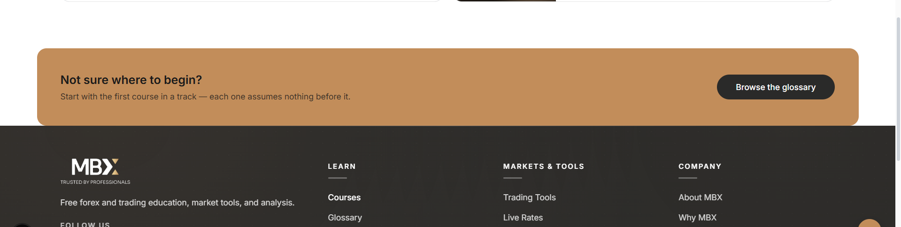
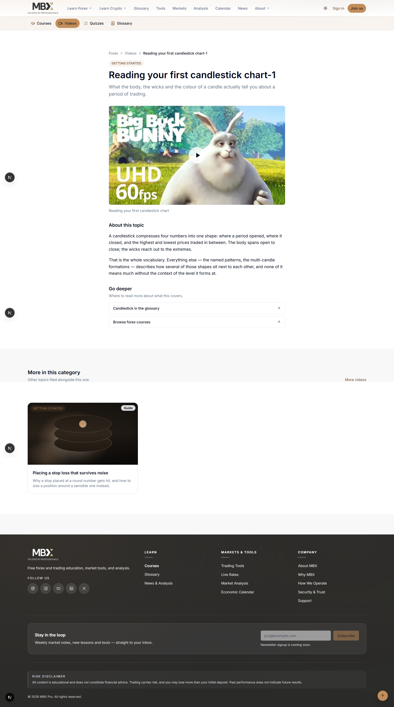
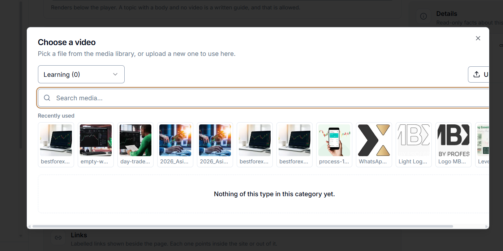
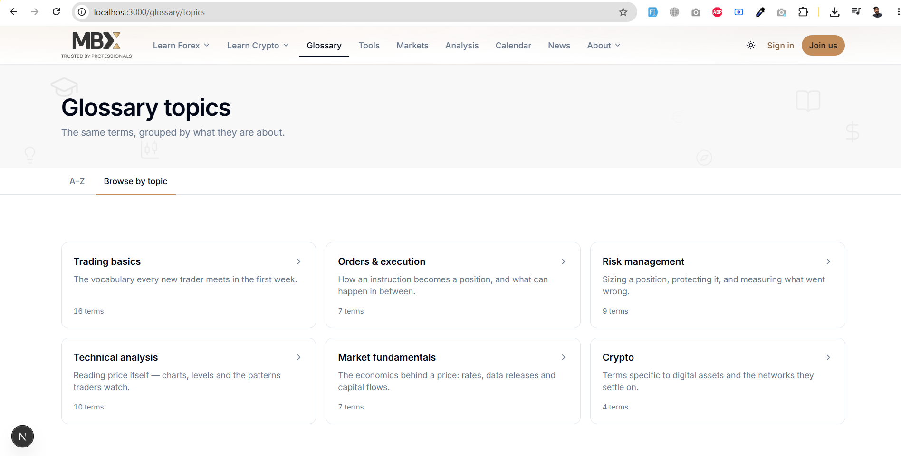
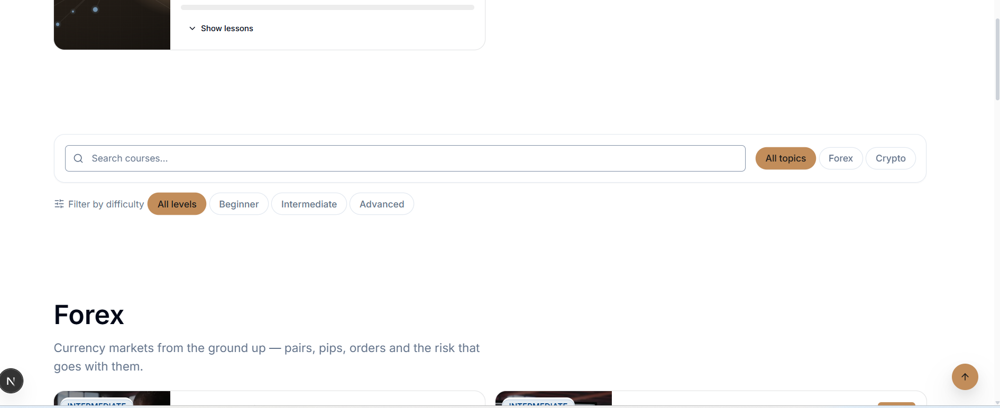
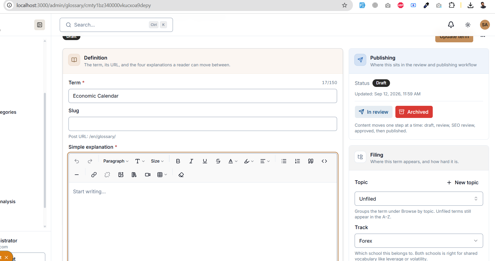
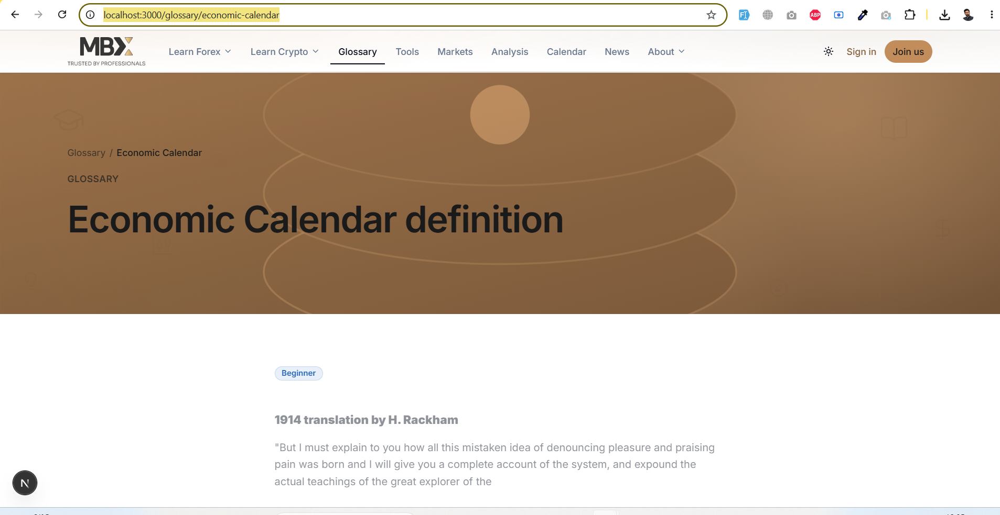

add some space between the footer & card

there are extra space of the right side cards Top stories
also remove the archives card
Archives
September 2026

improve the design "More in this category
Other topics filed alongside this one."
card..the text should be centered

http://localhost:3000/admin/learn/quizzes/cmtxx2ptd0004xsucvzo53p9h
when we saave the quize & apply the button to in review the status should be update without page laoding & show next status button

Video categories
http://localhost:3000/admin/learn/videos/categories
show the categories like in a crud way..when we add new category then it should show the popup modal & add the category..

the media card upload button should be visible on popup

we've added a course with 2 lessons & publish both..when we see on the public site there should be show the 2 lessons in the top banner but in detail page showing no lessson added yet..

alsoc check the schduling is implemented or not on all modules where added

the menu should be highlighted of A-z & Browse by topic ..should be more clear,rich effects,hover etc
also the cards should also be more rich effects added

reduce unnecessory spaces from the too & bottom as well

the slug should be auto fill when title paste like other pages are managing

http://localhost:3000/glossary/economic-calendar

there should be shorter vertically banner like used in the
http://localhost:3000/glossary/topics
but should be maitain the colorfull background..

i've add a new topic which is published successfully & show the live link from admin but when i clikc on browse by topic page then that newly added topic is not listed & appear..that should may be add some moderan paginaton or any other reason..resolve this as well..

in the news edit section the Excerpt input should be listed before the Body(Html) input..

Every page coming soon pages should be show a proper desgined pages of cooming soon message instead of back link..

we've added the news with the category of Trade ideas & published from the admin but when we click o news page and trade idea count still showing 0 count & not listed this news on public site..
http://localhost:3000/news/risk-management-position-sizing-masterclass

when we click on category the tradie ideas then its showing the that added news..

when we click on analysis page then its shwoung the correct count for the each article added..

in the details page the frequently asked quesiton color should be different from the above details
also the share icons should be more visible & colorfull with clear section differences form the tags..

http://localhost:3000/glossary/yield

the common question section be clear & distinct visbility from the above
explanatons..if FAQ added..
related terms should also be clear higlightes secitons
