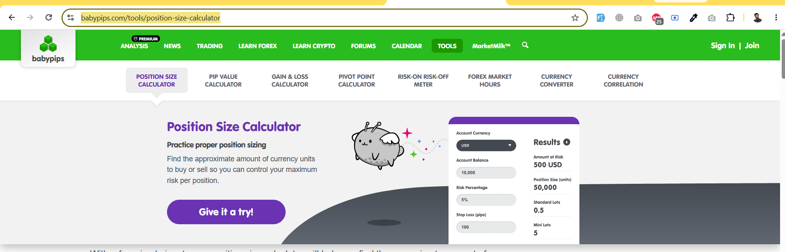

https://www.babypips.com/tools/position-size-calculator

https://www.babypips.com/tools/pip-value-calculator

https://www.babypips.com/tools/gain-loss-percentage-calculator

https://www.babypips.com/tools/pivot-point-calculator

https://www.babypips.com/tools/risk-on-risk-off-meter

https://www.babypips.com/tools/forex-market-hours

https://www.babypips.com/tools/currency-converter

https://www.babypips.com/tools/currency-correlation

i want to add all tools in our site you need to visit the reference site...
and follow the presentation flow & recommended topics data

First review all the pages & check either these are the only public site controle or can be controle form the admin side..

if we need to any api key or widgets etc..then it should be add in the settings..
if anything that should be add like currency pairs etc..then that should also be controle form the admin..
plan that the related topic of each page will manage ? by admin or public site statically?
we want maximum possible controle from the admin side..

Most of that calculators..check how can we make those calculators etc..
