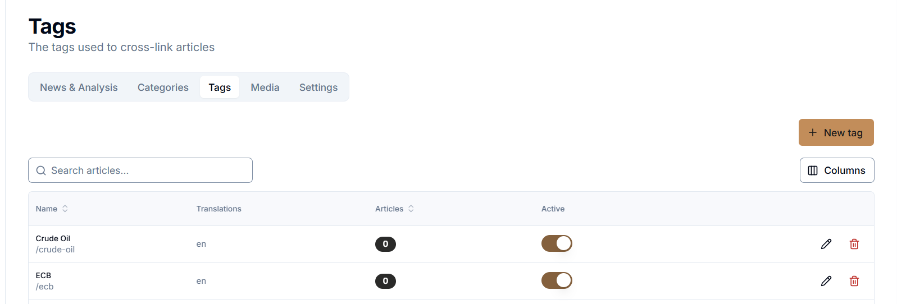
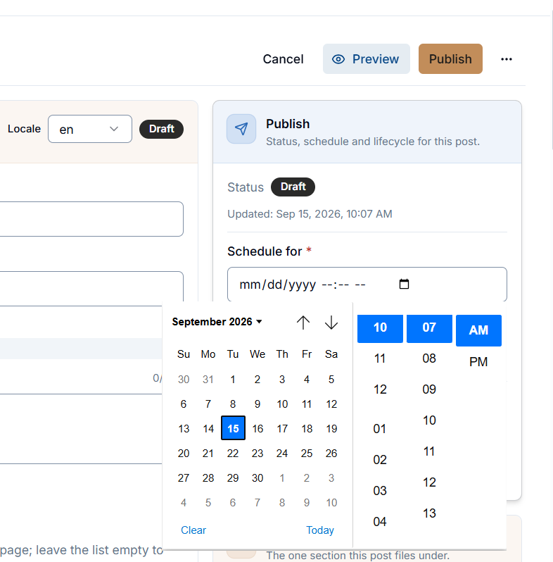
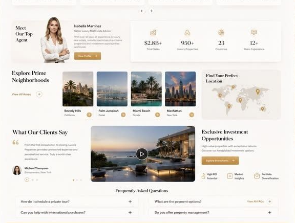

add the multiple seeders for the news & also add these logos
by default..
D:\projects\MBFX-Learning-Center\apps\web\storage\uploads\branding

News & Analysis
Categories
Tags
Media
Settings

all the sub page tabs should be used in that way when we click on the tab this will load the tab data without page loading..

also remove the media tab,
settings should be also be placed with above the tabs

also the new button should be placed in the same row of columns...every button & filter should be in the same row for the whole site..

this will apply on whole site & it will be standard for the future like button should in same row.. if we need to use the external page button then it will appear on the top right seprately rather then using with tabs..
the page tabs will not reload the page..it will only load the data..

---

the scheudle for input using the callendars but that input are using the blue clendars this shuld be use the same standard of website is using..also remove the extra space on the right side of the input

when we upload the media its compressed the resoluton to much low it should be medium resuliton for using & downlaoding..
also add the download option on media page..
when click on media file..there should smaller img preview because the form inputs are not visible on 1st go..

---

admin session logout timing..add this settiong in general seciton & provdie a dropdown for the 2m,5,15,30,60,120,never...
aslo implement that functionality as well..

---

on the public site the button allignments should be the same like in every where use the square radius on the public site..do not use round button,menu or any other places,,also use the centralize components as well..also check the sizing & radius etc..should be consistant everywhere

---

add the searchbar for the public site as well that can we access on any page,content,can be use by ctrl+k
----

remove the extra hover effects like showing the top colorfull line on the top ..maintain the other hover effects..like the
The platform
section
reduce the size of each section specially vertically,make smart display..
------

make this type of display & data presnetations
