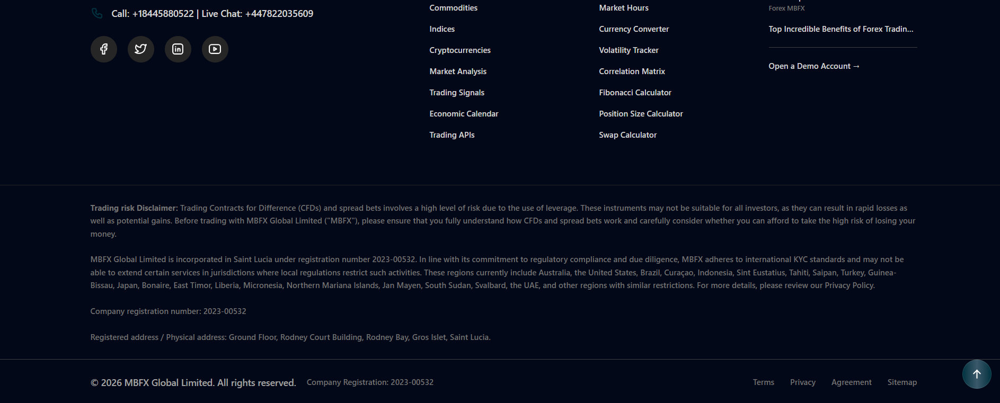
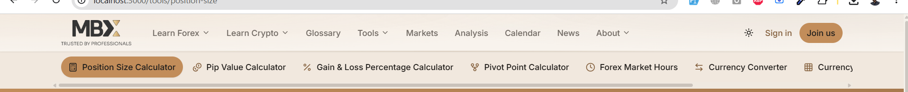
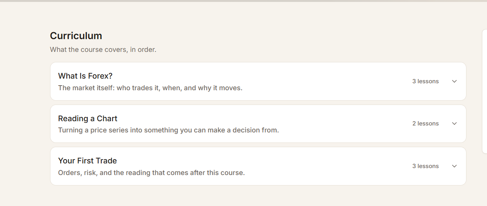
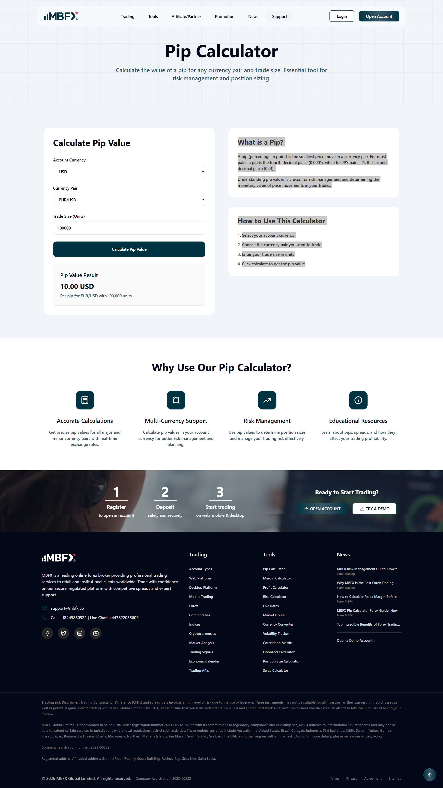

remove the about section on the public site & all pages that has been used in that..and follow this support page & add as its info & data presnetations like this site

docs/changes/changes-32-fixes-improvements.md
remove the 

add the this info in the seeder
Trading risk Disclaimer: Trading Contracts for Difference (CFDs) and spread bets involves a high level of risk due to the use of leverage. These instruments may not be suitable for all investors, as they can result in rapid losses as well as potential gains. Before trading with MBFX Global Limited ("MBFX"), please ensure that you fully understand how CFDs and spread bets work and carefully consider whether you can afford to take the high risk of losing your money.

MBFX Global Limited is incorporated in Saint Lucia under registration number 2023-00532. In line with its commitment to regulatory compliance and due diligence, MBFX adheres to international KYC standards and may not be able to extend certain services in jurisdictions where local regulations restrict such activities. These regions currently include Australia, the United States, Brazil, Curaçao, Indonesia, Sint Eustatius, Tahiti, Saipan, Turkey, Guinea-Bissau, Japan, Bonaire, East Timor, Liberia, Micronesia, Northern Mariana Islands, Jan Mayen, South Sudan, Svalbard, the UAE, and other regions with similar restrictions. For more details, please review our Privacy Policy.

Company registration number: 2023-00532

Registered address / Physical address: Ground Floor, Rodney Court Building, Rodney Bay, Gros Islet, Saint Lucia.

© 2026 MBFX Global Limited. All rights reserved.

Company Registration: 2023-00532

------------

Terms
Privacy
Agreement

the above 3 are should be dynamically add from the admin site when click on that pages then the pdf file should be visibile on new tab..

also add the sitemap 
Sitemap

add these pages in the site..sampe placement of these pages..aslo add the seeder for that file which is uploaded in this folder
D:\projects\MBFX-Learning-Center\apps\web\storage\uploads\policies

----

the late loading effects should be 2 way when we scrole down then also be show the late loading & when we scrol up then also show the late loading effects..the menu should also be show the late loading for the whole site

------
when we click on any tools then its appearing the submenu for the tools remove that

--------

improve the styling for this curriculum lessons..should be more colorfull,visible...add badges etc  

improve here as well there should be more clear visisble,distinct each lesson

http://localhost:3000/learn/forex/forex-fundamentals/pips-lots-and-leverage
------------

http://localhost:3000/markets
remove this
-----
http://localhost:3000/
when home page is loading first load something else image then showing the video...remove that image

-------

add the banners to all places
D:\projects\MBFX-Learning-Center\apps\web\storage\uploads\banners

-----
replace the news & analysis image from the 
D:\projects\MBFX-Learning-Center\apps\web\storage\uploads\The platform
----

the whole website should be responsive..check the responsiveness of the while site..specially the images etc
-----

https://mbfx.co/tools/pip-calculator
    
    overall the presentation should be like this..the all calculators..

    --------
    ecnonomic callendars hsould also be placed in the tools menu..

    ----also update the presentations of 
    http://localhost:3000/tools/market-hours
    like this..
    
    https://mbfx.co/tools/market-hours
