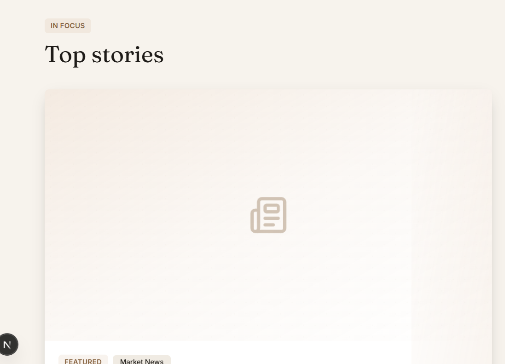
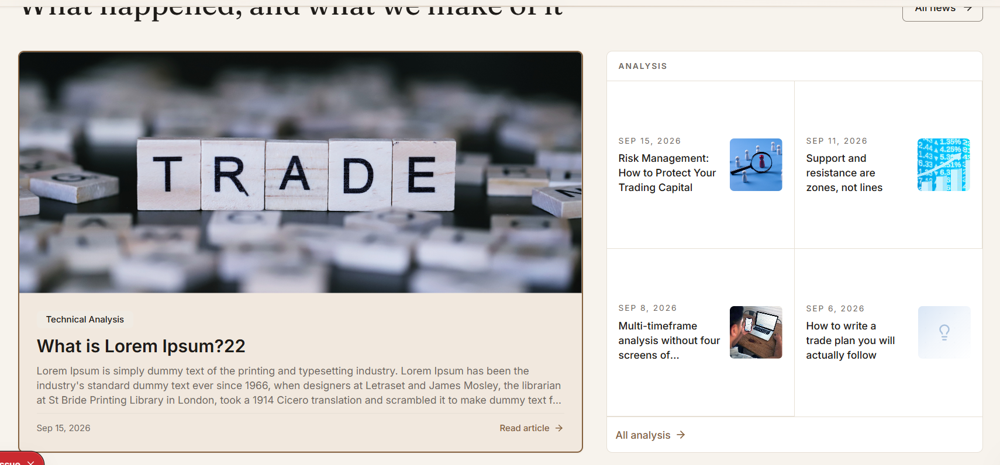

Trading Contracts for Difference (CFDs) and spread bets involves a high level of risk due to the use of leverage. These instruments may not be suitable for all investors, as they can result in rapid losses as well as potential gains. Before trading with MBFX Global Limited ("MBFX"), please ensure that you fully understand how CFDs and spread bets work and carefully consider whether you can afford to take the high risk of losing your money. MBFX Global Limited is incorporated in Saint Lucia under registration number 2023-00532. In line with its commitment to regulatory compliance and due diligence, MBFX adheres to international KYC standards and may not be able to extend certain services in jurisdictions where local regulations restrict such activities. These regions currently include Australia, the United States, Brazil, Curaçao, Indonesia, Sint Eustatius, Tahiti, Saipan, Turkey, Guinea-Bissau, Japan, Bonaire, East Timor, Liberia, Micronesia, Northern Mariana Islands, Jan Mayen, South Sudan, Svalbard, the UAE, and other regions with similar restrictions. For more details, please review our Privacy Policy.

remove this from all pages..replace with the subscribe banner
----------
support@mbfx.co
Call: +18445880522 | Live Chat: +447822035609

addt this in the footer
[alt text](image-66.png)

---------

on calledar page add the pix on the section
Using it

Plan the week before it starts

-------
the saarch is not working on public site

----
reduce the size verrtically..make smart dsiplay & presnetaton..

-------
all the news & analaysish display should be same size like the The platform cards..
------

reduce the white spaces..fill the sections as well..
also show the picture first then text same in the news
over reduce the size as well vertically..make samart display

-----
add the provider api in settings as well..place on the both sides..
----
asloa add the one liner description of ai,email templates,email log in the setting page..same like the others
