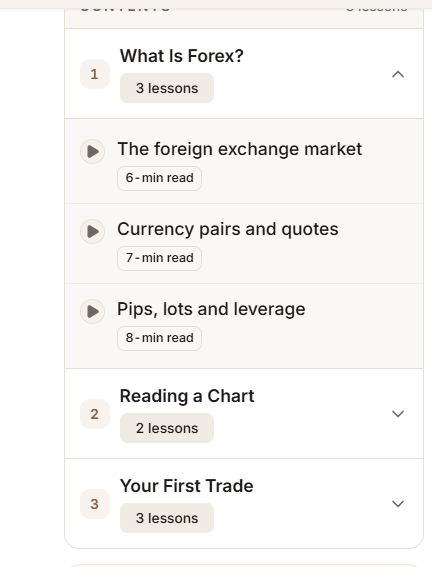

http://localhost:3000/sitemap

also add the cover image
D:\projects\MBFX-Learning-Center\apps\web\storage\uploads\banners\sitemap-banner.png

http://localhost:3000/glossary/topics/trading-basics
removed the browse by topic 
16
from the banner
------
http://localhost:3000/admin/glossary/topics/cmu1m98ix00a3m4uukjvv5xqy
add the cover image option can be visible on public site

-----
there should be symetry on the whole site..
same buttons,same cards,same hover effects of same type,
---

breaks the the each lessons with seprate card..also the sub category should also be move right side a little bit to make more vissible..
----
mark this lesson is complete is alway showing mute..also storte the reading history on user progress when login..
