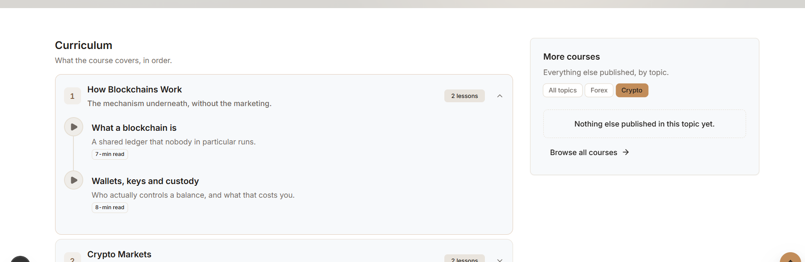
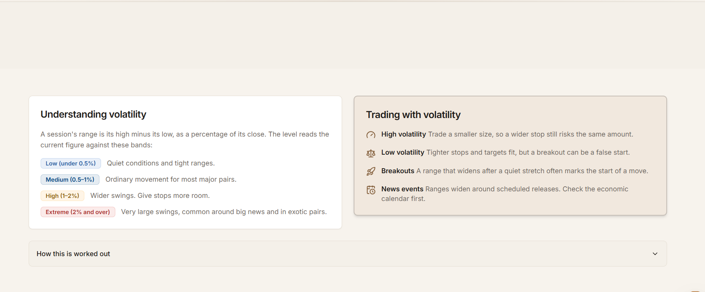
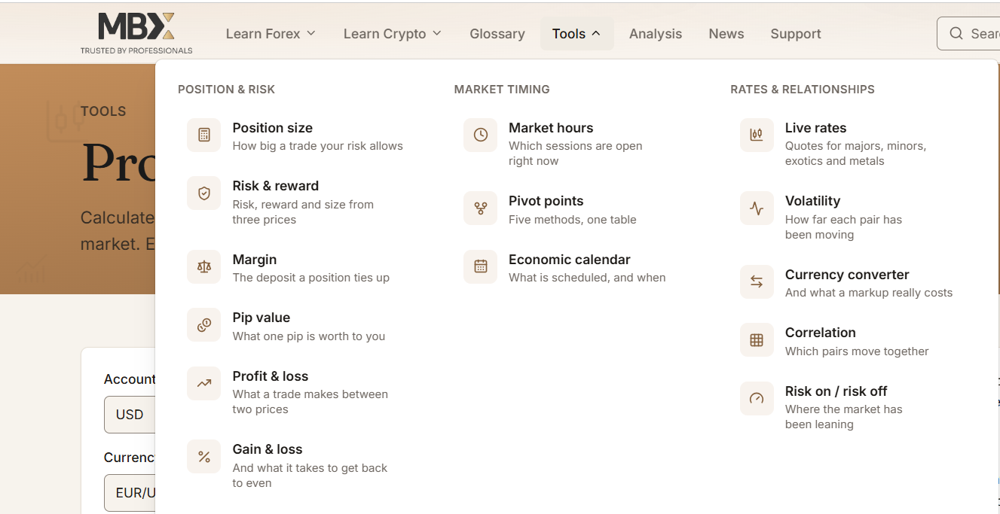

http://localhost:3000/glossary/yield

in glossary there should be news cards & tags cards available on the right side of the all glossary pages

--------
all the live view pages should be open in the new page..

------
D:\projects\MBFX-Learning-Center\apps\web\storage\uploads\banners\glossary-topics.png
use this as a banner on 
http://localhost:3000/glossary/topics

-----------
D:\projects\MBFX-Learning-Center\apps\web\storage\uploads\banners\analysis.png
use this on 
http://localhost:3000/analysis
------------
Topics
Keep exploring

on analysis page should also use the static background image same on the news page have used..also use the same image where this topic has shown on any page..

---------
fix this issue as well
Base UI: A component is changing the default value state of an uncontrolled FieldControl after being initialized. To suppress this warning opt to use a controlled FieldControl.
../../packages/ui/src/components/input.tsx (40:5) @ Input

  38 |   const wired = useFieldControl(props);
  39 |   return (
> 40 |     <InputPrimitive
     |     ^
  41 |       type={type}
  42 |       data-slot="input"
  43 |       data-size={size}
Call Stack
55

Show 51 ignore-listed frame(s)
Input
../../packages/ui/src/components/input.tsx (40:5)
ArticleSidebar
app\(public)\[locale]\news\_components\article-sidebar.tsx (71:9)
ArticleListing
app\(public)\[locale]\news\_components\article-listing.tsx (97:11)
AnalysisPage
app\(public)\[locale]\analysis\page.tsx (91:7)

-----------

Rates as of Sep 16, 2026 — out of date, and shown for reference only.
do not show this message..
----------
https://mbfx.co/tools/pip-calculator
get the text & add in the seeder 

------
<h1 class="font-display text-display-md font-normal tracking-tight text-balance">Position Size Calculator</h1>

Work out how big a trade can be before it risks more than you meant.

the front end public site using
font-family: inter, "inter Fallback", sans-serif;

so every text editor should also have the option available for the seleciton of font family this..add in all text editors in admin side.

----

more courses & Curriculum should be alligned in same 
----

review the existing tools calculatores..
in first intor add the deifinations with healdings
second how to use it with headings..
same like Pip Calculato
https://mbfx.co/tools/pip-calculator

add seeders for all calculators doing this
also add the late loading effects from different sides..each content should be late load..also reload while scroling ups & downs
this late loading should be apply on all tools pages..
----
https://mbfx.co/trading/calendar

update teh callendar page with this widget tradingview..also same like the top level filters..
also add the intstructions as well

-----
http://localhost:3000/admin/ai/features
i think no need of this..because we're uisng only inner text editor writing assistant

Generate with AI
Drafts every text field of an editor from a short brief, and rewrites any one field on request. You review before anything is replaced. Long pages need Max output tokens per request raised to about 8000.

---------
http://localhost:3000/admin/ai/providers/cmu4fphxa000200uuvcvvm0rv
resolve this issue as well..
-----

card size should be the same & alligned

----
http://localhost:3000/tools/pivot-points

the table should be more attractive & should be late load of each row..colorfull headings
higlighted rows on hover 
---
http://localhost:3000/economic-calendar
make the small banner size same like the other tools..
and add the static picture in banner..

----

balance the menu items
----
in the footer tools  devide in 2 colums
---
Around the markets
Top providers — market news
The latest headlines and analysis from leading financial news providers, gathered by TradingView.

this should also be add in seprate menu of tools retes & relationships
