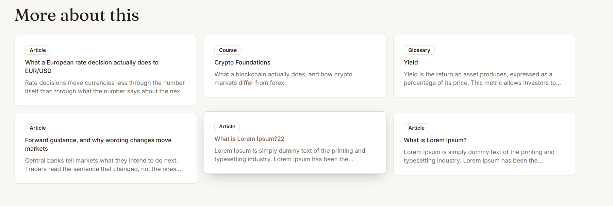
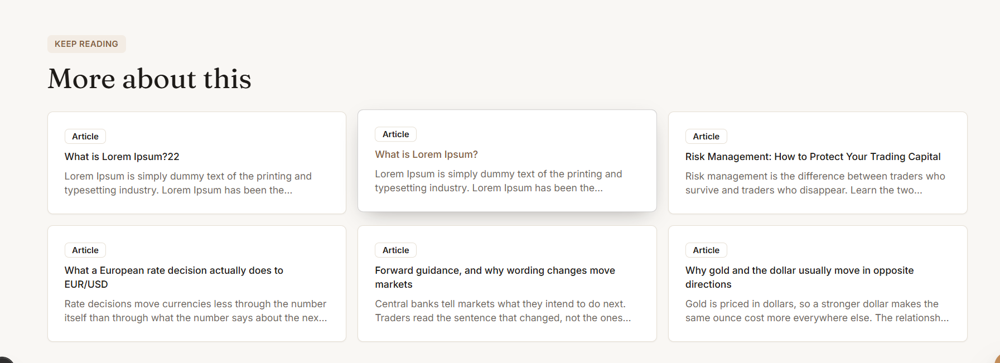
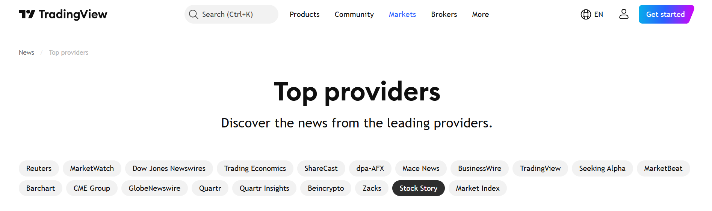
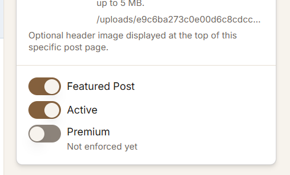
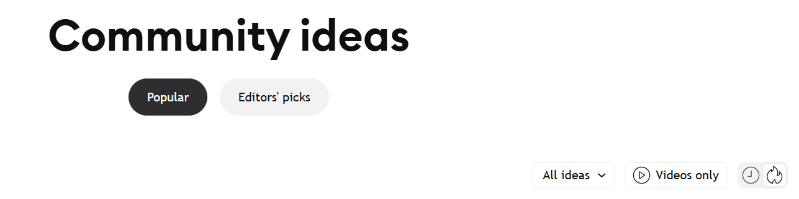

us the same size of cards..even text is bigger..should be optimize
http://localhost:3000/tools/position-size

-------

the card type should be visible in colorfull badge..

----
  check quiz & courses reading progress note & record for the login customoer,,
  aslo make the progess page more attaractive,with colorfull heading & showing the same size cards,also pagination of more reads..check specific the course related record for the login custormer..

  ------

 
http://localhost:3000/tools/market-news
 the top news should also be shown with these heading categories

 -----
 

 each modules,courses,videos,topics,glossary,
 should have all 3 option avilables like in the news showing..

 ------

 all the images/ocver iamges should be in right side cards in the admin,,same like in the news..
http://localhost:3000/admin/learn/lessons/cmu1m96ml0093m4uu0j9tkgqz
 ---
 also check that the quizes attached with specific courses is working & showing at the end of the course when attached to speecific course..
 -----
 when user complete the course & attempt a quiz their record should be available in the progress page...also sugget the login option with the message to save the progess please login or join us to save the progress..

 ----
 
 there should be top levels filters avialble on the public site to show the specific categories like feature/popular courses,news etc...
 --------
