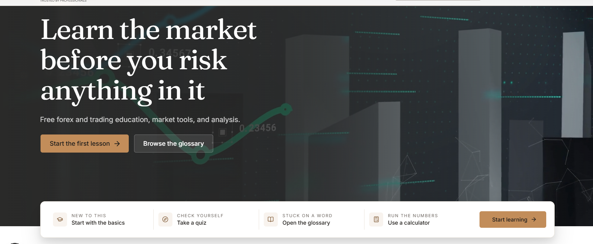
there should be a full page slider from the articles in the home page..remove the video..
the other design will remain same..
-----
https://mbfx.co/
choose this site font for the public site..
<h2 class="text-3xl md:text-5xl font-bold mb-4 text-gray-900 dark:text-foreground" style="opacity: 1; transform: none;">Why Choose MBFX</h2>

Experience the difference with our comprehensive trading solutions

<h3 class="text-xl font-semibold mb-3 text-gray-900 dark:text-foreground">Competitive Spreads</h3>

Trade with industry-leading spreads starting from 0.1 pips on major currency pairs.

<h4 class="font-semibold mb-2 text-gray-900 dark:text-foreground">Advanced Platform</h4>
<button class="button btn-gradient-solid h-10 text-sm btn-gradient-solid text-white px-6 py-2 rounded-lg font-medium transition-all duration-300 shadow-lg hover:shadow-xl button-press-feedback"><svg stroke="currentColor" fill="none" stroke-width="2" viewBox="0 0 24 24" stroke-linecap="round" stroke-linejoin="round" height="1em" width="1em" xmlns="http://www.w3.org/2000/svg"><path d="M5 12l14 0"></path><path d="M13 18l6 -6"></path><path d="M13 6l6 6"></path></svg>OPEN ACCOUNT</button>

<a href="https://www.facebook.com/mbfxglobal/" target="_blank" rel="noopener noreferrer" class="w-8 h-8 bg-gray-800 hover:bg-[var(--primary)] rounded-full flex items-center justify-center transition-colors duration-300"><svg stroke="currentColor" fill="none" stroke-width="2" viewBox="0 0 24 24" stroke-linecap="round" stroke-linejoin="round" class="h-4 w-4 text-white" height="1em" width="1em" xmlns="http://www.w3.org/2000/svg"><path d="M7 10v4h3v7h4v-7h3l1 -4h-4v-2a1 1 0 0 1 1 -1h3v-4h-3a5 5 0 0 0 -5 5v2h-3"></path></svg></a><a href="https://twitter.com/mbfx_global" target="_blank" rel="noopener noreferrer" class="w-8 h-8 bg-gray-800 hover:bg-[var(--primary)] rounded-full flex items-center justify-center transition-colors duration-300"><svg stroke="currentColor" fill="none" stroke-width="2" viewBox="0 0 24 24" stroke-linecap="round" stroke-linejoin="round" class="h-4 w-4 text-white" height="1em" width="1em" xmlns="http://www.w3.org/2000/svg"><path d="M22 4.01c-1 .49 -1.98 .689 -3 .99c-1.121 -1.265 -2.783 -1.335 -4.38 -.737s-2.643 2.06 -2.62 3.737v1c-3.245 .083 -6.135 -1.395 -8 -4c0 0 -4.182 7.433 4 11c-1.872 1.247 -3.739 2.088 -6 2c3.308 1.803 6.913 2.423 10.034 1.517c3.58 -1.04 6.522 -3.723 7.651 -7.742a13.84 13.84 0 0 0 .497 -3.753c0 -.249 1.51 -2.772 1.818 -4.013z"></path></svg></a><a href="https://www.instagram.com/mbfxglobal/" target="_blank" rel="noopener noreferrer" class="w-8 h-8 bg-gray-800 hover:bg-[var(--primary)] rounded-full flex items-center justify-center transition-colors duration-300"><svg stroke="currentColor" fill="none" stroke-width="2" viewBox="0 0 24 24" stroke-linecap="round" stroke-linejoin="round" class="h-4 w-4 text-white" height="1em" width="1em" xmlns="http://www.w3.org/2000/svg"><path d="M8 11v5"></path><path d="M8 8v.01"></path><path d="M12 16v-5"></path><path d="M16 16v-3a2 2 0 1 0 -4 0"></path><path d="M3 7a4 4 0 0 1 4 -4h10a4 4 0 0 1 4 4v10a4 4 0 0 1 -4 4h-10a4 4 0 0 1 -4 -4z"></path></svg></a><a href="https://youtube.com/c/MBFXglobal" target="_blank" rel="noopener noreferrer" class="w-8 h-8 bg-gray-800 hover:bg-[var(--primary)] rounded-full flex items-center justify-center transition-colors duration-300"><svg stroke="currentColor" fill="none" stroke-width="2" viewBox="0 0 24 24" stroke-linecap="round" stroke-linejoin="round" class="h-4 w-4 text-white" height="1em" width="1em" xmlns="http://www.w3.org/2000/svg"><path d="M2 8a4 4 0 0 1 4 -4h12a4 4 0 0 1 4 4v8a4 4 0 0 1 -4 4h-12a4 4 0 0 1 -4 -4v-8z"></path><path d="M10 9l5 3l-5 3z"></path></svg></a>

<strong>Trading risk Disclaimer:</strong> Trading Contracts for Difference (CFDs) and spread bets involves a high level of risk due to the use of leverage. These instruments may not be suitable for all investors, as they can result in rapid losses as well as potential gains. Before trading with MBFX Global Limited ("MBFX"), please ensure that you fully understand how CFDs and spread bets work and carefully consider whether you can afford to take the high risk of losing your money.  MBFX Global Limited is incorporated in Saint Lucia under registration number 2023-00532. In line with its commitment to regulatory compliance and due diligence, MBFX adheres to international KYC standards and may not be able to extend certain services in jurisdictions where local regulations restrict such activities. These regions currently include Australia, the United States, Brazil, Curaçao, Indonesia, Sint Eustatius, Tahiti, Saipan, Turkey, Guinea-Bissau, Japan, Bonaire, East Timor, Liberia, Micronesia, Northern Mariana Islands, Jan Mayen, South Sudan, Svalbard, the UAE, and other regions with similar restrictions. For more details, please review our Privacy Policy.  Company registration number: 2023-00532  Registered address / Physical address: Ground Floor, Rodney Court Building, Rodney Bay, Gros Islet, Saint Lucia.

© 2026 MBFX Global Limited. All rights reserved.

use this font family & sizes of text for the public site

-------------------
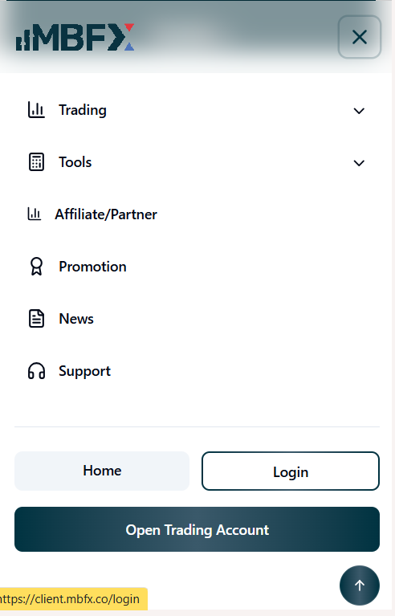
use this way of menue when we open in the mobile should also be responsive every page..

---------

remove transparency of the icons
---
button text color should be white..
& all the button size should be the same on public site like in this the both buttons read the latest & Browse Topics should be the same..check other pages as well

----
when clikc on pagination do not reload the page & update the content only..
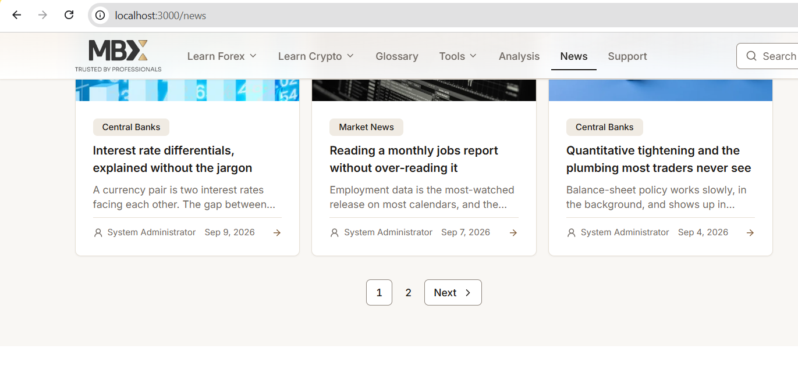
check other pagination for the other content as well..
-----
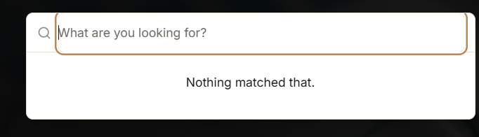
the search input is not showing the full input for the search design wise..check that
increase the modal size as well..
should be like this..do not show the /admin/users etc
icons should be visibl..filter should be with categories wise...below guidance of button arrows etc should also be available like in this pic
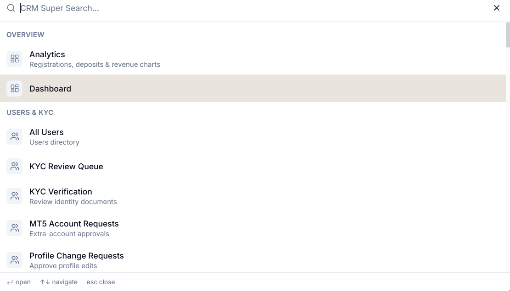
----
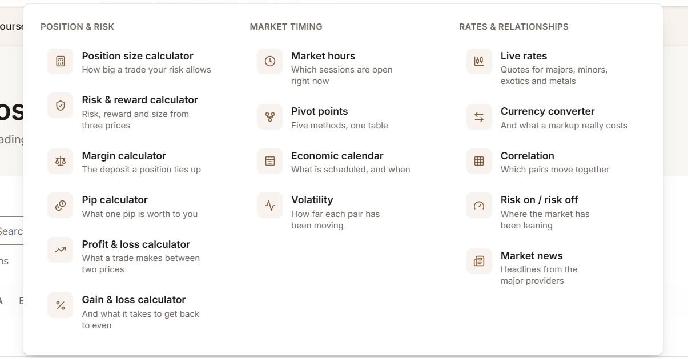
the display menu should be same like the learn forex menus
----
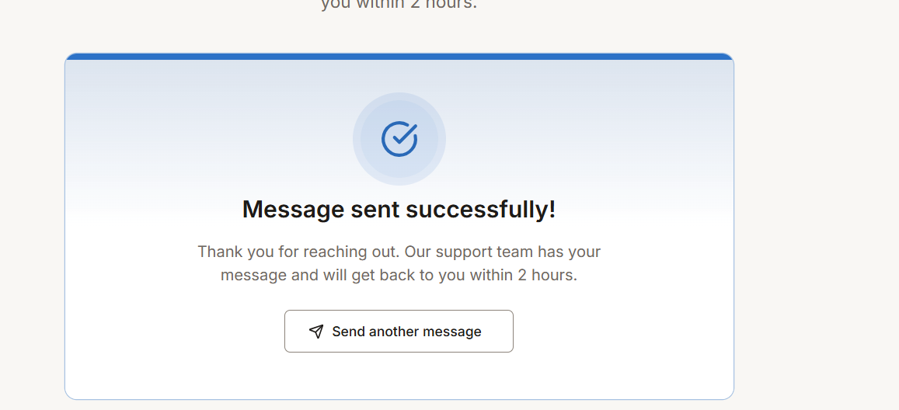
first only show the the message underr the form only..do not popup the modal for the success...only show the message with submit button..also colors should be compatible with the site
also check that where the email will send i mean which email..should be the same that used in the general..
----
review the admin sesison timeout which is working as per setting selected..

----
admin side the logo should be center & also the sidebar collapse button should also the outside of the sidebar menu..
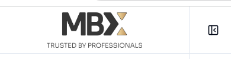
---
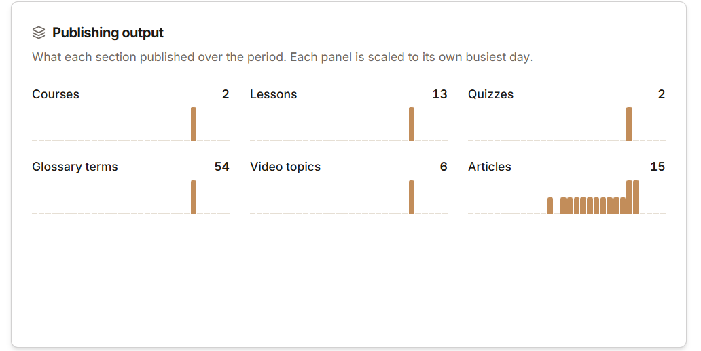
update the stats design as well..
the top cards should be visible like background icons avialble like this
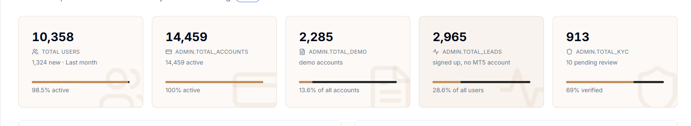
also add the more stats if posible like fill mutiple stats in one card where possible etc..change the color of bars
----
improve the desing of recent activity..
---
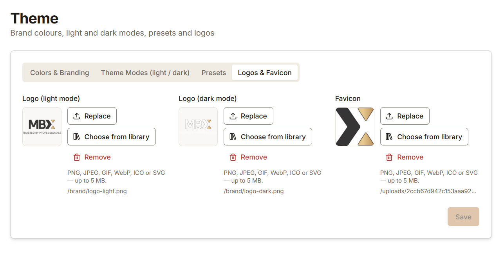
http://localhost:3000/admin/theme
remove the save button because there is not use here
---
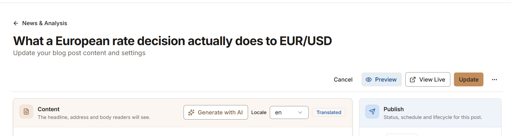
in the edit detials page..do not show the title on the top only write the static text like edit news & show the button on the same row..this flow will apply on all modules..this will be statndars as well...
like this
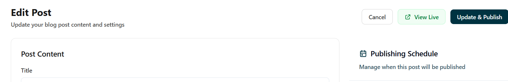
-----
http://localhost:3000/admin/articles/categories
the catgeorie & tag page will show as a dropdwn..not relaod the page..
every where the tab has been used there should not be any page reload for that..

------
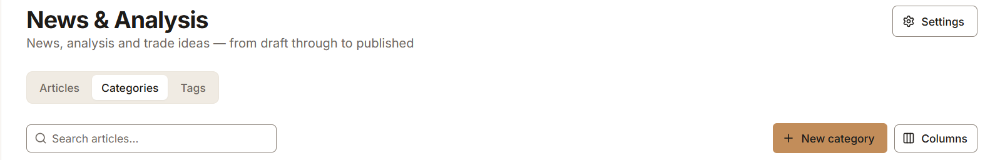
all the new buttons should be display on the top with same row of titl..like in this pic the new category button should place with settings button
this should be a standard..
----
all the tilte & buttons should be in the same row...

-----
all the modals should be fit in the screen size..
like in this not fitting in the screen size..check all the popup 
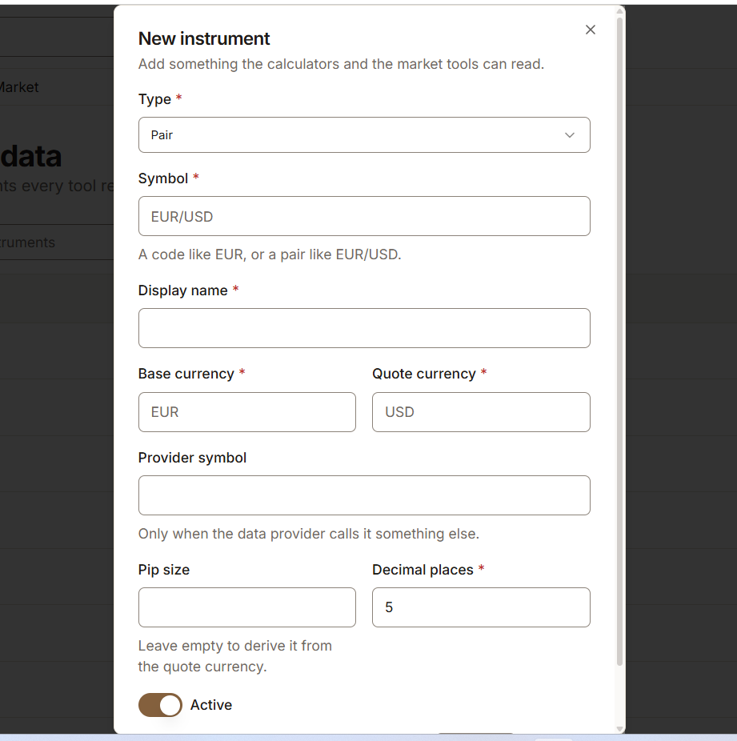