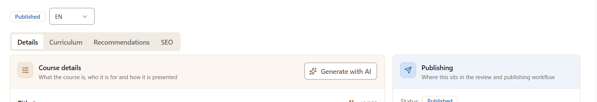
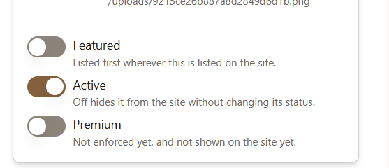

the page refresh on pagination should be smotth of content loading like in news & aritcles..check all other paginations should be the same experience 

----
when scrole down the the upper arrown icons should show some effects of ligtning or highlighting 
-----

do not place language dropdown & statuses in seprate rows..it will appear only in the tab row or contend hearder..check all the pages
----
http://localhost:3000/admin/learn/progress
there should be color full progress reports & add some graphs as well..
----

these options should be place after the contend major settings has been implemented..
like before the Term info cards..
----
<h1 class="text-3xl font-bold tracking-tight">Promotion Banners</h1>

Manage promotional banners displayed across the platform

Add a new supported currency

<h2 id="radix-_r_3d_" class="text-lg font-semibold leading-none tracking-tight">Add Currency</h2>
<button class="inline-flex items-center justify-center whitespace-nowrap rounded-md text-sm font-medium ring-offset-background transition-colors focus-visible:outline-none focus-visible:ring-2 focus-visible:ring-ring focus-visible:ring-offset-2 disabled:pointer-events-none disabled:opacity-50 bg-primary text-primary-foreground hover:bg-primary/90 h-10 px-4 py-2">Add Currency</button>

<button class="inline-flex items-center justify-center whitespace-nowrap rounded-md text-sm font-medium ring-offset-background transition-colors focus-visible:outline-none focus-visible:ring-2 focus-visible:ring-ring focus-visible:ring-offset-2 disabled:pointer-events-none disabled:opacity-50 bg-primary text-primary-foreground hover:bg-primary/90 h-10 px-4 py-2"><svg xmlns="http://www.w3.org/2000/svg" width="24" height="24" viewBox="0 0 24 24" fill="none" stroke="currentColor" stroke-width="2" stroke-linecap="round" stroke-linejoin="round" class="lucide lucide-plus h-4 w-4 mr-2"><path d="M5 12h14"></path><path d="M12 5v14"></path></svg>Add Currency</button>
use this font & size for the amdin side
-----

