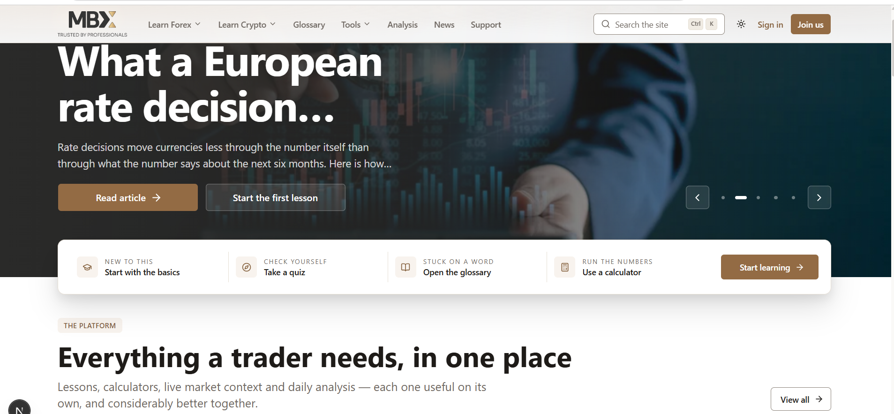
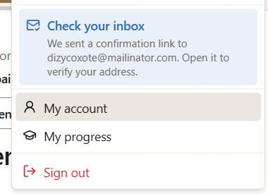
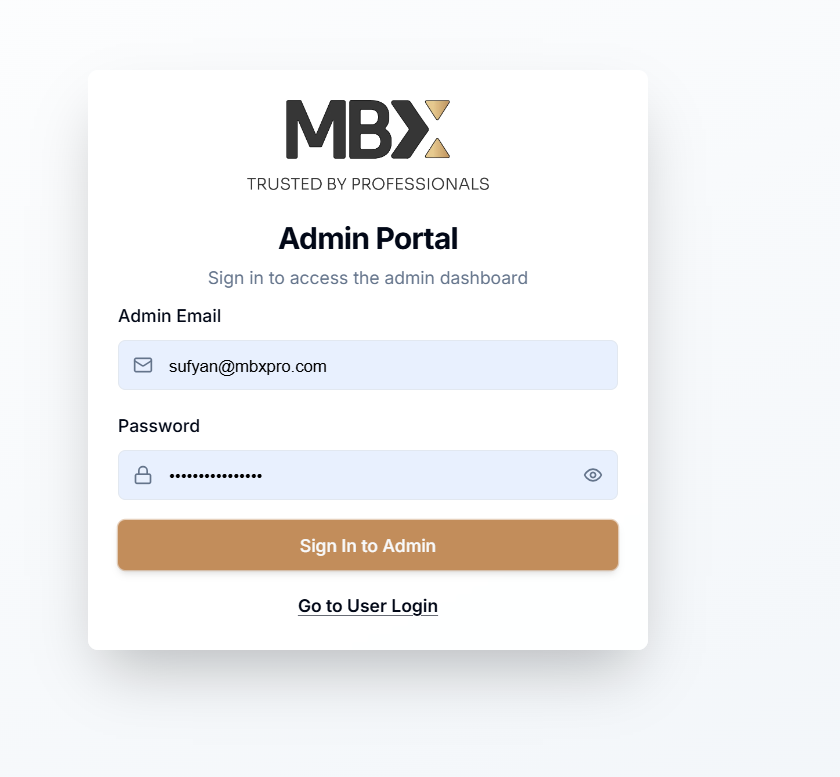
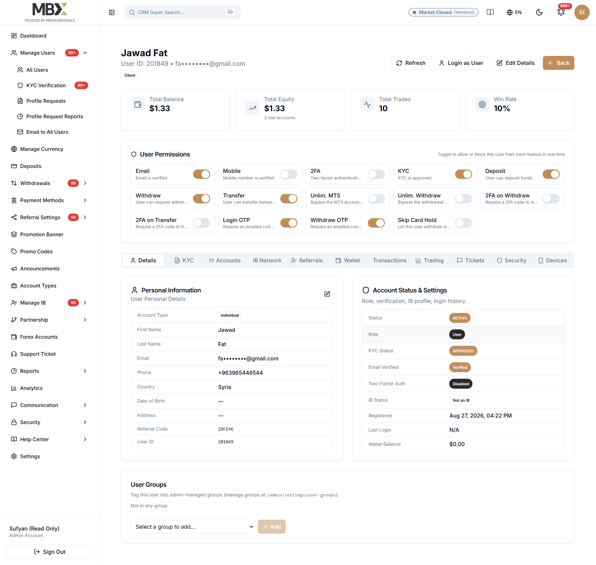
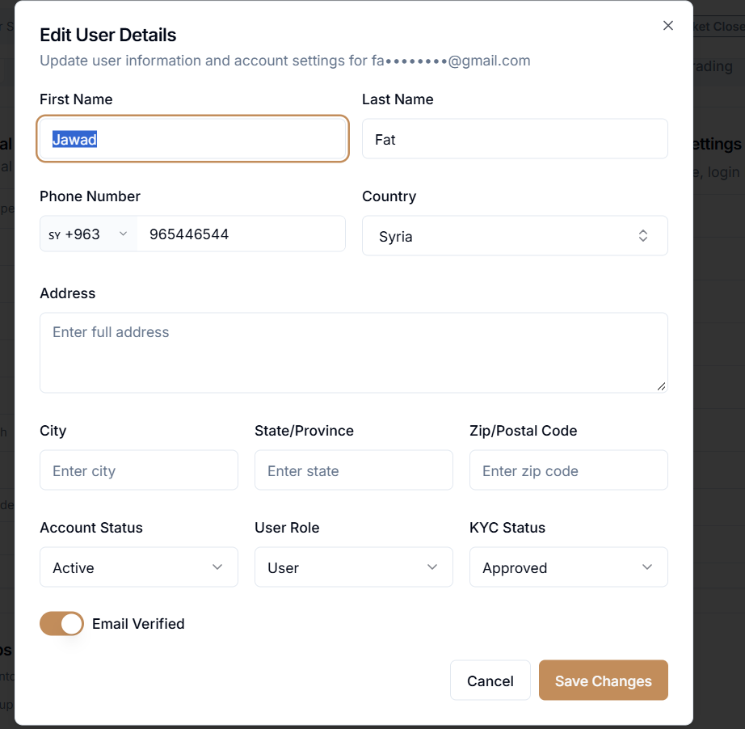
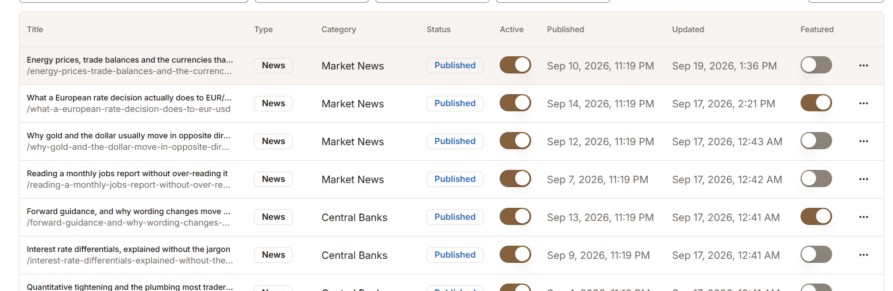

increase the size vertically a littlebit.
mute the left right arrow..higltihgt on hover..

---.
add late load effect on sidebar as well
etiher on desktop or on mobile

----

move signin & join un in menu only,,do not show here..but whe login then show the profile here

-----

email verify remove from the dropdown..show only on profile page..also do not use blue color anywhere..use site defaul colors
--
http://localhost:3000/admin/sign-in
also update the favicon on login & signup pages as well
----

the admin login should be like this
the other will remain the same.

----

when we click on user's profile then detail page should be like this formate & presentations..

the tabs should include the progess per modules..
the admin should have full controle like this..
add login as a user as well
the susbscriber should also have the same display..
-------
the employe should also have the same display but not much have scop yet
------

do not display the slugs on any modules in tables..only titles are enough..
----
when we try to view from the admin side..the first time the public site stuck on loading...when we refresh again then its laod quickly
---
there should be smooth page loading..when move to next or back pages..should be implemented the late loading effects..
----
when we apply fitler on news there should be show any word matching display news...also show the specific section laoder as well when filters any thing or paginagtions applying..should be smooth appearance of the data..

---

