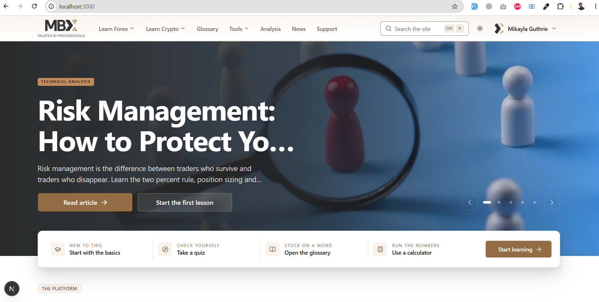
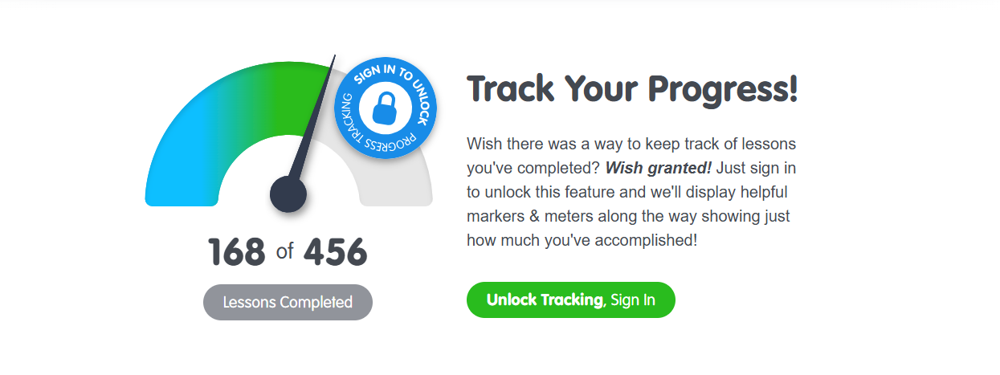
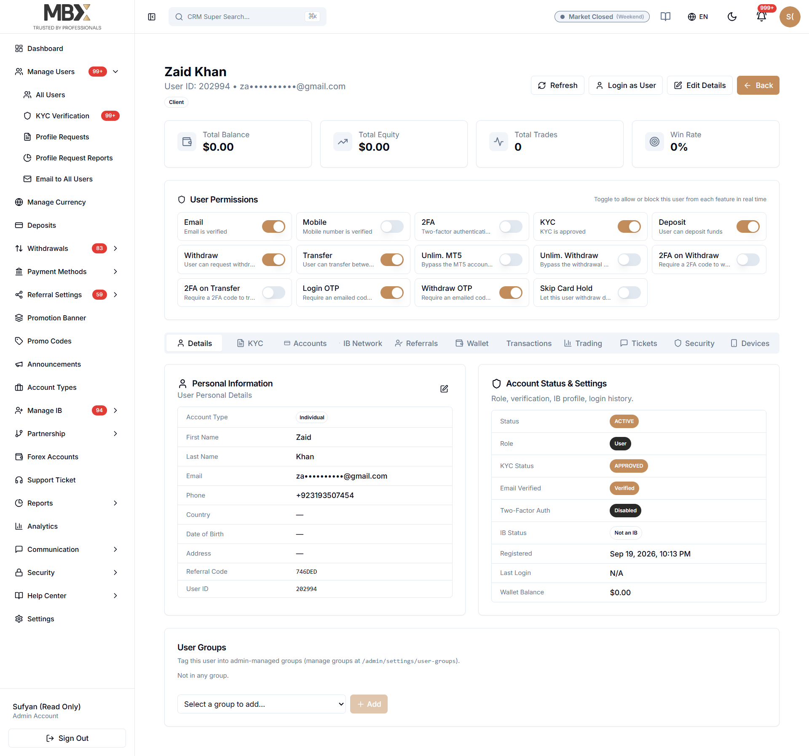
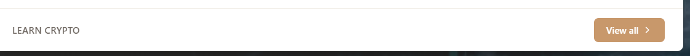
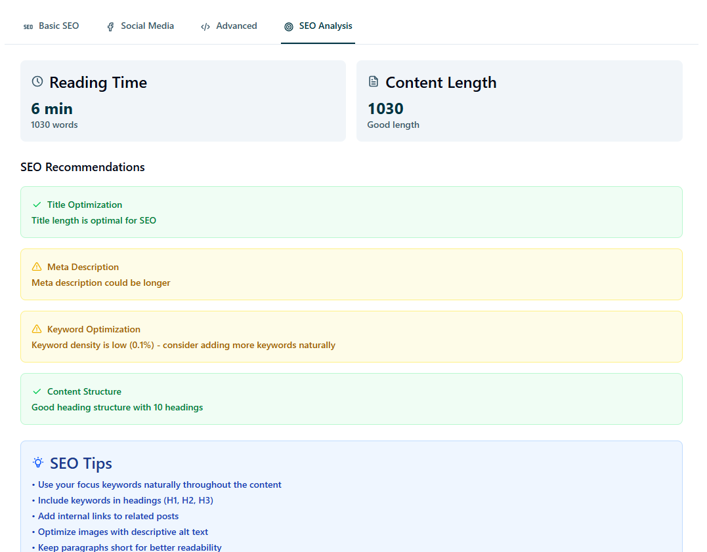
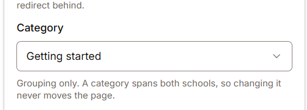
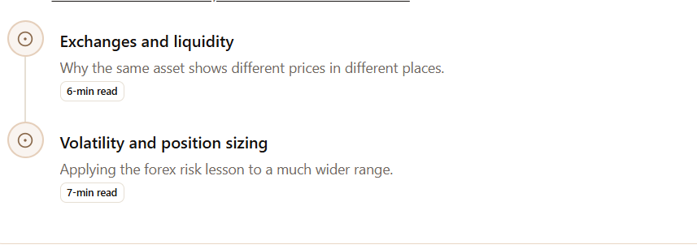
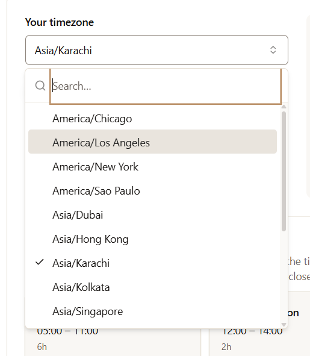
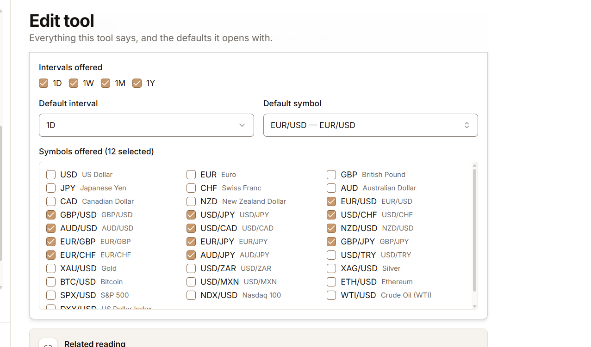
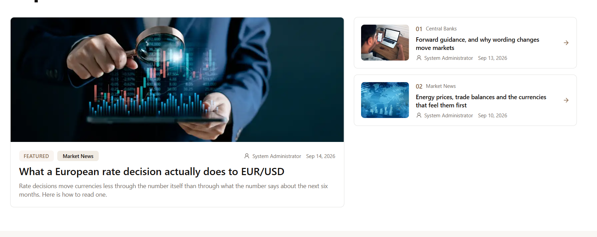

increase more size vertically..like the slider & while small banner will show on page load..

----
http://localhost:3000/learn/crypto/crypto-foundations
when we open the course show the signin option for the reminder to save the progress
like this

also when open the coursse there should also be have a signin option

http://localhost:3000/learn/crypto/crypto-foundations/what-a-blockchain-is

-----
chekc the video uploading & there compression..using of that video

----
make a produciton build ready & how will use in the produciton or live serve

---
add the seeder for the live server to upload
every should have available possible,cover,haeder picutes attachements where needed,added every possible things can be available,like image,video,exeternal links,headings..should be presentable,Faq if available,seo,added any available option..related things..

 & site with current settngs,color scheme,logo uploading,email adding   
D:\projects\MBFX-Learning-Center\apps\web\storage\uploads\images
i've images & use that image to attached where missing..
https://www.babypips.com/learn/forex/preschool#what-is-forex

https://www.babypips.com/crypto/learn/bitcoin-for-beginners

add 3 courses in each category with picutes attachements where needed,added every possible things can be available,like image,video,exeternal links,headings..should be presentable,Faq if available,seo,added any available option..
also add the 2 quizes seeders with images and real answer quesitons
-----
add the video seeders with full banners & conver images.in video sections should have only video realted contents..should be add 6 videos in seeders..the vidoes links should be related to forex & crypto as per topic

---
check glossary have seeders as well..
the tools should have Faq if not added
---
also save the current defaul theme settings in th seeder,brands

also add the current rate & ai api keys as well in seeder..
The system should be ready in one go...
all the current settings should be selected as a default..
------
http://localhost:3000/admin/users/peEsYUamxlD5LxsOIwsIkc8KxF7dzLpB

the data presnetation should be like in this way...
user name,email,id left side  & button on the right side
also do not show line on page tabs..
also show icons to edit the user-info..the admin can also update the email..

-----
in Glosary edit there is should be only one detail editor is enough having visual & html option...no need add 4 diferent ediotors inputs..

-----
every text editor should be added with both  visual & html options same like using news edit

like in
http://localhost:3000/admin/glossary/topics/cmu1m98ix00a3m4uukjvv5xqy
check other text editors as well

-----
Validation results
[Advisory] primary used directly as link text (light) — 2.57:1, needs 4.5:1
Links and inline text render as #886749 instead. The swatch is unchanged for fills, borders, and charts.
[Advisory] success used directly as link text (light) — 3.79:1, needs 4.5:1
Links and inline text render as #3C67B5 instead. The swatch is unchanged for fills, borders, and charts.
[Advisory] warning used directly as link text (light) — 2:1, needs 4.5:1
Links and inline text render as #99620A instead. The swatch is unchanged for fills, borders, and charts.
[Advisory] error used directly as link text (dark) — 4.12:1, needs 4.5:1
Links and inline text render as #DF5A54 instead. The swatch is unchanged for fills, borders, and charts.
[Advisory] info used directly as link text (dark) — 2.46:1, needs 4.5:1
Links and inline text render as #88827D instead. The swatch is unchanged for fills, borders, and charts.

in this combinations there should clear human readble message & suggest the color that should add in whicn input clearly..

also there can be option to add a preset in the settings when admin wants to save also admin can use that preset when he wants..

----
http://localhost:3000/admin/settings/media
the sizes should be uplaod in mb & should be dropdown avialble

-----
check the cron is working or not & provdie complete guide as well..
---
check the vidoe uplaoding is working or not...also check the media is saving in different folders as well like for news there should be seprate forlder,for courses should be seprate saving folder..

----

improve the design for that footer tile & button..
----
the seo analysis should be like in this formate on all modules

-----

http://localhost:3000/admin/learn/videos/cmu1m9f3k00djm4uugi5vu8iv
there should be button availabel to add category..
without page reloading..should be add..

also there should be option to add or show video on both forex & crrypto option..

-----
http://localhost:3000/admin/settings/email/templates/auth.password_reset
not showing the attached logo in preivew..
also the there should be ai rewrite assistant should be avialble..
also do not show the blue color it shoould be system default color to open a link or show a link...

the email buttons should also be appear same like the other modules updaitng./locked buttons while scrolling & also same foramte.
also use the same text editor tab used for visual/html option like the others..
when click on variable it should automatically clopboard

----

http://localhost:3000/learn/crypto/crypto-foundations
the sub-categories should be visible to the right more to see the clear difference between parent & subcategories difference..
---

the dropdown search input is borken..the header in not visible propely..check all dropdowns 

----
http://localhost:3000/tools/pivot-points
the currency dropdown is not showing on the public site

also in the admin side there should be an option to choose all currencies in tools edit

----

http://localhost:3000/analysis/risk-management-protect-your-trading-capital

but displaying this on http://localhost:3000/tools/pivot-points page under the More about this section when we click showing
showing this is Page not found

so if deleted or disbaled then there should also be hide from the site...

----

when we click on preivew or live view the first time is stuck on loading after refresh showing the page..
please reveiw this issue & fix  
---

check the added seo is loading perfeclty on public site?
-----
http://localhost:3000/admin/features
http://localhost:3000/admin/settings/articles
Remove this page..allow anything that attached with this settings..
-----

add 3 suggestion on the right side..

