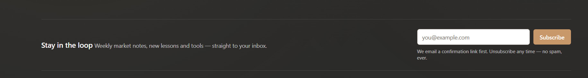

all the extra input detials will be under the inputs...

----

in admin courses there should be maintain the right side settigns with all tabs..move the seo stats under the seo sections
----

why remove the join/sign in section to remember the progress in courses & quizes...pleaserevert back
-----

this row should have the same background color of like the footer top strip having  sign & create free account button

-----

http://localhost:3000/admin/learn/videos/cmuc9lfjr000dd8uuj8it0r8t
the video section will apear before body because in same formate showing the videos in public site..
-----

when we set the preset then its show clearely selected active preset & also update the other tabs colors & branding & theme  modes data on active the presets...
in themes suggestiion should be show in collapsbale tickets..
the built in theme have the white background by default..update the seeder & built-in theme cards for both..
---
the general settings page should be show in tabs form
& form & also place the branding in the general under the tab remove from the theme settings..

----
http://localhost:3000/admin/articles/cmu2zy62h000r3ouuhm7bc96v
what is use of social medida & advance tab..if there is not use then  remove these tabs if we can use any sensible then we should make usefull in public..
---

