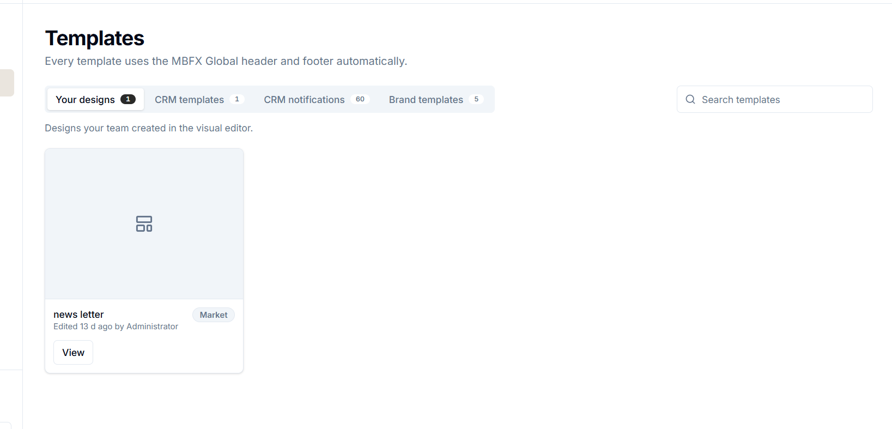
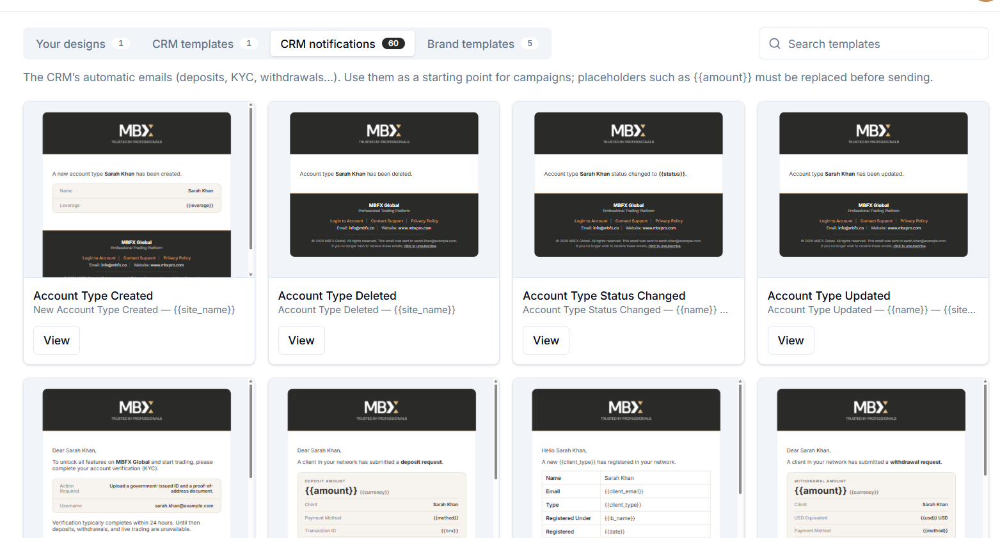
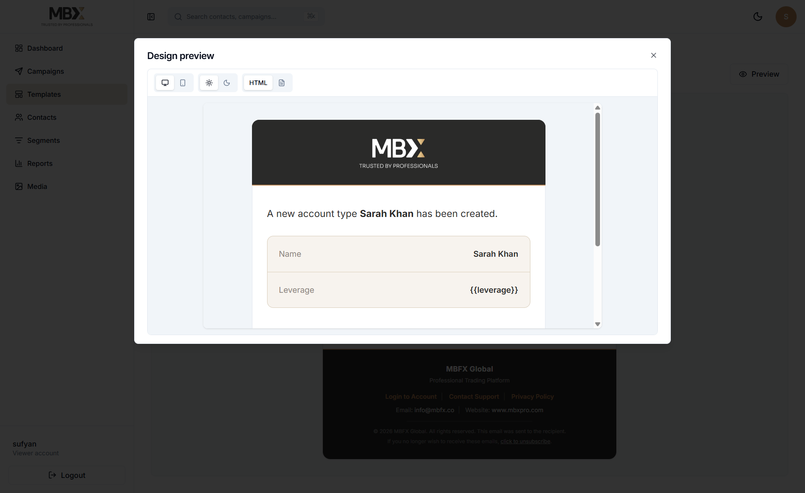
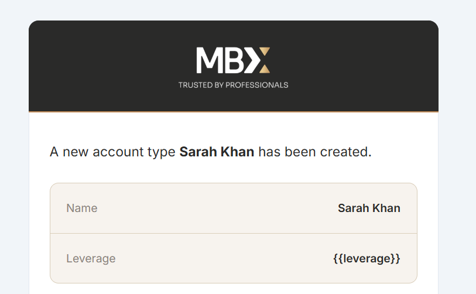
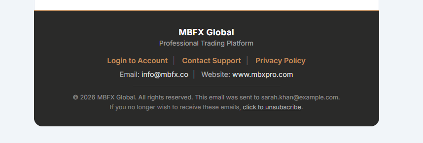
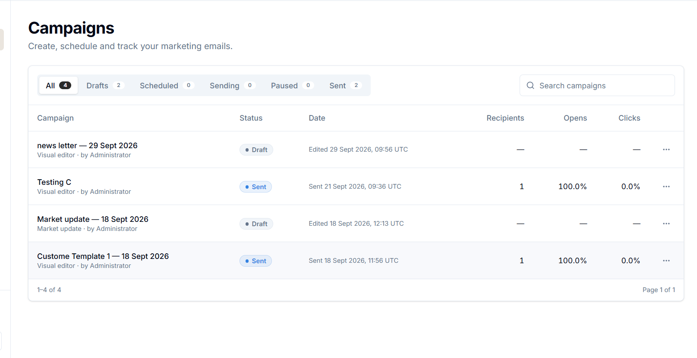
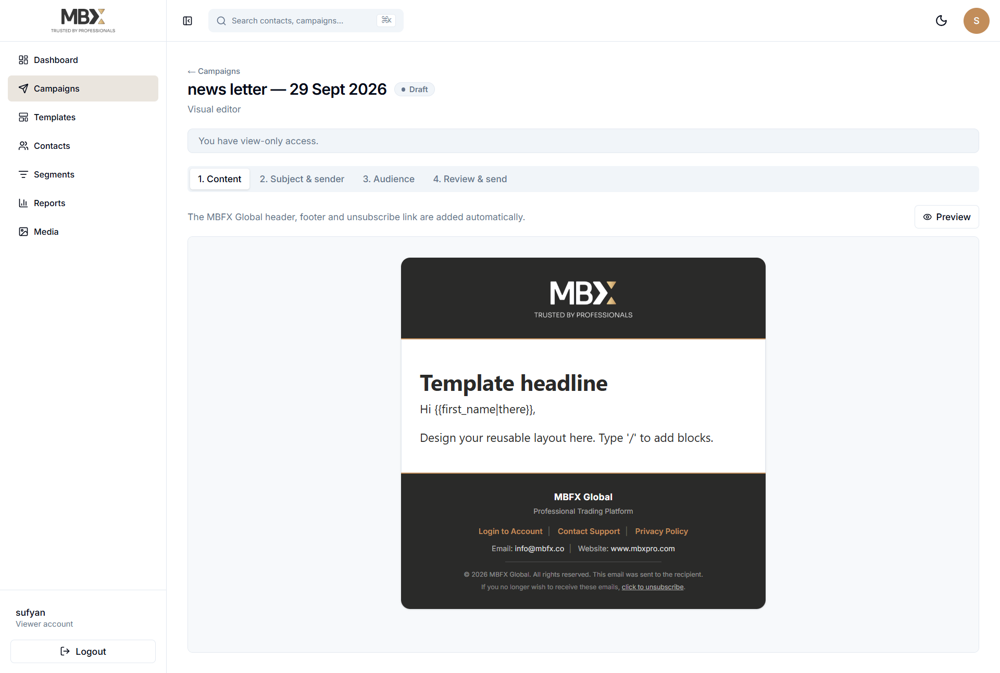
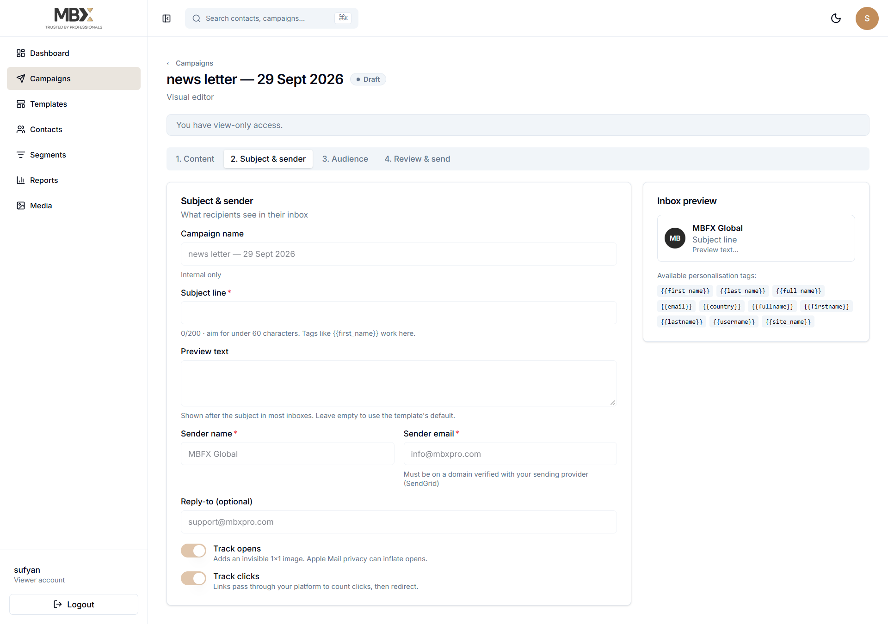
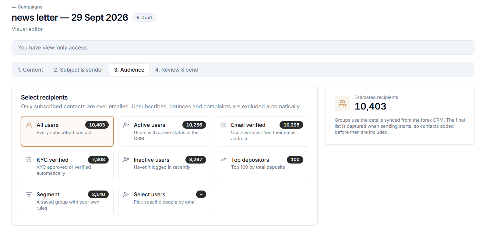
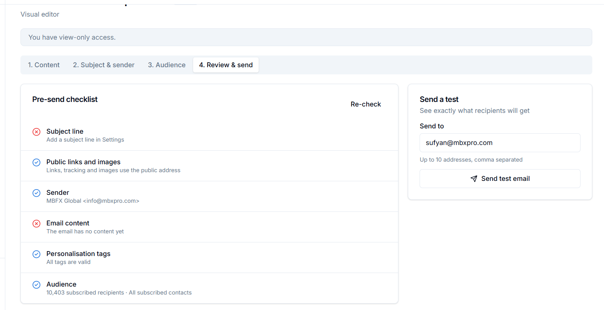

the templates should be shown like this having categories under the tabs..also present the view like this..
----

show each template like this

---

the preview should be visible like this having light & dark mode & desktop & mobile preview as well..
----
header:

footer:

the hearder & footer design should be like this..but all the content will dynamically fill

----------------

the email compains will update like this in tabs...

when we open the compaign

next tab

next tab

next tab

---------------------
do not remove any content..on;y presentation style will update & improvements..colorfull states & badges 
add any missing content

---

