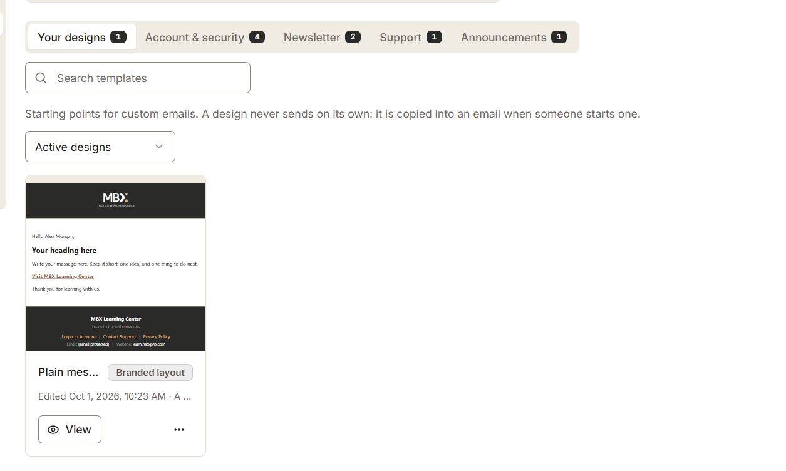
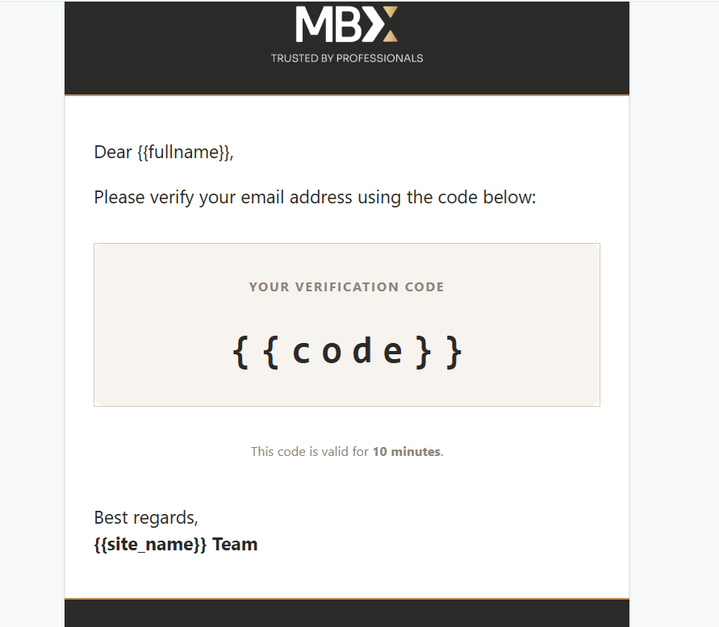
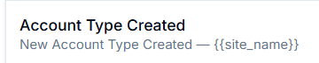

only the selected tabs count should be highlight...the other tabs count should be silent...
this should be place on all pages where having tabs & count

-----------
when we login or signup there should be smooth user experience...when login successfully then the loader stops & showing capcha again before reloading to the new page..so this should be smooth experience for users,,check all login,signup,support form,admin login..
----

the emaill verificaitn code should be like this

also add the verificaton formate for the email verifications
add seeder as well..
----

add user registration template like this..

use bold highlight currly brackets for dynamic content..this should be implement on all templates..highlighted title

update all templates design should be more professional,highlighted,colorfull badge where needed,background changed some specific portion..replace link with buttons where used with proper styling

----

update the formate like that in seeder for promotions..highlight 

----
auth.password_reset remove this,also show tile & short description like this

remove active status/badge as well..only show the language and succes/warning color as per settings..remove "current" with language in priview..
also the toggle is mixing with right side card..it should be screen fit..

check the toggle is working or not on live system..if template is not active then the email should not deliver for that seciton...
---
