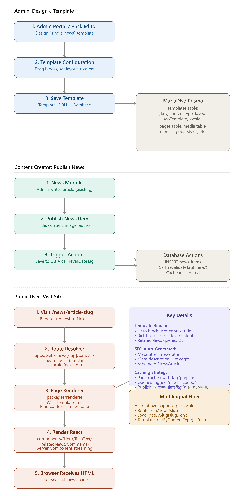

review that plan

D:\Projects\MBFX-Learning-Center\docs\MBX-Dynamic-Site-Controle-Plan.md



Now let me walk you through **exactly what happens** at each stage with concrete examples:

---

## **Stage 1: Admin Designs a Template (Puck Editor)**

**What the admin sees:**

```
┌─ Website Builder → Templates → Create New
│
├─ Left Panel: Block Library
│  ├─ Hero
│  ├─ RichText (Tiptap)
│  ├─ NewsHero
│  ├─ Comments
│  ├─ RelatedNews
│  └─ SocialShare
│
├─ Center: Visual Canvas
│  └─ Shows a PREVIEW with real news data
│     Title: "Forex Trading Strategies"
│     Featured Image: [actual image from Media Library]
│
└─ Right Panel: Block Settings
   ├─ Props Editor (text inputs, dropdowns, media picker)
   └─ Real-time preview updates
```

**Admin's actions:**

1. Drags "NewsHero" block → appears on canvas
2. Right panel shows: `titleField: "title"`, `imageField: "featuredImage"`, `authorField: "author"`
3. These are **context bindings** — when rendered later, they say "pull these fields from the news item"
4. Admin drags "RichText" → right panel shows `field: "content"`
5. Admin drags "RelatedNews" → right panel shows `category: context.category`, `limit: 3`
6. Admin clicks **Save**

**What gets stored in the database:**

```json
// templates table
{
  "id": "tpl_news_1",
  "key": "single-news",
  "name": "Single News Article",
  "contentType": "news",
  "locale": "en",
  "layout": {
    "content": [
      {
        "type": "NewsHero",
        "props": {
          "source": "context",
          "titleField": "title",
          "imageField": "featuredImage",
          "authorField": "author",
          "dateField": "publishedAt"
        }
      },
      {
        "type": "RichText",
        "props": {
          "source": "context",
          "field": "content"
        }
      },
      {
        "type": "RelatedNews",
        "props": {
          "category": "context.category",
          "limit": 3,
          "exclude": "context.id"
        }
      },
      {
        "type": "Comments",
        "props": {
          "provider": "disqus",
          "threadId": "context.slug"
        }
      }
    ]
  }
}
```

---

## **Stage 2: Content Creator Publishes a News Item**

**In the News Module (your existing system):**

```
Admin clicks "Create News Article"

Title: "Advanced Forex Trading Strategies"
Excerpt: "Learn how to master..."
Content: "[rich text from Tiptap editor]"
Featured Image: [picks from Media Library] → med_456.jpg
Category: "Forex Trading"
Author: "Jane Smith"
Tags: ["forex", "trading", "advanced"]
Language: "English"

Click: PUBLISH ✓
```

**What happens on PUBLISH:**

```javascript
// POST /api/news/publish
{
  async function publishNews(newsData) {
    // 1. Save to database
    const news = await prisma.news_items.create({
      data: {
        slug: "advanced-forex-trading-strategies",
        title: "Advanced Forex Trading Strategies",
        excerpt: "Learn how to master...",
        content: "[HTML from Tiptap]",
        featuredImage: { id: "med_456", url: "..." },
        category: { id: "cat_1", name: "Forex Trading" },
        author: { id: "user_42", name: "Jane Smith" },
        publishedAt: new Date(),
        locale: "en",
        status: "published",
      },
    });

    // 2. Invalidate cache so pages update
    await revalidateTag("news"); // ALL news-related pages refresh
    await revalidateTag("news:forex"); // News in "forex" category refresh
    await revalidatePath("/"); // Homepage refreshes (if it has a news grid)

    // 3. System automatically associates template
    // (The route resolver will find "single-news" template based on contentType="news")

    return { success: true, url: `/news/advanced-forex-trading-strategies` };
  }
}
```

---

## **Stage 3: User Visits /news/advanced-forex-trading-strategies**

### **3A. Browser Makes Request**

```
User enters: mbxpro.com/en/news/advanced-forex-trading-strategies
              (with next-intl locale prefix)

Browser sends HTTP GET to Next.js server
```

### **3B. Next.js Route Resolver (the key step)**

```typescript
// File: apps/web/app/[locale]/news/[slug]/page.tsx

export default async function NewsPage({ params, searchParams }) {
  const { locale, slug } = params;  // locale = "en", slug = "advanced-forex-trading-strategies"

  // STEP 1: Load the news item
  const news = await NewsService.getBySlug(slug, locale);
  if (!news) return notFound();  // → 404 if not found

  // Now 'news' contains:
  // {
  //   id: "news_789",
  //   slug: "advanced-forex-trading-strategies",
  //   title: "Advanced Forex Trading Strategies",
  //   excerpt: "Learn how...",
  //   content: "[HTML]",
  //   featuredImage: { id: "med_456", url: "..." },
  //   category: { id: "cat_1", name: "Forex Trading", slug: "forex-trading" },
  //   author: { id: "user_42", name: "Jane Smith", bio: "..." },
  //   publishedAt: "2026-09-04T10:00:00Z",
  //   url: "/en/news/advanced-forex-trading-strategies"
  // }

  // STEP 2: Load the template
  const template = await TemplateService.getByContentType("news", locale);
  if (!template) return notFound();

  // Now 'template' contains:
  // {
  //   key: "single-news",
  //   contentType: "news",
  //   layout: { content: [...blocks with context bindings...] }
  // }

  // STEP 3: Generate SEO metadata
  const metadata = {
    title: news.title + " | MBX Pro",  // "Advanced Forex Trading Strategies | MBX Pro"
    description: news.excerpt,         // "Learn how..."
    openGraph: {
      title: news.title,
      description: news.excerpt,
      images: [news.featuredImage.url],
      type: "article",
      publishedTime: news.publishedAt,
      authors: [news.author.name]
    },
    robots: { index: true, follow: true }
  };

  // STEP 4: Render the page with template + context
  return (
    <>
      <meta name="title" content={metadata.title} />
      <meta name="description" content={metadata.description} />
      <meta property="og:image" content={metadata.openGraph.images[0]} />

      <PageRenderer
        template={template}
        context={news}        // ← THE NEWS ITEM IS THE CONTEXT
        contentType="news"
        locale={locale}
      />
    </>
  );
}

export async function generateStaticParams() {
  // For ISR: pre-generate routes for recent articles
  const recentNews = await NewsService.list({ limit: 10, locale: "en" });
  return recentNews.map(news => ({
    locale: "en",
    slug: news.slug
  }));
}

export const revalidate = 3600;  // Revalidate every hour, or on-demand when published
```

### **3C. PageRenderer (The Magic)**

```typescript
// File: packages/renderer/PageRenderer.tsx

export async function PageRenderer({ template, context, contentType, locale }) {
  // template.layout.content is an array of blocks
  // context is the news item

  const renderedBlocks = await Promise.all(
    template.layout.content.map(block => resolveBlock(block, context))
  );

  return (
    <html lang={locale}>
      <body>
        {renderedBlocks.map((BlockComponent, idx) => (
          <BlockComponent key={idx} {...BlockComponent.props} />
        ))}
      </body>
    </html>
  );
}

async function resolveBlock(blockDefinition, context) {
  const { type, props } = blockDefinition;

  // Example: NewsHero block with context bindings
  if (type === "NewsHero") {
    // Block definition says: titleField = "title", imageField = "featuredImage"
    // So we inject the actual values from context:
    const resolvedProps = {
      ...props,
      title: context[props.titleField],        // context.title = "Advanced Forex..."
      image: context[props.imageField],        // context.featuredImage = { id, url }
      author: context[props.authorField],      // context.author = { name, bio }
      date: context[props.dateField]           // context.publishedAt = "2026-09-04..."
    };

    return {
      Component: NewsHeroBlock,
      props: resolvedProps
    };
  }

  // Example: RichText block with context
  if (type === "RichText") {
    const resolvedProps = {
      ...props,
      content: context[props.field]  // context.content = "[HTML]"
    };

    return {
      Component: RichTextBlock,
      props: resolvedProps
    };
  }

  // Example: RelatedNews — a dynamic block that queries the database
  if (type === "RelatedNews") {
    // Block config says: category = "context.category"
    // So we extract the category from context and query:
    const relatedNews = await NewsService.list({
      category: context[props.category.replace("context.", "")],  // context.category
      limit: props.limit,                                          // 3
      exclude: context.id                                          // Don't show current article
    });

    const resolvedProps = {
      ...props,
      items: relatedNews  // Inject the fetched articles
    };

    return {
      Component: RelatedNewsBlock,
      props: resolvedProps
    };
  }

  // Example: Comments block
  if (type === "Comments") {
    const resolvedProps = {
      ...props,
      threadId: context.slug  // Disqus thread ID = news.slug
    };

    return {
      Component: CommentsBlock,
      props: resolvedProps
    };
  }

  // Unknown block? Safe fallback
  return {
    Component: FallbackBlock,
    props: { message: `Unknown block type: ${type}` }
  };
}
```

---

## **Stage 4: Components Render**

Each block component is a **React Server Component** that renders to HTML:

```tsx
// Hero Block
export async function NewsHeroBlock({ title, image, author, date }) {
  return (
    <section className="hero bg-primary text-white py-16">
      <div className="container mx-auto max-w-4xl">
        <h1 className="text-5xl font-bold mb-4">{title}</h1>
        <div className="flex items-center gap-4 mb-8">
          
          <div>
            <p className="font-semibold">{author.name}</p>
            <p className="text-sm text-opacity-75">{formatDate(date)}</p>
          </div>
        </div>
        
      </div>
    </section>
  );
}

// Rich Text Block
export async function RichTextBlock({ content }) {
  return (
    <article className="prose prose-lg max-w-4xl mx-auto py-16 px-4">
      <div dangerouslySetInnerHTML={{ __html: sanitizeHtml(content) }} />
    </article>
  );
}

// Related News Block
export async function RelatedNewsBlock({ items, columns = 3 }) {
  return (
    <section className="py-16 bg-surface-1">
      <div className="container mx-auto max-w-6xl px-4">
        <h2 className="text-3xl font-bold mb-12">Related Articles</h2>
        <div className={`grid grid-cols-${columns} gap-6`}>
          {items.map((news) => (
            <a href={news.url} key={news.id}>
              <div className="card rounded-lg overflow-hidden hover:shadow-lg transition-shadow">
                
                <div className="p-4">
                  <h3 className="font-bold text-lg mb-2">{news.title}</h3>
                  <p className="text-sm text-secondary">{news.excerpt}</p>
                  <p className="text-xs text-muted mt-2">{formatDate(news.publishedAt)}</p>
                </div>
              </div>
            </a>
          ))}
        </div>
      </div>
    </section>
  );
}
```

---

## **Stage 5: Browser Receives HTML + Interactivity**

```html
<!-- Final HTML sent to browser -->
<!DOCTYPE html>
<html lang="en">
  <head>
    <title>Advanced Forex Trading Strategies | MBX Pro</title>
    <meta name="description" content="Learn how..." />
    <meta property="og:image" content="..." />
    <meta name="robots" content="index, follow" />
    <!-- Schema.org structured data -->
    <script type="application/ld+json">
      {
        "@context": "https://schema.org",
        "@type": "NewsArticle",
        "headline": "Advanced Forex Trading Strategies",
        "image": "...",
        "datePublished": "2026-09-04T10:00:00Z",
        "author": { "@type": "Person", "name": "Jane Smith" }
      }
    </script>
  </head>
  <body>
    <!-- HERO SECTION (from NewsHero block) -->
    <section class="hero bg-primary...">
      <h1>Advanced Forex Trading Strategies</h1>
      
    </section>

    <!-- ARTICLE CONTENT (from RichText block) -->
    <article class="prose...">
      <p>Learn how...</p>
      ...
    </article>

    <!-- RELATED NEWS (from RelatedNews block) -->
    <section>
      <h2>Related Articles</h2>
      <div class="grid...">
        <a href="/news/..."><div>... article card ...</div></a>
        <a href="/news/..."><div>... article card ...</div></a>
        <a href="/news/..."><div>... article card ...</div></a>
      </div>
    </section>

    <!-- COMMENTS (from Comments block) -->
    <div id="disqus_thread"></div>
    <script>
      var disqus_config = function () {
        this.page.url = ".../news/advanced-forex-trading-strategies";
        this.page.identifier = "advanced-forex-trading-strategies";
      };
    </script>

    <!-- Footer, etc. -->
  </body>
</html>
```

**User sees:**

- The complete news article page
- All styles applied (colors, fonts, spacing from global design system)
- Images loaded
- Comments section from Disqus
- Related articles as clickable cards
- **Exactly as the admin designed it**

---

## **Key Points Across All Stages**

| What                   | How                                               | Who                  |
| ---------------------- | ------------------------------------------------- | -------------------- |
| **Template design**    | Admin uses Puck drag-and-drop                     | Admin Portal         |
| **Context binding**    | Blocks store field names like `context.title`     | Template JSON        |
| **Content publishing** | News admin fills form, clicks Publish             | News Module          |
| **Cache invalidation** | `revalidateTag('news')` when news is published    | Next.js              |
| **Route resolution**   | `/news/[slug]` loads news + template              | Next.js Server       |
| **Rendering**          | PageRenderer walks template tree, injects context | packages/renderer    |
| **Dynamic blocks**     | Queries happen inside RelatedNews render          | Server Components    |
| **SEO**                | Auto-generated from news metadata                 | Next.js metadata API |
| **Multilingual**       | Every step respects the locale param              | next-intl            |
| **Caching**            | Page cached by slug, queries by tag               | Next.js ISR          |

---

## **The Beautiful Part: Zero Duplication**

- **One template** (`single-news`) works for **all future news articles**
- **One route file** (`/news/[slug]`) handles **every article**
- **One renderer** handles **every template type** (news, courses, analysis, etc.)
- **No admin work** when publishing new articles — they automatically use the designed template
- **Cache is smart** — only invalidates what changed

**This is the core promise of the CMS:** design once, publish forever, cache efficiently.

You **do not want to design every News article individually**. You want to design the **public-facing structure/template once**, and then the admin repeatedly manages the actual content inside that design.

The same architecture should work for **News, Analysis, Courses, Calendar/Events, Rates, Videos, etc.**

### The correct model

Think of it as:

**Design once → Publish many content items → Automatically render using that design**

For example, for **News**:

```text
ADMIN
│
├── Design News Listing Page        ← designed once
│   ├── Banner
│   ├── Introduction
│   ├── Category filters
│   ├── Search
│   ├── Dynamic News Grid
│   ├── Pagination / Load More
│   └── Newsletter CTA
│
├── Design News Detail Page        ← designed once
│   ├── Article banner
│   ├── Title
│   ├── Author / Date
│   ├── Featured image
│   ├── Article content
│   ├── Social sharing
│   ├── Comments
│   ├── Related News
│   └── Newsletter CTA
│
└── Manage News                    ← done many times
    ├── Add News
    ├── Edit News
    ├── Delete News
    ├── Publish / Unpublish
    ├── Categories
    ├── Tags
    └── Media
```

Then:

```text
News #1 ─┐
News #2 ─┤
News #3 ─┤──> SAME DESIGNED LISTING PAGE
News #4 ─┤
News #5 ─┘

News #1 ─┐
News #2 ─┤──> SAME DESIGNED DETAIL PAGE
News #3 ─┘
```

So if you change the News detail design later:

> **Change template once → all News detail pages change automatically.**

That is the key architecture.

---

# 1. We should separate "Design" from "Content"

This is the most important change to the previous plan.

There should be **three separate concepts**:

### A. Page Design

Defines the visual structure.

Examples:

- News Listing Design
- News Detail Design
- Course Listing Design
- Course Detail Design
- Events Listing Design
- Event Detail Design
- Rates Page Design

### B. Content

The actual records.

Examples:

- News article #1
- News article #2
- Course #1
- Course #2
- Event #1
- Event #2

### C. Dynamic Data Connection

The design tells the system:

> "This grid should display News."

or:

> "This section should display the latest 6 Courses."

or:

> "This table should display today's currency rates."

So the page builder is not storing actual news content inside the design.

It stores **instructions about where/how to display content**.

---

# 2. Example: News Listing Design

The admin opens:

**Website → Page Designs → News → Listing**

And builds:

```text
┌──────────────────────────────────────────────┐
│                 HERO BANNER                  │
│                                              │
│              Latest News & Analysis          │
└──────────────────────────────────────────────┘

             [ Search News ........ ]

 [All] [Market] [Trading] [Education] [Economy]

┌─────────────┐ ┌─────────────┐ ┌─────────────┐
│             │ │             │ │             │
│ News Image  │ │ News Image  │ │ News Image  │
│             │ │             │ │             │
│ Title       │ │ Title       │ │ Title       │
│ Date        │ │ Date        │ │ Date        │
└─────────────┘ └─────────────┘ └─────────────┘

┌─────────────┐ ┌─────────────┐ ┌─────────────┐
│ Dynamic     │ │ Dynamic     │ │ Dynamic     │
│ News        │ │ News        │ │ News        │
└─────────────┘ └─────────────┘ └─────────────┘

                 [Load More]

             Newsletter / CTA
```

The **News Grid** is a dynamic component.

Its configuration might be:

```text
Content Type: News
Source: Published News
Category: All
Sort: Latest
Limit: 9
Layout: 3 Columns
Card Design: Modern News Card
Pagination: Enabled
```

The admin doesn't manually add News cards to the page.

They only configure the **dynamic News collection**.

---

# 3. Adding News becomes completely separate

Later the admin goes to:

**Content → News → Add News**

They add:

```text
Title
Slug
Excerpt
Content
Featured Image
Author
Category
Tags
Published Date
SEO
```

Publish it.

That's it.

The system automatically makes it available to the existing News design.

No page editing is required.

So:

```text
Add News
   ↓
Save
   ↓
Publish
   ↓
News becomes available in Content System
   ↓
News Listing Dynamic Grid queries it
   ↓
New News automatically appears
```

---

# 4. News Detail Page works differently

The detail page is also designed **once**.

For example:

```text
┌──────────────────────────────────────────────┐
│                 NEWS BANNER                  │
└──────────────────────────────────────────────┘

CATEGORY

# EUR/USD Market Outlook for This Week

Author • September 4, 2026

[ Featured Image ]

──────────────────────────────────────────────

ARTICLE CONTENT

The actual article content is injected here.

──────────────────────────────────────────────

Share

Comments

──────────────────────────────────────────────

Related News

[News] [News] [News]

──────────────────────────────────────────────

Newsletter
```

The page builder needs special **dynamic content fields**.

For example:

```text
Dynamic Field
    ↓
Current News
    ↓
Title
Featured Image
Author
Published Date
Content
Category
Tags
```

So the designer can place:

```text
[Current Content Title]

[Current Content Featured Image]

[Current Content Body]
```

When somebody visits:

```text
/news/eur-usd-market-outlook
```

the renderer loads that News record and injects it into the design.

For another article:

```text
/news/gold-market-analysis
```

the **same design** is used with different data.

---

# 5. Related News should also be dynamic

The designer can add:

**Related Content**

and configure:

```text
Content Type: News
Relationship: Same Category
Exclude Current Item: Yes
Limit: 3
Sort: Latest
Card Design: News Card
```

Or:

```text
Content Type: News
Relationship: Same Tags
Limit: 4
```

Therefore the admin never manually maintains related-news links unless they specifically want manual relationships.

---

# 6. Filters are also part of the design

This is important.

The page designer should be able to add:

### Search

```text
[ Search News ]
```

Configuration:

```text
Search in:
✓ Title
✓ Excerpt
✓ Content
```

### Category Filter

```text
[ All ] [Trading] [Market] [Education]
```

Configuration:

```text
Filter Type: Category
Content Type: News
```

### Tag Filter

```text
[ Forex ] [Gold] [Stocks] [Crypto]
```

### Date Filter

```text
From: ____   To: ____
```

### Sorting

```text
Latest
Oldest
Most Viewed
Featured
```

The builder creates the UI.

The CMS supplies the data.

---

# 7. Exactly the same concept for Courses

You shouldn't create another completely different architecture for Courses.

Create:

### Course Listing Design

```text
Banner
↓
Search
↓
Category Filter
↓
Level Filter
↓
Dynamic Course Grid
↓
Pagination
```

### Course Detail Design

```text
Course Hero
↓
Course Image
↓
Title
↓
Instructor
↓
Description
↓
Curriculum
↓
Price / Enrollment
↓
Reviews
↓
Related Courses
```

Then:

```text
Admin designs Course pages once
             ↓
Admin adds 100 courses
             ↓
All 100 automatically use those designs
```

---

# 8. Calendar / Events

Same system.

### Calendar Listing Design

```text
Banner
↓
Calendar
↓
Month/Week/List switch
↓
Category filters
↓
Dynamic Events
```

### Event Detail Design

```text
Event Banner
↓
Event Title
↓
Date
↓
Time
↓
Location
↓
Description
↓
Speaker
↓
Registration
↓
Related Events
```

Add event:

```text
Event #1
Event #2
Event #3
```

All automatically appear.

---

# 9. Rates are slightly different

This is where we should make the architecture flexible.

Rates aren't necessarily traditional "content articles."

For example:

```text
Currency Rates
USD → PKR
EUR → PKR
GBP → PKR
```

The page can have:

```text
Hero Banner
↓
Currency Converter
↓
Live Rates Table
↓
Rate Cards
↓
Historical Chart
```

The **design** is still created once.

But instead of:

```text
Dynamic News
```

we have:

```text
Dynamic Rate Data
```

The renderer gets data from the Rates provider/service.

So the generic system should support **multiple data providers**, not only database content.

---

# 10. This gives us the right generic architecture

I would now structure the system around this:

```text
                 WEBSITE CMS
                      │
          ┌───────────┴───────────┐
          │                       │
     PAGE DESIGNS              CONTENT/DATA
          │                       │
     ┌────┴────┐            ┌─────┴─────┐
     │         │            │           │
  Listing   Detail       News       Courses
     │         │            │           │
     │         │            Events     Videos
     │         │            │           │
     │         │            Rates      Webinars
     │         │
     └─────────┬───────────────┐
               │               │
        Dynamic Components     │
               │               │
       ┌───────┼────────┐      │
       │       │        │      │
    Grid    Filter   Carousel  │
       │       │        │      │
       └───────┴────────┘      │
               │               │
               └───────┬───────┘
                       │
                 PUBLIC RENDERER
                       │
                  Public Website
```

---

# 11. The important distinction: "Page" vs "Content Page"

We should support two different kinds of public pages.

### Static / CMS Page

Example:

```text
/about
/contact
/pricing
```

Admin designs the entire page.

### Collection Page

Example:

```text
/news
/courses
/events
```

Admin designs the page **once**, but the content is dynamically loaded.

### Content Detail Page

Example:

```text
/news/article-one
/news/article-two

/courses/course-one
/courses/course-two

/events/event-one
/events/event-two
```

Admin designs the detail template once.

This distinction is extremely important.

---

# 12. Page Design should have a "Data Context"

For example:

### News Listing

```text
Page Type:
Collection

Content Type:
News
```

### News Detail

```text
Page Type:
Detail

Content Type:
News
```

### Course Listing

```text
Page Type:
Collection

Content Type:
Course
```

### Course Detail

```text
Page Type:
Detail

Content Type:
Course
```

### Rates

```text
Page Type:
Data
Data Provider:
Market Rates
```

This lets the same page builder work across the whole website.

---

# 13. The page builder components should understand dynamic data

Instead of only having:

```text
Text
Image
Button
Card
Grid
```

we should have:

### Basic Components

- Text
- Heading
- Image
- Video
- Button
- Icon
- Divider
- Spacer

### Layout Components

- Container
- Section
- Columns
- Grid
- Carousel
- Tabs
- Accordion

### Dynamic Components

- Dynamic Collection
- Dynamic Item
- Dynamic Field
- Dynamic Image
- Dynamic Metadata
- Dynamic Filters
- Related Content
- Featured Content
- Search
- Pagination
- Comments
- Ratings
- Author
- Categories
- Tags

### Data Components

- Rate Table
- Rate Card
- Converter
- Chart
- Calendar
- Market Widget

This makes the builder genuinely reusable.

---

# 14. We should also introduce "Design Templates"

For each content type:

```text
News
 ├── Listing Template
 ├── Detail Template
 └── Card Templates
```

```text
Course
 ├── Listing Template
 ├── Detail Template
 └── Card Templates
```

```text
Event
 ├── Listing Template
 ├── Detail Template
 └── Card Templates
```

And card templates can be reused.

For example:

```text
News Grid
    ↓
uses "Modern News Card"

Homepage
    ↓
uses "Modern News Card"

Related News
    ↓
uses "Modern News Card"
```

Change the card design once → every place using it updates.

---

# 15. This is also how the admin workflow should feel

The admin shouldn't think:

> "I need to create a page for every article."

Instead:

### Step 1 — Design

**Website → Designs**

```text
News Listing
News Detail
Course Listing
Course Detail
Event Listing
Event Detail
```

### Step 2 — Content

**Content → News**

```text
+ Add News
```

Add 1, 10, 100 or 10,000 articles.

### Step 3 — Automatic rendering

The system handles:

```text
Listing
Detail
Search
Filters
Categories
Tags
Related Content
SEO
Pagination
Sitemap
RSS
Cache
```

according to the configured design.

---

# 16. Most importantly: don't make the CMS "News-specific"

I would **not** build:

```text
NewsPageBuilder
CoursePageBuilder
EventPageBuilder
```

That will become difficult to maintain.

Instead:

```text
Generic Page Builder
        +
Generic Dynamic Data System
        +
Content Type Configuration
        +
Data Provider Interface
```

Then News, Courses, Events, etc. plug into it.

Conceptually:

```text
Page Builder
     │
     ├── News Provider
     ├── Course Provider
     ├── Event Provider
     ├── Video Provider
     ├── Webinar Provider
     └── Rates Provider
```

This is the architecture that matches what you're describing.

---

# 17. Final flow

The ideal system becomes:

```text
                 ADMIN
                   │
          ┌────────┴─────────┐
          │                  │
     DESIGN WEBSITE       MANAGE DATA
          │                  │
          │             ┌────┼─────────┐
          │             │    │         │
          │           News Courses   Events
          │             │    │         │
          └─────────────┼────┼─────────┘
                        │
                 DYNAMIC CONNECTION
                        │
                PUBLIC PAGE ENGINE
                        │
          ┌─────────────┼─────────────┐
          │             │             │
       Listing        Detail       Widgets
          │             │             │
       Dynamic       Dynamic       Dynamic
       Content       Content        Data
```

### The core principle should be:

> **Design the presentation once. Manage the data/content independently as many times as needed. The public website automatically connects the content to the appropriate design.**

And yes — **this should be the same foundation for News, Analysis, Courses, Calendar/Events, Rates, Videos and future modules**, rather than building separate page-builder logic for each module.

I would adjust the previous implementation plan around this model before touching the existing News implementation. The existing News data can be preserved/migrated, but **News should become the first real test case of this generic system**, not the foundation that dictates the architecture.
