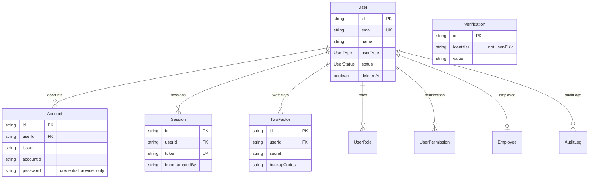
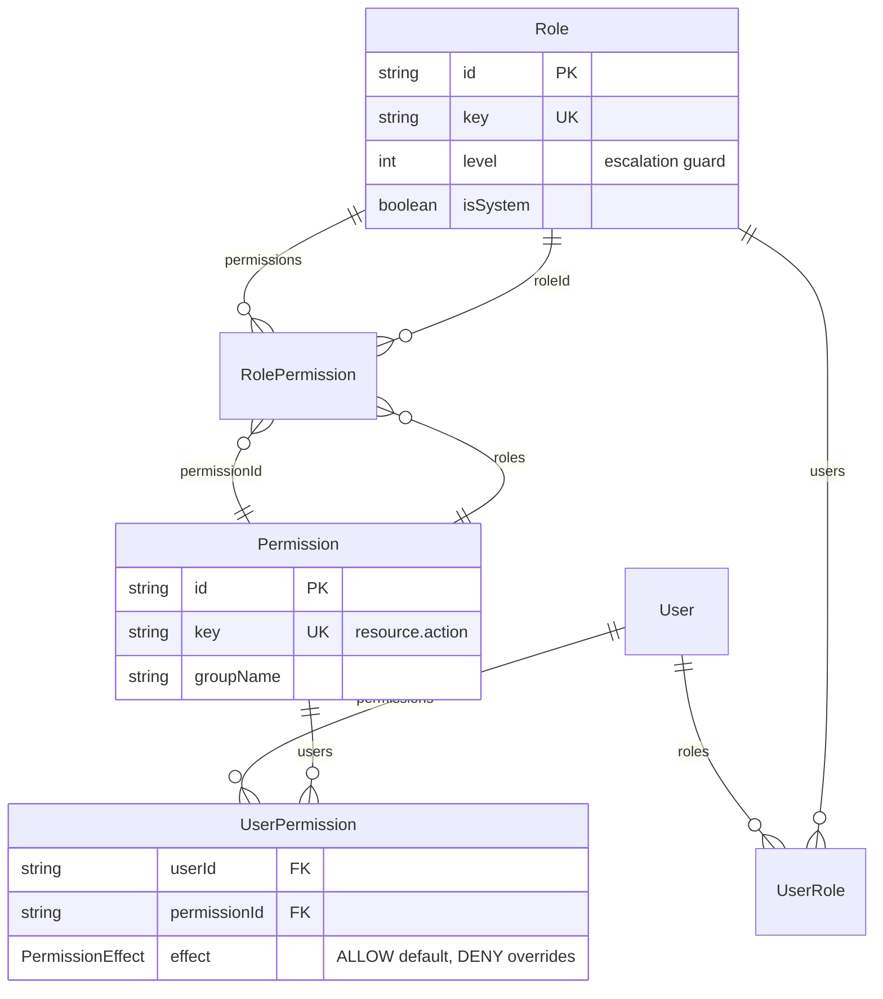
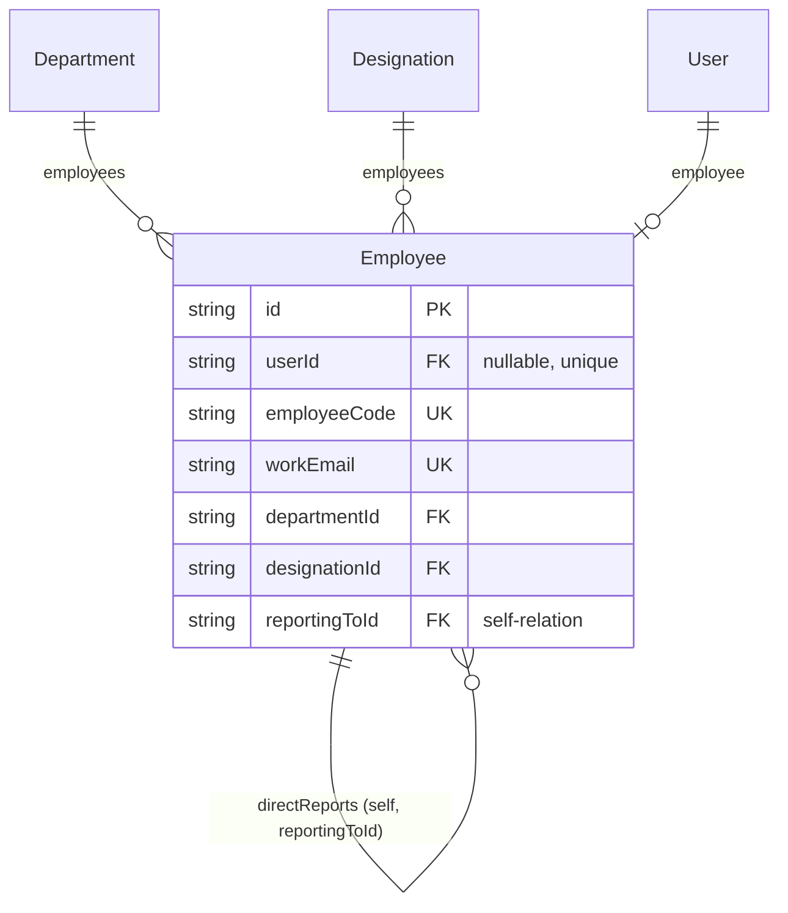
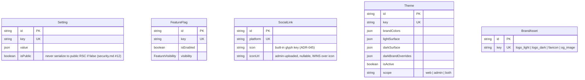
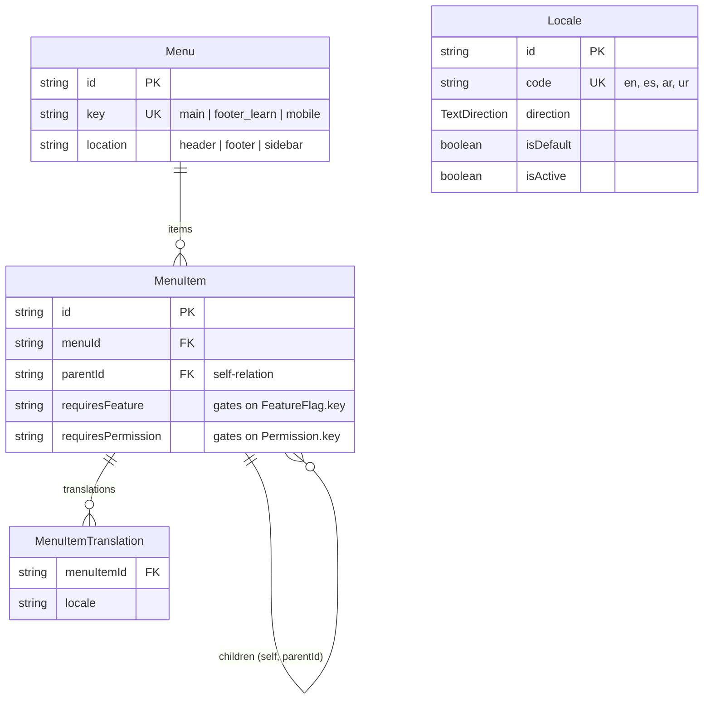
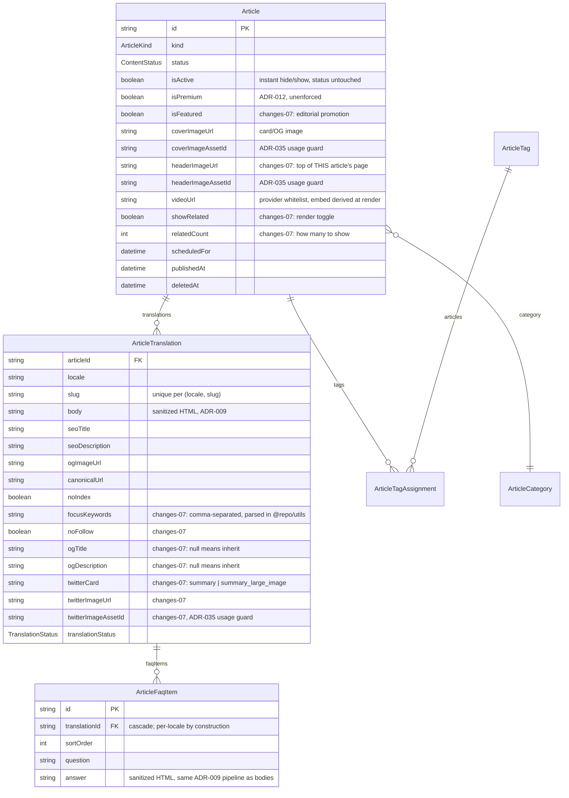
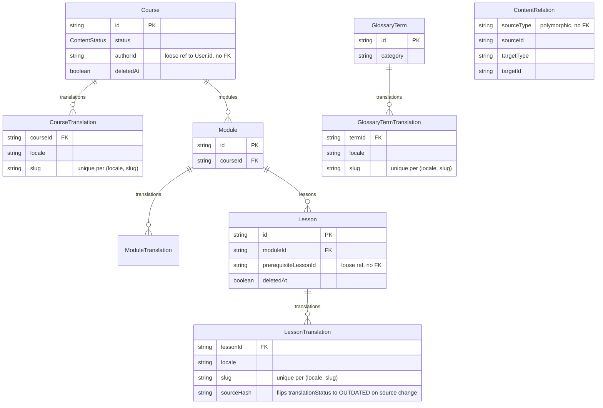

# Schema ERD — `@repo/db`

Generated by hand from `packages/db/prisma/schema.prisma` (Module 01). Split
by domain rather than one 30-entity diagram — update alongside the schema,
it isn't generated in CI. Field lists are trimmed to keys, FKs, and anything
that shapes a relationship; see the schema file for the full column list.

## Identity & Auth

`User`/`Account`/`Session`/`Verification`/`TwoFactor` are Better Auth's
generated shape (ADR-001) merged with project fields — see the schema
file's comment block for provenance.



## RBAC

Deny beats allow, deny beats super_admin (`.claude/rules/security.md` #2) —
enforced in `@repo/rbac` (Module 03), not by this schema.



## Employees

Distinct from auth identity — `Employee.userId` is nullable (HR record can
predate a login).



## Settings, Feature Flags, Theming, Branding

`Setting.value`/`FeatureFlag` drive runtime config (`@repo/settings`, Module
05); `Theme` drives `@repo/theme`'s CSS variable derivation (Module 02).
`Theme.allowUserToggle` intentionally does not exist (plan.md A5.4, ADR-008).



## Locales & Navigation

`(menuItemId, locale)` unique — one translation row per item per locale.



## Articles — News & Analysis (Module 15, ADR-015; extended changes-07 PR 2)

One `Article` base row + `kind` (NEWS / ANALYSIS / TRADE_IDEA), with the
base+translation pattern above. Related posts are **not** a column: they are
`ContentRelation` rows (`sourceType "article"`, `relationType "related"`),
reusing the generic linking table. FAQ entries hang off the TRANSLATION, not
the article — a question and its answer are translatable prose, so they are
per-locale by construction and cascade with the translation.



## Content — base + translation pattern

Course/Module/Lesson/GlossaryTerm all follow: locale-invariant base row,
slug lives on the translation, `(locale, slug)` unique per model. Articles,
tools, and static pages follow identically once added (plan.md A7 — not
blocking Phase 0). `authorId` is a loose reference (no FK) to `User.id`.



## Audit & Redirects

```mermaid
erDiagram
  User ||--o{ AuditLog : "auditLogs"

  AuditLog {
    string id PK
    string userId FK "nullable, SetNull on delete"
    string action "\"theme.update\", \"user.role.assign\""
    json changes "{ before, after }"
  }
  Redirect {
    string id PK
    string fromPath UK
    string toPath
    int statusCode
  }
```
